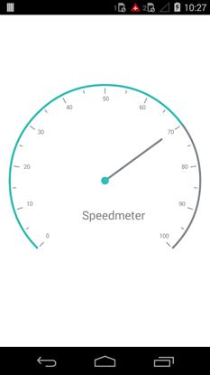

---

layout: post
title: Overview of Syncfusion SfCircularGauge control for Xamarin.Android
description: Overview of Syncfusion SfCircularGauge control
platform: Xamarin.Android
control: SfCircularGauge
documentation: ug

---

# Overview

Essential Circular Gauge for Xamarin.Android is ideal to visualize numeric values over a circular scale. The appearance of the gauge can be fully customized to seamlessly integrate with your applications. Essential Circular Gauge is a perfect solution for developers looking to add advanced, feature rich Circular Gauge to their applications.

## Key Features

* Scales - Supports rendering of multiple scales within the Circular Gauge.
* Ticks and Labels - Supports extensive appearance customization for Labels and Ticks in the Scale.
* Ranges - Supports highlighting the range of values in the gauge scale.
* Pointers - Supports adding multiple pointers to the gauge.
* Animation - Supports the animation of a pointer.
* Headers - Supports the addition of custom label text in the required location of the gauge.

