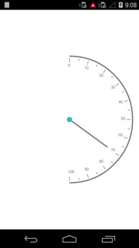

---

layout: post
title: Gauge Types in Syncfusion SfCircularGauge control for Xamarin.Android 
description: Different Gauge Types in Syncfusion SfCircularGauge control
platform: Xamarin.Android
control: SfCircularGauge
documentation: ug

---

# GAUGE TYPE

SfCircularGauge type is determined by positioning the control towards particular direction. GaugeType is an enum property that provides the option to select type of the SfCircularGauge type, which contains following options.

* Default,
* East,
* West,
* North,
* South,
* NorthEast,
* NorthWest,
* SouthEast,
* SouthWest



    SfCircularGauge circulargauge = new SfCircularGauge();
    Circulargauge.GaugeType=GaugeType.East;
    this.content=circulargauge;



