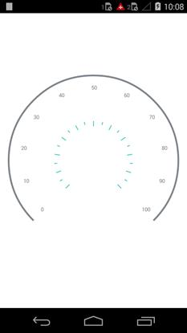

---

layout: post
title: Tick Setting in Syncfusion SfCircularGauge control for Xamarin.Android 
description: Learn how to set ticks in Syncfusion SfCircularGauge control
platform: Xamarin.Android
control: SfCircularGauge
documentation: ug

---

# TICK SETTING

TickSetting help you identify the gauge’s data value by marking the gauge scale in regular increments.

## Tick Customization  

The **Interval** property is used to calculate the tick count for a scale. Like ticks, minor ticks are calculated using the **MinorTicksPerInterval** property.

A tick’s length, color, and thickness are set by the **Length**, **Color** and **Thickness** UI properties.

The Major and Minor ticks can be positioned far away from the rim by using the **Offset** property



    SfCircularGauge circulargauge = new SfCircularGauge();

    TickSettings minor = new TickSettings();
                minor.Length = 6;
                minor.Color = Color.FromHex("#2bbfb8");
                minor.Thickness = 3;
                minor.Offset = 0.5;
                scale.MinorTickSettings = minor;

    TickSettings major = new TickSettings();
                major.Length = 12;
                major.Color = Color.FromHex("#2bbfb8");
                major.Thickness = 3;
                major.Offset = 0.5;
                scale.MajorTickSettings = major;
    circulargauge.Scales = scale;
    this.Content= circulargauge;



