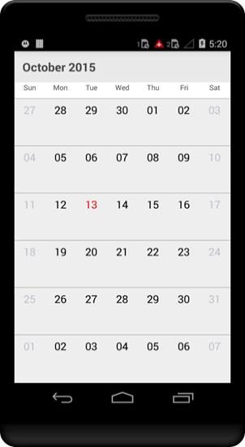
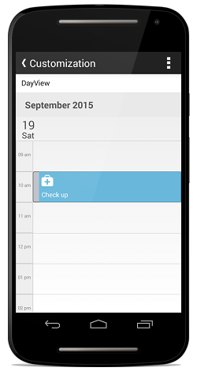
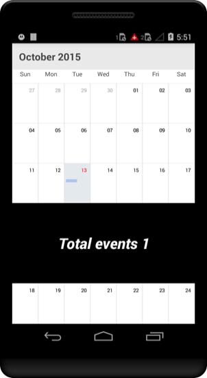
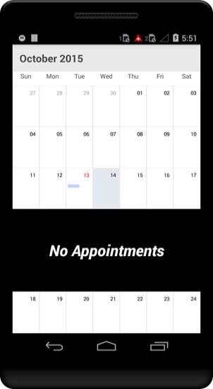

# Appearance & Styling

## Cell Customization

Schedule views are designed as per the native calendar control with some enriched user interface for the control interaction and usability. Month view cell contains the date along with its appointments if available. There is an option available in Schedule control to change the default UI of Month View cell. By using `monthViewItemChangedListener`  each month cell can be changed to required UI. For instance, Sunday and Saturday can be differentiated by different color or customized to required UI.



    //creating new instance for schedule
    SfSchedule sfschedule = new SfSchedule(this);
    sfschedule.ScheduleView = ScheduleView.MonthView;

    //month cell customization
    sfschedule.MonthViewItemChanged += sfSchedule_MonthViewItemChanged;

    // Set our view from the "main" layout resource
    SetContentView(sfschedule);     

    //month cell customization
    void sfSchedule_MonthViewItemChanged(object sender, SfSchedule.MonthViewItemChangedEventArgs e)
        {
            Calendar calendar = e.P0.Calendar;
            FrameLayout frameLayout = new FrameLayout(this);
            if (calendar != null)
            {
                GradientDrawable gradientDrawable = new GradientDrawable(
                    GradientDrawable.Orientation.TopBottom,
                    new int[] { 255, 0 }); //0xFF616261
                gradientDrawable.SetCornerRadius(0f);
                TextView monthCellText = new TextView(this);
                String text = new SimpleDateFormat("dd").Format(calendar.Time);
                monthCellText.Text = (text);
                if ((calendar.Get(Calendar.DayOfWeek) == Calendar.Sunday) || (calendar.Get(Calendar.DayOfWeek) == Calendar.Saturday))
                {
                    monthCellText.SetTextColor(Color.Red);
                }
                else
                {
                    monthCellText.SetTextColor(Color.Black);
                }
                if ((calendar.Get(Calendar.Year) == Calendar.Instance.Get(Calendar.Year)) && (calendar.Get(Calendar.Month) == Calendar.Instance.Get(Calendar.Month) && (calendar.Get(Calendar.DayOfMonth) == Calendar.Instance.Get(Calendar.DayOfMonth))))
                {
                    monthCellText.SetTextColor(Color.Red);
                }
                monthCellText.TextSize = (18);
                monthCellText.Gravity = GravityFlags.CenterHorizontal;
                monthCellText.SetPadding(0, 10, 0, 0);
                LinearLayout layout = new LinearLayout(this);

                Button appDot = new Button(this);
                LinearLayout.LayoutParams params1 = new LinearLayout.LayoutParams(
                        LinearLayout.LayoutParams.WrapContent, LinearLayout.LayoutParams.WrapContent);
                params1.SetMargins(0, 80, 0, 0);
                appDot.LayoutParameters = (params1);
                GradientDrawable appDotDrawable = new GradientDrawable();
                appDotDrawable.SetColor(255);
                appDotDrawable.SetCornerRadius(15);
                appDotDrawable.SetStroke(0, Color.Red);
                layout.SetGravity(GravityFlags.CenterHorizontal);
                appDot.SetBackgroundDrawable(appDotDrawable);
                appDot.LayoutParameters = (new ViewGroup.LayoutParams(10, 10));
                layout.Orientation = Orientation.Vertical;
                View line = new View(this);
                line.LayoutParameters = (new ViewGroup.LayoutParams(ViewGroup.LayoutParams.FillParent, 1));
                line.SetBackgroundColor(Color.Gray);
                layout.AddView(line);
                layout.AddView(monthCellText);
                if (e.P0.Appointments != null && e.P0.Appointments.Size() > 0)
                {
                    layout.AddView(appDot);
                }
                frameLayout.AddView(layout);
            }
            e.P0.MonthView = frameLayout;
        }



## Appointment Customization.

ScheduleAppointment created in schedule are arranged based on its duration, where the appointments viewed through day, week and work week view  are positioned in the timeslots. Default UI of the appointments in day, week and work week view can be changed by using `appointmentTemplateChangedListener` .



    //creating new instance for schedule
            SfSchedule sfschedule = new SfSchedule(this);
            sfschedule.ScheduleView = ScheduleView.DayView;

            appointmentCollection = new ScheduleAppointmentCollection();

            //Creating new event
            ScheduleAppointment clientMeeting = new ScheduleAppointment();

            Calendar currentDate = Calendar.Instance;
            Calendar startTime = (Calendar)currentDate.Clone();

            //setting start time for the event
            startTime.Set(
                currentDate.Get(CalendarField.Year),
                currentDate.Get(CalendarField.Month),
                currentDate.Get(CalendarField.DayOfMonth),
                10, 0, 0
            );

            Calendar endTime = (Calendar)currentDate.Clone();

            //setting end time for the event
            endTime.Set(
                currentDate.Get(CalendarField.Year),
                currentDate.Get(CalendarField.Month),
                currentDate.Get(CalendarField.DayOfMonth),
                12, 0, 0
            );

            clientMeeting.StartTime = startTime;
            clientMeeting.EndTime = endTime;
            clientMeeting.Color = Color.Blue;

            //setting Subject for the event
            clientMeeting.Subject = "ClientMeeting";

            //adding event into the collection
            appointmentCollection.Add(clientMeeting);
            sfschedule.Appointments = appointmentCollection;

    //appointment customization
            sfschedule.AppointmentTemplateChanged += sfSchedule_AppointmentTemplateChanged;

            // Set our view from the "main" layout resource
            SetContentView(sfschedule);

    //appointment customization
    void sfSchedule_AppointmentTemplateChanged(object sender, SfSchedule.AppointmentTemplateChangedEventArgs e)
        {
            FrameLayout frameLayout = new FrameLayout(this);
            GradientDrawable gradientDrawable = new GradientDrawable();
            //gradientDrawable.SetColor(B4B5C1);
            //gradientDrawable.setCornerRadius(5);
            //gradientDrawable.setStroke(1, 0xFF000000);
            TextView monthCellText = new TextView(this);
            monthCellText.SetBackgroundColor(Color.ParseColor("#A237B3E6"));
            //frameLayout.SetBackgroundDrawable(gradientDrawable);
            ImageView imageView = new ImageView(this);
            ScheduleAppointmentCollection appointment = e.P0.Appointments;
            for (int i = 0; i < appointment.Size(); i++)
            {
                monthCellText.Text = (((ScheduleAppointment)appointment.Get(i)).Subject.ToString());
                monthCellText.SetTextColor(Color.White);
                monthCellText.TextSize = (14);
                monthCellText.SetPadding(8, 60, 0, 0);
                frameLayout.SetPadding(20, 0, 0, 0);
                frameLayout.AddView(monthCellText);
                imageView = new ImageView(this);
                imageView.SetPadding(8, 0, 0, 0);
                if (((ScheduleAppointment)appointment.Get(i)).Subject == "Business Meeting")
                {
                    imageView.SetImageResource(Resource.Drawable.family);
                }
                else if (((ScheduleAppointment)appointment.Get(i)).Subject == "GoToMeeting")
                {
                   imageView.SetImageResource(Resource.Drawable.hospital);
                }
                else
                {
                   imageView.SetImageResource(Resource.Drawable.team);
                }
            }

            LinearLayout.LayoutParams layoutParams = new LinearLayout.LayoutParams(46, 60);
            imageView.LayoutParameters = (layoutParams);
            frameLayout.AddView(imageView);
            e.P0.AppointmentView = frameLayout;
        }



## Inline view Customization.

By enabling the Inline view feature, while tap on the schedule month view cell it will open a inline view which contains list of appointments on a particular day. Default UI of inline available in month view can be customized by using `inlineTappedListener` .



            ScheduleAppointmentCollection appointmentCollection;
            //..//
            //creating new instance for schedule
            SfSchedule sfschedule = new SfSchedule(this.ApplicationContext);
            sfschedule.ScheduleView = ScheduleView.MonthView;

            appointmentCollection = new ScheduleAppointmentCollection();

            //Creating new event
            ScheduleAppointment clientMeeting = new ScheduleAppointment();

            Calendar currentDate = Calendar.Instance;
            Calendar startTime = (Calendar)currentDate.Clone();

            //setting start time for the event
            startTime.Set(
                currentDate.Get(CalendarField.Year),
                currentDate.Get(CalendarField.Month),
                currentDate.Get(CalendarField.DayOfMonth),
                10, 0, 0
            );

            Calendar endTime = (Calendar)currentDate.Clone();

            //setting end time for the event
            endTime.Set(
                currentDate.Get(CalendarField.Year),
                currentDate.Get(CalendarField.Month),
                currentDate.Get(CalendarField.DayOfMonth),
                12, 0, 0
            );

            clientMeeting.StartTime = startTime;
            clientMeeting.EndTime = endTime;
            clientMeeting.Color = Color.Blue;

            //setting Subject for the event
            clientMeeting.Subject = "ClientMeeting";

            //adding event into the collection
            appointmentCollection.Add(clientMeeting);
            sfschedule.Appointments = appointmentCollection;

    // InlineTapped Event
        sfschedule.MonthViewSettings.ShowAppointmentsInline = true;
        sfschedule.MonthViewSettings.InlineTapped += MonthViewSettings_InlineTapped;
            
        // Set our view from the "main" layout resource
        SetContentView(sfschedule);

        // InlineTapped Event
        void MonthViewSettings_InlineTapped(object sender, MonthViewSettings.InlineTappedEventArgs e)
        {
            CustomView customView = new CustomView(this.ApplicationContext, e.P0.Calendar, e.P0.Schedule, e.P0.GetiviewRenderer());
            e.P0.SetInlineView(customView);
        }

        //Custom UI for inline
       class CustomView : InlineLayout
    {
        private Java.Util.Calendar calendar;
        private SfSchedule sfSchedule;
        private ViewRenderer viewRenderer;

        public CustomView(Android.Content.Context context, Java.Util.Calendar calendar, SfSchedule sfSchedule, ViewRenderer viewRenderer)
            : base(context, calendar, sfSchedule, viewRenderer)
        {
            // TODO: Complete member initialization          
            this.calendar = calendar;
            this.sfSchedule = sfSchedule;
            this.viewRenderer = viewRenderer;
        }

        public override void DrawInline(Android.Views.View view)
        {
            base.DrawInline(view);
            FrameLayout frameLayout = new FrameLayout(Context);
        frameLayout.SetBackgroundColor(Color.Black);
        if(view is TextView) 
        {
            TextView textView = new TextView(Context);
            textView.Text=(((TextView) view).Text);
            textView.SetTextColor(Color.White);
            textView.TextSize=(30);
            frameLayout.AddView(textView);
        }
        else if(view is ScrollView){
            int count = (((ScrollView)view).ChildCount);
            TextView textView = new TextView(Context);
            textView.Text=("Total events "+String.Concat(count));
            textView.SetTextColor(Color.White);
            textView.TextSize=(30);
            frameLayout.AddView(textView);
        }
        this.AddView(frameLayout);

        }       
    }



