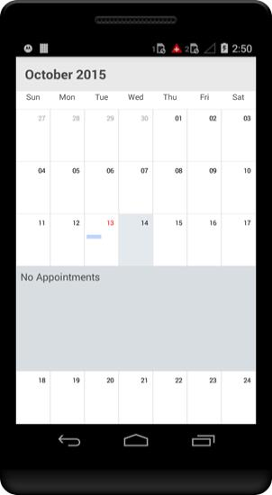
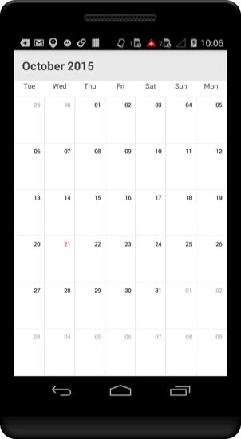

# Date Navigation and Gesture

## Forward

By default the date can be navigated to next view using touch gesture, by swiping the control in right to left direction. The view can be also changed programmatically using “forward” method available in SfSchedule. So that next immediate visible dates will be viewed. It will move to next month if the schedule views is month, similarly it will move to next week for week view and next day for day view.



    //creating a linear layout 
    LinearLayout linearLayout = new LinearLayout(this);
    linearLayout.Orientation = Orientation.Vertical;

    //creating button 
    Button forward_button = new Button(this);
    forward_button.Text="Forward";
    forward_button.Click += forward_button_Click;

    //creating new instance for schedule
    sfschedule = new SfSchedule(this);
    //setting schedule view
    sfschedule.ScheduleView = ScheduleView.WeekView;

    linearLayout.AddView(forward_button);
    linearLayout.AddView(sfschedule);

    // Set our view from the "main" layout resource
    SetContentView(linearLayout);

    //Button OnClick
    void forward_button_Click(object sender, EventArgs e)
    {
    //using schedule forward()
    sfschedule.Forward();
    }



>**NOTE**  It can be navigated until it reaches the Min Max dates.

## Backward

By default the date can be navigated to previous view using touch gesture, by swiping the control in left to right direction.The view can be also changed programmatically using “backward” method available in SfSchedule. So that previous immediate visible dates will be displayed. It will move to previous month if the schedule views is month, similarly it will move to previous week for week view and previous day for day view.



    //creating a linear layout 
    LinearLayout linearLayout = new LinearLayout(this);
    linearLayout.Orientation = Orientation.Vertical;
    
    //creating button 
    Button backward_button = new Button(this);
    backward_button.Text = "Backward";
    backward_button.Click += backward_button_Click;

    //creating new instance for schedule
    sfschedule = new SfSchedule(this);
    //setting schedule view
    sfschedule.ScheduleView = ScheduleView.WeekView;

    linearLayout.AddView(backward_button);
    linearLayout.AddView(sfschedule);

    // Set our view from the "main" layout resource
    SetContentView(linearLayout);

    //Button OnClick
    void backward_button_Click(object sender, EventArgs e)
    {
    //using schedule forward()
    sfschedule.Backward();
    }



>**NOTE** It can be navigated until it reaches the Min Max dates.

## Move to Date 

Visible dates can be moved to specific date using “moveToDate” method available in SfSchedule. It will move to any specific date if the `schedule view` is Day View, similarly it will move to the specific week if it is week view and to specific month if it is month view.



    Calendar moveToSpecificDate = Calendar.Instance;
    moveToSpecificDate.Set(2015, 7, 25);

    //navigating to specific date
    sfschedule.MoveToDate=moveToSpecificDate;

    // Set our view from the "main" layout resource
    SetContentView(sfschedule);



>**NOTE**  The specified date should lies between `MinDisplayDate` and `MaxDisplayDate` , if  the specified date is greater than “maxDisplayDate” then the view moved to maxDisplayDate similarly if the specified date is lesser than the “minDisplayDate” then the view moved to minDisplayDate.

## Enable/disable navigation

By default Schedule views can be moved backwards and forwards using touch swipe gesture. This navigation, using touch gesture can be enabled and disabled using “enableNavigation” property available in Schedule control. By default this is enabled.



    //disabling navigation gesture
    sfschedule.EnableNavigation = false;

    // Set our view from the "main" layout resource
    SetContentView(sfschedule);



## Min Max dates. 

Visible dates can be restricted between certain range of dates using `minDisplayDate` and `maxDisplayDate` properties available in Schedule control. It is applicable in all the schedule views.

So that beyond the min max date range, it will restrict date navigations features of forward(), backward(), moveToDate() and also can’t swipe the control using touch gesture beyond the min max date range.Also, beyond the min max date range, selection will also not works for month view. So that tapped listeners while tapped on the month cell will not be listened. Thus Inline feature in month view will works only within the min max date range.



    //creating new instance for schedule
    SfSchedule sfschedule = new SfSchedule(this);
    sfschedule.ScheduleView = ScheduleView.MonthView;

    Calendar currentDate = Calendar.Instance;
    Calendar minDate = (Calendar)currentDate.Clone();
    minDate.Set(2015, 5, 12);

    Calendar maxDate = (Calendar)currentDate.Clone();
    maxDate.Set(2015, 11, 12);

    sfschedule.MinDisplayDate = minDate;
    sfschedule.MaxDisplayDate = maxDate;

    // Set our view from the "main" layout resource
    SetContentView(sfschedule);



## Transition modes

Dates can be navigated by using swipe gesture as well as using inbuilt methods (forward() and backward()). By default those navigation are performed along with `Scroll` animation. Other than the default scroll animation, there are other options available like card, reveal, float animations is also available with it. It can be changed by using transitionMode property of Schedule control.



    //creating new instance for schedule
    sfschedule = new SfSchedule(this);
    //setting schedule view
    sfschedule.ScheduleView = ScheduleView.DayView;

    //setting transition mode
    sfschedule.TransitionMode = TransitionMode.Reveal;

    // Set our view from the "main" layout resource
    SetContentView(sfschedule);



## Inline

By enabling Inline feature in month view, while touch the month view cell, appointments available in a particular day will be listed in inline view. There are options available to customize the default UI of inline view while tap on the month cell using inlineTapped listener. InlineAppointmentsTappedListener is a listener available in month view to raise while tapped on the appointments in inline view.



    SfSchedule sfschedule = new SfSchedule(this);
    sfschedule.ScheduleView = ScheduleView.WeekView;
    
    //setting Show inline 
    fschedule.MonthViewSettings.ShowAppointmentsInline = true;



## FirstDay of the Week

By default schedule control will be rendered with Sunday as the first day of the week, it can be customized to any day of the week by FirstDayOfWeek property of SfSchedule.



    //setting first day of the week
    sfschedule.FirstDayOfWeek = Calendar.Tuesday;



