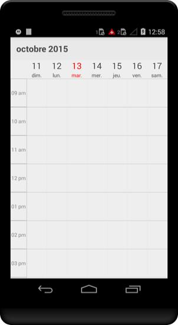

# Localization 

Schedule control is available with complete localization support. 

Localization can be specified by setting the `Locale` property of the control. In the format of `Language code` followed by `Country code`.  Based on the locale specified the strings in the control such as Date, time, days are localized accordingly.

By default schedule control is available with `en-US` locale. 

As the subject of the appointments are given in the application level, it can be set as localized strings as per the requirement. To know more about settings the subject refer ScheduleAppointment



            //creating new instance for schedule
            sfschedule = new SfSchedule(this);

            //setting schedule view
            sfschedule.ScheduleView = ScheduleView.WeekView;

            //setting locale for the control
            sfschedule.Locale = new Locale("fr", "FR");
            
            // Set our view from the "main" layout resource
            SetContentView(sfschedule);



## Schedule Custom String Localization

Schedule has a built in support for localizing the custom Strings in it by specifying the corresponding string’s key and value in `strings.xml` under value directory. For an example in schedule there is a string “No Appointment” in Schedule Month View Inline. To localize the string, specify the key (“No_Appointments”) and assign the corresponding localized string to it in string.xml file. Please refer the following code for French language.

Xamarin.Android can select and load resources from different directories, based on the current device configuration and locale. For an example, if an application requires multiple languages we can follow the below steps.

The procedure for creating `strings.xml` files is as follows:

1. Translate the `strings.xml` file to each language.
2. Create three new folders under res –`values-ar`, `values-de`, `values-en` and `values-fr` (The original `values` folder already exists).
3. Place the translated `strings.xml` files in the respective folders.

