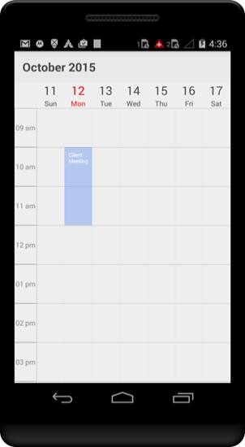

# Populating Appointments

Schedule control has an inbuilt capability to handle the appointment arrangement internally based on the ScheduleAppointment collections. ScheduleAppointment is a class, which holds the details about the appointment to be rendered in schedule. Schedule Appointments collection can be provided to schedule using the following method.

## Adding appointments using Collection

ScheduleAppointment has some basic properties such as StartTime, EndTime, Subject and some additional information about the appointment can be added using Color, Notes, Location, All Day, Recursive properties.

Create the collection of the ScheduleAppointments by setting required details using above mentioned properties for each appointment.And then assign the created collection to the “Appointments” property of SfSchedule as like in below code example.



        ScheduleAppointmentCollection appointmentCollection;
             //..//
            //creating new instance for schedule
            SfSchedule sfschedule = new SfSchedule(this);
            sfschedule.ScheduleView = ScheduleView.WeekView;
            appointmentCollection = new ScheduleAppointmentCollection();

            //Creating new event
            ScheduleAppointment clientMeeting = new ScheduleAppointment();

            Calendar currentDate = Calendar.Instance;
            Calendar startTime = (Calendar)currentDate.Clone();
            
    //setting start time for the event
            startTime.Set(
                currentDate.Get(CalendarField.Year),
                currentDate.Get(CalendarField.Month),
                currentDate.Get(CalendarField.DayOfMonth),
                10, 0, 0
            );

            Calendar endTime = (Calendar)currentDate.Clone();
           
    //setting end time for the event
            endTime.Set(
                currentDate.Get(CalendarField.Year),
                currentDate.Get(CalendarField.Month),
                currentDate.Get(CalendarField.DayOfMonth),
                12, 0, 0
            );

            clientMeeting.StartTime = startTime;
            clientMeeting.EndTime = endTime;
            clientMeeting.Color = Color.Blue;

    //setting Subject for the event
            clientMeeting.Subject = "ClientMeeting";

    //adding event into the collection
            appointmentCollection.Add(clientMeeting);
            sfschedule.Appointments = appointmentCollection;
            
            // Set our view from the "main" layout resource
            SetContentView(sfschedule);



