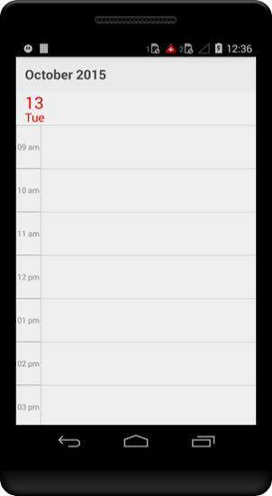
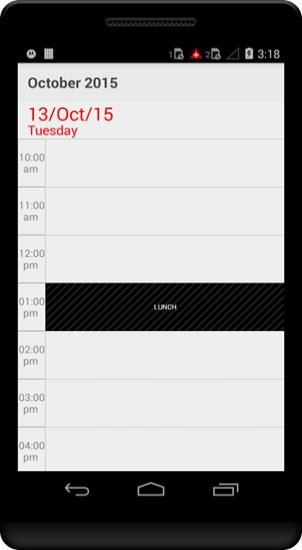
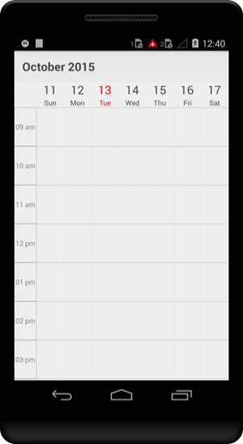
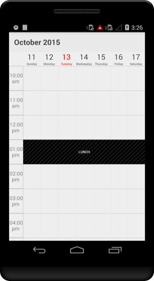
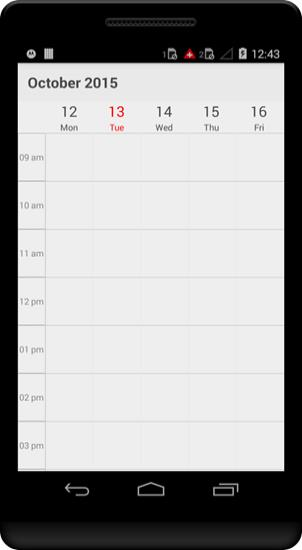
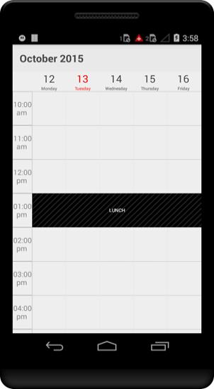
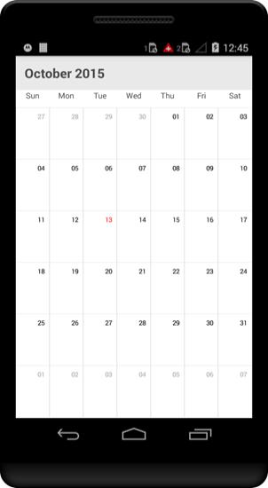
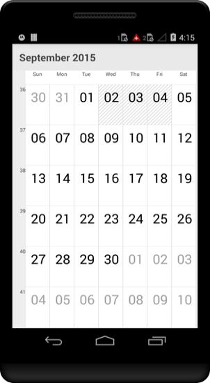

# Views

Schedule control provides four different types of views to display dates. Day view, Week view, WorkWeek view and month view. It can be assigned to the schedule control by using ScheduleView property. Based on the user’s preference appointments can be viewed in any of the four type of view available. By default schedule control is assigned with day view.

## Day View

Day view is used to display a single day; current day will be visible by default. Appointments on a specific day will be arranged in respective timeslots based on its duration.



    //creating new instance for schedule
    sfschedule = new SfSchedule(this);

    //setting schedule view
    sfschedule.ScheduleView = ScheduleView.DayView;

    // Set our view from the "main" layout resource
    SetContentView(sfschedule);



### Settings

#### Date Time Formating

You can format the date and time string in the schedule control using DayLabelSettings of  DayViewSettings and the size of those strings are also customizable.

#### Non-Accessible Blocks

You can restrict/allocate certain timeslot as Non-accessible block using NonAccessibleBlocks of DayViewSettings, so that you can allocate those timeslots for predefined events/activities like Lunch hour.

#### Working Hours

You can differentiate working hours with non-working hour timeslots by its color using WorkStartHour and  WorkEndHour  properties of DayViewSettings.

#### All Day Appointments Panel

You can view All day appointments in separate panel and the panels visibility can be enabled by setting ShowAllDay property of DayViewSettings as true.



    //creating new instance for schedule
            sfschedule = new SfSchedule(this);

            //setting schedule view
            sfschedule.ScheduleView = ScheduleView.DayView;

            //setting day view settings properties
            DayViewSettings dayViewSettings = new DayViewSettings();
            dayViewSettings.WorkStartHour=10;
            dayViewSettings.WorkEndHour=18;
            dayViewSettings.ShowAllDay=true;

            //setting non-accessing blocks.
            NonAccessibleBlocksCollection nonAccessibleBlocksCollection = new NonAccessibleBlocksCollection();
            NonAccessibleBlock lunchHour = new NonAccessibleBlock();
            lunchHour.StartTime=13;
            lunchHour.EndTime=14;
            lunchHour.Color=Color.Black;
            lunchHour.Text="LUNCH";
            nonAccessibleBlocksCollection.Add(lunchHour);
            dayViewSettings.NonAccessibleBlocks=nonAccessibleBlocksCollection;

            //setting label size and formats
            DayLabelSettings dayLabelSettings = new DayLabelSettings();
            dayLabelSettings.TimeLabelSize=14;
            dayLabelSettings.DateLabelSize=25;
            dayLabelSettings.DateFormat="dd/MMM/yy ";
            dayLabelSettings.DayFormat="EEEE";
            dayLabelSettings.TimeFormat="hh:mm a ";

            dayViewSettings.DayLabelSettings=dayLabelSettings;

            sfschedule.DayViewSettings=dayViewSettings;
    
            // Set our view from the "main" layout resource
            SetContentView(sfschedule);



## Week View

To view all the seven days of a particular week, by default if will be current week.Appointments arranged in timeslots based on its duration with respective day of the week.



    //creating new instance for schedule
    sfschedule = new SfSchedule(this);

    //setting schedule view
    sfschedule.ScheduleView = ScheduleView.WeekView;

    // Set our view from the "main" layout resource
    SetContentView(sfschedule);



### Settings

#### Date Time Formating

You can format the date and time string in the schedule control using WeekLabelSettings of  WeekViewSettings and the size of those strings are also customizable.

#### Non-Accessible Blocks

You can restrict/allocate certain timeslot as Non-accessible block using NonAccessibleBlocks of WeekViewSettings, so that you can allocate those timeslots for predefined events/activities like Lunch hour.

#### Working Hours

You can differentiate working hours with non-working hour timeslots by its color using WorkStartHour and  WorkEndHour  properties of WeekViewSettings.

#### All Day Appointments Panel

You can view All day appointments in separate panel and the panels visibility can be enabled by setting ShowAllDay property of WeekViewSettings as true. 



    //creating new instance for schedule
            sfschedule = new SfSchedule(this);

            //setting schedule view
            sfschedule.ScheduleView = ScheduleView.WeekView;

            //setting week view settings properties
            WeekViewSettings weekViewSettings = new WeekViewSettings();
            weekViewSettings.WorkStartHour = 10;
            weekViewSettings.WorkEndHour = 18;
            weekViewSettings.ShowAllDay = true;

            //setting non-accessing blocks.
            NonAccessibleBlocksCollection nonAccessibleBlocksCollection = new NonAccessibleBlocksCollection();
            NonAccessibleBlock lunchHour = new NonAccessibleBlock();
            lunchHour.StartTime=13;
            lunchHour.EndTime=14;
            lunchHour.Color=Color.Black;
            lunchHour.Text="LUNCH";
            nonAccessibleBlocksCollection.Add(lunchHour);
            weekViewSettings.NonAccessibleBlocks = nonAccessibleBlocksCollection;

            //setting label size and formats
            WeekLabelSettings weekLabelSettings = new WeekLabelSettings();
            weekLabelSettings.TimeLabelSize = 14;
            weekLabelSettings.DateLabelSize = 25;
            weekLabelSettings.DateFormat = "dd ";
            weekLabelSettings.DayFormat = "EEEE";
            weekLabelSettings.TimeFormat = "hh:mm a ";

            weekViewSettings.WeekLabelSettings = weekLabelSettings;

            sfschedule.WeekViewSettings = weekViewSettings;
            
            // Set our view from the "main" layout resource
            SetContentView(sfschedule);



## Work Week View

To view working days of a particular week, by default current work week will be displayed. Saturday and Sunday are the non-working days by default; it can be customized with any days in a week. Appointments arranged in timeslots based on its duration with respective day of the week.



    //creating new instance for schedule
    sfschedule = new SfSchedule(this);

    //setting schedule view
    sfschedule.ScheduleView = ScheduleView.WorkWeekView;

    // Set our view from the "main" layout resource
    SetContentView(sfschedule);



### Settings

#### Date Time Formating

You can format the date and time string in the schedule control using WorkWeekLabelSettings of  WorkWeekViewSettings and the size of those strings are also customizable.

#### Non-Accessible Blocks

You can restrict/allocate certain timeslot as Non-accessible block using NonAccessibleBlocks of WorkWeekViewSettings, so that you can allocate those timeslots for predefined events/activities like Lunch hour.

#### Working Hours

You can differentiate working hours with non-working hour timeslots by its color using WorkStartHour and  WorkEndHour  properties of WorkWeekViewSettings.

#### All Day Appointments Panel

You can view All day appointments in separate panel and the panels visibility can be enabled by setting ShowAllDay property of WorkWeekViewSettings as true. 



           //creating new instance for schedule
            sfschedule = new SfSchedule(this);

            //setting schedule view
            sfschedule.ScheduleView = ScheduleView.WorkWeekView;

            //setting workweek view settings properties
            WorkWeekViewSettings workWeekViewSettings = new WorkWeekViewSettings();
            workWeekViewSettings.WorkStartHour = 10;
            workWeekViewSettings.WorkEndHour = 18;
            workWeekViewSettings.ShowAllDay = true;

            //setting non-accessing blocks.
            NonAccessibleBlocksCollection nonAccessibleBlocksCollection = new NonAccessibleBlocksCollection();
            NonAccessibleBlock lunchHour = new NonAccessibleBlock();
            lunchHour.StartTime=13;
            lunchHour.EndTime=14;
            lunchHour.Color=Color.Black;
            lunchHour.Text="LUNCH";
            nonAccessibleBlocksCollection.Add(lunchHour);
            workWeekViewSettings.NonAccessibleBlocks = nonAccessibleBlocksCollection;

            //setting label size and formats
            WorkWeekLabelSettings workWeekLabelSettings = new WorkWeekLabelSettings();
            workWeekLabelSettings.TimeLabelSize = 14;
            workWeekLabelSettings.DateLabelSize = 25;
            workWeekLabelSettings.DateFormat = "dd ";
            workWeekLabelSettings.DayFormat = "EEEE";
            workWeekLabelSettings.TimeFormat = "hh:mm a ";

            workWeekViewSettings.WorkWeekLabelSettings = workWeekLabelSettings;

            sfschedule.WorkWeekViewSettings = workWeekViewSettings;
            
            // Set our view from the "main" layout resource
            SetContentView(sfschedule);



## Month View

To view entire dates of a particular month, by default current month will be displayed initially. Appointments arranged within the cell based on its duration. Current date is differentiated by some color and rest of the dates in a month will be in different color., Also the color differentiation for dates will be applicable for previous and next month dates.



    //creating new instance for schedule
    sfschedule = new SfSchedule(this);

    //setting schedule view
    sfschedule.ScheduleView = ScheduleView.MonthView;

    // Set our view from the "main" layout resource
    SetContentView(sfschedule);



### Settings

#### Date Time Formating

You can format the date and time string in the schedule control using MonthLabelSettings of  MonthViewSettings and the size of those strings are also customizable.

#### Blackout dates

You can restrict/allocate certain month cell as blackout days using BlackoutDates of MonthViewSettings, so that we can allocate those cells for predefined events/activities like Scheduled maintenance, planned leave etc.

#### Week number

You display the week number of the year in month view by setting showWeekNumber in
property of MonthViewSettings are true. By default it is false.

#### Visible AppointmentCount

You can customize the number of appointments to be rendered inside a month view cell using VisibleCellAppointmentsCount property of MonthViewSettings



          //creating new instance for schedule
            sfschedule = new SfSchedule(this);

            //setting schedule view
            sfschedule.ScheduleView = ScheduleView.MonthView;

            //setting month view settings properties
            MonthViewSettings monthViewSettings = new MonthViewSettings();
            monthViewSettings.ShowWeekNumber=true;
            monthViewSettings.ShowAppointmentsInline=true;

            //setting black out dates
            List<Date> blackOut_Dates_Collection = new List<Date>();
            Calendar currenDate = Calendar.Instance;
            blackOut_Dates_Collection.Add(new               Date(currenDate.Get(Calendar.Year),currenDate.Get(Calendar.Month), 2));
            blackOut_Dates_Collection.Add(new Date(currenDate.Get(Calendar.Year), currenDate.Get(Calendar.Month), 3));
            blackOut_Dates_Collection.Add(new Date(currenDate.Get(Calendar.Year), currenDate.Get(Calendar.Month), 4));
            monthViewSettings.BlackoutDates=blackOut_Dates_Collection;

            //setting label size and formats
            MonthLabelSettings monthLabelSettings = new MonthLabelSettings();
            monthLabelSettings.DayLabelSize=10;
            monthLabelSettings.DayFormat="E";
            monthLabelSettings.DateLabelSize=26;
            monthLabelSettings.DateFormat="dd";
    
            monthViewSettings.MonthLabelSettings = monthLabelSettings;

            sfschedule.MonthViewSettings = monthViewSettings;

            // Set our view from the "main" layout resource
            SetContentView(sfschedule);



