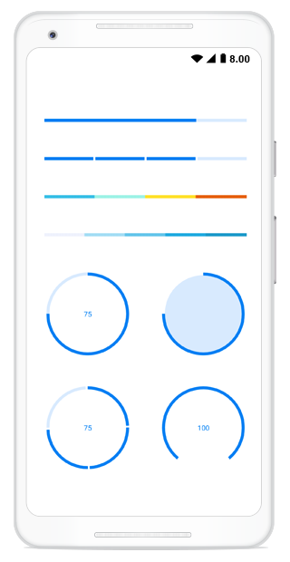

# Overview

The progress bar provides a customizable visual that indicates the progress of a task.

## Key features

* Visualize the progress in different shapes, such as rectangle and circle.
* Customize the ranges with different colors in linear progress bar.
* Customize the progress and track the thickness.
* Display the custom content at the center of circular progress bar.
* Visualize the progress in segments.
* Customize the angle of the circular progress bar.

