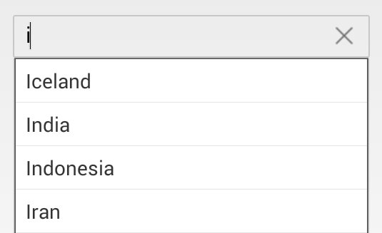

# AutoCompleteSource 

* The `AutoCompleteSource` property in the AutoComplete control is used to set the list of strings to the suggestions dropdown using DataAdapter.

* To create a Text Box that automatically completes input strings by comparing the prefix being entered to the prefixes of all strings in a maintained source. This is useful for Text Box controls in which URLs, addresses, file names, or commands will be frequently entered.

* The use of this is optional, but you must set this to Custom Source in order to use AutoCompleteCustomSource.


	
	List<String> countryList = new List<String>(); 
	countryList.Add ("Afghanistan");
	countryList.Add ("Akrotiri");
	countryList.Add ("Albania");
	countryList.Add ("Algeria");
	ArrayAdapter<String> countryListDataAdapters = new ArrayAdapter<String>(context,Android.Resource.Layout.SimpleListItem1, countryList);
	countryAutoComplete.SetAutoCompleteSource(countryListDataAdapters);
	countryAutoComplete.AutoCompleteMode=AutoCompleteMode.Suggest;
	 

	

