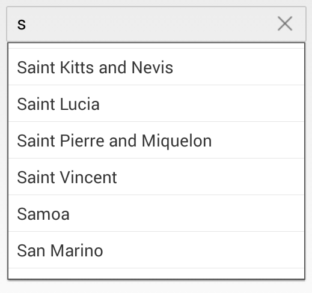

# Customizing the Suggestion DropDown

The suggestion list display behavior can be customized based on the entered text and delays in displaying the items.

## Set Minimum Prefix Characters

Instead of displaying the suggestion list on every text entry, you can filter and display the most relevant matches after a few text entries. This can be achieved by modifying the `MinimumPrefixCharacters` property.

N> The default property value is 1.




	
countryAutoComplete.MinimumPrefixCharacters = 4;
	 



	

## Set PopUp Delay

You can delay the time taken to display the dropdown with the suggestion list by using the `PopUpDelay` property in SfAutoComplete.

N> The default value is 0. The property value is specified in milliseconds.




	
countryAutoComplete.PopUpDelay = 100;
	 




## Set Maximum Height for the DropDown

The height of the dropdown portion of the SfAutoComplete control can be customized using the `MaximumDropDownHeight` property.

N> The `MaximumDropDownHeight` value can be any positive integer value.	




	
countryAutoComplete.MaximumDropDownHeight = 200;
	 



	

## Set Border Color for the DropDown

The `DropDownBorderColor` property is used to change the border color of the dropdown. The following code example demonstrates how to change the border color of the dropdown.




	
            LinearLayout linearLayout = new LinearLayout(this);
            linearLayout.LayoutParameters = new ViewGroup.LayoutParams(1000, ViewGroup.LayoutParams.MatchParent);
            linearLayout.SetBackgroundColor(Android.Graphics.Color.Transparent);

            SfAutoComplete countryAutoComplete = new SfAutoComplete(this);
            countryAutoComplete.LayoutParameters = new ViewGroup.LayoutParams(ViewGroup.LayoutParams.MatchParent, 50);

            List<String> countryList = new List<String>();
            countryList.Add("Uganda");
            countryList.Add("Ukraine");
            countryList.Add("United Arab Emirates");
            countryList.Add("United Kingdom");
            countryList.Add("United States");

            ArrayAdapter<String> countryListDataAdapters = new ArrayAdapter<String>(this, Android.Resource.Layout.SimpleListItem1, countryList);
            countryAutoComplete.AutoCompleteSource = countryListDataAdapters;
            countryAutoComplete.DropDownBorderColor = Color.Red;
            countryAutoComplete.MaximumDropDownHeight = 200;

            linearLayout.AddView(countryAutoComplete);
            SetContentView(linearLayout);
	 



	
