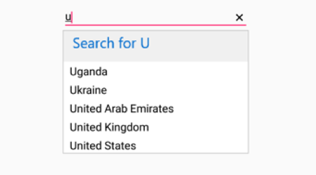
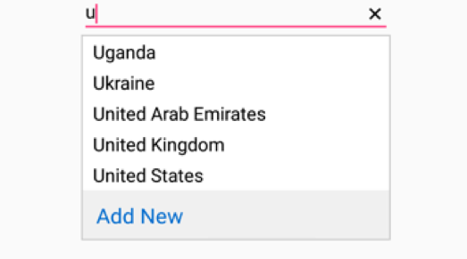

## Header and Footer

We can provide Header and Footer content in the SfAutoComplete by enabling `ShowDropDownHeaderView` and `ShowDropDownFooterView`. 

## Header Content

We can provide Header Content at the top of the AutoComplete's Suggestion box. `DropDownHeaderView` property is used to set the content of the header. The following code example illustrate how to set Header content in SfAutoComplete.




	
	List<String> countryList = new List<String>(); 
	countryList.Add ("Uganda");
	countryList.Add ("Ukraine");
	countryList.Add ("United Arab Emirates");
	countryList.Add ("United Kingdom");
	countryList.Add ("United States");
	ArrayAdapter<String> countryListDataAdapters = new ArrayAdapter<String>(context,Android.Resource.Layout.SimpleListItem1, countryList);
	countryAutoComplete.SetAutoCompleteSource(countryListDataAdapters);
	countryAutoComplete.SuggestionMode=SuggestionMode.StartsWith;
	countryAutoComplete.ShowDropDownHeaderView=true;

    TextView textView = new TextView(context);
    textView.Text = "Search for U"
	textView.setTextColor(Color.parseColor("Blue"));
    textView.TextSize = 16;
    textView.SetPadding(20, 0, 20, 0);
	countryAutoComplete.DropDownHeaderView=textView;

	 



	
## Header Height

The height of the Header in the SfAutoComplete can be adjusted by the property `DropDownHeaderViewHeight`.




List<String> countryList = new List<String>(); 
	countryList.Add ("Uganda");
	countryList.Add ("Ukraine");
	countryList.Add ("United Arab Emirates");
	countryList.Add ("United Kingdom");
	countryList.Add ("United States");
	ArrayAdapter<String> countryListDataAdapters = new ArrayAdapter<String>(context,Android.Resource.Layout.SimpleListItem1, countryList);
	countryAutoComplete.SetAutoCompleteSource(countryListDataAdapters);
	countryAutoComplete.SuggestionMode=SuggestionMode.StartsWith;
	countryAutoComplete.
	
	//Set the Height of the Header View 

	DropDownHeaderViewHeight=50;
	countryAutoComplete.ShowDropDownHeaderView=true;

	 TextView textView = new TextView(context);
     textView.Text = "Search for U"
	 textView.setTextColor(Color.parseColor("Blue"));
     textView.TextSize = 20;
     textView.SetPadding(20, 0, 20, 0);
	countryAutoComplete.DropDownHeaderView=textView;




	

## Footer Content

We can provide Footer Content at the bottom of the AutoComplete's Suggestion box. `DropDownFooterView` property is used to set the content of the footer. The following code example illustrate how to set Footer content in SfAutoComplete.




	
	List<String> countryList = new List<String>(); 
	countryList.Add ("Uganda");
	countryList.Add ("Ukraine");
	countryList.Add ("United Arab Emirates");
	countryList.Add ("United Kingdom");
	countryList.Add ("United States");
	ArrayAdapter<String> countryListDataAdapters = new ArrayAdapter<String>(context,Android.Resource.Layout.SimpleListItem1, countryList);
	countryAutoComplete.SetAutoCompleteSource(countryListDataAdapters);
	countryAutoComplete.ShowDropDownFooterView=true;

	TextView textView = new TextView(context);
            textView.Text = "Add New"
            textView.TextSize = 20;
			textView.setTextColor(Color.parseColor("Blue"));
            textView.SetPadding(20, 0, 20, 0);
			countryAutoComplete.DropDownFooterView=textView;
	 




## Footer Height

The height of the Header in the SfAutoComplete can be adjusted by the property `DropDownFooterViewHeight`.





List<String> countryList = new List<String>(); 
    countryList.Add ("Uganda");
	countryList.Add ("Ukraine");
	countryList.Add ("United Arab Emirates");
	countryList.Add ("United Kingdom");
	countryList.Add ("United States");
	ArrayAdapter<String> countryListDataAdapters = new ArrayAdapter<String>(context,Android.Resource.Layout.SimpleListItem1, countryList);
	countryAutoComplete.SetAutoCompleteSource(countryListDataAdapters);

	//Set the Height of the Footer View 

    countryAutoComplete.DropDownFooterViewHeight= 50;

	TextView textView = new TextView(context);
    textView.Text = "Add New"
	textView.setTextColor(Color.parseColor("Blue"));
    textView.TextSize = 20;
    textView.SetPadding(20, 0, 20, 0);
	countryAutoComplete.DropDownFooterView=textView;





 