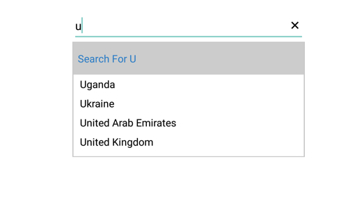
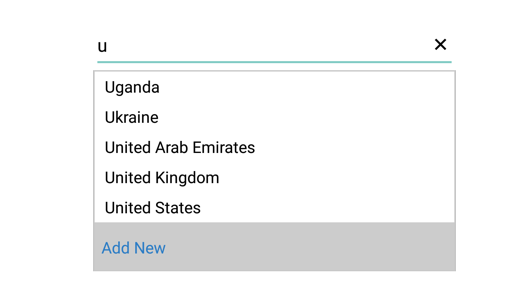

# Header and Footer in Xamarin.Android SfAutoComplete

You can provide header and footer content in the SfAutoComplete by enabling `ShowDropDownHeaderView` and `ShowDropDownFooterView` properties.

## Header Content

You can provide header content at the top of the AutoComplete suggestion box. The `DropDownHeaderView` property is used to set the content of the header. The height of the header in the SfAutoComplete can be adjusted using the `DropDownHeaderViewHeight` property.

The following code example illustrates how to set header content in SfAutoComplete:





countryAutoComplete.ShowDropDownHeaderView = true;
countryAutoComplete.DropDownItemHeight = 30;
countryAutoComplete.DropDownTextSize = 16;

// Set the height for the HeaderView
countryAutoComplete.DropDownHeaderViewHeight = 50;

TextView textView = new TextView(this);
textView.Text = "Search For U";
textView.SetBackgroundColor(Color.LightGray);
textView.Gravity = GravityFlags.CenterVertical;
textView.SetTextColor(Color.ParseColor("#2B7CC5"));
textView.TextSize = 16;
textView.SetPadding(20, 0, 20, 0);
countryAutoComplete.DropDownHeaderView = textView;
	 




## Footer Content

You can provide footer content at the bottom of the AutoComplete suggestion box. The `DropDownFooterView` property is used to set the content of the footer. The height of the footer in the SfAutoComplete can be adjusted using the `DropDownFooterViewHeight` property.

The following code example illustrates how to set footer content in SfAutoComplete:





countryAutoComplete.ShowDropDownHeaderView = true;
countryAutoComplete.DropDownItemHeight = 30;
countryAutoComplete.DropDownTextSize = 16;

// Set the height for the FooterView
countryAutoComplete.DropDownFooterViewHeight = 50;

TextView textView = new TextView(this);
textView.Text = "Add New";
textView.SetBackgroundColor(Color.LightGray);
textView.Gravity = GravityFlags.CenterVertical;
textView.SetTextColor(Color.ParseColor("#2B7CC5"));
textView.TextSize = 16;
textView.SetPadding(20, 0, 20, 0);
countryAutoComplete.DropDownFooterView = textView;
	 




