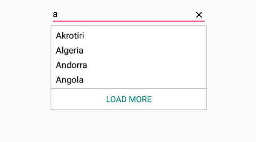
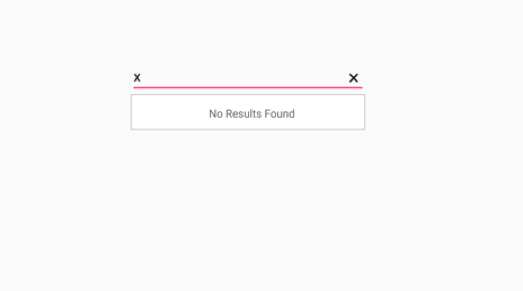

# Maximum Display Item with Expander

Restrict the number of suggestions displayed and have the remaining items loaded by selecting LoadMore.We can restrict maximum suggestion to be displayed with the `MaximumSuggestion` property. We can set the desire text for the displaying the Load more text with the property `LoadMoreText`.




	
	List<String> countryList = new List<String>(); 
	countryList.Add ("Akrotiri");
	countryList.Add ("Algeria");
	countryList.Add ("Andorra");
	countryList.Add ("Angola");
	countryList.Add ("Afghanistan");
	countryList.Add ("Arabia");
	countryList.Add ("Africa");
	ArrayAdapter<String> countryListDataAdapters = new ArrayAdapter<String>(context,Android.Resource.Layout.SimpleListItem1, countryList);
	countryAutoComplete.SetAutoCompleteSource(countryListDataAdapters);
	countryAutoComplete.MaximumSuggestion="4";
	countryAutoComplete.LoadMoreText="LOAD MORE";
	 



	

### Restricting the maximum display of item dynamically

We can restrict the maximum display of items dynamically by calling `LoadMore` method. The method is of two types.

* LoadMore method with argument.

* LoadMore method without arguments.

The user can dynamically change the maximum suggestion count by calling LoadMore method by giving the maximum suggestion as the argument inside.

## No Results Found

When the entered item is not in the suggestion list, SfAutoComplete displays a text indicating there is no search results found. We can set the desire text to be displayed for indicating no results found with the `NoResultsFoundText` property.




	
	List<String> countryList = new List<String>(); 
	countryList.Add ("Afghanistan");
	countryList.Add ("Akrotiri");
	countryList.Add ("Albania");
	countryList.Add ("Algeria");
	ArrayAdapter<String> countryListDataAdapters = new ArrayAdapter<String>(this,Android.Resource.Layout.SimpleListItem1, countryList);
	countryAutoComplete.AutoCompleteSource = countryListDataAdapters;
	countryAutoComplete.NoResultsFoundText="No Results Found";
	 




