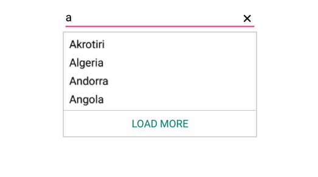

# Maximum Display Items with Load More

You can restrict the number of suggestions displayed and load the remaining items by selecting Load More. The maximum number of suggestions to be displayed can be restricted using the `MaximumSuggestion` property. You can set the desired text for displaying the Load More text using the `LoadMoreText` property.





countryAutoComplete.MaximumSuggestion="4";
countryAutoComplete.LoadMoreText="LOAD MORE";
	 



	

## Restricting Maximum Display Items Dynamically

You can restrict the maximum display of items dynamically by calling the `LoadMore` method. The maximum suggestion count can be changed dynamically by calling the LoadMore method with the maximum suggestion count as an argument.
 



 
// Without passing arguments
autoComplete.LoadMore();
 
// With passing arguments
autoComplete.LoadMore(5);
 

