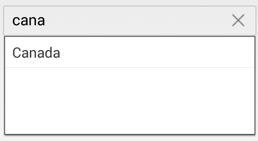

# MinimumPrefixCharacter

* The minimum number of characters to be entered in the text box before the autocomplete suggestion box displays possible matches.

N> Population of the Autocomplete Box does not occur until the conditions specified by the MinimumPrefixCharacter property values are met.The default is 1.


	
	countryAutoComplete.MinimumPrefixCharacters = 4;
	 

	

