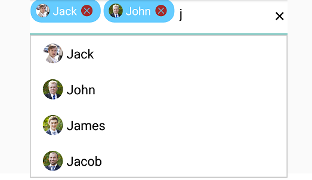

# Multiple Selection

Select multiple items from a suggestion list. There are two ways to perform multi selection in autocomplete.

* Token Representation

* Delimiter

## Token Representation

Selected items will be displayed with a customizable token representation and the users can remove each tokenized item with the close button.




	
	
	ArrayAdapter<String> countryListDataAdapters = new ArrayAdapter<String>(context,Android.Resource.Layout.SimpleListItem1, countryList);
	countryAutoComplete.SetAutoCompleteSource(countryListDataAdapters);
	countryAutoComplete.MultiSelectMode=MultiSelectMode.Token;
	countryAutoComplete.TokensWrapMode=TokensWrapMode.Wrap;
	 




### Wrap Mode of Token

The selected item can be displayed as token inside SfAutoComplete in two ways. They are

* `Wrap` - When `TokensWrapMode` is set to `Wrap` the selected items will be wrap to the next line of the SfAutoComplete.

* `None` - When `TokensWrapMode` is set to `None` the selected item will be wrap in horizontal orientation.





public class Student
	{
		string Name;
		string Image;
		public Student(string name,string image)
		{
			this.Name = name;
			this.Image = image;

		}
		public string getName()
		{
			return Name;
		}
		public string getImage()
		{
			return Image;
		}
	}

public NSMutableArray StudentDetails
		{
			get;
			set;
		}

		void GetStudentData()
		{
			NSMutableArray array = new NSMutableArray();
			array.Add(getDictionary("John", "a1.png"));
			array.Add(getDictionary("James", "a2.png"));
			array.Add(getDictionary("Jacob", "a3.png"));
			array.Add(getDictionary("Joy", "a4.png"));
			array.Add(getDictionary("Victoria", "a5.png"));
			array.Add(getDictionary("James", "a6.png"));

			StudentDetails = array;
		}

		NSDictionary getDictionary(string name, string image)
		{

			object[] objects = new object[2];
			object[] keys = new object[2];
			keys.SetValue("Name", 0);
			keys.SetValue("Image", 1);
			objects.SetValue((NSString)name, 0);
			objects.SetValue((NSString)image, 1);
			return NSDictionary.FromObjectsAndKeys(objects, keys);
		}
	 
	
	ArrayAdapter<Object> arrayDataAdapters = new ArrayAdapter<Object>(context,Android.Resource.Layout.SimpleListItem1, array);
	StudentDetails.MultiSelectMode=MultiSelectMode.Token;
	studentAutoComplete.DataSource = arrayDataAdapters;

// Set the TokensWrapMode into Wrap.

	StudentDetails.TokensWrapMode=TokensWrapMode.Wrap;

	TokensSetting token = new TokensSetting();
	token.FontSize=15;
	token.CornerRadius=5;
	token.SetTextColor(Color.Red);
	token.SetBackgroundColor(Color.Gray);
	token.SelectedBackgroundColor(Color.Yellow);
	token.SetDeleteButtonColor(Color.Maroon);
    token.IsCloseButtonVisible=true;
	StudentDetails.TokensSetting= token;

	




### Token Customization

Customization can be done for Token. There are various ways to customize the tokens. They are as follows.

* `TextColor` - sets the color of the text inside the token.

* `FontSize` - sets the size of the Font inside the token.

* `FontFamily` - sets the Font family for the text inside the token.

* `BackgroundColor` - sets the background color of the token.

* `SelectedBackgroundColor` - sets the background color of the token when it is selected.

* `IsCloseButtonVisible` - Enables and disables the close button inside SfAutoComplete.

* `DeleteButtonColor` - sets the color of the close button inside SfAutoComplete.
token.
* `CornerRadius` - sets the corner radius for the token.




	
	public class Student
	{
		string Name;
		string Image;
		public Student(string name,string image)
		{
			this.Name = name;
			this.Image = image;

		}
		public string getName()
		{
			return Name;
		}
		public string getImage()
		{
			return Image;
		}
	}
	
public NSMutableArray StudentDetails
		{
			get;
			set;
		}

		void GetStudentData()
		{
			NSMutableArray array = new NSMutableArray();
			array.Add(getDictionary("John", "image1.png"));
			array.Add(getDictionary("James", "image2.png"));
			array.Add(getDictionary("Jacob", "image33.png"));
			array.Add(getDictionary("Joy", "image4.png"));
			array.Add(getDictionary("Victoria", "image5.png"));
			array.Add(getDictionary("James", "image6.png"));
			StudentDetails = array;
		}

		NSDictionary getDictionary(string name, string image)
		{

			object[] objects = new object[2];
			object[] keys = new object[2];
			keys.SetValue("Name", 0);
			keys.SetValue("Image", 1);
			objects.SetValue((NSString)name, 0);
			objects.SetValue((NSString)image, 1);
			return NSDictionary.FromObjectsAndKeys(objects, keys);
		}
	 
	
	ArrayAdapter<Object> arrayDataAdapters = new ArrayAdapter<Object>(context,Android.Resource.Layout.SimpleListItem1, array);
	StudentDetails.MultiSelectMode=MultiSelectMode.Token;
	studentAutoComplete.DataSource = arrayDataAdapters;

	// Token Customization

	TokensSetting token = new TokensSetting();
	token.FontSize=15;
	token.CornerRadius=5;
	token.SetTextColor(Color.Red);
	token.SetBackgroundColor(Color.Gray);
	token.SelectedBackgroundColor(Color.Yellow);
	token.SetDeleteButtonColor(Color.Maroon);
    token.IsCloseButtonVisible=true;
	StudentDetails.TokensSetting= token;

	 




	

## Delimiter

When selecting the multiple items, the selected items can be divided with a desired character given for a delimiter. We can set delimiter character with the `Delimiter` property.




	
	List<String> countryList = new List<String>(); 
	countryList.Add ("Andorra");
	countryList.Add ("Akrotiri");
	countryList.Add ("Angola");
	countryList.Add ("Algeria");
	countryList.Add ("Argentina");
	countryList.Add ("Antarctica");
	countryList.Add ("Armenia");
	countryList.Add ("Aruba");
	ArrayAdapter<String> countryListDataAdapters = new ArrayAdapter<String>(context,Android.Resource.Layout.SimpleListItem1, countryList);
	countryAutoComplete.SetAutoCompleteSource(countryListDataAdapters);
	countryAutoComplete.SuggestionMode=SuggestionMode.Contains;
	countryAutoComplete.MultiSelectMode=MultiSelectMode.Delimiter;
	countryAutoComplete.Delimiter="#";
	 



	

	

