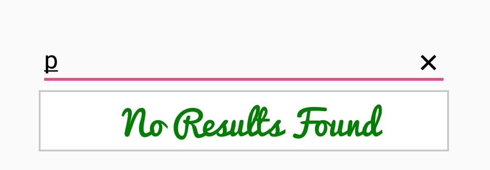

# No Results Found

When the entered item is not in the suggestion list, SfAutoComplete displays text indicating that no search results were found. You can set the desired text to be displayed when no results are found using the `NoResultsFoundText` property.





countryAutoComplete.NoResultsFoundText="No Results Found";
	 




## Customizing No Results Found Text

The `NoResultsFoundTextColor`, `NoResultsFoundFontSize`, and `NoResultsFoundTypeface` properties are used to customize the foreground color, font size, and typeface of the no results found text.





countryAutoComplete.NoResultsFoundText = "No Results Found";
countryAutoComplete.NoResultsFoundFontSize = 20;
countryAutoComplete.NoResultsFoundTextColor = Android.Graphics.Color.DarkGreen;
countryAutoComplete.NoResultsFoundTypeface = Typeface.CreateFromAsset(this.Assets, "Pacifico.ttf");





