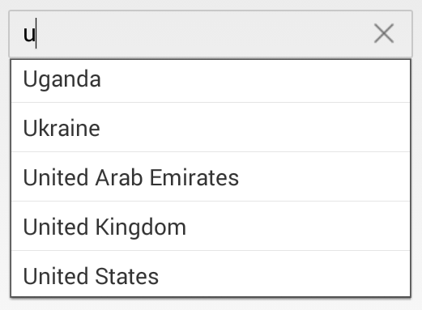

# Overview

The Essential® Xamarin.Android AutoComplete widget provides suggestions while typing. The suggested text can be appended to the original text or displayed in a dropdown list. It also provides a gesture-friendly UI to perform operations like Suggest, Append, and SuggestAppend.

The Essential® AutoComplete can be used in any search scenario.

## Key Features

* `Watermark` - The control displays watermark text when no input is provided.

* `AutoComplete Mode` - The control provides suggestions based on a predefined collection while typing.

* `Suggestion Mode` - The suggestion list can be displayed with multiple types of search patterns.

* `AutoCompleteSource` - A list of strings that is loaded to the control for displaying suggestions.

* `Multiple Selection` - AutoComplete provides two different ways to select multiple items from the suggestion list: Token representation and Delimiter.

* `Load More` - Restricts the number of suggestions displayed and allows loading remaining items by selecting Load More.

* `Header and Footer` - Header and footer content can be added to the top and bottom of the suggestion list in SfAutoComplete.

* `Diacritic Sensitivity` - AutoComplete supports populating items from languages with diacritical marks and searching for them with English characters from an en-US keyboard.

* `Text Highlighting` - AutoComplete supports highlighting matching text in the suggestion list based on the input provided.

* `Custom Filter` - AutoComplete allows users to filter items in the suggestion list based on their custom filtering conditions.
