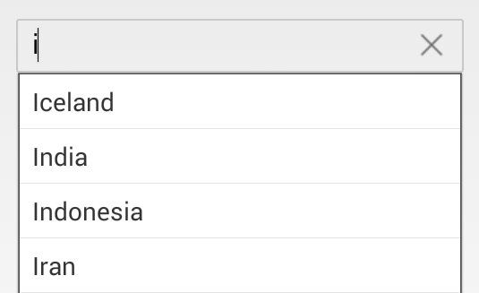

# Populating Items in Xamarin.Android SfAutoComplete

The `AutoCompleteSource` property in the SfAutoComplete control is used to set the list of strings for the suggestion dropdown using a DataAdapter.

The AutoComplete functionality creates a text input that automatically completes input strings by comparing the entered prefix to the prefixes of all strings in the data source. This is useful for text input controls where URLs, addresses, file names, or commands are frequently entered.

Setting the AutoCompleteSource is optional, but it must be configured to use custom data sources with the `AutoCompleteCustomSource` property.




	
	List<String> countryList = new List<String>(); 
	countryList.Add ("Afghanistan");
	countryList.Add ("Akrotiri");
	countryList.Add ("Albania");
	countryList.Add ("Algeria");
	ArrayAdapter<String> countryListDataAdapters = new ArrayAdapter<String>(context,Android.Resource.Layout.SimpleListItem1, countryList);
	countryAutoComplete.SetAutoCompleteSource(countryListDataAdapters);
	countryAutoComplete.AutoCompleteMode=AutoCompleteMode.Suggest;
	 



	

