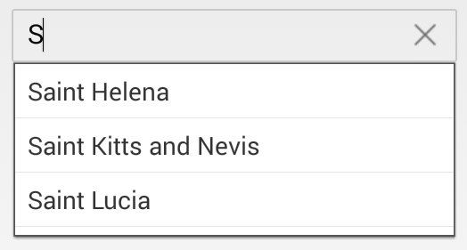

# Suggestion Mode	

It is used to display which type of filtered list is show in the dropdown. They are,

* StartsWith - It begins to search with the starting letter.


	
	countryAutoComplete.SuggestionMode = SuggestionMode.StartsWith;
	 

	

* StartsWithCaseSensitive - This mode is used to display the suggestions based on the starting letter with case sensitive in autocomplete.


	
	countryAutoComplete.SuggestionMode = SuggestionMode.StartsWithCaseSensitive;
	 

	

* Contains - It displays Suggestion if AutoComplete contains that words.


	
	countryAutoComplete.SuggestionMode = SuggestionMode.Contains;
	 

	

* ContainsWithCaseSensitive - It displays the Suggestion if AutoComplete contains that Words with Case sensitive.


	
	countryAutoComplete.SuggestionMode = SuggestionMode.ContainsWithCaseSensitive;
	 

	

* Equals - It displays the word that matches.


	
	countryAutoComplete.SuggestionMode = SuggestionMode.Equals;
	 

	

* EqualsWithCaseSensitive - It displays the word that matches with Case sensitive.


	
	countryAutoComplete.SuggestionMode = SuggestionMode.EqualsWithCaseSensitive;
	 

	

* EndsWith - It displays the suggestion based on ending word in autocomplete control.


	
	countryAutoComplete.SuggestionMode = SuggestionMode.EndsWith;
	 

	

* EndsWithCaseSensitive - It display the suggestion based on the ending words with case sensitive in autocomplete control.


	
	countryAutoComplete.SuggestionMode = SuggestionMode.EndsWithCaseSensitive;
	 

	

