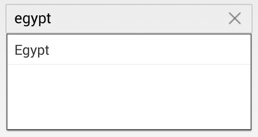

# Various Filter Options for Suggestion

By default, items that match the starting letter will be displayed as suggestions. This behavior can be changed using the `SuggestionMode` property, which provides various options to filter the data according to the text entered. There are eight types of suggestion modes, which are described as follows:

## Words that Start with Input Text

Displays the list of suggestions based on the starting letter.




	
	countryAutoComplete.SuggestionMode = SuggestionMode.StartsWith;
	 



	

### Filter with Character Casing

Displays the list of suggestions based on the starting letter with case sensitivity.




	
	countryAutoComplete.SuggestionMode = SuggestionMode.StartsWithCaseSensitive;
	 



	

## Words that Contain the Input Text

Displays the list of suggestions if the AutoComplete list contains those words.




	
	countryAutoComplete.SuggestionMode = SuggestionMode.Contains;
	 



	

### Filter with Character Casing

Displays the list of suggestions if the AutoComplete list contains those words with case sensitivity.




	
	countryAutoComplete.SuggestionMode = SuggestionMode.ContainsWithCaseSensitive;
	 



	

## Words that Equal the Input Text

Displays words that exactly match the input text.



	
	countryAutoComplete.SuggestionMode = SuggestionMode.Equals;
	 



	

### Filter with Character Casing

Displays words that exactly match the input text with case sensitivity.




	
	countryAutoComplete.SuggestionMode = SuggestionMode.EqualsWithCaseSensitive;
	 



	

## Words that End with Input Text

Displays the list of suggestions based on the ending text.




	
	countryAutoComplete.SuggestionMode = SuggestionMode.EndsWith;
	 



	

### Filter with Character Casing

Displays the list of suggestions based on the ending text with case sensitivity.




	
countryAutoComplete.SuggestionMode = SuggestionMode.EndsWithCaseSensitive;
	 



	

## Custom Filter

Displays the list of suggestions based on custom filtering logic in the SfAutoComplete.




	
countryAutoComplete.SuggestionMode = SuggestionMode.Custom;
	 



	

