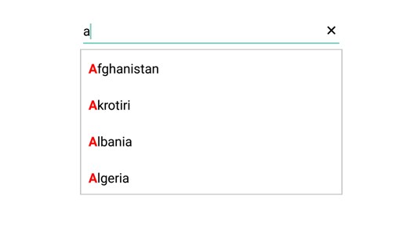
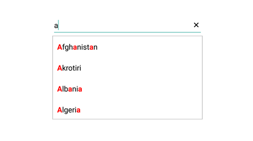

# Highlighting matched text

Highlight matching characters in a suggestion list to pick an item with more clarity. There are two ways to highlight the matching text:

* FirstOccurrence

* MultipleOccurrence

The text highlight can be indicated with various customizing styles by enabling the below properties. They are

* HighlightedTextColor -  sets the color of the highlighted text for differentiating the highlighted characters.

* HighlightTextFontAttributes - sets the FontAttributes of the highlighted text.

## FirstOccurrence

It highlights the first position of the matching characters in the suggestion list.




	
	List<String> countryList = new List<String>(); 
	countryList.Add ("Afghanistan");
	countryList.Add ("Akrotiri");
	countryList.Add ("Albania");
	countryList.Add ("Algeria");
	ArrayAdapter<String> countryListDataAdapters = new ArrayAdapter<String>(context,Android.Resource.Layout.SimpleListItem1, countryList);
	countryAutoComplete.SetAutoCompleteSource(countryListDataAdapters);
	countryAutoComplete.SuggestionMode=SuggestionMode.StartsWith;
	countryAutoComplete.TextHighlightMode=OccurrenceMode.FirstOccurrence;
	 



	

## MultipleOccurrence

It highlights the matching character that are present everywhere in the suggestion list for Contains case in SuggestionMode.




	
	List<String> countryList = new List<String>(); 
	countryList.Add ("Afghanistan");
	countryList.Add ("Akrotiri");
	countryList.Add ("Albania");
	countryList.Add ("Algeria");
	ArrayAdapter<String> countryListDataAdapters = new ArrayAdapter<String>(context,Android.Resource.Layout.SimpleListItem1, countryList);
	countryAutoComplete.SetAutoCompleteSource(countryListDataAdapters);
	countryAutoComplete.SuggestionMode=SuggestionMode.Contains;
	countryAutoComplete.TextHighlightMode=OccurrenceMode.MultipleOccurrence;
	 



	

