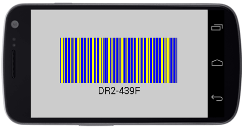
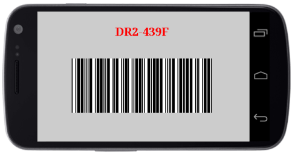

# Barcode Customization

## Bar Customization

The color of the Barcode can be customized by using the properties of `DarkBarBrush` and `LightBarBrush` in the SfBarcode. 

The DarkBarBrush represents the color of the dark bar (Black color by default) and the LightBarBrush represents the color of the gap between two adjacent black bars (White color by default).



    //Changes the color of darker area of Barcode.
    sfBarcode.DarkBarBrush = Color.Blue;
    //Changes the color of lighter area of Barcode.
    sfBarcode.LightBarBrush = Color.Red;



  
                               
Barcode with bar color customization
{:.caption}

>**NOTE** The DarkBarBrush and LightBarBrush customizations are applicable only for one dimensional Barcodes. In order, to recognize a Barcode symbol by a scanner, there must be an adequate contrast between the dark bars and the light spaces. All the Barcode scanners do not have support for colored Barcodes.

## Text Customization

The text representing the Barcode can be customized by using the following properties.

* The color of text can be altered by using the `TextColor` property.
* The size of text can be altered by using the `TextSize` property.
* The horizontal alignment of text can be customized with the help of the `TextPosition` property.
* The gap between Barcode and text can be adjusted by setting the property of `TextGapHeight`.
* To change the location of text vertically, you can make use of the `TextLocation` property with options of top and bottom location.



    sfBarcode.TextColor = Color.Blue;
    sfBarcode.TextSize = 30;
    Typeface fontFamily = Typeface.Create("helvetica", TypefaceStyle.Bold);
    sfBarcode.TextFont = fontFamily;
    sfBarcode.TextGapHeight = 20;
    sfBarcode.TextLocation = BarcodeTextLocation.Bottom;
    sfBarcode.TextAlignment = TextAlignment.Center;



                                                          
Barcode with text customization
{:.caption}

