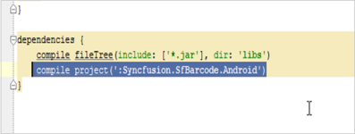
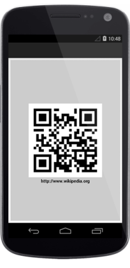
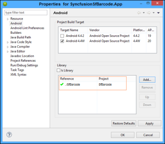

# Getting Started

## Create your first Barcode in Xamarin.Android Studio

This section explains how to configure a Barcode for Xamarin.Android application by using the JavaXamarin.Android. To get started with the Essential Barcode, refer to the following steps and in result, you get the output on Xamarin.Android devices as follows.

                                                                                             
QR Barcode output                                                                                   
{:.caption}

## Add and Configure the Barcode

The following steps explain you how to add the SfBarcode reference.

1. Open Xamarin.Android Studio IDE and choose File -> New Project from Menu to create a new application.
2. Select the required SDK and make sure that it has a minimum SDK Version of API 16, JellyBean, because you are provided with 
   support from API version 16.
3. Copy the Syncfusion.SfBarcode.Xamarin.Android.aar file from the installed location and add it to the libs folder of the created 
   project. When the folder is not available, create a new folder libs.

4. Open the Build.gradle file, make the libs folder as a flatDir repository and add the SfBarcode in dependencies.
   
            
   {:.caption}

## Configure the Barcode control

The following steps explain how to create and configure a Barcode.

1.Add reference to the SfBarcode as follows.
 
2.Create a SfBarcode instance in the Main Activity and set the SfBarcode as a ContentView in onCreate() overridden method.

 
   
   public class MainActivity extends Activity {

	@Override

	protected void onCreate(Bundle savedInstanceState) {

		super.onCreate(savedInstanceState);

		// creates new instance for Barcode

		SfBarcode sfBarcode = new SfBarcode(this);

		setContentView(sfBarcode);

	}
	
  
  
3.Then you can set the text that you want to encode.
 
  
   
  
    sfBarcode.Text = "http://www.wikipedia.org";
  
    
   
4.Set the required symbology to encode the given text. By default, the given text is encoded by using Code 39 symbology.

   
  
    sfBarcode.Symbology = BarcodeSymbolType.QRBarcode;
  
    
   
5.To customize the Barcode, initialize the settings of the corresponding Barcode symbology. 



    QRBarcodeSettings setting = new QRBarcodeSettings();
    setting.XDimension = 15;
    sfBarcode.SymbologySettings = setting;

    
   
6.Finally, the Barcode is generated as displayed in the screenshot by using the following code example.


  
    public class MainActivity : Activity
    {
        protected override void OnCreate(Bundle bundle)
        {
            base.OnCreate(bundle);
            SfBarcode sfBarcode = new SfBarcode(this);
            sfBarcode.Text = "http://www.wikipedia.org";
            sfBarcode.Symbology = BarcodeSymbolType.QRBarcode;
            QRBarcodeSettings setting = new QRBarcodeSettings();
            setting.XDimension = 15;
            sfBarcode.SymbologySettings = setting;
            sfBarcode.SetBackgroundColor(Color.White);
            SetContentView(sfBarcode);
        }
    }

    
   
     

  Final output of Xamarin.Android getting started application
  {:.caption}

## Create your first Barcode in Eclipse

This section explains how to configure a Barcode for Xamarin.Android application by using the Java Xamarin.Android. To get started with the Essential Barcode, refer to the following steps and in result, you get the output on Xamarin.Android devices as follows.

    
                                        
QR Barcode output
{:.caption}

## Add and Configure the Barcode:

The following steps explain you how to add the SfBarcode reference.

4. Then right-click on the Xamarin.Android application and choose Properties -> Xamarin.Android and add the SfBarcode project as dependency 
   library.

                                                                        
    Xamarin.Android Window
    {:.caption}

## Configure the Barcode control

The following steps explain how to create and configure a Barcode.

1.Add reference to the SfBarcode as follows.

2.Create a SfBarcode instance in Main Activity and set the SfBarcode as a ContentView in onCreate() overridden method.

  
  
    public class MainActivity extends Activity {

	@Override

	protected void onCreate(Bundle savedInstanceState) {

		super.onCreate(savedInstanceState);

		// creates new instance for Barcode

		SfBarcode sfBarcode = new SfBarcode(this);

		setContentView(sfBarcode);

	}
   
    
3.Then you can set the text that you want to encode.
 



    sfBarcode.Text = "http://www.wikipedia.org";


   
4.Set the required symbology to encode the given text. By default, the given text is encoded by using the Code 39 symbology.



    sfBarcode.Symbology = BarcodeSymbolType.QRBarcode;


   
5.To customize the Barcode, initialize the settings of the corresponding Barcode symbology. 



    QRBarcodeSettings setting = new QRBarcodeSettings();
    setting.XDimension = 15;
    sfBarcode.SymbologySettings = setting;



6.Finally, the Barcode is generated as displayed in the screenshot for the following code example.

   


    public class MainActivity : Activity
    {
    protected override void OnCreate(Bundle bundle)
    {
        base.OnCreate(bundle);
        SfBarcode sfBarcode = new SfBarcode(this);
        sfBarcode.Text = "http://www.wikipedia.org";
        sfBarcode.Symbology = BarcodeSymbolType.QRBarcode;
        QRBarcodeSettings setting = new QRBarcodeSettings();
        setting.XDimension = 15;
        sfBarcode.SymbologySettings = setting;
        sfBarcode.SetBackgroundColor(Color.White);
        SetContentView(sfBarcode);
    }
}

   
                                                   
Final output of Xamarin.Android getting started application
{:.caption}