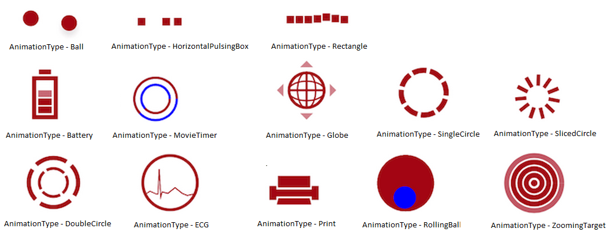

# AnimationType

The `AnimationType` property of SfBusyIndicator allows to set anyone of the animation from the built-in animations as a BusyIndicator.



	SfBusyIndicator busyIndicator = new SfBusyIndicator(this);
	busyIndicator.AnimationType=AnimationTypes.Ball;
	


                                          
