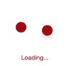
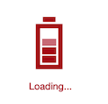
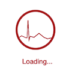
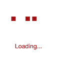
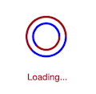
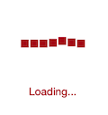
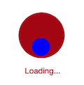
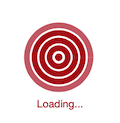

# AnimationType

The `AnimationType` property of SfBusyIndicator allows to set anyone of the animation from the built-in animations as a BusyIndicator.



	SfBusyIndicator sfBusyIndicator = new SfBusyIndicator(this);
	sfBusyIndicator.AnimationType=AnimationTypes.ECG;
	


                                          
AnimationType - Ball
{:.caption}

   
                                            
AnimationType - Battery
{:.caption}

                                                       

AnimationType - DoubleCircle
{:.caption}

                                                       
AnimationType - ECG
{:.caption}

                                    

AnimationType - Globe
{:.caption}

                                          

AnimationType - HorizontalPulsingBox
{:.caption}

                      

AnimationType - MovieTimer
{:.caption}

                                 

AnimationType - Print
{:.caption}

                                     

AnimationType - Rectangle
{:.caption}

                     

AnimationType - RollingBall
{:.caption}

                              

AnimationType - SlicedCircle
{:.caption}

                       

AnimationType - SingleCircle
{:.caption}

                          

AnimationType - ZoomingTarget
{:.caption}

