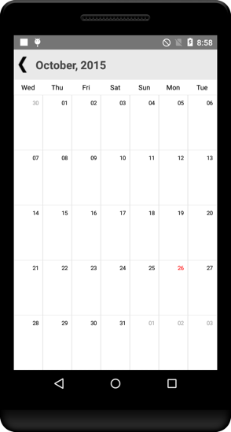

# FirstDayofWeek

By default, the starting day will be sunday. This can be modified using `FirstDayofWeek` property. Changing the first day of week will be applied to both month and year view.


	
	calendar.FirstDayofWeek= 4;
	


                                        

