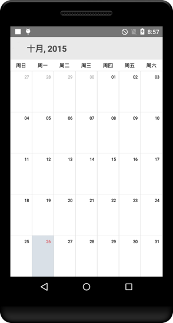

# Localization

SfCalendar control is available with complete localization support.
 
Localization can be specified by setting the `Locale` property of the control using the format of Language code followed by Country code. Based on the locale specified, the strings in the control are localized accordingly.
 
N> By default, SfCalendar control is available with en-US locale. 



SfCalendar sfCalendar = new SfCalendar(this);

sfCalendar.Locale = new Java.Util.Locale("zh,CN");



                                        

