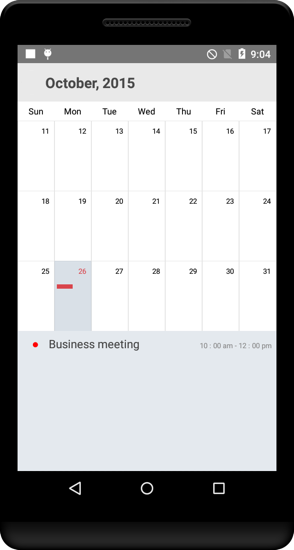
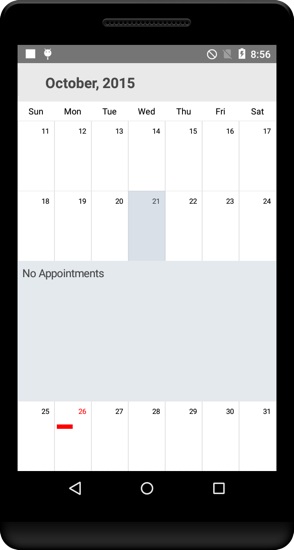

# Populating Events

Calendar control has an inbuilt capability to display the events based on the calendar events collection provided to `DataSource` property. For events to be listed for a particular day, enable the inline feature in month view cell.

The default UI of the inline view with events will be like list of events with a Gray background

                                        

Default UI of the inline view without events will be hinting No Events available on a particular day.

                                        

Inline event support can be toggled on / off with `ShowEventsInline` property.



	sfcalendar.showInLineEvent=True;



N> The Inline function will be available only in MonthView with Single selection mode.

## Adding events using Collection

Calendar Events collection can be provided to calendar using the following steps. `CalendarEventCollection` is a class, which holds the details about the events to be rendered in calendar. 

`CalendarInlineEvent` has some basic properties such as `StartTime`, `EndTime` and `Subject`.


		   
		   CalendarEventCollection eventsCollection =new CalendarEventCollection();
		   CalendarInlineEvent events=new CalendarInlineEvent();
           DateTime d=new DateTime(2015,1,1);
           DateTime d1=new DateTime(2015,1,1);
           events.StartTime=d;
           events.EndTime=d1;
           events.Subject=”Go to Meeting”;
           events.Color=Color.RED;
		   


Create the collection of the calendar events by setting required details using above mentioned properties for each events.



	eventsCollection.Add(events);
	


Assign the created collection to the `DataSource` property of Calendar 



	calendar.DataSource(eventsCollection); 



                                        

