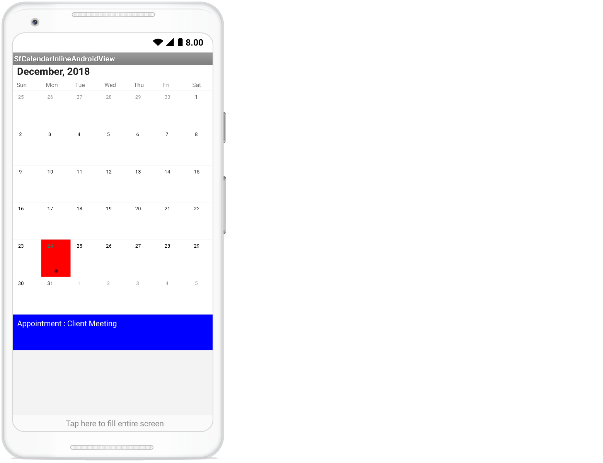
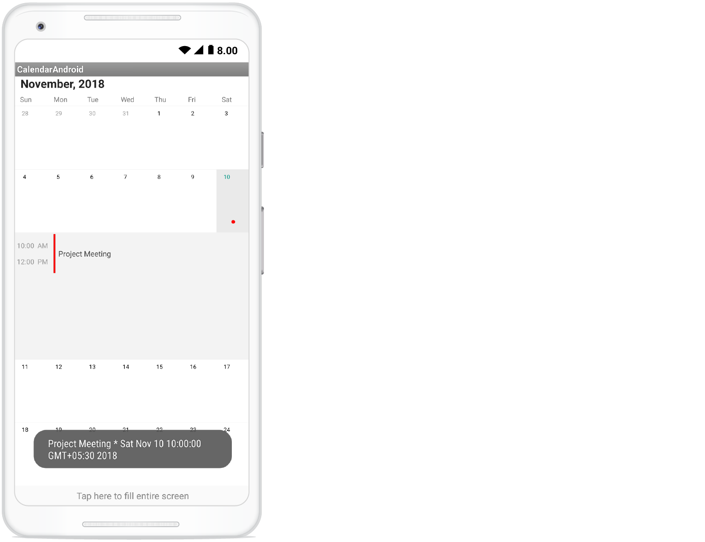
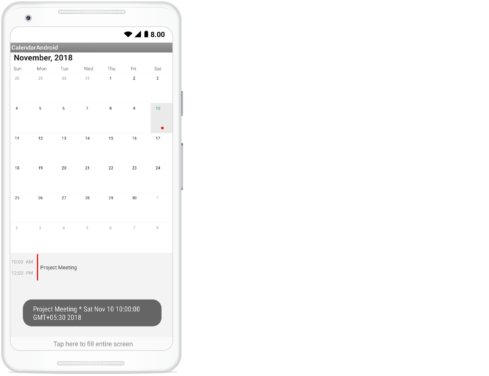

# Populating Events with Xamarin.Android Calendar (SfCalendar)

`SfCalendar` control has an built-in capability to display the events based on the calendar events collection provided to [DataSource](https://help.syncfusion.com/cr/cref_files/xamarin-android/sfcalendar/Syncfusion.SfCalendar.Android~Com.Syncfusion.Calendar.SfCalendar~DataSource.html) property. For events to be listed for a particular day, enable the inline feature in month view cell.

The default UI of the inline view with events will be like list of events with a Gray background

                                        

Default UI of the inline view without events will be hinting No Events available on a particular day.

                                        

[Inline](https://help.syncfusion.com/cr/cref_files/xamarin-android/sfcalendar/Syncfusion.SfCalendar.Android~Com.Syncfusion.Calendar.InlineTappedEventArgs~Inline.html) event support can be toggled on / off with [ShowEventsInline](https://help.syncfusion.com/cr/cref_files/xamarin-android/sfcalendar/Syncfusion.SfCalendar.Android~Com.Syncfusion.Calendar.SfCalendar~ShowEventsInline.html) property.



SfCalendar sfCalendar = new SfCalendar(this);
sfcalendar.ShowEventsInline=true;



N> The Inline function will be available only in MonthView with Single selection mode.

## Adding events using Collection

Calendar Events collection can be provided to `SfCalendar` using the following steps. [CalendarEventCollection](https://help.syncfusion.com/cr/cref_files/xamarin-android/sfcalendar/Syncfusion.SfCalendar.Android~Com.Syncfusion.Calendar.InlineEventToggledEventArgs~CalendarEventCollection.html) is a class, which holds the details about the events to be rendered in `SfCalendar`. 

[CalendarInlineEvent](https://help.syncfusion.com/cr/cref_files/xamarin-android/sfcalendar/Syncfusion.SfCalendar.Android~Com.Syncfusion.Calendar.InlineAppointmentTappedEventArgs~CalendarInlineEvent.html) has some basic properties such as [StartTime](https://help.syncfusion.com/cr/cref_files/xamarin-android/sfcalendar/Syncfusion.SfCalendar.Android~Com.Syncfusion.Calendar.CalendarInlineEvent~StartTime.html), [EndTime](https://help.syncfusion.com/cr/cref_files/xamarin-android/sfcalendar/Syncfusion.SfCalendar.Android~Com.Syncfusion.Calendar.CalendarInlineEvent~EndTime.html), [Subject](https://help.syncfusion.com/cr/cref_files/xamarin-android/sfcalendar/Syncfusion.SfCalendar.Android~Com.Syncfusion.Calendar.CalendarInlineEvent~Subject.html) and [Color](https://help.syncfusion.com/cr/cref_files/xamarin-android/sfcalendar/Syncfusion.SfCalendar.Android~Com.Syncfusion.Calendar.CalendarInlineEvent~Color.html)


		   
 SfCalendar sfCalendar = new SfCalendar(this);

CalendarEventCollection eventsCollection = new CalendarEventCollection();
CalendarInlineEvent events = new CalendarInlineEvent();

//starting date of event
Calendar startEventDate = Calendar.Instance;
startEventDate.Set(2015, 9, 26, 10, 0, 0);
events.StartTime = startEventDate;

//ending date of event
Calendar endEventDate = Calendar.Instance;
endEventDate.Set(2015, 9, 26, 12, 0, 0);
events.EndTime = endEventDate;

//subject which will be going to add as content in Inline event appointments
events.Subject = "Business Meeting";

//Indicator color in appointments
events.Color = Android.Graphics.Color.Red;

eventsCollection.Add(events);

//Add collection of events as source of SfCalendar

sfCalendar.DataSource = eventsCollection;

SetContentView(sfCalendar);
		   


Create the collection of the calendar events by setting required details using above mentioned properties for each events.



	eventsCollection.Add(events);
	


Assign the created collection to the [DataSource](https://help.syncfusion.com/cr/cref_files/xamarin-android/sfcalendar/Syncfusion.SfCalendar.Android~Com.Syncfusion.Calendar.SfCalendar~DataSource.html) property of SfCalendar 



	sfCalendar.DataSource = eventsCollection;
 


                                   

N> Instead of the actual month of the event it will display the next month in the calendar. So, If you want to get the exact month of the event, you should provide the previous month with the same date. This is the actual behavior of this property.

## Customize inline/agenda view appearance

You can customize the inline item view by [OnInlineItemLoaded](https://help.syncfusion.com/cr/cref_files/xamarin-android/Syncfusion.SfCalendar.Android~Com.Syncfusion.Calendar.SfCalendar~InlineItemLoaded_EV.html) event using in `SfCalendar` and you can get the details of appointment from the `CalendarInlineEvent` property, the custom view can be set to `View` property of [InlineItemLoadedEventArgs](https://help.syncfusion.com/cr/cref_files/xamarin-android/Syncfusion.SfCalendar.Android~Com.Syncfusion.Calendar.InlineItemLoadedEventArgs.html) argument.



	calendar.InlineItemLoaded += Calendar_InlineItemLoaded; 

	.....

	void Calendar_InlineItemLoaded(object sender, InlineItemLoadedEventArgs e)
	{
		var appointment = e.CalendarInlineEvent;
		Button button = new Button(this);
		button.Text = "Appointment :" + appointment.Subject;
		button.SetBackgroundColor(Color.Blue);
		button.SetTextColor(Color.White);
		e.View = button;
	} 



Inline view mode

 

Agenda view mode

 
                                  
## Getting inline/agenda view appointment details

Using `InlineEvent` property from the `InlineItemTappedEventArgs` argument of `InlineItemTapped` event, you can get the month inline/agenda appointments details while tapping the specific appointment in inline/agenda view.


calendar.InlineItemTapped+= Calendar_InlineItemTapped; 

private void Calendar_InlineItemTapped(object sender, InlineItemTappedEventArgs e)
    {
        var appointment = e.InlineEvent;
        Toast.MakeText(this, appointment.Subject + " * " + appointment.StartTime.Time.ToString(), ToastLength.Long).Show(); 
    } 


Inline view mode

 

Agenda view mode

 

