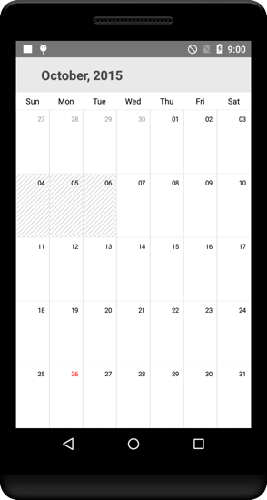

# Restricting Dates from Selection

## Min Max dates

Visible dates can be restricted between certain range of dates using `MinDate` and `MaxDate` properties available in SfCalendar control. It is applicable in all the calendar views.

The inline feature in month view will work only within the min max date range.

Beyond the min max date range, following restrictions will be applied.

* Date navigations features of MoveToDate will be restricted.

* Cannot swipe the control using touch gesture.

* Selection does not work for month view. 

* The tapped delegates will not be triggered while tapped on the monthcell.  



SfCalendar sfCalendar = new SfCalendar(this);

Calendar minCalendar = Calendar.Instance;
minCalendar.Set(2016, 9, 1);

Calendar maxCalendar = Calendar.Instance;
maxCalendar.Set(2020, 9, 1);

sfCalendar.MinDate = minCalendar;
sfCalendar.MaxDate = maxCalendar;

SetContentView(sfCalendar);

	


## Blackout dates

In SfCalendar, blackout dates refers the disabled dates that restrict the user from selecting it. These dates will be marked with slanted Stripes. 

The blackout dates can be achieved in two ways. 

* A date collection can be provided to set the `BlackoutDates` property. This is useful when one wants to block dates where holidays or any other events occur. 

* By invoking the `AddDatesInPast` method, all past dates will be blacked out till current date.



SfCalendar sfCalendar = new SfCalendar(this);

List<Date> black_dates = new List<Date>();

for (int i = 4; i < =6; i++)
{
	Date date = new Date(2015,9,i);
	black_dates.Add(date);
}
sfCalendar.BlackoutDates = black_dates;

SetContentView(sfCalendar);



                                        

N> This support is enabled only in month view and the dates that consists inline events will also be disabled, when they are blacked out.

