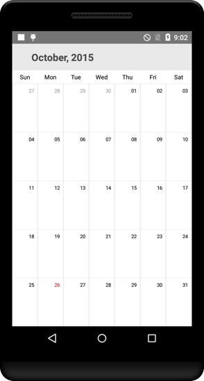
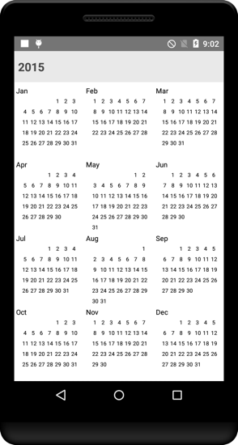

# Built-in Views

`SfCalendar` control provides two types of views to display dates such as month view and year view. It can be assigned to the `SfCalendar` control by using [ViewMode](https://help.syncfusion.com/cr/cref_files/xamarin-android/sfcalendar/Syncfusion.SfCalendar.Android~Com.Syncfusion.Calendar.SfCalendar~ViewMode.html) property.

By default `SfCalendar` control is assigned with month view. Based on the user’s preference, `SfCalendar` can be viewed in any one of the available two type.

## MonthView

This displays entire dates of a particular month, by default current month will be displayed on Loading. The current date is provided with unique color different from the rest of the dates color in a month. The events availability will be denoted within the cell based on its duration.

The dates in month view can be selected by three ways such as single, multiple and range which can be modified using `SelectionMode`



SfCalendar sfCalendar = new SfCalendar(this);
sfCalendar.ViewMode = ViewMode.MonthView;



                                        

### Month View Settings

* The current day text color can be modified using [TodayTextColor](https://help.syncfusion.com/cr/cref_files/xamarin-android/sfcalendar/Syncfusion.SfCalendar.Android~Com.Syncfusion.Calendar.MonthViewSettings~TodayTextColor.html). 
* The month view label settings class has the APIs to change date text size, day text size and various format options. 
* The Background color of the inline view can be modified using [InlineBackgroundColor](https://help.syncfusion.com/cr/cref_files/xamarin-android/sfcalendar/Syncfusion.SfCalendar.Android~Com.Syncfusion.Calendar.MonthViewSettings~InlineBackgroundColor.html) property.



SfCalendar sfCalendar = new SfCalendar(this);
MonthViewLabelSetting labelSettings = new MonthViewLabelSetting();
labelSettings.DayLabelSize = 10;
labelSettings.DayFormat = "EEE";
labelSettings.DateLabelSize = 12;

MonthViewSettings monthViewSettings = new MonthViewSettings();
monthViewSettings.TodayTextColor = Android.Graphics.Color.ParseColor("#1B79D6");
monthViewSettings.InlineBackgroundColor = Android.Graphics.Color.ParseColor("#E4E8ED");
monthViewSettings.WeekEndBackgroundColor=Android.Graphics.Color.ParseColor("#F7F7F7");
monthViewSettings.MonthViewLabelSetting = labelSettings;

sfCalendar.MonthViewSettings = monthViewSettings;



N> Similarly there are many settings available to modify Text and Background colors of month view in `MonthViewSettings` class.

### Customize trailing and leading days

The `SfCalendar` allows you hide the days of the next month and previous month in calendar to enhance the appearance. This can be achieved by enabling the [ShowLeadingAndTrailingDays](https://help.syncfusion.com/cr/cref_files/xamarin-android/Syncfusion.SfCalendar.Android~Com.Syncfusion.Calendar.SfCalendar~ShowLeadingAndTrailingDays.html) property. The following code demonstrates how to hide the leading and trailing dates in calendar.





SfCalendar calendar = new SfCalendar(this);
calendar.ViewMode = ViewMode.MonthView;
calendar.ShowLeadingAndTrailingDays = true;
this.Content = calendar;





N>
* The DrawMonthCell event is triggered for the current month dates.
* The VisibleDates in the MonthChanged event will return the current month dates.

## YearView

This displays entire dates/month of a particular year, by default current year will be displayed on loading. The Years can be changed by swiping back and forth or `forward` and `backward` methods can be used. The Months can be navigated quickly by selecting on the particular month in year view.



SfCalendar sfCalendar = new SfCalendar(this);
sfCalendar.ViewMode = ViewMode.YearView;



                                        

### Year View Settings

*	The Month header color can be modified using [MonthHeaderTextColor](https://help.syncfusion.com/cr/cref_files/xamarin-android/sfcalendar/Syncfusion.SfCalendar.Android~Com.Syncfusion.Calendar.YearViewSettings~MonthHeaderTextColor.html) property in similar way, year header and date text color can be changed using `YearHeaderTextColor` and [DateTextColor](https://help.syncfusion.com/cr/cref_files/xamarin-android/sfcalendar/Syncfusion.SfCalendar.Android~Com.Syncfusion.Calendar.YearViewSettings~DateTextColor.html) properties respectively. 
*	The gravity of the month name can be modified using `HeaderLabelAlignment` property, to position it to Left, Right or Center. 
*	The complete layout’s background color can be modified using [YearLayoutBackground](https://help.syncfusion.com/cr/cref_files/xamarin-android/sfcalendar/Syncfusion.SfCalendar.Android~Com.Syncfusion.Calendar.YearViewSettings~YearLayoutBackground.html) property.



YearViewSettings yearViewSettings = new YearViewSettings();
yearViewSettings.YearHeaderTextColor = Android.Graphics.Color.ParseColor("#1B79D6");
yearViewSettings.MonthHeaderBackground = Android.Graphics.Color.ParseColor("#E4E8ED");
yearViewSettings.DateTextColor = Android.Graphics.Color.Red;
sfCalendar.YearViewSettings = yearViewSettings;

