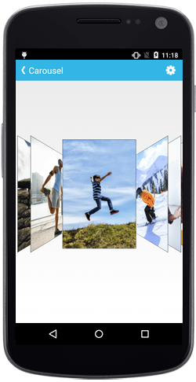
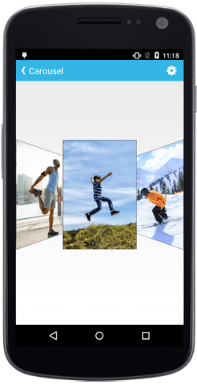
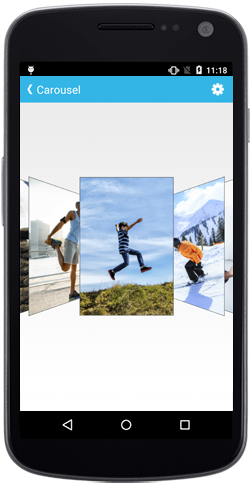

# Transformation

## Rotation Angle

The `RotationAngle` property in the SfCarousel control is used to rotate all the items in a specified angle. 

If the angle value is positive, then the rotation is in the clockwise direction. If the angle value is negative, the rotation is in the counterclockwise direction. 

N> This angle can also be specified from 0 to 360.



	carousel.RotationAngle=40;



## Offset

### Items Offset

Specify the distance between the items in SfCarousel panel using `Offset` property.

N> The default value is 20.



	carousel.Offset=30;



### Selected Item Offset

Distance between the selected item and other items can be customized by using `SelectedItemOffset` property.

N> The default value is 0.



	carousel.SelectedItemOffset=5;



### Scale Offset

The `ScaleOffset` property in the SfCarousel control is used to scale all the items to the specified scale value.


	
	carousel.ScaleOffset=0.7f;



