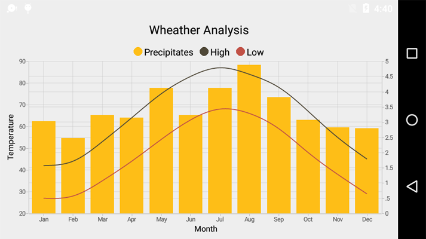

# Getting Started

This section provides a quick overview for working with Essential Chart for Xamarin Android. It guides you to the entire process of creating a real-world chart.

This section enables you to visualize the weather data for Washington, DC, during the period 1961-1990. The raw sample data is given as follows.

<table>
<tr>
<th>
Month</th><th>
High</th><th>
Low</th><th>
Precipitation</th></tr>
<tr>
<td>
January</td><td>
42</td><td>
27</td><td>
3.03</td></tr>
<tr>
<td>
February</td><td>
44</td><td>
28</td><td>
2.48</td></tr>
<tr>
<td>
March</td><td>
53</td><td>
35</td><td>
3.23</td></tr>
<tr>
<td>
April</td><td>
64</td><td>
44</td><td>
3.15</td></tr>
<tr>
<td>
May</td><td>
75</td><td>
54</td><td>
4.13</td></tr>
<tr>
<td>
June</td><td>
83</td><td>
63</td><td>
3.23</td></tr>
<tr>
<td>
July</td><td>
87</td><td>
68</td><td>
4.13</td></tr>
<tr>
<td>
August</td><td>
84</td><td>
66</td><td>
4.88</td></tr>
<tr>
<td>
September</td><td>
78</td><td>
59</td><td>
3.82</td></tr>
<tr>
<td>
October</td><td>
67</td><td>
48</td><td>
3.07</td></tr>
<tr>
<td>
November</td><td>
55</td><td>
38</td><td>
2.83</td></tr>
<tr>
<td>
December</td><td>
45</td><td>
29</td><td>
2.8</td></tr>
</table>

## Reference Essential Studio components in your solution

After installing Essential Studio for Xamarin, you can find all the required assemblies in the installation folders, 

{Syncfusion Installed location}\Essential Studio\14.2.0.26\lib

N> Assemblies are available in unzipped package location in Mac.

Add the following assembly references to the Android project,

android\Syncfusion.SfChart.Andriod.dll

## Add and configure the Chart

The following steps explain on how to create a Chart and configure its elements,

1. Create an instance of SfChart.
2. Add the primary and secondary axis for the chart as follows.



SfChart chart = new SfChart (this);

//Initializing Primary Axis

CategoryAxis primaryAxis = new CategoryAxis ();

primaryAxis.Title.Text = "Month";

chart.PrimaryAxis = primaryAxis;

//Initializing Secondary Axis

NumericalAxis secondaryAxis = new NumericalAxis ();

secondaryAxis.Title.Text = "Temperature";

chart.SecondaryAxis = secondaryAxis;

SetContentView(chart);



You can set a title for the chart using the Title.Text property as follows.



chart.Title.Text = "Weather Analysis";



## Add Chart series

In this sample, you can display the temperature over the months using a Column Series. Before creating the series, create a data model representing the climate details data.

In SfChart, the series ItemsSource should to be a collection of ChartDataPoint objects. Add the following class for generating the datapoints.



public class DataModel
{
	public ObservableArrayList  HighTemperature;

	public DataModel ()
    {
		HighTemperature = new ObservableArrayList ();
        HighTemperature.Add (new ChartDataPoint ("Jan", 42));
        HighTemperature.Add (new ChartDataPoint ("Feb", 44));
        HighTemperature.Add (new ChartDataPoint ("Mar", 53));
        HighTemperature.Add (new ChartDataPoint ("Apr", 64));
        HighTemperature.Add (new ChartDataPoint ("May", 75));
        HighTemperature.Add (new ChartDataPoint ("Jun", 83));
        HighTemperature.Add (new ChartDataPoint ("Jul", 87));
        HighTemperature.Add (new ChartDataPoint ("Aug", 84));
        HighTemperature.Add (new ChartDataPoint ("Sep", 78));
        HighTemperature.Add (new ChartDataPoint ("Oct", 67));
        HighTemperature.Add (new ChartDataPoint ("Nov", 55));
        HighTemperature.Add (new ChartDataPoint ("Dec", 45));
    }
}
   


Now, add the series to the chart and set its DataSource as follows.



//Adding the series to the chart

chart.Series.Add (new ColumnSeries () 
{
	DataSource= dataModel.HighTemperature
}); 



## Add Legends

You can enable the Legends in SfChart by setting legend visibility to visible as follows.



//Adding Chart Legend for the Chart

chart.Legend.Visibility = Visibility.Visible;  



Circular legend icons are displayed for each series by default. Next, provide the labels for the series using the Label property, this information is displayed along with the legend icon.

The next step is to add the HighTemperature column series as follows.



//Adding the column series to the chart

chart.Series.Add (new ColumnSeries () 
{
	DataSource = dataModel.HighTemperature,
    Label = "Series 1" 
});



## Add multiple series to the SfChart

So far, only the high temperature data is displayed over time. Now, you can display other data such as low temperature and precipitation.

Add two SplineSeries for displaying high and low temperatures and a ColumnSeries for displaying the precipitation as follows.



DataModel dataModel = new DataModel ();

//Adding ColumnSeries to the chart for Precipitation
chart.Series.Add (new ColumnSeries () 
{
     DataSource = dataModel.Precipitation,
     Label = "Precipitation"
});

//Adding the SplineSeries to the chart for high temperature
chart.Series.Add (new SplineSeries () 
{
     DataSource = dataModel.HighTemperature,
     Label = "High"
});

//Adding the SplineSeries to the chart for low temperature
chart.Series.Add (new SplineSeries () 
{
     DataSource = dataModel.LowTemperature,
     Label = "Low"
});



Currently, all the data is plotted against a single scale but the precipitation data should be plotted against a different scale.

## Add multiple Y-axis

Add a secondary axis(y axis) to the chart as follows.



//Adding ColumnSeries to the chart for Precipitation

chart.Series.Add (new ColumnSeries () 
{
	DataSource = dataModel.Precipitation,
	Label = "Precipitation",
	YAxis = new NumericalAxis(){
		OpposedPosition = true
	}

});
	


The OpposedPosition is set to true to place the secondary axis on the opposite side.

The following is the complete code example for creating the Chart.



public class WeatherActivity : Activity
{
    protected override void OnCreate (Bundle bundle)
    {
		base.OnCreate (bundle);          

    	//Initializing chart
    	SfChart chart = new SfChart (this); 
    	chart.Title.Text = "Weather Analysis" ;
	
		//Initializing Primary Axis
    	CategoryAxis primaryAxis = new CategoryAxis ();
    	primaryAxis.Title.Text = “Month”;
    	chart.PrimaryAxis = primaryAxis;
	
		//Initializing Secondary Axis
    	NumericalAxis secondaryAxis = new NumericalAxis ();
    	secondaryAxis.Title.Text  = "Temperature" ;
    	chart.SecondaryAxis = secondaryAxis;
	
	
    	DataModel dataModel = new DataModel ();
	
		//Adding ColumnSeries to the chart for Precipitation
    	
		chart.Series.Add (new ColumnSeries () 
		{
			DataSource = dataModel.Precipitation,
        	Label = "Precipitation",
        	YAxis = new NumericalAxis()
			{ 
				OpposedPosition = true, 
        	    ShowMajorGridLines=  false 
				
			}
    	});

		//Adding the SplineSeries to the chart for high temperature
    	
		chart.Series.Add (new SplineSeries () 
		{
    		DataSource = dataModel.HighTemperature,
    	    Label = "High"
    	});
	
		//Adding the SplineSeries to the chart for low temperature
    	
		chart.Series.Add (new SplineSeries () 
		{
    	 	DataSource = dataModel.LowTemperature,
    	    Label = "Low"
    	});
	
		//Adding Chart Legend for the Chart
    	chart.Legend.Visibility = Visibility.Visible; 
    	SetContentView(chart);
    }

}

public class DataModel
{
	public ObservableArrayList  HighTemperature;

	public ObservableArrayList  LowTemperature;

	public ObservableArrayList  Precipitation;

	public DataModel ()
    {
		HighTemperature = new ObservableArrayList ();
        HighTemperature.Add (new ChartDataPoint ("Jan", 42));
        HighTemperature.Add (new ChartDataPoint ("Feb", 44));
        HighTemperature.Add (new ChartDataPoint ("Mar", 53));
        HighTemperature.Add (new ChartDataPoint ("Apr", 64));
        HighTemperature.Add (new ChartDataPoint ("May", 75));
        HighTemperature.Add (new ChartDataPoint ("Jun", 83));
        HighTemperature.Add (new ChartDataPoint ("Jul", 87));
        HighTemperature.Add (new ChartDataPoint ("Aug", 84));
        HighTemperature.Add (new ChartDataPoint ("Sep", 78));
        HighTemperature.Add (new ChartDataPoint ("Oct", 67));
        HighTemperature.Add (new ChartDataPoint ("Nov", 55));
        HighTemperature.Add (new ChartDataPoint ("Dec", 45));

        LowTemperature = new ObservableArrayList ();
        LowTemperature.Add (new ChartDataPoint ("Jan", 27));
        LowTemperature.Add (new ChartDataPoint ("Feb", 28));
        LowTemperature.Add (new ChartDataPoint ("Mar", 35));
        LowTemperature.Add (new ChartDataPoint ("Apr", 44));
        LowTemperature.Add (new ChartDataPoint ("May", 54));
        LowTemperature.Add (new ChartDataPoint ("Jun", 63));
        LowTemperature.Add (new ChartDataPoint ("Jul", 68));
        LowTemperature.Add (new ChartDataPoint ("Aug", 66));
        LowTemperature.Add (new ChartDataPoint ("Sep", 59));
        LowTemperature.Add (new ChartDataPoint ("Oct", 48));
        LowTemperature.Add (new ChartDataPoint ("Nov", 38));
        LowTemperature.Add (new ChartDataPoint ("Dec", 29));

        Precipitation = new ObservableArrayList ();
        Precipitation.Add (new ChartDataPoint ("Jan", 3.03));
        Precipitation.Add (new ChartDataPoint ("Feb", 2.48));
        Precipitation.Add (new ChartDataPoint ("Mar", 3.23));
        Precipitation.Add (new ChartDataPoint ("Apr", 3.15));
        Precipitation.Add (new ChartDataPoint ("May", 4.13));
        Precipitation.Add (new ChartDataPoint ("Jun", 3.23));
        Precipitation.Add (new ChartDataPoint ("Jul", 4.13));
        Precipitation.Add (new ChartDataPoint ("Aug", 4.88));
        Precipitation.Add (new ChartDataPoint ("Sep", 3.82));
        Precipitation.Add (new ChartDataPoint ("Oct", 3.07));
        Precipitation.Add (new ChartDataPoint ("Nov", 2.83));
        Precipitation.Add (new ChartDataPoint ("Dec", 2.8));
    }
}



The following screenshot illustrates the output.

_Weather Analysis Chart_