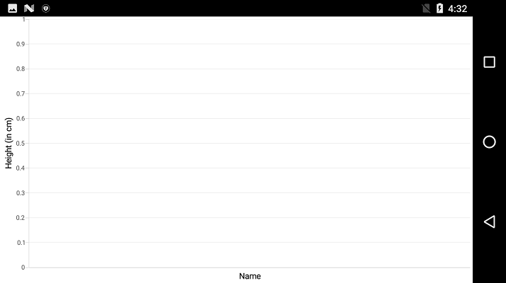

# Getting Started

This section explains you the steps required to populate the Chart with data, title, add data labels and tooltips to the Chart. This section covers only the minimal features that you need to know to get started with the Chart.

## Adding Chart Reference

After installing Essential Studio for Xamarin, you can find all the required assemblies in the installation folders, 

{Syncfusion Installed location}\Essential Studio\15.3.0.26\lib

N> Assemblies are available in unzipped package location in Mac.

Add the following assembly references to the Android project,

android\Syncfusion.SfChart.Andriod.dll

## Initialize Chart

Import the [`SfChart`]() namespace as shown below in your respective Page,



using Com.Syncfusion.Charts;



Then initialize an empty chart with two axes as shown below,

 

SfChart chart = new SfChart (this);

//Initializing Primary Axis
CategoryAxis primaryAxis = new CategoryAxis ();

chart.PrimaryAxis = primaryAxis;

//Initializing Secondary Axis
NumericalAxis secondaryAxis = new NumericalAxis ();

chart.SecondaryAxis = secondaryAxis;

SetContentView(chart);



Run the project and check if you get following output to make sure you have configured your project properly to add [`SfChart`.]()

## Initialize view model

Now, let us define a simple data model that represents a data point in [`SfChart`.]()


public class Person   
{   
    public string Name { get; set; }

    public double Height { get; set; }
}
 

Next, create a view model class and initialize a list of `Person` objects as shown below,


public class ViewModel  
{
      public ObservableCollection<Person> Data { get; set; }      

      public ViewModel()       
      {
            Data = new ObservableCollection<Person>()
            {
                new Person { Name = "David", Height = 180 },
                new Person { Name = "Michael", Height = 170 },
                new Person { Name = "Steve", Height = 160 },
                new Person { Name = "Joel", Height = 182 }
            }; 
       }
 }
 

## Populate Chart with data

As we are going to visualize the comparison of heights in the data model, add [`ColumnSeries`]() to [`SfChart.Series`]() property, and then set the Data property of the above `ViewModel` to the [`ColumnSeries.ItemsSource`]() property as shown below.

N> You need to set [`XBindingPath`]() and [`YBindingPath`]() properties, so that [`SfChart`]() would fetch values from the respective properties in the data model to plot the series.


//Initializing primary axis
CategoryAxis primaryAxis = new CategoryAxis();

primaryAxis.Title.Text = "Name";

chart.PrimaryAxis = primaryAxis;

//Initializing secondary Axis
NumericalAxis secondaryAxis = new NumericalAxis();

secondaryAxis.Title.Text = "Height (in cm)";

chart.SecondaryAxis = secondaryAxis;

//Initializing column series
ColumnSeries series = new ColumnSeries();

ViewModel viewModel = new ViewModel();

series.ItemsSource = viewModel.Data;

series.XBindingPath = "Name";

series.YBindingPath = "Height";

chart.Series.Add(series);


## Add Title

You can add title to chart to provide quick information to the user about the data being plotted in the chart. You can set title using [`SfChart.Title`]() property as shown below.


 
chart.Title.Text = "Chart";



Refer this [link]() to learn more about the options available in [`SfChart`]() to customize chart title.

## Enable data labels

You can add data labels to improve the readability of the chart. This can be achieved using [`ChartSeries.DataMarker.ShowLabel`]() property as shown below.

 

series.DataMarker.ShowLabel = true;



Refer this [link]() to learn more about the options available in [`SfChart`]() to customize data markers.

## Enable legend

You can enable legend using [`SfChart.Legend`]() property as shown below,

 

chart.Legend.Visibility = Visibility.Visible; 



Additionally, you need to set label for each series using [`ChartSeries.Label`]() property, which will be displayed in corresponding legend.

 

series.Label = "Heights";



Refer this [link]() to learn more about the options available in [`SfChart`]() to customize legend.

## Enable tooltip

Tooltips are used to show information about the segment, when you tap on the segment. You can enable tooltip by setting [`ChartSeries.TooltipEnabled `]() property to true.

 

series.TooltipEnabled = true;



Refer this [link]() to learn more about the options available in [`SfChart`]() to customize tooltip.

You can find the complete getting started sample from this [link.]()
