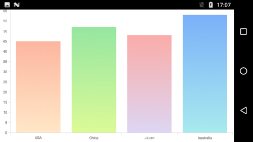
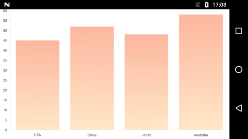

# Color Palette

## Apply palette for Series

[`ColorModel`](https://help.syncfusion.com/cr/cref_files/xamarin-android/sfchart/Syncfusion.SfChart.Android~Com.Syncfusion.Charts.ChartColorModel.html) property of [`SfChart`](http://help.syncfusion.com/cr/cref_files/xamarin-android/sfchart/Syncfusion.SfChart.Android~Com.Syncfusion.Charts.SfChart.html) is used to define the colors for each series. [`ColorModel`](https://help.syncfusion.com/cr/cref_files/xamarin-android/sfchart/Syncfusion.SfChart.Android~Com.Syncfusion.Charts.ChartColorModel.html) contains the following color palettes.

**Predefined Palettes**

Currently, Chart supports three types of palette and [`Metro`](https://help.syncfusion.com/cr/cref_files/xamarin-android/sfchart/Syncfusion.SfChart.Android~Com.Syncfusion.Charts.ChartColorPalette.html) palette is the default palette for [`SfChart`](https://help.syncfusion.com/cr/cref_files/xamarin-android/sfchart/Syncfusion.SfChart.Android~Com.Syncfusion.Charts.SfChart.html).

These predefined palettes are

* Metro
* Pineapple
* TomatoSpectrum

 The following screenshot shows the default appearance of multiple series.

**Custom Palette**

You can apply the custom colors by setting the palette as [`Custom`](https://help.syncfusion.com/cr/cref_files/xamarin-android/sfchart/Syncfusion.SfChart.Android~Com.Syncfusion.Charts.ChartColorPalette.html) using [`ColorPalette`](https://help.syncfusion.com/cr/cref_files/xamarin-android/sfchart/Syncfusion.SfChart.Android~Com.Syncfusion.Charts.ChartColorModel~ColorPalette.html) and provide the custom colors using [`CustomColors`](https://help.syncfusion.com/cr/cref_files/xamarin-android/sfchart/Syncfusion.SfChart.Android~Com.Syncfusion.Charts.ChartColorModel~CustomColors.html) property.

Following code illustrates how to set the custom colors.

 
[C#]

SfChart chart = new SfChart(this);
...

var colors = new List<Color>();
colors.Add(Color.ParseColor("#FFEAE018"));
colors.Add(Color.ParseColor("#FFB3B1AD"));
colors.Add(Color.ParseColor("#FF8C0707"));

chart.ColorModel.ColorPalette = ChartColorPalette.Custom;
chart.ColorModel.CustomColors = colors;



**None Palette**

None palette will not apply any color to the series. So in order to define the color for any series, you can use the [`Color`](http://help.syncfusion.com/cr/cref_files/xamarin-android/sfchart/Syncfusion.SfChart.Android~Com.Syncfusion.Charts.ChartSeries~Color.html) property or the [`ColorModel`](http://help.syncfusion.com/cr/cref_files/xamarin-android/sfchart/Syncfusion.SfChart.Android~Com.Syncfusion.Charts.ChartSeries~ColorModel.html) property of [`ChartSeries`](https://help.syncfusion.com/cr/cref_files/xamarin-android/sfchart/Syncfusion.SfChart.Android~Com.Syncfusion.Charts.ChartSeries.html) (The ColorModel of Series will be explained later in this document).

## Apply palette for data points

[`ColorModel`](http://help.syncfusion.com/cr/cref_files/xamarin-android/sfchart/Syncfusion.SfChart.Android~Com.Syncfusion.Charts.ChartSeries~ColorModel.html) property of ChartSeries is used to define the colors for each data point. Following palettes are used to define the colors.

**Predefined Palettes**

Currently, Chart supports three types of palette. These predefined palettes are

* Metro
* Pineapple
* TomatoSpectrum

 
[C#]

ColumnSeries columnSeries = new ColumnSeries();
columnSeries.ColorModel.ColorPalette = ChartColorPalette.Metro;



**Custom Palette**

You can apply the custom colors by setting the palette as `Custom` using [`ColorPalette`](https://help.syncfusion.com/cr/cref_files/xamarin-android/sfchart/Syncfusion.SfChart.Android~Com.Syncfusion.Charts.ChartColorModel~ColorPalette.html) and provide the custom colors using [`CustomColors`](https://help.syncfusion.com/cr/cref_files/xamarin-android/sfchart/Syncfusion.SfChart.Android~Com.Syncfusion.Charts.ChartColorModel~CustomColors.html) property.

Following code illustrates how to set the custom colors.

 
[C#]

var colors = new List<Color>();
colors.Add(Color.Red);
colors.Add(Color.Gray);
colors.Add(Color.Blue);
colors.Add(Color.Maroon);
colors.Add(Color.Pink);

ColumnSeries columnSeries = new ColumnSeries();
columnSeries.ColorModel.ColorPalette = ChartColorPalette.Custom;
columnSeries.ColorModel.CustomColors = colors;



**None Palette**

None palette will not apply any color to the data points. So in order to define the color for the data points, you can use the [`Color`](http://help.syncfusion.com/cr/cref_files/xamarin-android/sfchart/Syncfusion.SfChart.Android~Com.Syncfusion.Charts.ChartSeries~Color.html) property of [`ChartSeries`](https://help.syncfusion.com/cr/cref_files/xamarin-android/sfchart/Syncfusion.SfChart.Android~Com.Syncfusion.Charts.ChartSeries.html).

## Gradient Colors

The [`CustomGradientColors`](https://help.syncfusion.com/cr/cref_files/xamarin-android/sfchart/Syncfusion.SfChart.Android~Com.Syncfusion.Charts.ChartColorModel~CustomGradientColors.html) property of [`ChartColorModel`](https://help.syncfusion.com/cr/cref_files/xamarin-android/sfchart/Syncfusion.SfChart.Android~Com.Syncfusion.Charts.ChartColorModel.html) is used to define the gradient colors, the colors from this property is used for series or chart if the [`Palette`](https://help.syncfusion.com/cr/cref_files/xamarin-android/sfchart/Syncfusion.SfChart.Android~Com.Syncfusion.Charts.ChartColorModel~ColorPalette.html) property of ChartColorModel is [`Custom`](https://help.syncfusion.com/cr/cref_files/xamarin-android/sfchart/Syncfusion.SfChart.Android~Com.Syncfusion.Charts.ChartColorPalette.html) and the [`CustomColors`](https://help.syncfusion.com/cr/cref_files/xamarin-android/sfchart/Syncfusion.SfChart.Android~Com.Syncfusion.Charts.ChartColorModel~CustomColors.html) property is null. The following properties are used to define the gradient color for the chart.

The [`StartPoint`](https://help.syncfusion.com/cr/cref_files/xamarin-android/sfchart/Syncfusion.SfChart.Android~Com.Syncfusion.Charts.ChartGradientColor~StartPoint.html) and [`EndPoint`](https://help.syncfusion.com/cr/cref_files/xamarin-android/sfchart/Syncfusion.SfChart.Android~Com.Syncfusion.Charts.ChartGradientColor~EndPoint.html)  properties of [`ChartGradientColor`](https://help.syncfusion.com/cr/cref_files/xamarin-android/sfchart/Syncfusion.SfChart.Android~Com.Syncfusion.Charts.ChartGradientColor.html) is used to configure the direction of gradient color, [`GradientStops`](https://help.syncfusion.com/cr/cref_files/xamarin-android/sfchart/Syncfusion.SfChart.Android~Com.Syncfusion.Charts.ChartGradientColor~GradientStops.html)  property is used to set the color based on the offset.

The [`Color`](https://help.syncfusion.com/cr/cref_files/xamarin-android/sfchart/Syncfusion.SfChart.Android~Com.Syncfusion.Charts.ChartGradientStop~Color.html) and [`Offset`](https://help.syncfusion.com/cr/cref_files/xamarin-android/sfchart/Syncfusion.SfChart.Android~Com.Syncfusion.Charts.ChartGradientStop~Offset.html) properties of [`ChartGradientStop`](https://help.syncfusion.com/cr/cref_files/xamarin-android/sfchart/Syncfusion.SfChart.Android~Com.Syncfusion.Charts.ChartGradientStop.html) is used to configure the color and offset position of each color. 

Following code snippets and screenshot illustrates how to apply the gradient color to the chart series.

 
[C#]

            series.ColorModel.ColorPalette = ChartColorPalette.Custom;

            ChartGradientColor gradientColor1 = new ChartGradientColor() { StartPoint = new PointF(0.5f, 1), EndPoint = new PointF(0.5f, 0) };
            ChartGradientStop stop11 = new ChartGradientStop() { Color = Color.ParseColor("#FFE7C7"), Offset = 0 };
            ChartGradientStop stop12 = new ChartGradientStop() { Color = Color.ParseColor("#FCB69F"), Offset = 1 };
            gradientColor1.GradientStops.Add(stop11);
            gradientColor1.GradientStops.Add(stop12);

            ChartGradientColor gradientColor2 = new ChartGradientColor() { StartPoint = new PointF(0.5f, 1), EndPoint = new PointF(0.5f, 0) };
            ChartGradientStop stop21 = new ChartGradientStop() { Color = Color.ParseColor("#DCFA97"), Offset = 0 };
            ChartGradientStop stop22 = new ChartGradientStop() { Color = Color.ParseColor("#96E6A1"), Offset = 1 };
            gradientColor2.GradientStops.Add(stop21);
            gradientColor2.GradientStops.Add(stop22);

            ChartGradientColor gradientColor3 = new ChartGradientColor() { StartPoint = new PointF(0.5f, 1), EndPoint = new PointF(0.5f, 0) };
            ChartGradientStop stop31 = new ChartGradientStop() { Color = Color.ParseColor("#DDD6F3"), Offset = 0 };
            ChartGradientStop stop32 = new ChartGradientStop() { Color = Color.ParseColor("#FAACA8"), Offset = 1 };
            gradientColor3.GradientStops.Add(stop31);
            gradientColor3.GradientStops.Add(stop32);

            ChartGradientColor gradientColor4 = new ChartGradientColor() { StartPoint = new PointF(0.5f, 1), EndPoint = new PointF(0.5f, 0) };
            ChartGradientStop stop41 = new ChartGradientStop() { Color = Color.ParseColor("#A8EAEE"), Offset = 0 };
            ChartGradientStop stop42 = new ChartGradientStop() { Color = Color.ParseColor("#7BB0F9"), Offset = 1 };
            gradientColor4.GradientStops.Add(stop41);
            gradientColor4.GradientStops.Add(stop42);

            ChartGradientColorCollection gradientColors = new ChartGradientColorCollection()
            {
                gradientColor1,
                gradientColor2,
                gradientColor3,
                gradientColor4
            };

        series.ColorModel.CustomGradientColors = gradientColors;



Following code snippet and screenshot illustrates how to apply the gradient color to the chart area.

 
[C#]

           chart.ColorModel.ColorPalette = ChartColorPalette.Custom;

            ChartGradientColor gradientColor = new ChartGradientColor() { StartPoint = new PointF(0.5f, 1), EndPoint = new PointF(0.5f, 0) };
            ChartGradientStop stop1 = new ChartGradientStop() { Color = Color.ParseColor("#FFE7C7"), Offset = 0 };
            ChartGradientStop stop2 = new ChartGradientStop() { Color = Color.ParseColor("#FCB69F"), Offset = 1 };
            gradientColor.GradientStops.Add(stop1);
            gradientColor.GradientStops.Add(stop2);

             ChartGradientColorCollection gradientColors = new ChartGradientColorCollection()
            {
                gradientColor
            };

            chart.ColorModel.CustomGradientColors = gradientColors;



