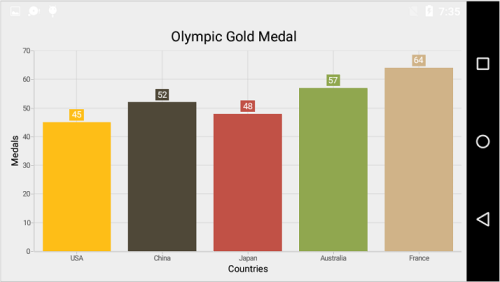

# Color Palette

## Apply palette for Series

[`ColorModel`](http://help.syncfusion.com/cr/cref_files/xamarin-android/sfchart/Syncfusion.SfChart.Android~Com.Syncfusion.Charts.SfChart~ColorModel.html) property of [`SfChart`](http://help.syncfusion.com/cr/cref_files/xamarin-android/sfchart/Syncfusion.SfChart.Android~Com.Syncfusion.Charts.SfChart.html) is used to define the colors for each series. ColorModel contains the following color palettes.

**Predefined Palettes**

Currently, Chart supports three types of palette and Metro palette is the default palette for SfChart.

These predefined palettes are

* Metro
* Pineapple
* TomatoSpectrum

 The following screenshot shows the default appearance of multiple series.

**Custom Palette**

You can apply the custom colors by setting the palette as [`Custom`](http://help.syncfusion.com/cr/cref_files/xamarin-android/sfchart/Syncfusion.SfChart.Android~Com.Syncfusion.Charts.Enums.ChartColorPalette_members.html) using [`ColorPalette`](http://help.syncfusion.com/cr/cref_files/xamarin-android/sfchart/Syncfusion.SfChart.Android~Com.Syncfusion.Charts.Enums.ChartColorPalette.html) and provide the custom colors using [`CustomColors`](http://help.syncfusion.com/cr/cref_files/xamarin-android/sfchart/Syncfusion.SfChart.Android~Com.Syncfusion.Charts.ChartColorModel~CustomColors.html) property.

Following code illustrates how to set the custom colors.

 
[C#]

SfChart chart = new SfChart(this);
...

var colors = new List<Color>();
colors.Add(Color.ParseColor("#FFEAE018"));
colors.Add(Color.ParseColor("#FFB3B1AD"));
colors.Add(Color.ParseColor("#FF8C0707"));

chart.ColorModel.ColorPalette = ChartColorPalette.Custom;
chart.ColorModel.CustomColors = colors;



**None Palette**

None palette will not apply any color to the series. So in order to define the color for any series, you can use the [`Color`](http://help.syncfusion.com/cr/cref_files/xamarin-android/sfchart/Syncfusion.SfChart.Android~Com.Syncfusion.Charts.ChartSeries~Color.html) property or the [`ColorModel`](http://help.syncfusion.com/cr/cref_files/xamarin-android/sfchart/Syncfusion.SfChart.Android~Com.Syncfusion.Charts.ChartSeries~ColorModel.html) property of ChartSeries (The ColorModel of Series will be explained later in this document).

## Apply palette for data points

[`ColorModel`](http://help.syncfusion.com/cr/cref_files/xamarin-android/sfchart/Syncfusion.SfChart.Android~Com.Syncfusion.Charts.ChartSeries~ColorModel.html) property of ChartSeries is used to define the colors for each data point. Following palettes are used to define the colors.

**Predefined Palettes**

Currently, Chart supports three types of palette. These predefined palettes are

* Metro
* Pineapple
* TomatoSpectrum

 
[C#]

ColumnSeries columnSeies = new ColumnSeries();
columnSeies.ColorModel.ColorPalette = ChartColorPalette.Metro;



**Custom Palette**

You can apply the custom colors by setting the palette as [`Custom`](http://help.syncfusion.com/cr/cref_files/xamarin-android/sfchart/Syncfusion.SfChart.Android~Com.Syncfusion.Charts.Enums.ChartColorPalette_members.html) using [`ColorPalette`](http://help.syncfusion.com/cr/cref_files/xamarin-android/sfchart/Syncfusion.SfChart.Android~Com.Syncfusion.Charts.ChartColorModel~ColorPalette.html) and provide the custom colors using [`CustomColors`](http://help.syncfusion.com/cr/cref_files/xamarin-android/sfchart/Syncfusion.SfChart.Android~Com.Syncfusion.Charts.ChartColorModel~CustomColors.html) property.

Following code illustrates how to set the custom colors.

 
[C#]

var colors = new List<Color>();
colors.Add(Color.Red);
colors.Add(Color.Gray);
colors.Add(Color.Blue);
colors.Add(Color.Maroon);
colors.Add(Color.Pink);

ColumnSeries columnSeies = new ColumnSeries();
columnSeies.ColorModel.ColorPalette = ChartColorPalette.Custom;
columnSeies.ColorModel.CustomColors = colors;



**None Palette**

None palette will not apply any color to the data points. So in order to define the color for the data points, you can use the [`Color`](http://help.syncfusion.com/cr/cref_files/xamarin-android/sfchart/Syncfusion.SfChart.Android~Com.Syncfusion.Charts.ChartSeries~Color.html) property of ChartSeries.