# Axis

Charts typically have two axes that are used to measure and categorize data: a vertical (Y) axis, and a horizontal (X) axis.

Vertical(Y) axis always uses numerical scale. Horizontal(X) axis supports the following types of scale:

* Category
* Numeric
* Date time

## Category Axis

Category axis displays text labels instead of numbers. 

 
[C#]

chart.PrimaryAxis = new CategoryAxis();



### Placing labels between ticks

Labels in category axis can be placed between the ticks by using [`LabelPlacement`](http://help.syncfusion.com/cr/cref_files/xamarin-android/sfchart/Syncfusion.SfChart.Android~Com.Syncfusion.Charts.CategoryAxis~LabelPlacement.html) property of categoryAxis. Default value of [`LabelPlacement`](http://help.syncfusion.com/cr/cref_files/xamarin-android/sfchart/Syncfusion.SfChart.Android~Com.Syncfusion.Charts.CategoryAxis~LabelPlacement.html) is `OnTicks` i.e. labels will be placed on the ticks by default.

 
[C#]

chart.PrimaryAxis = new CategoryAxis() 
{ 
	LabelPlacement = LabelPlacement.BetweenTicks 
};



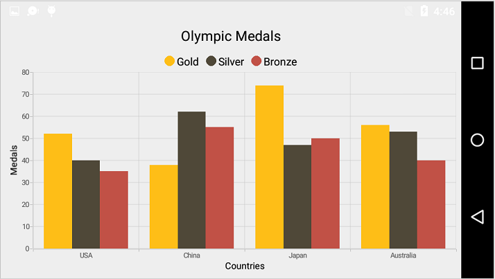

### Displaying labels after a fixed interval

To display labels after a fixed interval n, you can use [`Interval`](http://help.syncfusion.com/cr/cref_files/xamarin-android/sfchart/Syncfusion.SfChart.Android~Com.Syncfusion.Charts.ChartAxis~Interval.html) property of ChartAxis as n. Default value of interval is 1 i.e. all the labels will be displayed by default.

 
[C#]

chart.PrimaryAxis = new CategoryAxis() 
{ 
	Interval = 2, 
	LabelPlacement = LabelPlacement.BetweenTicks 
};



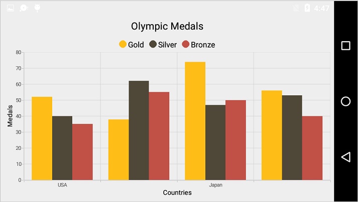

## Numeric Axis

Numeric axis uses numerical scale and displays numbers as labels. 

 
[C#]

chart.PrimaryAxis = new NumericalAxis();



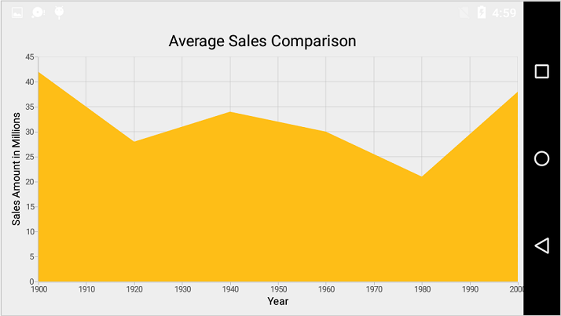

### Customizing numeric range

To customize the range of an axis, you can use the [`Minimum`](http://help.syncfusion.com/cr/cref_files/xamarin-android/sfchart/Syncfusion.SfChart.Android~Com.Syncfusion.Charts.NumericalAxis~Minimum.html) and [`Maximum`](http://help.syncfusion.com/cr/cref_files/xamarin-android/sfchart/Syncfusion.SfChart.Android~Com.Syncfusion.Charts.NumericalAxis~Maximum.html) properties of [`NumericalAxis`](http://help.syncfusion.com/cr/cref_files/xamarin-android/sfchart/Syncfusion.SfChart.Android~Com.Syncfusion.Charts.NumericalAxis.html). By default, nice range will be calculated automatically based on the provided data.

 
[C#]

chart.SecondaryAxis = new NumericalAxis() 
{ 
	Minimum = 10, 
	Maximum = 50
};



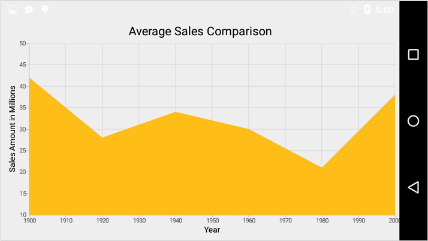

### Customizing numeric interval

Axis interval can be customized using the [`Interval`](http://help.syncfusion.com/cr/cref_files/xamarin-android/sfchart/Syncfusion.SfChart.Android~Com.Syncfusion.Charts.ChartAxis~Interval.html) property of ChartAxis. By default, nice interval will be calculated based on the minimum and maximum value of the provided data.

 
[C#]

chart.SecondaryAxis = new NumericalAxis() 
{ 
	Interval = 10 
};



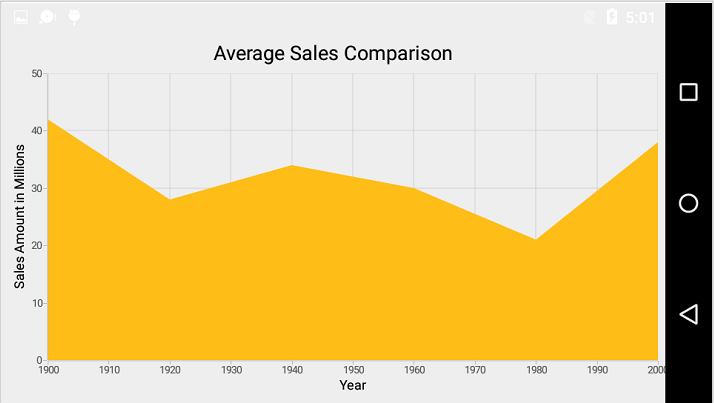

### Apply padding to the range

Padding can be applied to the minimum and maximum extremes of the axis range by using [`RangePadding`](http://help.syncfusion.com/cr/cref_files/xamarin-android/sfchart/Syncfusion.SfChart.Android~Com.Syncfusion.Charts.NumericalAxis~RangePadding.html) property. Numeric axis supports the following types of padding.

* None
* Round
* Additional
* Normal

**None**

When the value of [`RangePadding`](http://help.syncfusion.com/cr/cref_files/xamarin-android/sfchart/Syncfusion.SfChart.Android~Com.Syncfusion.Charts.NumericalAxis~RangePadding.html) is `None`, padding will not be applied to the axis. This is also the default value of [`RangePadding`](http://help.syncfusion.com/cr/cref_files/xamarin-android/sfchart/Syncfusion.SfChart.Android~Com.Syncfusion.Charts.NumericalAxis~RangePadding.html) for horizontal axis.

 
[C#]

chart.SecondaryAxis = new NumericalAxis() 
{ 
	RangePadding = NumericalPadding.None 
};



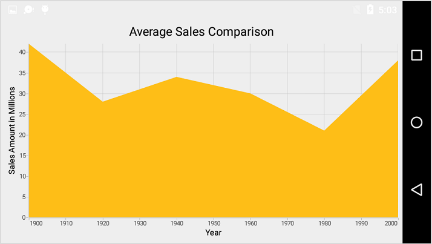

**Round**

When the value of [`RangePadding`](http://help.syncfusion.com/cr/cref_files/xamarin-android/sfchart/Syncfusion.SfChart.Android~Com.Syncfusion.Charts.NumericalAxis~RangePadding.html) is `Round`, axis range will be rounded to the nearest possible value divided by the interval.

 
[C#]

chart.SecondaryAxis = new NumericalAxis() 
{ 
	RangePadding = NumericalPadding.Round 
};



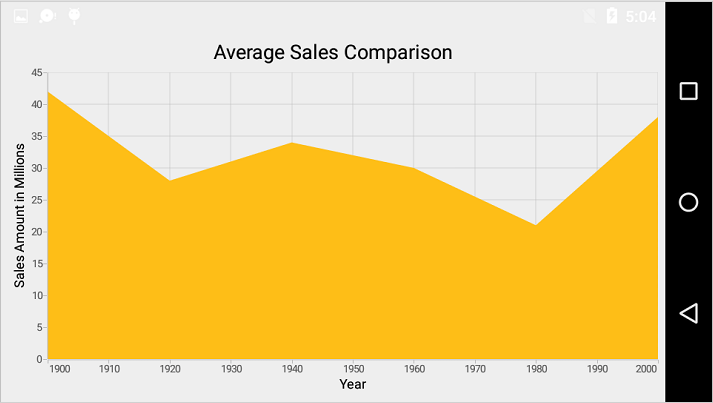

**Additional**

When the value of [`RangePadding`](http://help.syncfusion.com/cr/cref_files/xamarin-android/sfchart/Syncfusion.SfChart.Android~Com.Syncfusion.Charts.NumericalAxis~RangePadding.html) is `Additional`, axis range will be rounded and an interval of the axis will be added as padding to the minimum and maximum values of the range.

 
[C#]

chart.SecondaryAxis = new NumericalAxis() 
{ 
	RangePadding = NumericalPadding.Additional 
};



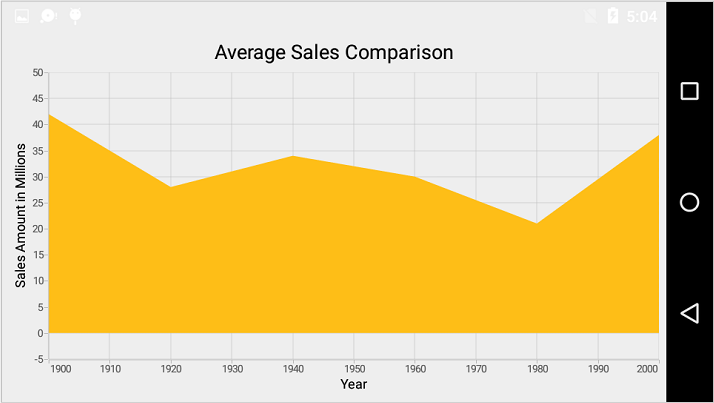

**Normal**

When the value of [`RangePadding`](http://help.syncfusion.com/cr/cref_files/xamarin-android/sfchart/Syncfusion.SfChart.Android~Com.Syncfusion.Charts.NumericalAxis~RangePadding.html) is `Normal`, nice range will be calculated for the axis based on the best readability of the data. This is also the default for vertical axis.

 
[C#]

chart.SecondaryAxis = new NumericalAxis() 
{ 
	RangePadding = NumericalPadding.Normal 
};



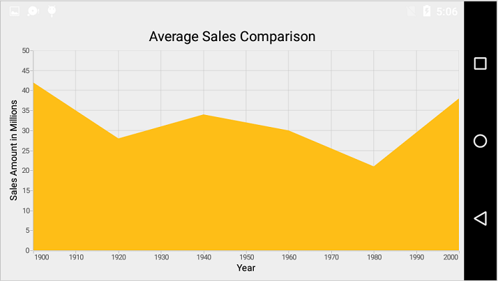

## Date Time Axis

Date time axis uses date time scale and displays date time values as axis labels in specified format. 

 
[C#]

chart.PrimaryAxis = new DateTimeAxis();



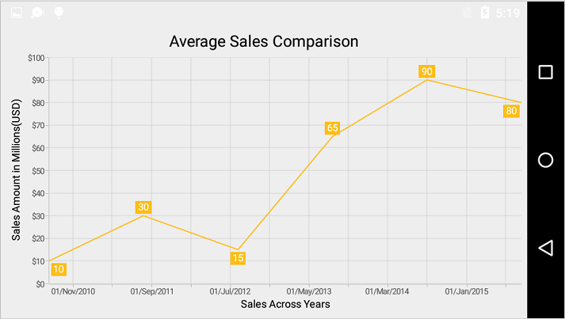

### Customizing date time range

To customize the range of an axis, you can use the [`Minimum`](http://help.syncfusion.com/cr/cref_files/xamarin-android/sfchart/Syncfusion.SfChart.Android~Com.Syncfusion.Charts.DateTimeAxis~Minimum.html) and [`Maximum`](http://help.syncfusion.com/cr/cref_files/xamarin-android/sfchart/Syncfusion.SfChart.Android~Com.Syncfusion.Charts.DateTimeAxis~Maximum.html) properties of [`DateTimeAxis`](http://help.syncfusion.com/cr/cref_files/xamarin-android/sfchart/Syncfusion.SfChart.Android~Com.Syncfusion.Charts.DateTimeAxis.html). By default, nice range will be calculated automatically based on the provided data.

 
[C#]

Calendar calendar = new GregorianCalendar(2010, 1,1);
DateTimeAxis dateTimeAxis = new DateTimeAxis();
dateTimeAxis.Minimum = calendar.Time;
calendar.Set(2015, 12,30);
dateTimeAxis.Maximum = calendar.Time;
chart.PrimaryAxis = dateTimeAxis;



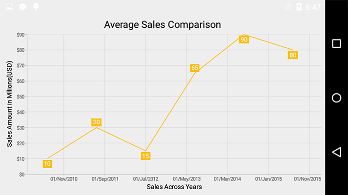

### Date time intervals

Date time intervals can be customized using [`Interval`](http://help.syncfusion.com/cr/cref_files/xamarin-android/sfchart/Syncfusion.SfChart.Android~Com.Syncfusion.Charts.ChartAxis~Interval.html) and [`IntervalType`](http://help.syncfusion.com/cr/cref_files/xamarin-android/sfchart/Syncfusion.SfChart.Android~Com.Syncfusion.Charts.DateTimeAxis~IntervalType.html) properties of the [`DateTimeAxis`](http://help.syncfusion.com/cr/cref_files/xamarin-android/sfchart/Syncfusion.SfChart.Android~Com.Syncfusion.Charts.DateTimeAxis.html). For example, setting [`Interval`](http://help.syncfusion.com/cr/cref_files/xamarin-android/sfchart/Syncfusion.SfChart.Android~Com.Syncfusion.Charts.ChartAxis~Interval.html) as 2 and [`IntervalType`](http://help.syncfusion.com/cr/cref_files/xamarin-android/sfchart/Syncfusion.SfChart.Android~Com.Syncfusion.Charts.DateTimeAxis~IntervalType.html) as `Years` will consider 2 years as interval.

Essential Chart supports the following types of interval for date time axis

* Years
* Months
* Days
* Hours
* Minutes
* Seconds
* Milliseconds

 
[C#]

chart.PrimaryAxis = new DateTimeAxis() 
{ 
	IntervalType = DateTimeIntervalType.Months, 
	Interval = 6
};



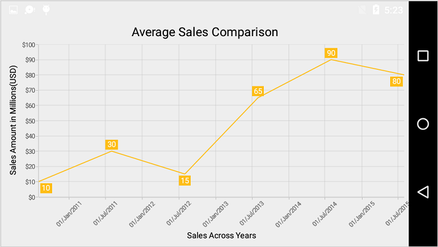

### Apply padding to the range

Padding can be applied to the minimum and maximum extremes of the range by using [`RangePadding`](http://help.syncfusion.com/cr/cref_files/xamarin-android/sfchart/Syncfusion.SfChart.Android~Com.Syncfusion.Charts.DateTimeAxis~RangePadding.html) property. Date time axis supports the following types of padding:

* None
* Round
* Additional

**None**

When the value of [`RangePadding`](http://help.syncfusion.com/cr/cref_files/xamarin-android/sfchart/Syncfusion.SfChart.Android~Com.Syncfusion.Charts.DateTimeAxis~RangePadding.html) is `None`, padding will not be applied to the axis. This is also the default value of [`RangePadding`](http://help.syncfusion.com/cr/cref_files/xamarin-android/sfchart/Syncfusion.SfChart.Android~Com.Syncfusion.Charts.DateTimeAxis~RangePadding.html).

 
[C#]

chart.PrimaryAxis = new DateTimeAxis() 
{ 
	RangePadding = DateTimeRangePadding.None 
};



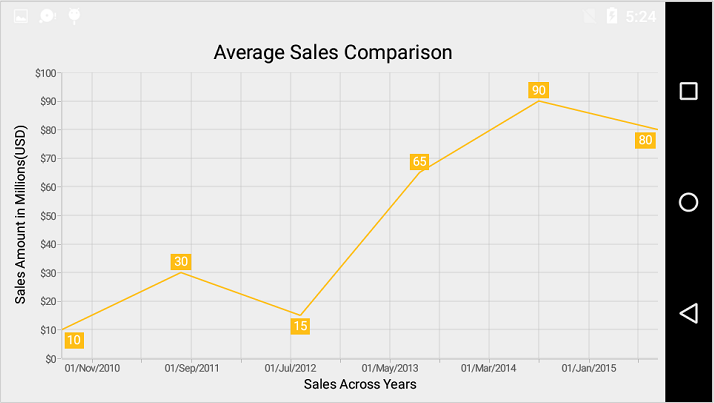

**Round**

When the value of [`RangePadding`](http://help.syncfusion.com/cr/cref_files/xamarin-android/sfchart/Syncfusion.SfChart.Android~Com.Syncfusion.Charts.DateTimeAxis~RangePadding.html) is `round`, axis range will be rounded to the nearest possible date time value.

 
[C#]

chart.PrimaryAxis = new DateTimeAxis() 
{ 
	RangePadding = DateTimeRangePadding.Round 
};



**Additional**

When the value of [`RangePadding`](http://help.syncfusion.com/cr/cref_files/xamarin-android/sfchart/Syncfusion.SfChart.Android~Com.Syncfusion.Charts.DateTimeAxis~RangePadding.html) is `Additional`, range will be rounded and date time interval of the axis will be added as padding to the minimum and maximum extremes of the range.

 
[C#]

chart.PrimaryAxis = new DateTimeAxis() 
{ 
	RangePadding = DateTimeRangePadding.Additional 
};



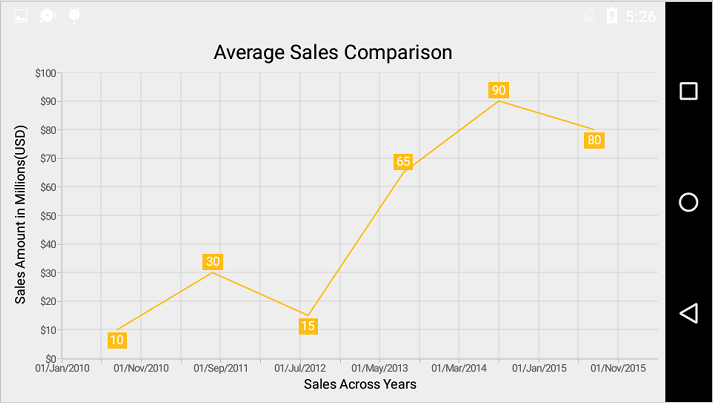

## Logarithmic Axis

Logarithmic axis uses logarithmic scale and displays numbers as axis labels. 

 
[C#]

chart.SecondaryAxis = new LogarithmicAxis();



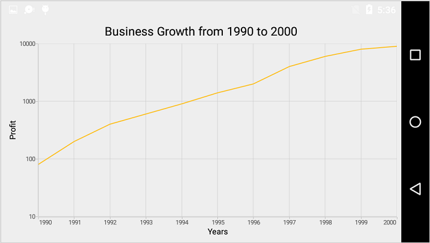

### Customizing the logarithmic range

To customize the range of log axis, you can use the [`Minimum`](http://help.syncfusion.com/cr/cref_files/xamarin-android/sfchart/Syncfusion.SfChart.Android~Com.Syncfusion.Charts.LogarithmicAxis~Minimum.html) and [`Maximum`](http://help.syncfusion.com/cr/cref_files/xamarin-android/sfchart/Syncfusion.SfChart.Android~Com.Syncfusion.Charts.LogarithmicAxis~Maximum.html) properties of LogarithmicAxis. By default, nice range will be calculated automatically based on the provided data.

 
[C#]

chart.SecondaryAxis = new LogarithmicAxis()
{
    Minimum = 100,
    Maximum = 10000
};



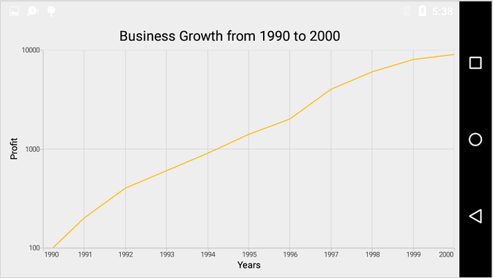

### Logarithmic Base

To change the log base value, you can use [`LogarithmicBase`](http://help.syncfusion.com/cr/cref_files/xamarin-android/sfchart/Syncfusion.SfChart.Android~Com.Syncfusion.Charts.LogarithmicAxis~LogarithmicBase.html) property.

 
[C#]

chart.SecondaryAxis = new LogarithmicAxis()
{
    LogarithmicBase = 2
};



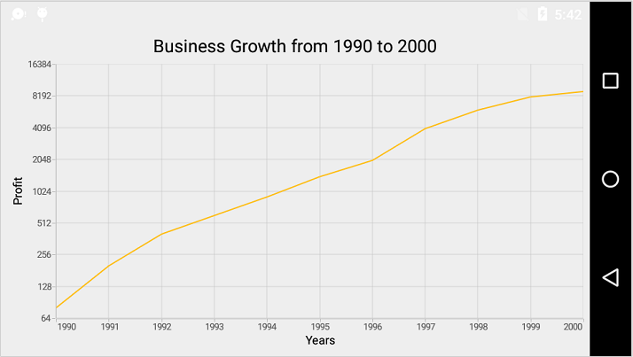

## Common Axis Features

Customization of features such as axis title, labels, grid lines and tick lines are common to all the axes. Each of these features are explained in this section.

### Axis Visibility

Axis visibility can be controlled using the [`Visibility`](http://help.syncfusion.com/cr/cref_files/xamarin-android/sfchart/Syncfusion.SfChart.Android~Com.Syncfusion.Charts.ChartAxis~Visibility.html) property of axis. Default value of [`Visibility`](http://help.syncfusion.com/cr/cref_files/xamarin-android/sfchart/Syncfusion.SfChart.Android~Com.Syncfusion.Charts.ChartAxis~Visibility.html) is `Visible`.

 
[C#]

chart.SecondaryAxis.Visibility = Visibility.Gone;



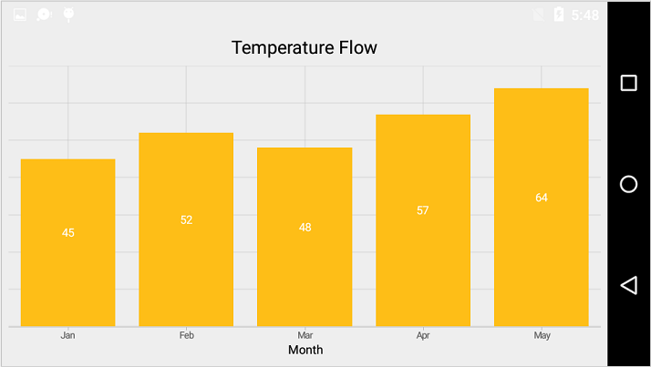

### Axis Title

The [`Title`](http://help.syncfusion.com/cr/cref_files/xamarin-android/sfchart/Syncfusion.SfChart.Android~Com.Syncfusion.Charts.ChartAxis~Title.html) in axis provides options to customize the text and font of axis title. Axis does not display title by default. The title can be customized using following properties,

* [`Text`](http://help.syncfusion.com/cr/cref_files/xamarin-android/sfchart/Syncfusion.SfChart.Android~Com.Syncfusion.Charts.AxisTitleStyle~Text.html) – used to set the title for axis.
* [`TextColor`](http://help.syncfusion.com/cr/cref_files/xamarin-android/sfchart/Syncfusion.SfChart.Android~Com.Syncfusion.Charts.ChartLabelStyle~TextColor.html) – used to change the color of the label.
* [`BackgroundColor`](http://help.syncfusion.com/cr/cref_files/xamarin-android/sfchart/Syncfusion.SfChart.Android~Com.Syncfusion.Charts.ChartLabelStyle~BackgroundColor.html) – used to change the label background color.
* [`StrokeColor`](http://help.syncfusion.com/cr/cref_files/xamarin-android/sfchart/Syncfusion.SfChart.Android~Com.Syncfusion.Charts.ChartLabelStyle~StrokeColor.html) – used to change the border color.
* [`StrokeWidth`](http://help.syncfusion.com/cr/cref_files/xamarin-android/sfchart/Syncfusion.SfChart.Android~Com.Syncfusion.Charts.ChartLabelStyle~StrokeWidth.html) – used to change the width of the border.
* [`TextSize`](http://help.syncfusion.com/cr/cref_files/xamarin-android/sfchart/Syncfusion.SfChart.Android~Com.Syncfusion.Charts.ChartLabelStyle~TextSize.html) – used to change the text size.
* [`Typeface`](http://help.syncfusion.com/cr/cref_files/xamarin-android/sfchart/Syncfusion.SfChart.Android~Com.Syncfusion.Charts.ChartLabelStyle~Typeface.html) – used to change the font family and font weight.
* [`MarginTop`](http://help.syncfusion.com/cr/cref_files/xamarin-android/sfchart/Syncfusion.SfChart.Android~Com.Syncfusion.Charts.ChartLabelStyle~MarginTop.html) - used to change the top margin of the title.
* [`MarginBottom`](http://help.syncfusion.com/cr/cref_files/xamarin-android/sfchart/Syncfusion.SfChart.Android~Com.Syncfusion.Charts.ChartLabelStyle~MarginBottom.html) - used to change the bottom margin of the title.
* [`MarginLeft`](http://help.syncfusion.com/cr/cref_files/xamarin-android/sfchart/Syncfusion.SfChart.Android~Com.Syncfusion.Charts.ChartLabelStyle~MarginLeft.html) - used to change the left margin of the title.
* [`MarginRight`](http://help.syncfusion.com/cr/cref_files/xamarin-android/sfchart/Syncfusion.SfChart.Android~Com.Syncfusion.Charts.ChartLabelStyle~MarginRight.html) - used to change the right margin of the title.

Following code snippet illustrates how to enable and customize the axis title.

 
[C#]

chart.PrimaryAxis = new CategoryAxis();
chart.PrimaryAxis.Title.Text = "Month";
chart.PrimaryAxis.Title.TextColor = Color.Blue;
chart.PrimaryAxis.Title.TextSize = 16;
chart.PrimaryAxis.Title.Typeface = Typeface.DefaultBold;



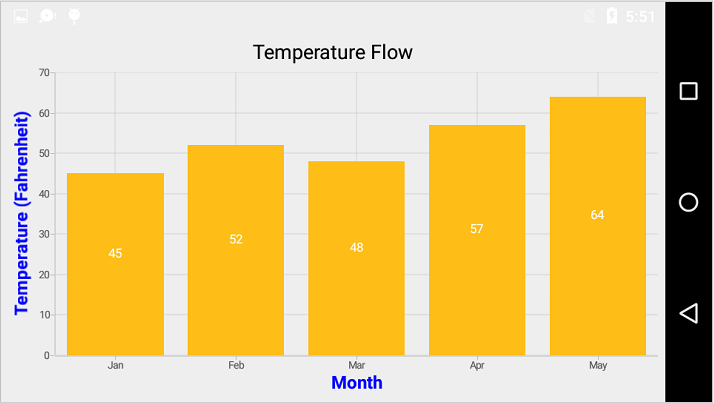

### Label customization

The [`LabelStyle`](http://help.syncfusion.com/cr/cref_files/xamarin-android/sfchart/Syncfusion.SfChart.Android~Com.Syncfusion.Charts.ChartAxis~LabelStyle.html) property of axis provides options to customize the font-family, color, size and font-weight of axis labels. The axis labels can be customized using following properties:

* [`TextColor`](http://help.syncfusion.com/cr/cref_files/xamarin-android/sfchart/Syncfusion.SfChart.Android~Com.Syncfusion.Charts.ChartLabelStyle~TextColor.html) – used to change the color of the labels.
* [`BackgroundColor`](http://help.syncfusion.com/cr/cref_files/xamarin-android/sfchart/Syncfusion.SfChart.Android~Com.Syncfusion.Charts.ChartLabelStyle~BackgroundColor.html) – used to change the label background color.
* [`StrokeColor`](http://help.syncfusion.com/cr/cref_files/xamarin-android/sfchart/Syncfusion.SfChart.Android~Com.Syncfusion.Charts.ChartLabelStyle~StrokeColor.html) – used to change the border color.
* [`StrokeWidth`](http://help.syncfusion.com/cr/cref_files/xamarin-android/sfchart/Syncfusion.SfChart.Android~Com.Syncfusion.Charts.ChartLabelStyle~StrokeWidth.html) – used to change the thickness of the border.
* [`TextSize`](http://help.syncfusion.com/cr/cref_files/xamarin-android/sfchart/Syncfusion.SfChart.Android~Com.Syncfusion.Charts.ChartLabelStyle~TextSize.html) – used to change the text size.
* [`Typeface`](http://help.syncfusion.com/cr/cref_files/xamarin-android/sfchart/Syncfusion.SfChart.Android~Com.Syncfusion.Charts.ChartLabelStyle~Typeface.html) – used to change the font family and font weight.
* [`MarginTop`](http://help.syncfusion.com/cr/cref_files/xamarin-android/sfchart/Syncfusion.SfChart.Android~Com.Syncfusion.Charts.ChartLabelStyle~MarginTop.html) - used to change the top margin of the labels.
* [`MarginBottom`](http://help.syncfusion.com/cr/cref_files/xamarin-android/sfchart/Syncfusion.SfChart.Android~Com.Syncfusion.Charts.ChartLabelStyle~MarginBottom.html) - used to change the bottom margin of the labels.
* [`MarginLeft`](http://help.syncfusion.com/cr/cref_files/xamarin-android/sfchart/Syncfusion.SfChart.Android~Com.Syncfusion.Charts.ChartLabelStyle~MarginLeft.html) - used to change the left margin of the labels.
* [`MarginRight`](http://help.syncfusion.com/cr/cref_files/xamarin-android/sfchart/Syncfusion.SfChart.Android~Com.Syncfusion.Charts.ChartLabelStyle~MarginRight.html) - used to change the right margin of the labels.

 
[C#]

chart.PrimaryAxis.LabelStyle.TextColor = Color.Red;
chart.PrimaryAxis.LabelStyle.TextSize = 12;
chart.PrimaryAxis.LabelStyle.Typeface = Typeface.DefaultBold;



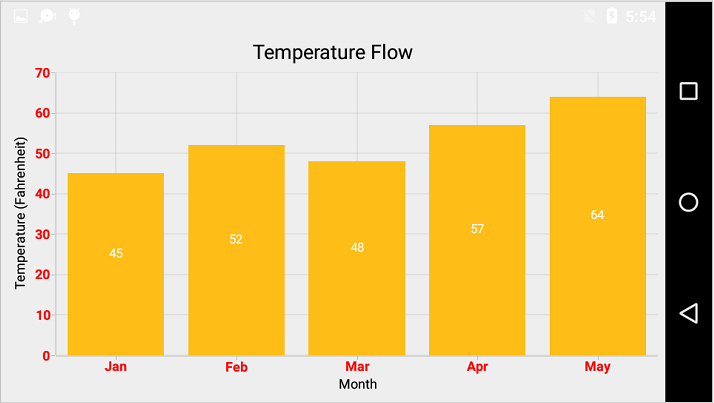

### Format the Labels

Axis labels can be formatted using [`LabelFormat`](http://help.syncfusion.com/cr/cref_files/xamarin-android/sfchart/Syncfusion.SfChart.Android~Com.Syncfusion.Charts.ChartLabelStyle~LabelFormat.html) property of ChartAxis. This supports all the [`SimpleDateFormat`](https://docs.oracle.com/javase/7/docs/api/java/text/SimpleDateFormat.html) patterns for date time axis and all the [`DecimalFormat`](https://docs.oracle.com/javase/7/docs/api/java/text/DecimalFormat.html) patterns for the number axis.

### Label and Tick Positioning

Axis labels and ticks can be positioned inside or outside the chart area by using [`LabelStyle`](http://help.syncfusion.com/cr/cref_files/xamarin-android/sfchart/Syncfusion.SfChart.Android~Com.Syncfusion.Charts.ChartAxis~LabelStyle.html).[`LabelsPosition`](http://help.syncfusion.com/cr/cref_files/xamarin-android/sfchart/Syncfusion.SfChart.Android~Com.Syncfusion.Charts.ChartAxisLabelStyle~LabelsPosition.html) and [`TickPosition`](http://help.syncfusion.com/cr/cref_files/xamarin-android/sfchart/Syncfusion.SfChart.Android~Com.Syncfusion.Charts.ChartAxis~TickPosition.html) properties of ChartAxis. By default labels and ticks will be positioned outside the chart area.

 
[C#]

chart.PrimaryAxis.LabelStyle.LabelsPosition = AxisElementPosition.Inside;
chart.PrimaryAxis.TickPosition = AxisElementPosition.Inside;



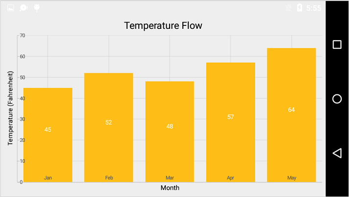

### Axis Label Rotation

The axis label can be rotated by using [`LabelRotationAngle`](http://help.syncfusion.com/cr/cref_files/xamarin-android/sfchart/Syncfusion.SfChart.Android~Com.Syncfusion.Charts.ChartAxis~LabelRotationAngle.html). 

 
[C#]

chart.PrimaryAxis.LabelRotationAngle = 315;



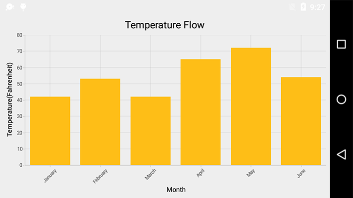

### Edge Labels Placement

Labels with long text at the edges of an axis may appear partially outside the chart. The [`EdgeLabelsDrawingMode`](http://help.syncfusion.com/cr/cref_files/xamarin-android/sfchart/Syncfusion.SfChart.Android~Com.Syncfusion.Charts.ChartAxis~EdgeLabelsDrawingMode.html) property can be used to avoid the partial appearance of labels at the corners.

 
[C#]

chart.PrimaryAxis.EdgeLabelsDrawingMode = EdgeLabelsDrawingMode.Shift;



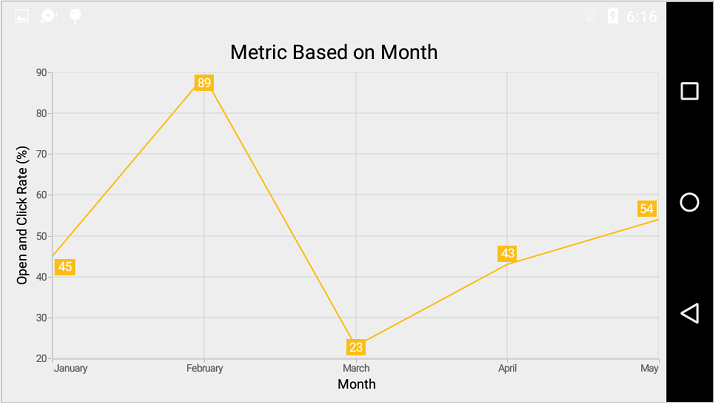

### Axis Line Customization

The [`LineStyle`](http://help.syncfusion.com/cr/cref_files/xamarin-android/sfchart/Syncfusion.SfChart.Android~Com.Syncfusion.Charts.ChartAxis~LineStyle.html) properties are used to customize the axis line. The axis line can be customized using following properties:

* [`StrokeColor`](http://help.syncfusion.com/cr/cref_files/xamarin-android/sfchart/Syncfusion.SfChart.Android~Com.Syncfusion.Charts.ChartLineStyle~StrokeColor.html) - used to change the stroke color of the axis line.
* [`StrokeWidth`](http://help.syncfusion.com/cr/cref_files/xamarin-android/sfchart/Syncfusion.SfChart.Android~Com.Syncfusion.Charts.ChartLineStyle~StrokeWidth.html) - used to change the stroke width of the axis line.
* [`PathEffect`](http://help.syncfusion.com/cr/cref_files/xamarin-android/sfchart/Syncfusion.SfChart.Android~Com.Syncfusion.Charts.ChartLineStyle~PathEffect.html) - used to change the dotted line of axis line.

 
[C#]

chart.PrimaryAxis.LineStyle.StrokeWidth = 4;
chart.PrimaryAxis.LineStyle.StrokeColor = Color.Blue;
chart.PrimaryAxis.LineStyle.PathEffect = new DashPathEffect(new float[] { 4, 4 }, 3);



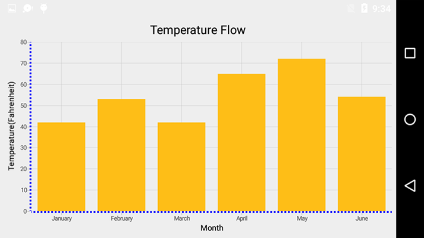

### Grid Lines Customization

The [`ShowMajorGridLines`](http://help.syncfusion.com/cr/cref_files/xamarin-android/sfchart/Syncfusion.SfChart.Android~Com.Syncfusion.Charts.ChartAxis~ShowMajorGridLines.html) and [`ShowMinorGridLines`](http://help.syncfusion.com/cr/cref_files/xamarin-android/sfchart/Syncfusion.SfChart.Android~Com.Syncfusion.Charts.RangeAxisBase~ShowMinorGridLines.html) properties are used to control the visibility of grid lines. [`MajorGridLineStyle`](http://help.syncfusion.com/cr/cref_files/xamarin-android/sfchart/Syncfusion.SfChart.Android~Com.Syncfusion.Charts.ChartAxis~MajorGridLineStyle.html) and [`MinorGridLineStyle`](http://help.syncfusion.com/cr/cref_files/xamarin-android/sfchart/Syncfusion.SfChart.Android~Com.Syncfusion.Charts.RangeAxisBase~MinorGridLineStyle.html) properties in axis are used to customize the major grid lines and minor grid lines of an axis respectively. By default minor grid lines will not be visible. 

The grid lines can be customized using following properties:
* [`StrokeColor`](http://help.syncfusion.com/cr/cref_files/xamarin-android/sfchart/Syncfusion.SfChart.Android~Com.Syncfusion.Charts.ChartLineStyle~StrokeColor.html) - used to change the stroke color of the grid lines
* [`StrokeWidth`](http://help.syncfusion.com/cr/cref_files/xamarin-android/sfchart/Syncfusion.SfChart.Android~Com.Syncfusion.Charts.ChartLineStyle~StrokeWidth.html) - used to change the stroke width of the grid lines
* [`PathEffect`](http://help.syncfusion.com/cr/cref_files/xamarin-android/sfchart/Syncfusion.SfChart.Android~Com.Syncfusion.Charts.ChartLineStyle~PathEffect.html) - used to change the dotted line of grid lines

 
[C#]

chart.SecondaryAxis.ShowMajorGridLines = true;
chart.SecondaryAxis.ShowMinorGridLines = true;
chart.SecondaryAxis.MinorTicksPerInterval = 2;



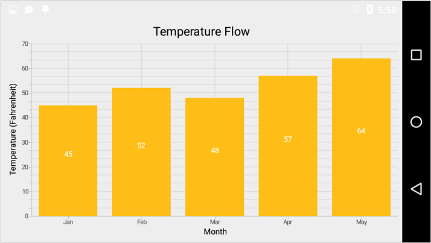

### Tick Lines Customization

The [`MajorTickStyle`](http://help.syncfusion.com/cr/cref_files/xamarin-android/sfchart/Syncfusion.SfChart.Android~Com.Syncfusion.Charts.ChartAxis~MajorTickStyle.html) and [`MinorTickStyle`](http://help.syncfusion.com/cr/cref_files/xamarin-android/sfchart/Syncfusion.SfChart.Android~Com.Syncfusion.Charts.RangeAxisBase~MinorTickStyle.html) properties in axis are used to customize the major tick lines of an axis and minor tick lines of an axis respectively. They provide options to change the width, size, color and visibility of tick lines. By default minor tick lines will not be visible.

 
[C#]

NumericalAxis numericalAxis = new NumericalAxis();
numericalAxis.MajorTickStyle.TickSize = 7;
numericalAxis.MajorTickStyle.StrokeWidth = 3;
numericalAxis.MajorTickStyle.StrokeColor = Color.Red;
numericalAxis.ShowMinorGridLines = true;
numericalAxis.MinorTicksPerInterval = 1;
numericalAxis.MinorTickStyle.TickSize = 5;
numericalAxis.MinorTickStyle.StrokeWidth = 2;
numericalAxis.MinorTickStyle.StrokeColor = Color.Green;
chart.SecondaryAxis = numericalAxis;



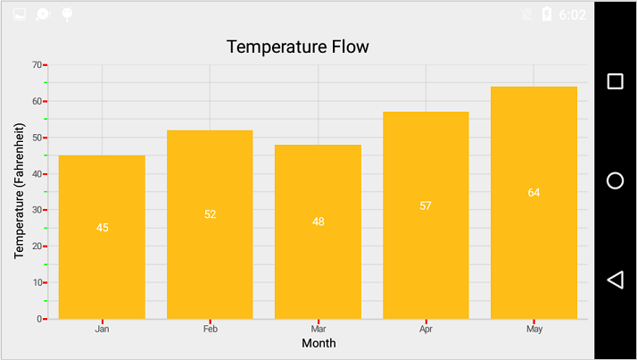

### Inversing Axis

Axis can be inversed using the [`Inversed`](http://help.syncfusion.com/cr/cref_files/xamarin-android/sfchart/Syncfusion.SfChart.Android~Com.Syncfusion.Charts.ChartAxis~Inversed.html) property of axis. Default value is `False`.

 
[C#]

chart.SecondaryAxis.Inversed = true;



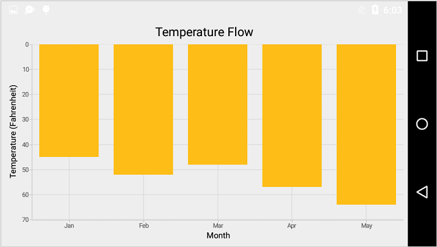

### Placing Axes at the Opposite side

The [`OpposedPosition`](http://help.syncfusion.com/cr/cref_files/xamarin-android/sfchart/Syncfusion.SfChart.Android~Com.Syncfusion.Charts.ChartAxis~OpposedPosition.html) property of axis can be used to place the axis at the opposite side of its default position. Default value is `False`. 

 
[C#]

chart.SecondaryAxis.OpposedPosition = true;



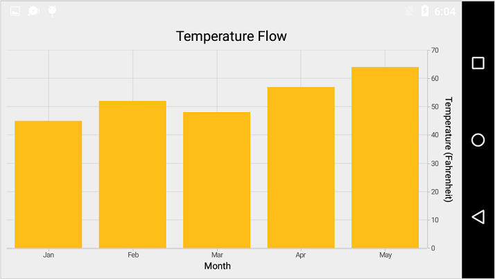

### Maximum number of labels per 100 pixels

By default, a maximum of 3 labels are displayed for each 100 pixels in axis. The maximum number of labels that should be present within 100 pixels length can be customized using the [`MaximumLabels`](http://help.syncfusion.com/cr/cref_files/xamarin-android/sfchart/Syncfusion.SfChart.Android~Com.Syncfusion.Charts.ChartAxis~MaximumLabels.html) property of an axis. This property is applicable only for automatic range calculation and will not work if you set value for [`Interval`](http://help.syncfusion.com/cr/cref_files/xamarin-android/sfchart/Syncfusion.SfChart.Android~Com.Syncfusion.Charts.ChartAxis~Interval.html) property of an axis.

 
[C#]

chart.SecondaryAxis.MaximumLabels = 5;



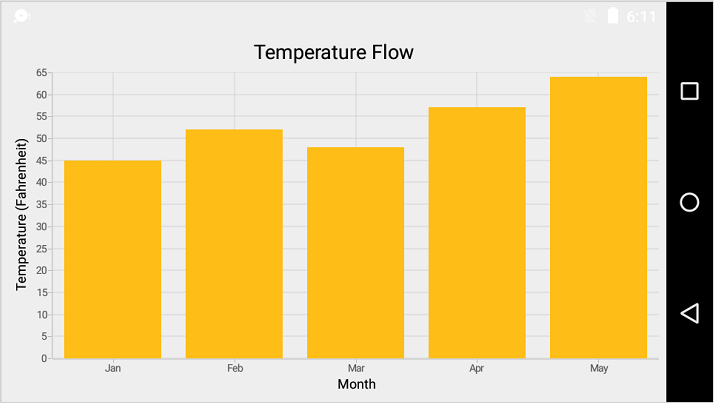

### AutoScrollingMode

[`AutoScrollingMode`](https://help.syncfusion.com/cr/cref_files/xamarin-android/sfchart/Syncfusion.SfChart.Android~Com.Syncfusion.Charts.ChartAxis~AutoScrollingMode.html) property can be used to determine whether the axis should be scrolled from start position or end position. The default value of [`AutoScrollingMode`](https://help.syncfusion.com/cr/cref_files/xamarin-android/sfchart/Syncfusion.SfChart.Android~Com.Syncfusion.Charts.ChartAxis~AutoScrollingMode.html) is [`End`].

 
[C#]

chart.PrimaryAxis = new CategoryAxis()
{
      AutoScrollingDelta = 3,
	  
      AutoScrollingMode = ChartAutoScrollingMode.Start
};



## Smart Axis Labels

Axis labels may overlap with each other based on chart dimensions and label size. The [`LabelsIntersectAction`](http://help.syncfusion.com/cr/cref_files/xamarin-android/sfchart/Syncfusion.SfChart.Android~Com.Syncfusion.Charts.ChartAxis~LabelsIntersectAction.html) property of axis is useful in avoiding the overlapping of axis labels with each other. Default value of [`LabelsIntersectAction`](http://help.syncfusion.com/cr/cref_files/xamarin-android/sfchart/Syncfusion.SfChart.Android~Com.Syncfusion.Charts.ChartAxis~LabelsIntersectAction.html) is `None`. Other available values of [`LabelsIntersectAction`](http://help.syncfusion.com/cr/cref_files/xamarin-android/sfchart/Syncfusion.SfChart.Android~Com.Syncfusion.Charts.ChartAxis~LabelsIntersectAction.html) are `MultipleRows`and `Hide`.

 
[C#]

chart.PrimaryAxis.LabelsIntersectAction = AxisLabelsIntersectAction.MultipleRows;



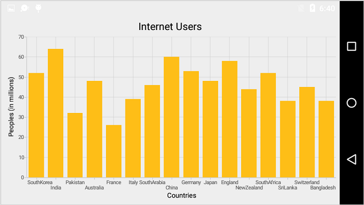

## Events

**ActualRangeChanged**

This event is triggered when the axis range is changed. The argument contains the following information.

* [`ActualMinimum`](https://help.syncfusion.com/cr/cref_files/xamarin-android/sfchart/Syncfusion.SfChart.Android~Com.Syncfusion.Charts.ChartAxis+ActualRangeChangedEventArgs~ActualMinimum.html) - used to get the axis actual minimum value
* [`ActualMaximum`](https://help.syncfusion.com/cr/cref_files/xamarin-android/sfchart/Syncfusion.SfChart.Android~Com.Syncfusion.Charts.ChartAxis+ActualRangeChangedEventArgs~ActualMaximum.html) - used to get the axis actual maximum value
* [`VisibleMinimum`](https://help.syncfusion.com/cr/cref_files/xamarin-android/sfchart/Syncfusion.SfChart.Android~Com.Syncfusion.Charts.ChartAxis+ActualRangeChangedEventArgs~VisibleMinimum.html) - used to get the axis visible minimum value
* [`VisibleMaximum`](https://help.syncfusion.com/cr/cref_files/xamarin-android/sfchart/Syncfusion.SfChart.Android~Com.Syncfusion.Charts.ChartAxis+ActualRangeChangedEventArgs~VisibleMaximum.html) - used to get the axis visible maximum value

N> Actual range and visible range are similar unless the range is changed by specifying the [`ZoomPosition`](http://help.syncfusion.com/cr/cref_files/xamarin-android/sfchart/Syncfusion.SfChart.Android~Com.Syncfusion.Charts.ChartAxis~ZoomPosition.html) and [`ZoomFactor`](http://help.syncfusion.com/cr/cref_files/xamarin-android/sfchart/Syncfusion.SfChart.Android~Com.Syncfusion.Charts.ChartAxis~ZoomFactor.html) property or zoom the chart interactively. Visible range is always the range which you see visually in the screen.

**LabelCreated**

This event is triggered when the axis label is created. The argument contains the following information.

* `index` - used to get the index of the axis label
* [`LabelContent`](http://help.syncfusion.com/cr/cref_files/xamarin-android/sfchart/Syncfusion.SfChart.Android~Com.Syncfusion.Charts.ChartAxis+ChartAxisLabel~LabelContent.html) - used to get or set the content of label
* [`Position`](http://help.syncfusion.com/cr/cref_files/xamarin-android/sfchart/Syncfusion.SfChart.Android~Com.Syncfusion.Charts.ChartAxis+ChartAxisLabel~Position.html) - used to get or set the position of the label
* [`IsVisible`](http://help.syncfusion.com/cr/cref_files/xamarin-android/sfchart/Syncfusion.SfChart.Android~Com.Syncfusion.Charts.ChartAxis+ChartAxisLabel~IsVisible.html) - used to set the axis label visibility

**LabelClicked**

This event is triggered when the axis label is clicked. The argument contains the following information.

* [`Label`](https://help.syncfusion.com/cr/cref_files/xamarin-android/sfchart/Syncfusion.SfChart.Android~Com.Syncfusion.Charts.ChartAxis+ChartAxisLabelClickedEventArgs~Label.html) - Used to get the ChartAxisLabel, which contains axis label position and text.
