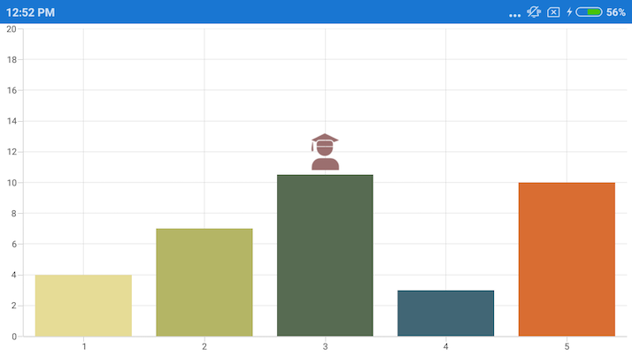

# Annotation

[`SfChart`](https://help.syncfusion.com/cr/cref_files/xamarin-android/Syncfusion.SfChart.Android~Com.Syncfusion.Charts.SfChart.html) supports annotations, which allows you to mark the specific area of interest in the chart area. You can add text, images and custom views.

The following annotations are supported in [`SfChart`](https://help.syncfusion.com/cr/cref_files/xamarin-android/Syncfusion.SfChart.Android~Com.Syncfusion.Charts.SfChart.html)

*   Text annotation
*   Shape annotation
*   View annotation

## Adding Annotations

You can create an instance for any type of annotation and add this to [`Annotations`](https://help.syncfusion.com/cr/cref_files/xamarin-android/Syncfusion.SfChart.Android~Com.Syncfusion.Charts.ChartBase~Annotations.html) collection. Here for an instance, the [`EllipseAnnotation`](https://help.syncfusion.com/cr/cref_files/xamarin-android/Syncfusion.SfChart.Android~Com.Syncfusion.Charts.EllipseAnnotation.html) is added.

 
[C#]

SfChart chart = new SfChart(this);
...

EllipseAnnotation annotation = new EllipseAnnotation()
{
    X1 = 2,

    Y1 = 35,

    X2 = 6,

    Y2 = 40,

    Text = "Ellipse"
};

chart.Annotations.Add(annotation);



## Positioning the annotation

Annotations can be positioned in plot area based on [`X1`](https://help.syncfusion.com/cr/cref_files/xamarin-android/Syncfusion.SfChart.Android~Com.Syncfusion.Charts.ChartAnnotation~X1.html) and [`Y1`](https://help.syncfusion.com/cr/cref_files/xamarin-android/Syncfusion.SfChart.Android~Com.Syncfusion.Charts.ChartAnnotation~Y1.html) properties. For shape annotations, specify X2 and Y2 properties, if needed. The X and Y values can be specified with axis units or pixel units, and these can be identified by using [`CoordinateUnit`](https://help.syncfusion.com/cr/cref_files/xamarin-android/Syncfusion.SfChart.Android~Com.Syncfusion.Charts.ChartAnnotation~CoordinateUnit.html) property.

### Positioning based on CoordinateUnit as axis

To position the annotation based on an axis, set the X1 and Y1, X2 and Y2 properties based on axis range values, if needed, and then set the [`CoordinateUnit`](https://help.syncfusion.com/cr/cref_files/xamarin-android/Syncfusion.SfChart.Android~Com.Syncfusion.Charts.ChartAnnotation~CoordinateUnit.html) value as [`Axis`](https://help.syncfusion.com/cr/cref_files/xamarin-android/Syncfusion.SfChart.Android~Com.Syncfusion.Charts.ChartCoordinateUnit.html).

 
[C#]

SfChart chart = new SfChart(this);
...

RectangleAnnotation annotation = new RectangleAnnotation()
{
    X1 = 4,

    Y1 = 40,

    X2 = 8,

    Y2 = 45,

    Text = "Axis Value",

    CoordinateUnit = ChartCoordinateUnit.Axis
};

chart.Annotations.Add(annotation);



### Positioning based on CoordinateUnit as pixels

To position the annotations based on the pixel values, set the [`CoordinateUnit`](https://help.syncfusion.com/cr/cref_files/xamarin-android/Syncfusion.SfChart.Android~Com.Syncfusion.Charts.ChartAnnotation~CoordinateUnit.html) value as [`Pixels`](https://help.syncfusion.com/cr/cref_files/xamarin-android/Syncfusion.SfChart.Android~Com.Syncfusion.Charts.ChartCoordinateUnit.html). The pixel values in X1 and Y1, X2 and Y2 properties of an annotation are shown in the following code snippet,

 
[C#]

SfChart chart = new SfChart(this);
...

RectangleAnnotation annotation = new RectangleAnnotation()
{
    X1 = 1,

    Y1 = 1,

    X2 = 150,

    Y2 = 150,

    Text = "Pixel Value",

    CoordinateUnit = ChartCoordinateUnit.Pixels
};

chart.Annotations.Add(annotation);



## Adding annotation for multiple axes

When there are multiple axes, annotations can be added for a particular axis by using [`XAxisName`](https://help.syncfusion.com/cr/cref_files/xamarin-android/Syncfusion.SfChart.Android~Com.Syncfusion.Charts.ChartAnnotation~XAxisName.html) and [`YAxisName`](https://help.syncfusion.com/cr/cref_files/xamarin-android/Syncfusion.SfChart.Android~Com.Syncfusion.Charts.ChartAnnotation~YAxisName.html) properties. The following code snippet illustrates this,

 
[C#]

SfChart chart = new SfChart(this);
...

EllipseAnnotation annotation = new EllipseAnnotation()
{
    X1 = 4,

    Y1 = 30,

    X2 = 8,

    Y2 = 35,

    YAxisName = "YAxis"
};

chart.Annotations.Add(annotation);

SplineSeries series = new SplineSeries();

series.XBindingPath = "Name";

series.YBindingPath = "Value";

series.ItemsSource = model.Data;

series.YAxis = new NumericalAxis()
{
    OpposedPosition = true,

    Name = "YAxis"
};

chart.Series.Add(series);



## Text annotation

[`TextAnnotation`](https://help.syncfusion.com/cr/cref_files/xamarin-android/Syncfusion.SfChart.Android~Com.Syncfusion.Charts.TextAnnotation.html) is used to add simple text with the help of [`Text`](https://help.syncfusion.com/cr/cref_files/xamarin-android/Syncfusion.SfChart.Android~Com.Syncfusion.Charts.TextAnnotation~Text.html) property in specific points over the chart area.

 
[C#]

SfChart chart = new SfChart(this);
...

TextAnnotation annotation = new TextAnnotation()
{
    X1 = 7,

    Y1 = 35,

    Text = "August"
};

chart.Annotations.Add(annotation);



### Customizing text annotation

The [`TextAnnotation`](https://help.syncfusion.com/cr/cref_files/xamarin-android/Syncfusion.SfChart.Android~Com.Syncfusion.Charts.TextAnnotation.html) can be customized by using [`LabelStyle`](https://help.syncfusion.com/cr/cref_files/xamarin-android/Syncfusion.SfChart.Android~Com.Syncfusion.Charts.TextAnnotation~LabelStyle.html) property. The following properties are used to customize the text:

* [`TextColor`](https://help.syncfusion.com/cr/cref_files/xamarin-android/Syncfusion.SfChart.Android~Com.Syncfusion.Charts.ChartLabelStyle~TextColor.html) – Used to change the color of the text.
* [`BackgroundColor`](https://help.syncfusion.com/cr/cref_files/xamarin-android/Syncfusion.SfChart.Android~Com.Syncfusion.Charts.ChartLabelStyle~BackgroundColor.html) – Used to change the background color of the text.
* [`StrokeColor`](https://help.syncfusion.com/cr/cref_files/xamarin-android/Syncfusion.SfChart.Android~Com.Syncfusion.Charts.ChartLabelStyle~StrokeColor.html) – Used to change the border color.
* [`StrokeWidth`](https://help.syncfusion.com/cr/cref_files/xamarin-android/Syncfusion.SfChart.Android~Com.Syncfusion.Charts.ChartLabelStyle~StrokeWidth.html) – Used to change the width of the border.
* [`TextSize`](https://help.syncfusion.com/cr/cref_files/xamarin-android/Syncfusion.SfChart.Android~Com.Syncfusion.Charts.ChartLabelStyle~TextSize.html) – Used to change the text size.
* [`Typeface`](https://help.syncfusion.com/cr/cref_files/xamarin-android/Syncfusion.SfChart.Android~Com.Syncfusion.Charts.ChartLabelStyle~Typeface.html) – Used to change the font family and font weight.
* [`MarginTop`](https://help.syncfusion.com/cr/cref_files/xamarin-android/Syncfusion.SfChart.Android~Com.Syncfusion.Charts.ChartLabelStyle~MarginTop.html) – Used to change the top margin of the text.
* [`MarginBottom`](https://help.syncfusion.com/cr/cref_files/xamarin-android/Syncfusion.SfChart.Android~Com.Syncfusion.Charts.ChartLabelStyle~MarginBottom.html) – Used to change the bottom margin of the text.
* [`MarginLeft`](https://help.syncfusion.com/cr/cref_files/xamarin-android/Syncfusion.SfChart.Android~Com.Syncfusion.Charts.ChartLabelStyle~MarginLeft.html) – Used to change the left margin of the text.
* [`MarginRight`](https://help.syncfusion.com/cr/cref_files/xamarin-android/Syncfusion.SfChart.Android~Com.Syncfusion.Charts.ChartLabelStyle~MarginRight.html) – Used to change the right margin of the text.
* [`HorizontalLabelAlignment`](https://help.syncfusion.com/cr/cref_files/xamarin-android/Syncfusion.SfChart.Android~Com.Syncfusion.Charts.ChartAnnotationLabelStyle~HorizontalLabelAlignment.html) – Used to align the text horizontally.
* [`VerticalLabelAlignment`](https://help.syncfusion.com/cr/cref_files/xamarin-android/Syncfusion.SfChart.Android~Com.Syncfusion.Charts.ChartAnnotationLabelStyle~VerticalLabelAlignment.html) – Used to align the text vertically.

 
[C#]

SfChart chart = new SfChart(this);
...

TextAnnotation annotation = new TextAnnotation()
{
    X1 = 7,

    Y1 = 35,

    Text = "August"
};

annotation.LabelStyle.MarginTop = 5;

annotation.LabelStyle.MarginLeft = 5;

annotation.LabelStyle.MarginRight = 5;

annotation.LabelStyle.MarginBottom = 5;

annotation.LabelStyle.TextSize = 16;

annotation.LabelStyle.Typeface = Typeface.DefaultFromStyle(TypefaceStyle.Italic);

annotation.LabelStyle.StrokeColor = Color.Red;

annotation.LabelStyle.StrokeWidth = 2;

annotation.LabelStyle.BackgroundColor = Color.Teal;

annotation.LabelStyle.TextColor = Color.White;

annotation.LabelStyle.VerticalLabelAlignment = ChartAnnotationAlignment.Start;

chart.Annotations.Add(annotation);



## Shape annotation

[`ShapeAnnotation`](https://help.syncfusion.com/cr/cref_files/xamarin-android/Syncfusion.SfChart.Android~Com.Syncfusion.Charts.ShapeAnnotation.html) allows you to add annotations in the form of shapes such as rectangle, ellipse, horizontal line, vertical line, etc., at the specific area of interest in the chart area.

* [`RectangleAnnotation`](https://help.syncfusion.com/cr/cref_files/xamarin-android/Syncfusion.SfChart.Android~Com.Syncfusion.Charts.RectangleAnnotation.html) – Used to draw a rectangle over the chart area.
* [`EllipseAnnotation`](https://help.syncfusion.com/cr/cref_files/xamarin-android/Syncfusion.SfChart.Android~Com.Syncfusion.Charts.EllipseAnnotation.html) – Used to draw a circle or an ellipse over the chart area.
* [`LineAnnotation`](https://help.syncfusion.com/cr/cref_files/xamarin-android/Syncfusion.SfChart.Android~Com.Syncfusion.Charts.LineAnnotation.html) – Used to draw a line over the chart area.
* [`VerticalLineAnnotation`](https://help.syncfusion.com/cr/cref_files/xamarin-android/Syncfusion.SfChart.Android~Com.Syncfusion.Charts.VerticalLineAnnotation.html) – Used to draw a vertical line across the chart area.
* [`HorizontalLineAnnotation`](https://help.syncfusion.com/cr/cref_files/xamarin-android/Syncfusion.SfChart.Android~Com.Syncfusion.Charts.HorizontalLineAnnotation.html) – Used to draw a horizontal line across the chart area.

The following APIs are commonly used in all [`ShapeAnnotation`](https://help.syncfusion.com/cr/cref_files/xamarin-android/Syncfusion.SfChart.Android~Com.Syncfusion.Charts.ShapeAnnotation.html):

* [`X2`](https://help.syncfusion.com/cr/cref_files/xamarin-android/Syncfusion.SfChart.Android~Com.Syncfusion.Charts.ShapeAnnotation~X2.html) – Represents the X2 coordinate of the shape annotation.
* [`Y2`](https://help.syncfusion.com/cr/cref_files/xamarin-android/Syncfusion.SfChart.Android~Com.Syncfusion.Charts.ShapeAnnotation~Y2.html) – Represents the Y2 coordinate of the shape annotation.
* [`FillColor`](https://help.syncfusion.com/cr/cref_files/xamarin-android/Syncfusion.SfChart.Android~Com.Syncfusion.Charts.ShapeAnnotation~FillColor.html) – Represents the inside background color of the shape annotation.
* [`StrokeColor`](https://help.syncfusion.com/cr/cref_files/xamarin-android/Syncfusion.SfChart.Android~Com.Syncfusion.Charts.ShapeAnnotation~StrokeColor.html) – Represents the stroke color of the shape annotation.
* [`StrokeWidth`](https://help.syncfusion.com/cr/cref_files/xamarin-android/Syncfusion.SfChart.Android~Com.Syncfusion.Charts.ShapeAnnotation~StrokeWidth.html) – Represents the stroke width of the shape annotation.
* [`StrokeDashArray`](https://help.syncfusion.com/cr/cref_files/xamarin-android/Syncfusion.SfChart.Android~Com.Syncfusion.Charts.ShapeAnnotation~StrokeDashArray.html) – Represents the stroke dashes of the shape annotation.
* [`Text`](https://help.syncfusion.com/cr/cref_files/xamarin-android/Syncfusion.SfChart.Android~Com.Syncfusion.Charts.ShapeAnnotation~Text.html) – Represents the text of the shape annotation.
* [`LabelStyle`](https://help.syncfusion.com/cr/cref_files/xamarin-android/Syncfusion.SfChart.Android~Com.Syncfusion.Charts.ShapeAnnotation~LabelStyle.html) – Represents the style for customizing the annotation text of shape annotation.

### Rectangle annotation

The [`RectangleAnnotation`](https://help.syncfusion.com/cr/cref_files/xamarin-android/Syncfusion.SfChart.Android~Com.Syncfusion.Charts.RectangleAnnotation.html) is used to draw a rectangle or a square in specific points over the chart area.

 
[C#]

SfChart chart = new SfChart(this);
...

RectangleAnnotation annotation = new RectangleAnnotation()
{
    X1 = 4,

    Y1 = 20,

    X2 = 6,

    Y2 = 55,
};

chart.Annotations.Add(annotation);



### Ellipse annotation

The [`EllipseAnnotation`](https://help.syncfusion.com/cr/cref_files/xamarin-android/Syncfusion.SfChart.Android~Com.Syncfusion.Charts.EllipseAnnotation.html) is used to draw an oval or a circle in specific points over the chart area. You can also specify the height and width of [`EllipseAnnotation`](https://help.syncfusion.com/cr/cref_files/xamarin-android/Syncfusion.SfChart.Android~Com.Syncfusion.Charts.EllipseAnnotation.html) by using [`Height`](https://help.syncfusion.com/cr/cref_files/xamarin-android/Syncfusion.SfChart.Android~Com.Syncfusion.Charts.EllipseAnnotation~Height.html) and [`Width`](https://help.syncfusion.com/cr/cref_files/xamarin-android/Syncfusion.SfChart.Android~Com.Syncfusion.Charts.EllipseAnnotation~Width.html) properties, respectively.

 
[C#]

SfChart chart = new SfChart(this);
...

EllipseAnnotation annotation = new EllipseAnnotation()
{
    X1 = 6,

    Y1 = 32,

    Height = 30,

    Width = 30
};

chart.Annotations.Add(annotation);



N> When [`X2`](https://help.syncfusion.com/cr/cref_files/xamarin-android/Syncfusion.SfChart.Android~Com.Syncfusion.Charts.ShapeAnnotation~X2.html) and [`Y2`](https://help.syncfusion.com/cr/cref_files/xamarin-android/Syncfusion.SfChart.Android~Com.Syncfusion.Charts.ShapeAnnotation~Y2.html) properties of [`EllipseAnnotation`](https://help.syncfusion.com/cr/cref_files/xamarin-android/Syncfusion.SfChart.Android~Com.Syncfusion.Charts.EllipseAnnotation.html) are set, the [`Height`](https://help.syncfusion.com/cr/cref_files/xamarin-android/Syncfusion.SfChart.Android~Com.Syncfusion.Charts.EllipseAnnotation~Height.html) and [`Width`](https://help.syncfusion.com/cr/cref_files/xamarin-android/Syncfusion.SfChart.Android~Com.Syncfusion.Charts.EllipseAnnotation~Width.html) properties do not work.

### Line annotation

The [`LineAnnotation`](https://help.syncfusion.com/cr/cref_files/xamarin-android/Syncfusion.SfChart.Android~Com.Syncfusion.Charts.LineAnnotation.html) is used to draw a line in specific points over the chart area. 

 
[C#]

SfChart chart = new SfChart(this);
...

LineAnnotation annotation = new LineAnnotation()
{
    X1 = 2,

    Y1 = 35,

    X2 = 8,

    Y2 = 45,

    Text = "Line"

};

chart.Annotations.Add(annotation);



**Adding arrow to line annotation**

To display the single headed arrow, set the [`LineCap`](https://help.syncfusion.com/cr/cref_files/xamarin-android/Syncfusion.SfChart.Android~Com.Syncfusion.Charts.LineAnnotation~LineCap.html) property to [`Arrow`](https://help.syncfusion.com/cr/cref_files/xamarin-android/Syncfusion.SfChart.Android~Com.Syncfusion.Charts.ChartLineCap.html). The default value of the [`LineCap`](https://help.syncfusion.com/cr/cref_files/xamarin-android/Syncfusion.SfChart.Android~Com.Syncfusion.Charts.LineAnnotation~LineCap.html) property is [`None`](https://help.syncfusion.com/cr/cref_files/xamarin-android/Syncfusion.SfChart.Android~Com.Syncfusion.Charts.ChartLineCap.html).

 
[C#]

SfChart chart = new SfChart(this);
...

LineAnnotation annotation = new LineAnnotation()
{
    X1 = 2,

    Y1 = 40,

    X2 = 10,

    Y2 = 40,

    LineCap = ChartLineCap.Arrow
};

chart.Annotations.Add(annotation);



### Vertical and horizontal line annotations

The [`VerticalLineAnnotation`](https://help.syncfusion.com/cr/cref_files/xamarin-android/Syncfusion.SfChart.Android~Com.Syncfusion.Charts.VerticalLineAnnotation.html) and [`HorizontalLineAnnotation`](https://help.syncfusion.com/cr/cref_files/xamarin-android/Syncfusion.SfChart.Android~Com.Syncfusion.Charts.HorizontalLineAnnotation.html) properties are used to draw the vertical and horizontal lines in specific points over the chart area.

 
[C#]

SfChart chart = new SfChart(this);
...

VerticalLineAnnotation vertical = new VerticalLineAnnotation()
{
    X1 = 6
};

chart.Annotations.Add(vertical);

HorizontalLineAnnotation horizontal = new HorizontalLineAnnotation()
{
    Y1 = 35
};

chart.Annotations.Add(horizontal);



                                                

**Displaying axis labels for vertical and horizontal line annotations**

The [`VerticalLineAnnotation`](https://help.syncfusion.com/cr/cref_files/xamarin-android/Syncfusion.SfChart.Android~Com.Syncfusion.Charts.VerticalLineAnnotation.html) and [`HorizontalLineAnnotation`](https://help.syncfusion.com/cr/cref_files/xamarin-android/Syncfusion.SfChart.Android~Com.Syncfusion.Charts.HorizontalLineAnnotation.html) properties display the axis labels in which the line is placed. Default value of [`ShowAxisLabel`](https://help.syncfusion.com/cr/cref_files/xamarin-android/Syncfusion.SfChart.Android~Com.Syncfusion.Charts.HorizontalLineAnnotation~ShowAxisLabel.html) property is false. This feature can be enabled by setting [`ShowAxisLabel`](https://help.syncfusion.com/cr/cref_files/xamarin-android/Syncfusion.SfChart.Android~Com.Syncfusion.Charts.VerticalLineAnnotation~ShowAxisLabel.html) property to true as shown in the following code snippet,

 
[C#]

SfChart chart = new SfChart(this);
...

VerticalLineAnnotation vertical = new VerticalLineAnnotation()
{
    X1 = 6,

    ShowAxisLabel = true
};

chart.Annotations.Add(vertical);

HorizontalLineAnnotation horizontal = new HorizontalLineAnnotation()
{
    Y1 = 35,

    ShowAxisLabel = true
};

chart.Annotations.Add(horizontal);



  

**Customizing the axis label**

The default appearance of the axis labels can be customized by using [`AxisLabelStyle`](https://help.syncfusion.com/cr/cref_files/xamarin-android/Syncfusion.SfChart.Android~Com.Syncfusion.Charts.VerticalLineAnnotation~AxisLabelStyle.html) property. The following properties of [`AxisLabelStyle`](https://help.syncfusion.com/cr/cref_files/xamarin-android/Syncfusion.SfChart.Android~Com.Syncfusion.Charts.HorizontalLineAnnotation~AxisLabelStyle.html) are used to customize the axis label:

* [`TextColor`](https://help.syncfusion.com/cr/cref_files/xamarin-android/Syncfusion.SfChart.Android~Com.Syncfusion.Charts.ChartLabelStyle~TextColor.html) – Used to change the color of the text.
* [`BackgroundColor`](https://help.syncfusion.com/cr/cref_files/xamarin-android/Syncfusion.SfChart.Android~Com.Syncfusion.Charts.ChartLabelStyle~BackgroundColor.html) – Used to change the background color of the text.
* [`StrokeColor`](https://help.syncfusion.com/cr/cref_files/xamarin-android/Syncfusion.SfChart.Android~Com.Syncfusion.Charts.ChartLabelStyle~StrokeColor.html) – Used to change the border color.
* [`StrokeWidth`](https://help.syncfusion.com/cr/cref_files/xamarin-android/Syncfusion.SfChart.Android~Com.Syncfusion.Charts.ChartLabelStyle~StrokeWidth.html) – Used to change the width of the border.
* [`TextSize`](https://help.syncfusion.com/cr/cref_files/xamarin-android/Syncfusion.SfChart.Android~Com.Syncfusion.Charts.ChartLabelStyle~TextSize.html) – Used to change the text size.
* [`Typeface`](https://help.syncfusion.com/cr/cref_files/xamarin-android/Syncfusion.SfChart.Android~Com.Syncfusion.Charts.ChartLabelStyle~Typeface.html) – Used to change the font family and font weight.
* [`MarginTop`](https://help.syncfusion.com/cr/cref_files/xamarin-android/Syncfusion.SfChart.Android~Com.Syncfusion.Charts.ChartLabelStyle~MarginTop.html) – Used to change the top margin of the text.
* [`MarginBottom`](https://help.syncfusion.com/cr/cref_files/xamarin-android/Syncfusion.SfChart.Android~Com.Syncfusion.Charts.ChartLabelStyle~MarginBottom.html) – Used to change the bottom margin of the text.
* [`MarginLeft`](https://help.syncfusion.com/cr/cref_files/xamarin-android/Syncfusion.SfChart.Android~Com.Syncfusion.Charts.ChartLabelStyle~MarginLeft.html) – Used to change the left margin of the text.
* [`MarginRight`](https://help.syncfusion.com/cr/cref_files/xamarin-android/Syncfusion.SfChart.Android~Com.Syncfusion.Charts.ChartLabelStyle~MarginRight.html) – Used to change the right margin of the text.

 
[C#]

SfChart chart = new SfChart(this);
...

VerticalLineAnnotation vertical = new VerticalLineAnnotation()
{
    X1 = 6,

    ShowAxisLabel = true
};

vertical.AxisLabelStyle.MarginTop = 5;

vertical.AxisLabelStyle.MarginLeft = 5;

vertical.AxisLabelStyle.MarginRight = 5;

vertical.AxisLabelStyle.MarginBottom = 5;

vertical.AxisLabelStyle.TextSize = 12;

vertical.AxisLabelStyle.Typeface = Typeface.DefaultFromStyle(TypefaceStyle.Italic);

vertical.AxisLabelStyle.StrokeColor = Color.Blue;

vertical.AxisLabelStyle.StrokeWidth = 2;

vertical.AxisLabelStyle.BackgroundColor = Color.Red;

vertical.AxisLabelStyle.TextColor = Color.White;

chart.Annotations.Add(vertical);

HorizontalLineAnnotation horizontal = new HorizontalLineAnnotation()
{
    Y1 = 35,

    ShowAxisLabel = true
};

horizontal.AxisLabelStyle.MarginTop = 5;

horizontal.AxisLabelStyle.MarginLeft = 5;

horizontal.AxisLabelStyle.MarginRight = 5;

horizontal.AxisLabelStyle.MarginBottom = 5;

horizontal.AxisLabelStyle.TextSize = 12;

horizontal.AxisLabelStyle.Typeface = Typeface.DefaultFromStyle(TypefaceStyle.Italic);

horizontal.AxisLabelStyle.StrokeColor = Color.Blue;

horizontal.AxisLabelStyle.StrokeWidth = 2;

horizontal.AxisLabelStyle.BackgroundColor = Color.Red;

horizontal.AxisLabelStyle.TextColor = Color.White;

chart.Annotations.Add(horizontal);



  

**Adding arrow to vertical and horizontal line annotations**

To display the single headed arrow, set the [`LineCap`](https://help.syncfusion.com/cr/cref_files/xamarin-android/Syncfusion.SfChart.Android~Com.Syncfusion.Charts.LineAnnotation~LineCap.html) property to `Arrow`. The default value of the [`LineCap`](https://help.syncfusion.com/cr/cref_files/xamarin-android/Syncfusion.SfChart.Android~Com.Syncfusion.Charts.LineAnnotation~LineCap.html) property is `None`.

 
[C#]

SfChart chart = new SfChart(this);
...

VerticalLineAnnotation vertical = new VerticalLineAnnotation()
{
    X1 = 6,

    LineCap = ChartLineCap.Arrow
};

chart.Annotations.Add(vertical);

HorizontalLineAnnotation horizontal = new HorizontalLineAnnotation()
{
    Y1 = 35,

    LineCap = ChartLineCap.Arrow
};

chart.Annotations.Add(horizontal);



  

## Adding text in shape annotation 

For all the shape annotations, the text can be displayed by using the [`Text`](https://help.syncfusion.com/cr/cref_files/xamarin-android/Syncfusion.SfChart.Android~Com.Syncfusion.Charts.ShapeAnnotation~Text.html) property.

### Customizing text in shape annotation

The `Text` in shape annotation also can be customized by using the [`LabelStyle`](https://help.syncfusion.com/cr/cref_files/xamarin-android/Syncfusion.SfChart.Android~Com.Syncfusion.Charts.ShapeAnnotation~LabelStyle.html) property. The following properties are used to customize the text:
            
* [`TextColor`](https://help.syncfusion.com/cr/cref_files/xamarin-android/Syncfusion.SfChart.Android~Com.Syncfusion.Charts.ChartLabelStyle~TextColor.html) – Used to change the color of the text.
* [`BackgroundColor`](https://help.syncfusion.com/cr/cref_files/xamarin-android/Syncfusion.SfChart.Android~Com.Syncfusion.Charts.ChartLabelStyle~BackgroundColor.html) – Used to change the background color of the text.
* [`StrokeColor`](https://help.syncfusion.com/cr/cref_files/xamarin-android/Syncfusion.SfChart.Android~Com.Syncfusion.Charts.ChartLabelStyle~StrokeColor.html) – Used to change the border color.
* [`StrokeWidth`](https://help.syncfusion.com/cr/cref_files/xamarin-android/Syncfusion.SfChart.Android~Com.Syncfusion.Charts.ChartLabelStyle~StrokeWidth.html) – Used to change the width of the border.
* [`TextSize`](https://help.syncfusion.com/cr/cref_files/xamarin-android/Syncfusion.SfChart.Android~Com.Syncfusion.Charts.ChartLabelStyle~TextSize.html) – Used to change the text size.
* [`Typeface`](https://help.syncfusion.com/cr/cref_files/xamarin-android/Syncfusion.SfChart.Android~Com.Syncfusion.Charts.ChartLabelStyle~Typeface.html) – Used to change the font family and font weight.
* [`MarginTop`](https://help.syncfusion.com/cr/cref_files/xamarin-android/Syncfusion.SfChart.Android~Com.Syncfusion.Charts.ChartLabelStyle~MarginTop.html) - Used to change the top margin of the text.
* [`MarginBottom`](https://help.syncfusion.com/cr/cref_files/xamarin-android/Syncfusion.SfChart.Android~Com.Syncfusion.Charts.ChartLabelStyle~MarginBottom.html) - Used to change the bottom margin of the text.
* [`MarginLeft`](https://help.syncfusion.com/cr/cref_files/xamarin-android/Syncfusion.SfChart.Android~Com.Syncfusion.Charts.ChartLabelStyle~MarginLeft.html) - Used to change the left margin of the text.
* [`MarginRight`](https://help.syncfusion.com/cr/cref_files/xamarin-android/Syncfusion.SfChart.Android~Com.Syncfusion.Charts.ChartLabelStyle~MarginRight.html) - Used to change the right margin of the text.
* [`HorizontalLabelAlignment`](https://help.syncfusion.com/cr/cref_files/xamarin-android/Syncfusion.SfChart.Android~Com.Syncfusion.Charts.ChartAnnotationLabelStyle~HorizontalLabelAlignment.html) – Used to align the text horizontally.
* [`VerticalLabelAlignment`](https://help.syncfusion.com/cr/cref_files/xamarin-android/Syncfusion.SfChart.Android~Com.Syncfusion.Charts.ChartAnnotationLabelStyle~VerticalLabelAlignment.html) – Used to align the text vertically.

 
[C#]

SfChart chart = new SfChart(this);
...

EllipseAnnotation annotation = new EllipseAnnotation()
{
    X1 = 2,

    Y1 = 30,

    X2 = 6,

    Y2 = 35,

    Text = "Ellipse"
};

annotation.LabelStyle.MarginTop = 5;

annotation.LabelStyle.MarginLeft = 5;

annotation.LabelStyle.MarginRight = 5;

annotation.LabelStyle.MarginBottom = 5;

annotation.LabelStyle.TextSize = 16;

annotation.LabelStyle.Typeface = Typeface.DefaultFromStyle(TypefaceStyle.Italic);

annotation.LabelStyle.StrokeColor = Color.Red;

annotation.LabelStyle.StrokeWidth = 2;

annotation.LabelStyle.BackgroundColor = Color.Blue;

annotation.LabelStyle.TextColor = Color.White;

chart.Annotations.Add(annotation);



 
            
## View annotation

The [`ViewAnnotation`](https://help.syncfusion.com/cr/cref_files/xamarin-android/Syncfusion.SfChart.Android~Com.Syncfusion.Charts.ViewAnnotation.html) allows you to add annotations in the form of own custom view with the help of [`View`](https://help.syncfusion.com/cr/cref_files/xamarin-android/Syncfusion.SfChart.Android~Com.Syncfusion.Charts.ViewAnnotation~View.html) property at the specific area of interest in the chart area. The [`ViewAnnotation`](https://help.syncfusion.com/cr/cref_files/xamarin-android/Syncfusion.SfChart.Android~Com.Syncfusion.Charts.ViewAnnotation.html) also can be aligned by using the [`VerticalAlignment`](https://help.syncfusion.com/cr/cref_files/xamarin-android/Syncfusion.SfChart.Android~Com.Syncfusion.Charts.ViewAnnotation~VerticalAlignment.html) and [`HorizontalAlignment`](https://help.syncfusion.com/cr/cref_files/xamarin-android/Syncfusion.SfChart.Android~Com.Syncfusion.Charts.ViewAnnotation~HorizontalAlignment.html) properties.

 
[C#]

SfChart chart = new SfChart(this);
...

ViewAnnotation annotation = new ViewAnnotation()
{
    X1 = 3,

    Y1 = 12,

    VerticalAlignment = ChartAnnotationAlignment.Start
};

ImageView imageView = new ImageView(con);

imageView.SetImageResource(Resource.Drawable.Graduate);

LinearLayout linearLayout = new LinearLayout(con);

LinearLayout.LayoutParams layoutParams = new LinearLayout.LayoutParams(LinearLayout.LayoutParams.MatchParent, LinearLayout.LayoutParams.MatchParent);

linearLayout.LayoutParameters = layoutParams;

linearLayout.AddView(imageView);

annotation.View = linearLayout;

chart.Annotations.Add(annotation);



 

## Event

**AnnotationClicked**

The [`AnnotationClicked`](https://help.syncfusion.com/cr/cref_files/xamarin-android/Syncfusion.SfChart.Android~Com.Syncfusion.Charts.ChartBase~AnnotationClicked_EV.html) event is triggered when the user has clicked the annotation. The argument contains the following information.

* [`Annotation`](https://help.syncfusion.com/cr/cref_files/xamarin-android/Syncfusion.SfChart.Android~Com.Syncfusion.Charts.ChartAnnotationClickedEventArgs~Annotation.html) – used to get the instance of annotation which is clicked.
* [`X`](https://help.syncfusion.com/cr/cref_files/xamarin-android/Syncfusion.SfChart.Android~Com.Syncfusion.Charts.ChartAnnotationClickedEventArgs~X.html) – used to get the x position of touch point on annotation.
* [`Y`](https://help.syncfusion.com/cr/cref_files/xamarin-android/Syncfusion.SfChart.Android~Com.Syncfusion.Charts.ChartAnnotationClickedEventArgs~Y.html) – used to get the y position of touch point on annotation..

## Get the touch position in annotation

The [`OnTouchEvent`]() method of ChartAnnotation occurs while doing the interactions inside the annotation. 



public class TextAnnotationExt : TextAnnotation
{
   protected override void OnTouchEvent(MotionEvent e)
   {
      base.OnTouchEvent(e);
   }
}


