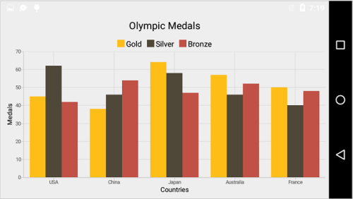
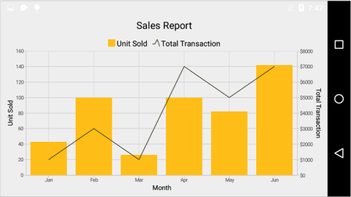
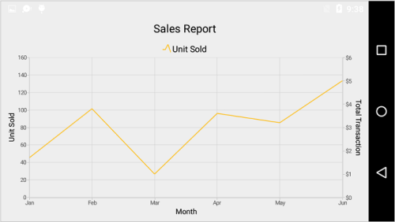
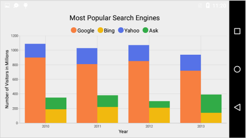
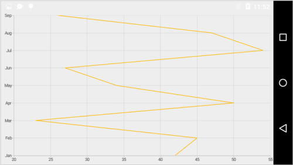

# Chart Series

## Multiple Series

You can add multiple series using [`Series`](https://help.syncfusion.com/cr/cref_files/xamarin-android/sfchart/Syncfusion.SfChart.Android~Com.Syncfusion.Charts.ChartSeries.html) property of [`SfChart`](http://help.syncfusion.com/cr/cref_files/xamarin-android/sfchart/Syncfusion.SfChart.Android~Com.Syncfusion.Charts.SfChart.html) class.

 
[C#]

SfChart chart = new SfChart();
...

ColumnSeries columnSeries1 = new ColumnSeries()
{
	ItemsSource = Data1,
    XBindingPath = "Country",
    YBindingPath = "Count"
};
chart.Series.Add(columnSeries1);

ColumnSeries columnSeries2 = new ColumnSeries()
{
	ItemsSource = Data2,
	XBindingPath = "Country",
    YBindingPath = "Count"
};
chart.Series.Add(columnSeries2);

ColumnSeries columnSeries3 = new ColumnSeries()
{
	ItemsSource = Data3,
	XBindingPath = "Country",
    YBindingPath = "Count"
};
chart.Series.Add(columnSeries3);



## Combination Series

[`SfChart`](http://help.syncfusion.com/cr/cref_files/xamarin-android/sfchart/Syncfusion.SfChart.Android~Com.Syncfusion.Charts.SfChart.html) allows you to render the combination of different types of series.

 
[C#]

SfChart chart = new SfChart();
...

ColumnSeries columnSeries = new ColumnSeries()
{
	ItemsSource = Data1,
	XBindingPath = "Month",
    YBindingPath = "Unit"
};
chart.Series.Add(columnSeries);

LineSeries lineSeries = new LineSeries()
{
	ItemsSource = Data2,
	XBindingPath = "Month",
    YBindingPath = "Unit"
};



**Limitation of Combination Chart**

* Bar, StackingBar, and StackingBar100 cannot be combined with the other Cartesian type series.
* Cartesian type series cannot be combined with accumulation series (pie, doughnut, funnel, and pyramid).

When the combination of Cartesian and accumulation series types are added to the series collection, the series which are similar to the first series will be rendered and other series will be ignored. Following code snippet illustrates this.

 

SfChart chart = new SfChart();
...

LineSeries lineSeries = new LineSeries()
{
	ItemsSource = Data1,
	XBindingPath = "Month",
    YBindingPath = "Unit"
};
chart.Series.Add(lineSeries);

PieSeries pieSeries = new PieSeries()
{
	ItemsSource = Data2,
	XBindingPath = "Month",
    YBindingPath = "Unit"
};
chart.Series.Add(pieSeries);



## Grouping Stacked Series

You can group and stack the similar stacked series types using [`GroupingLabel`](http://help.syncfusion.com/cr/cref_files/xamarin-android/sfchart/Syncfusion.SfChart.Android~Com.Syncfusion.Charts.StackingSeriesBase~GroupingLabel.html) property of stacked series. The stacked series which contains the same [`GroupingLabel`](http://help.syncfusion.com/cr/cref_files/xamarin-android/sfchart/Syncfusion.SfChart.Android~Com.Syncfusion.Charts.StackingSeriesBase~GroupingLabel.html) will be stacked in a single group.

 
[C#]

StackingColumnSeries stackingColumnSeries1 = new StackingColumnSeries();
stackingColumnSeries1.ItemsSource = Data1;
stackingColumnSeries1.XBindingPath = "Year";
stackingColumnSeries1.YBindingPath = "Visitors";
stackingColumnSeries1.GroupingLabel = "GroupOne";
stackingColumnSeries1.Label = "Google";
chart.Series.Add(stackingColumnSeries1);

StackingColumnSeries stackingColumnSeries2 = new StackingColumnSeries();
stackingColumnSeries2.ItemsSource = Data2;
stackingColumnSeries2.XBindingPath = "Year";
stackingColumnSeries2.YBindingPath = "Visitors";
stackingColumnSeries2.GroupingLabel = "GroupTwo";
stackingColumnSeries2.Label = "Bing";
chart.Series.Add(stackingColumnSeries2);

StackingColumnSeries stackingColumnSeries3 = new StackingColumnSeries();
stackingColumnSeries3.ItemsSource = Data3;
stackingColumnSeries3.XBindingPath = "Year";
stackingColumnSeries3.YBindingPath = "Visitors";
stackingColumnSeries3.GroupingLabel = "GroupOne";
stackingColumnSeries3.Label = "Yahoo";
chart.Series.Add(stackingColumnSeries3);

StackingColumnSeries stackingColumnSeries4 = new StackingColumnSeries();
stackingColumnSeries4.ItemsSource = Data4;
stackingColumnSeries4.XBindingPath = "Year";
stackingColumnSeries4.YBindingPath = "Visitors";
stackingColumnSeries4.GroupingLabel = "GroupTwo";
stackingColumnSeries4.Label = "Ask";
chart.Series.Add(stackingColumnSeries4);



##Vertical Chart

[`SfChart`](http://help.syncfusion.com/cr/cref_files/xamarin-android/sfchart/Syncfusion.SfChart.Android~Com.Syncfusion.Charts.SfChart.html) allows you to change the orientation of the rendered chart by setting [`Transposed`](http://help.syncfusion.com/cr/cref_files/xamarin-android/sfchart/Syncfusion.SfChart.Android~Com.Syncfusion.Charts.CartesianSeries~Transposed.html) property to true.


[C#]

SfChart chart = new SfChart();
...

LineSeries lineSeries = new LineSeries();

lineSeries.Transposed = true;

chart.Series.Add(lineSeries);



