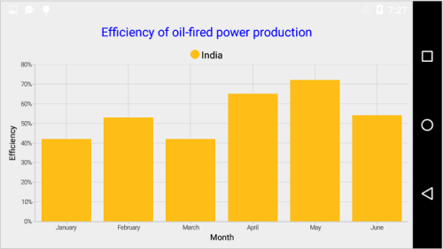

# Title

You can define and customize the Chart title using [`Title`](https://help.syncfusion.com/cr/cref_files/xamarin-android/Syncfusion.SfChart.Android~Com.Syncfusion.Charts.ChartBase~Title.html) property of [`SfChart`](http://help.syncfusion.com/cr/cref_files/xamarin-android/Syncfusion.SfChart.Android~Com.Syncfusion.Charts.SfChart.html). The [`Text`](http://help.syncfusion.com/cr/cref_files/xamarin-android/Syncfusion.SfChart.Android~Com.Syncfusion.Charts.ChartTitle~Text.html) property of [`ChartTitle`](https://help.syncfusion.com/cr/cref_files/xamarin-android/Syncfusion.SfChart.Android~Com.Syncfusion.Charts.ChartTitle.html) is used to set the text for the title. 

Following properties are used to customize its appearance.

* [`Text`](http://help.syncfusion.com/cr/cref_files/xamarin-android/Syncfusion.SfChart.Android~Com.Syncfusion.Charts.ChartTitle~Text.html) – used to set the chart title.
* [`TextColor`](http://help.syncfusion.com/cr/cref_files/xamarin-android/Syncfusion.SfChart.Android~Com.Syncfusion.Charts.ChartTitle~TextColors.html) – used to change the color of the title.
* [`TextSize`](http://help.syncfusion.com/cr/cref_files/xamarin-android/Syncfusion.SfChart.Android~Com.Syncfusion.Charts.ChartTitle~TextSize.html) – used to change the text size.
* [`Typeface`](http://help.syncfusion.com/cr/cref_files/xamarin-android/Syncfusion.SfChart.Android~Com.Syncfusion.Charts.ChartTitle~Typeface.html) – used to change the font family and font weight.
* [`Alpha`](http://help.syncfusion.com/cr/cref_files/xamarin-android/Syncfusion.SfChart.Android~Com.Syncfusion.Charts.ChartTitle~Alpha.html) - used to set the alpha value of title. It's range from 0.0 to 1.0
* [`SetBackgroundColor(Color)`]() – used to change the title background color.
* [`SetPadding(Left, Top, Right, Bottom)`]() - used to change the padding value for title.


[C#]

SfChart sfChart = new SfChart(this);

sfChart.Title.Text = "Efficiency of oil-fired power production";

sfChart.Title.SetTextColor( Color.Blue);



## Text Alignment

You can align the title text content to the Start, Center or End of the title using the [`TextAlignment`](http://help.syncfusion.com/cr/cref_files/xamarin-android/Syncfusion.SfChart.Android~Com.Syncfusion.Charts.ChartTitle~TextAlignment.html) property of the [`ChartTitle`](http://help.syncfusion.com/cr/cref_files/xamarin-android/Syncfusion.SfChart.Android~Com.Syncfusion.Charts.ChartTitle.html).


[C#]

SfChart sfChart = new SfChart(this);

sfChart.Title.Text = "Efficiency of oil-fired power production";

sfChart.Title.TextAlignment = TextAlignment.TextStart;

sfChart.Title.SetTextColor( Color.Blue);



