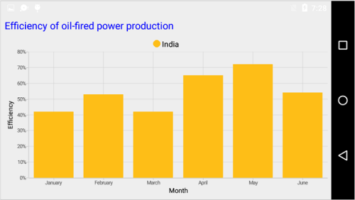

# Chart Title

You can define and customize the Chart title using `Title` property of `SfChart`. The `Text` property of `ChartTitle` is used to set the text for the title. 

Following properties are used to customize its appearance.

* `Text` – used to set the chart title.
* `TextColor` – used to change the color of the title.
* `BackgroundColor` – used to change the title background color.
* `TextSize` – used to change the text size.
* `Typeface` – used to change the font family and font weight.
* `Padding` - used to change the padding value for title.
* `Height` - used to change the height of the title.
* `Width` - used to change the width of the title.
* `Alpha` - used to set the alpha value of title. It's range from 0.0 to 1.0


[C#]

SfChart sfChart = new SfChart(this);

sfChart.Title.Text = "Efficiency of oil-fired power production";

sfChart.Title.SetTextColor( Color.Blue);



## Text Alignment

You can align the title text content to the Start, Center or End of the title using the `TextAlignment` property of the `ChartTitle`.


[C#]

SfChart sfChart = new SfChart(this);

sfChart.Title.Text = "Efficiency of oil-fired power production";

sfChart.Title.TextAlignment = TextAlignment.TextStart;

sfChart.Title.SetTextColor( Color.Blue);



