# Chart Types

## Line Chart

To render a line chart, create an instance of `LineSeries` and add to the series collection of `SfChart`. You can use the following properties to customize the appearance.

* `Color` – used to change the color of the line.
* `StrokeWidth` – used to change the stroke width of the line.


[C#] 

SfChart chart = new SfChart();
...

LineSeries lineSeries = new LineSeries()
{
	DataSource = Data
};
chart.Series.Add(lineSeries);



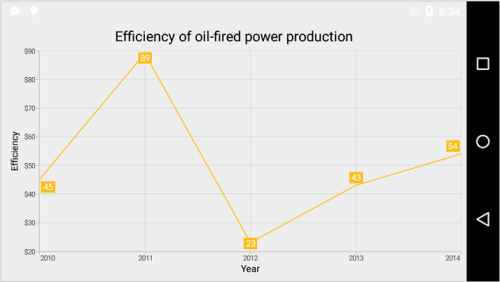

## Area Chart

To render an area chart, create an instance of `AreaSeries` and add to the series collection of `SfChart`. You can use the following properties to customize the appearance.

* `Color` – used to change the color of the series.
* `StrokeWidth` – used to change the stroke width of the series.
* `StrokeColor` – used to change the stroke color of the series.

 
[C#]

SfChart chart = new SfChart();
...

AreaSeries areaSeries = new AreaSeries()
{
	DataSource = Data
};
chart.Series.Add(areaSeries);



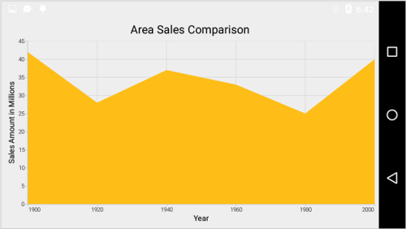

## Spline Area Chart

To render a spline area chart, create an instance of `SplineAreaSeries` and add to the series collection of `SfChart`. You can use the following properties to customize the spline area appearance.

* `Color` – used to change the color of the series.
* `StrokeWidth` – used to change the stroke width of the series.
* `StrokeColor` – used to change the stroke color of the series.

 
[C#]

SfChart chart = new SfChart();
...

SplineAreaSeries splineAreaSeries = new SplineAreaSeries()
{
	DataSource = Data
};
chart.Series.Add(splineAreaSeries);



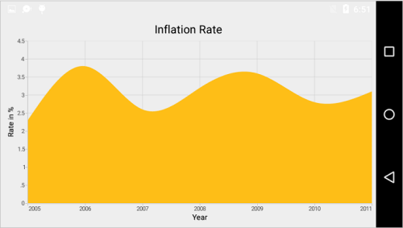

## Stacked Area Chart

To render a stacked area chart, create an instance of `StackingAreaSeries` and add to the series collection of `SfChart`. You can use the following properties to customize the stacked area appearance.

* `Color` – used to change the color of the series.
* `StrokeWidth` – used to change the stroke width of the series.
* `StrokeColor` – used to change the stroke color of the series.

 
[C#]

SfChart chart = new SfChart();
...

StackingAreaSeries stackingAreaSeries1 = new StackingAreaSeries()
{
	DataSource = Data1
};
chart.Series.Add(stackingAreaSeries1);

StackingAreaSeries stackingAreaSeries2 = new StackingAreaSeries()
{
	DataSource = Data2
};
chart.Series.Add(stackingAreaSeries2);

StackingAreaSeries stackingAreaSeries3 = new StackingAreaSeries()
{
	DataSource = Data3
};
chart.Series.Add(stackingAreaSeries3);



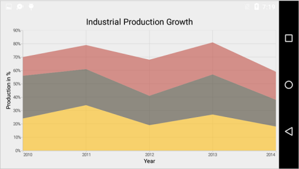

## 100% Stacked Area Chart

To render a 100% stacked area chart, create an instance of `StackingArea100Series` and add to the series collection of `SfChart`. You can use the following properties to customize the 100% stacked area appearance.

* `Color` – used to change the color of the series.
* `StrokeWidth` – used to change the stroke width of the series.
* `StrokeColor` – used to change the stroke color of the series.

 
[C#]

SfChart chart = new SfChart();
...

StackingArea100Series stackingArea100Series1 = new StackingArea100Series()
{
	DataSource = Data1
};
chart.Series.Add(stackingArea100Series1);

StackingArea100Series stackingArea100Series2 = new StackingArea100Series()
{
	DataSource = Data2
};
chart.Series.Add(stackingArea100Series2);

StackingArea100Series stackingArea100Series3 = new StackingArea100Series()
{
	DataSource = Data3
};
chart.Series.Add(stackingArea100Series3);



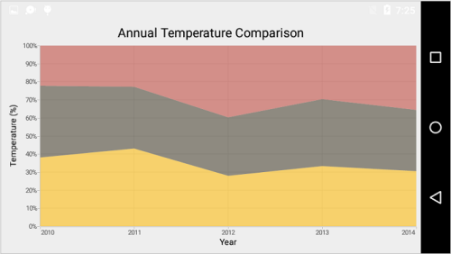

## Column Chart

To render a column chart, create an instance of `ColumnSeries` and add to the series collection of `SfChart`. You can use the following properties to configure the column segment.

* `Color` – used to change the color of the series.
* `StrokeWidth` – used to change the stroke width of the series.
* `StrokeColor` – used to change the stroke color of the series. 
* `Spacing` - used to change the width of the column.
* `DataMarkerPosition` - used to change the position of data marker. 

 
[C#]

SfChart chart = new SfChart();
...

ColumnSeries columnSeries = new ColumnSeries()
{
	DataSource = Data
};
chart.Series.Add(columnSeries);



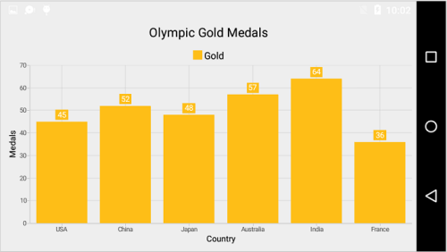

## Range Column Chart

To render a range column chart, create an instance of `RangeColumnSeries` and add to the series collection of `SfChart`. 

Since the `RangeColumnSeries` requires two Y values for a point, your data should contain high and low values. High and low value specifies the maximum and minimum range of the point. 

You can use [ChartDataPoint's](http://help.syncfusion.com/cr/cref_files/Android/sfchart/com/syncfusion/charts/ChartDataPoint.html#ChartDataPoint%28Tx,%20Ty,%20Ty%29) three parameter constructor to pass x value, high and low values to  `RangeColumnSeries`,


[C#] 

SfChart chart = new SfChart();
...
	
RangeColumnSeries rangeColumnSeries = new RangeColumnSeries()
{
	DataSource = data;
}
	
chart.Series.Add(rangeColumnSeries);



Following properties are used to customize the range column segment appearance,

* `Color` – used to change the color of the series.
* `StrokeWidth` – used to change the stroke width of the series.
* `StrokeColor` – used to change the stroke color of the series.

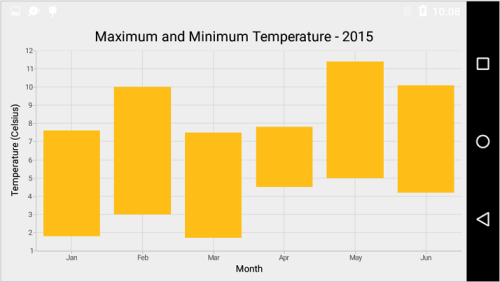

## Stacked Column Chart

To render a stacked column chart, create an instance of `StackingColumnSeries` and add to the series collection of `SfChart`. You can use the following properties to configure the stacked column segment.

* `Color` – used to change the color of the series.
* `StrokeWidth` – used to change the stroke width of the series.
* `StrokeColor` – used to change the stroke color of the series.
* `Spacing` - used to change the width of the column.
* `DataMarkerPosition` - used to change the position of data marker.

 
[C#]

SfChart chart = new SfChart();
...

StackingColumnSeries stackingColumnSeries1 = new StackingColumnSeries()
{
	DataSource = Data1
};
chart.Series.Add(stackingColumnSeries1);

StackingColumnSeries stackingColumnSeries2 = new StackingColumnSeries()
{
	DataSource = Data2
};
chart.Series.Add(stackingColumnSeries2);

StackingColumnSeries stackingColumnSeries3 = new StackingColumnSeries()
{
	DataSource = Data3
};
chart.Series.Add(stackingColumnSeries3);



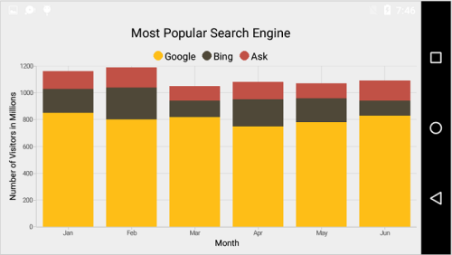

## 100% Stacked Column Chart

To render a 100% stacked column chart, create an instance of `StackingColumn100Series` and add to the series collection of `SfChart`. You can use the following properties to configure the 100% stacked column segment.

* `Color` – used to change the color of the series.
* `StrokeWidth` – used to change the stroke width of the series.
* `StrokeColor` – used to change the stroke color of the series.
* `Spacing` - used to change the width of the column.
* `DataMarkerPosition` - used to change the position of data marker.

 
[C#]

SfChart chart = new SfChart();
...

StackingColumn100Series stackingColumn100Series1 = new StackingColumn100Series()
{
	DataSource = Data1
};
chart.Series.Add(stackingColumn100Series1);

StackingColumn100Series stackingColumn100Series2 = new StackingColumn100Series()
{
	DataSource = Data2
};
chart.Series.Add(stackingColumnSeries2);

StackingColumn100Series stackingColumn100Series3 = new StackingColumn100Series()
{
	DataSource = Data3
};
chart.Series.Add(stackingColumn100Series3);



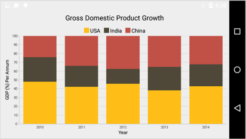

## Bar Chart

To render a bar chart, create an instance of `BarSeries` and add to the series collection of `SfChart`. You can use the following properties to configure the bar segment.

* `Color` – used to change the color of the series.
* `StrokeWidth` – used to change the stroke width of the series.
* `StrokeColor` – used to change the stroke color of the series.
* `Spacing` - used to change the width of the column.
* `DataMarkerPosition` - used to change the position of data marker.

 
[C#]

SfChart chart = new SfChart();
...

BarSeries barSeries = new BarSeries()
{
	DataSource = Data
};
chart.Series.Add(barSeries);



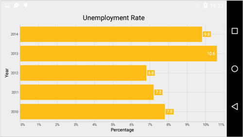

## Stacked Bar Chart

To render a stacked bar chart, create an instance of `StackingBarSeries` and add to the series collection of `SfChart`. You can use the following properties to configure the stacked bar segment.

* `Color` – used to change the color of the series.
* `StrokeWidth` – used to change the stroke width of the series.
* `StrokeColor` – used to change the stroke color of the series.
* `Spacing` - used to change the width of the column.
* `DataMarkerPosition` - used to change the position of data marker.

 
[C#]

SfChart chart = new SfChart();
...

StackingBarSeries stackingBarSeries1 = new StackingBarSeries()
{
	DataSource = Data1
};
chart.Series.Add(stackingBarSeries1);

StackingBarSeries stackingBarSeries2 = new StackingBarSeries()
{
	DataSource = Data2
};
chart.Series.Add(stackingBarSeries2);

StackingBarSeries stackingBarSeries3 = new StackingBarSeries()
{
	DataSource = Data3
};
chart.Series.Add(stackingBarSeries3);



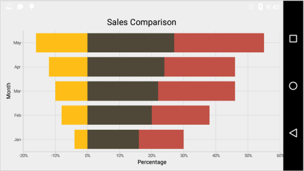

## 100% Stacked Bar Chart

To render a 100% stacked bar chart, create an instance of `StackingBar100Series` and add to the series collection of `SfChart`. You can use the following properties to configure the 100% stacked bar segment.

* `Color` – used to change the color of the series.
* `StrokeWidth` – used to change the stroke width of the series.
* `StrokeColor` – used to change the stroke color of the series.
* `Spacing` - used to change the width of the column.
* `DataMarkerPosition` - used to change the position of data marker.

 
[C#]

SfChart chart = new SfChart();
...

StackingBar100Series stackingBar100Series1 = new StackingBar100Series()
{
	DataSource = Data1
};
chart.Series.Add(stackingBar100Series1);

StackingBar100Series stackingBar100Series2 = new StackingBar100Series()
{
	DataSource = Data2
};
chart.Series.Add(stackingBar100Series2);

StackingBar100Series stackingBar100Series3 = new StackingBar100Series()
{
	DataSource = Data3
};
chart.Series.Add(stackingBar100Series3);



## Spline Chart

To render a spline chart, create an instance of `SplineSeries` and add to the series collection of `SfChart`. You can use the following properties to customize the spline segment appearance.

* `Color` – used to change the color of the series.
* `StrokeWidth` – used to change the stroke width of the series.

 
[C#]

SfChart chart = new SfChart();
...

SplineSeries splineSeries = new SplineSeries()
{
	DataSource = Data
};
chart.Series.Add(splineSeries);



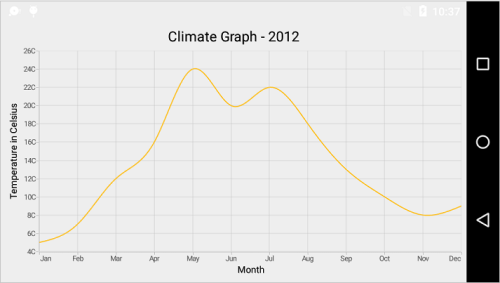

## Fast Line Chart

`FastLineSeries` is a line chart, but it loads faster than `LineSeries`. You can use this when there are large number of points to be loaded in chart. To render a fast line chart, create an instance of `FastLineSeries` and add to the series collection of `SfChart`. You can use the following properties to customize the fast line segment appearance.

* `Color` – used to change the color of the series.
* `StrokeWidth` – used to change the stroke width of the series.

 
[C#]

SfChart chart = new SfChart();
...

FastLineSeries fastLineSeries = new FastLineSeries()
{
	DataSource = Data
};
chart.Series.Add(fastLineSeries);



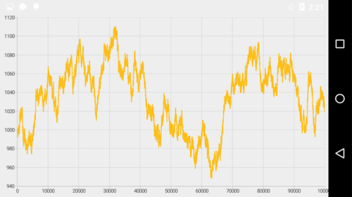

### Dashed Lines

`PathEffect` property of the `FastLineSeries` is used to render fast line series with dashes.


[C#]

FastLineSeries fastLineSeries = new FastLineSeries() 
{ 
	DataSource = Data 
};
fastLineSeries.PathEffect = new DashPathEffect(new float[]{6,6}, 4);



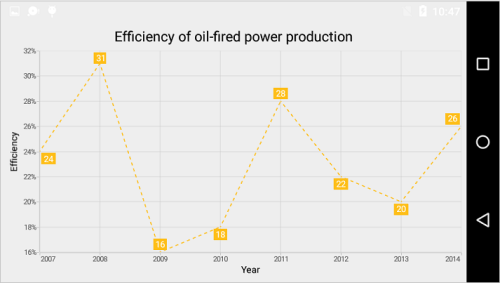

## Step Line Chart

To render a step line chart, create an instance of `StepLineSeries` and add to the `Series` collection property of SfChart. You can use the following properties to customize the stepline segment appearance.

* `Color` – used to change the color of the series.
* `StrokeWidth` – used to change the stroke width of the series.

 
[C#]

SfChart chart = new SfChart();
...

StepLineSeries stepLineSeries = new StepLineSeries()
{
	DataSource = Data
};
chart.Series.Add(stepLineSeries);



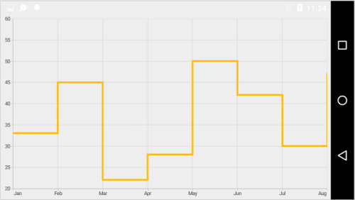

## Bubble Chart

To render a bubble chart, create an instance of `BubbleSeries` and add to the series collection of `SfChart`. 

Bubble chart requires 3 fields (X, Y and Size) to plot a point. Here `‘Size’` is used to specify the size of each bubble segment. 

You can use [ChartDataPoint's](http://help.syncfusion.com/cr/cref_files/Android/sfchart/com/syncfusion/charts/ChartDataPoint.html#ChartDataPoint%28Tx,%20Ty,%20Ty%29) three parameter constructor to pass x, y and size values to  `BubbleSeries`,


[C#]

SfChart chart = new SfChart();
...
	   
BubbleSeries bubbleSeries = new BubbleSeries() 
{ 
	DataSource = data 
};
chart.Series.Add(bubbleSeries);



Following properties are used to customize the bubble segment appearance.

* `Color` – used to change the color of the series.
* `StrokeWidth` – used to change the stroke width of the series.
* `StrokeColor` – used to change the stroke color of the series.
* `MinimumRadius` – used to change the minimum size of the series.
* `MaximumRadius` – used to change the maximum size of the series.

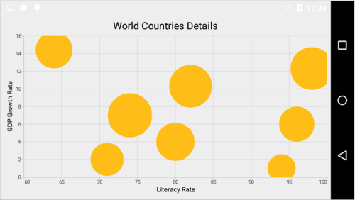

## Scatter Chart	

To render a scatter chart, create an instance of `ScatterSeries` and add to the series collection of `SfChart`. You can use the following properties to customize the scatter segment appearance.

* `Color` – used to change the color of the series.
* `StrokeWidth` – used to change the stroke width of the series.
* `StrokeColor` – used to change the stroke color of the series.
* `ScatterWidth` – used to change the width of the series.
* `ScatterHeight` – used to change the height of the series.

 
[C#]

SfChart chart = new SfChart();
...

ScatterSeries scatterSeries = new ScatterSeries()
{
    ScatterHeight = 15,
    ScatterWidth = 15,
    DataSource = Data
};
chart.Series.Add(scatterSeries);



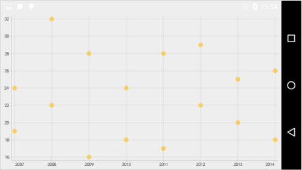

## OHLC Chart

To render an OHLC chart, create an instance of `HiLoOpenCloseSeries` and add to the series collection of `SfChart`.

OHLC chart requires five values (X, Open, High, Low and Close) to plot a point. 

You can use [ChartDataPoint's](http://help.syncfusion.com/cr/cref_files/Android/sfchart/com/syncfusion/charts/ChartDataPoint.html#ChartDataPoint%28Tx,%20Ty,%20Ty,%20Ty,%20Ty%29) five parameter constructor to pass x, open, high, low and close values to  `HiLoOpenCloseSeries`,


[C#]

SfChart chart = new SfChart();
...
	   
HiLoOpenCloseSeries hiLoOpenCloseSeries = new HiLoOpenCloseSeries() 
{ 
	DataSource = data 
};
chart.Series.Add(hiLoOpenCloseSeries);



You can use the following properties to customize the HiLoOpenCloseSeries segment appearance.

* `Color` – used to change the color of the series.
* `StrokeWidth` – used to change the stroke width of the series.

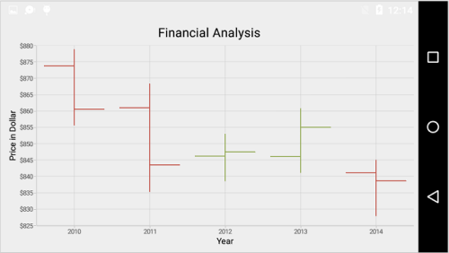

### Bull and Bear Color	

In OHLC chart, `BullFillColor` property is used to specify a fill color for the segments that indicates an increase in stock price in the measured time interval and `BearFillColor` property is used to specify a fill color for the segments that indicates a decrease in stock price in the measured time interval.


[C#]

HiLoOpenCloseSeries hiLoOpenCloseSeries = new HiLoOpenCloseSeries()
{
    DataSource = Data,
    BearFillColor = Color.Blue,
    BullFillColor = Color.Purple
};



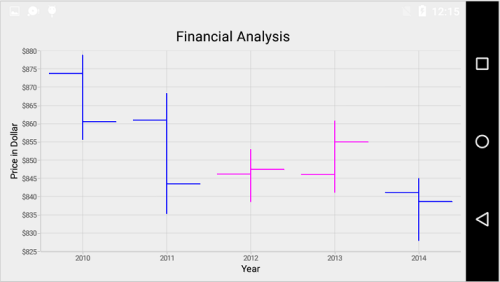

## Candle Chart

To render a candle chart, create an instance of `CandleSeries` and add to the series collection of `SfChart`.

Candle chart requires five values (X, Open, High, Low and Close) to plot a point. 

You can use [ChartDataPoint's](http://help.syncfusion.com/cr/cref_files/Android/sfchart/com/syncfusion/charts/ChartDataPoint.html#ChartDataPoint%28Tx,%20Ty,%20Ty,%20Ty,%20Ty%29) five parameter constructor to pass x, open, high, low and close values to  `CandleSeries`,


[C#]

SfChart chart = new SfChart();
...
	   
CandleSeries candleSeries = new CandleSeries() 
{ 
	DataSource = data 
};
chart.Series.Add(candleSeries);



You can use the following properties to customize the candle segment appearance.

* `Color` – used to change the color of the series.
* `StrokeWidth` – used to change the stroke width of the series.
* `StrokeColor` – used to change the stroke color of the series.

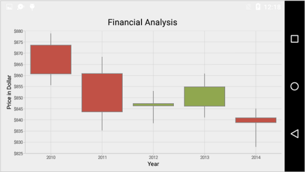

### Bull and Bear Color

In Candle chart, `BullFillColor` property is used to specify a fill color for the segments that indicates an increase in stock price in the measured time interval and `setBearFillColor(int)` property is used to specify a fill color for the segments that indicates a decrease in stock price in the measured time interval.


[C#]

CandleSeries candleSeries = new CandleSeries()
{
    DataSource = Data,
    BearFillColor = Color.Blue,
    BullFillColor = Color.Purple
};



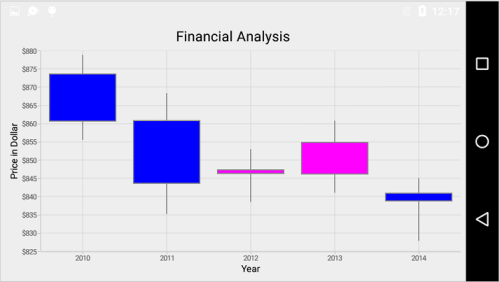

## Radar Chart

To render a radar chart, create an instance of `RadarSeries` and add to the Series collection of `SfChart`. 

### Draw type

`DrawType` property is used to specify the radar series rendering type. Following are the two options you can set to this property,

* Line – data points are visualized using line series.
* Area – data points are visualized using area series.


[C#]

RadarSeries radarSeries = new RadarSeries();

radarSeries.DataSource = dataPoints;

radarSeries.DrawType = PolarChartDrawType.Line;



### Customize the appearance

You can use the following properties to customize the appearance.

* `Color` – used to change the color of the series.
* `StrokeWidth` – used to change the stroke width of the series.
* `StrokeColor` – used to change the stroke color of the series, when draw type is set to Area.
* `PathEffect` – used to render line with dashes, when draw type is set to Line.


[C#]

RadarSeries radarSeries = new RadarSeries();

radarSeries.DataSource = dataPoints;

radarSeries.Color = Color.Aqua;

radarSeries.StrokeWidth = 3;

radarSeries.StrokeColor = Color.Blue;



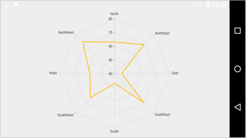

### Closed Series

`Closed` property is used to determine, whether to connect the first and last data point of the series. By default, value is `true`.


[C#]

RadarSeries radarSeries = new RadarSeries();

radarSeries.DataSource = dataPoints;

radarSeries.Closed = false;



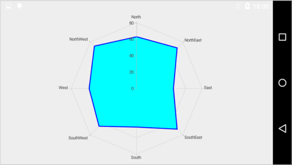

## Polar Chart

To render a polar chart, create an instance of `PolarSeries` and add to the Series collection of `SfChart`. 

### Draw type 

`DrawType` property is used to specify the polar series rendering type. Following are the two options you can set to this property,

* Line – data points are visualized using line series.
* Area – data points are visualized using area series.


[C#]

PolarSeries polarSeries = new PolarSeries();

polarSeries.DataSource = dataPoints;

polarSeries.DrawType = PolarChartDrawType.Line;



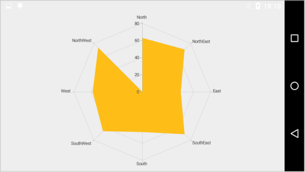

### Customize the appearance

You can use the following properties to customize the appearance.

* `Color` – used to change the color of the series.
* `StrokeWidth` – used to change the stroke width of the series.
* `StrokeColor` – used to change the stroke color of the series, when draw type is set to Area.
* `PathEffect` – used to render line with dashes, when draw type is set to Line.


[C#]

PolarSeries polarSeries = new PolarSeries();

polarSeries.DataSource = dataPoints;

polarSeries.Color = Color.Aqua;

polarSeries.StrokeWidth = 3;

polarSeries.StrokeColor = Color.Blue;



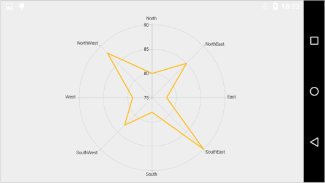

### Closed Series

`Closed` property is used to determine, whether to connect the first and last data point of the series. By default, value is true.


[C#]

PolarSeries polarSeries = new PolarSeries();

polarSeries.DataSource = dataPoints;

polarSeries.Closed = false;



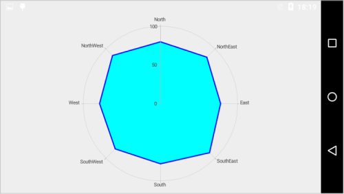

## Pie Chart

To render a pie chart, create an instance of `PieSeries` and add to the series collection of `SfChart`. You can use the following properties to customize the pie segment appearance.

* `Color` – used to change the color of the series.
* `StrokeWidth` – used to change the stroke width of the series.
* `StrokeColor` – used to change the stroke color of the series.
* `DataMarkerPosition` - used to change the position of data marker.

 
[C#]

SfChart chart = new SfChart();
...

PieSeries pieSeries = new PieSeries()
{
    DataSource = Data
};
chart.Series.Add(pieSeries);



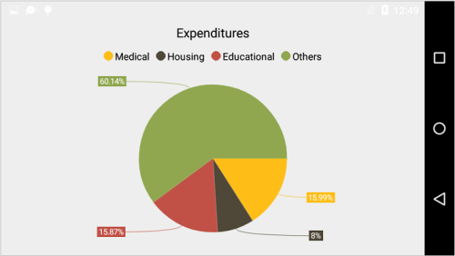

### Changing the pie size

You can use `CircularCoefficient` property to change the diameter of the pie chart with respect to the plot area. It ranges from 0 to 1 and the default value is `0.8`.

 
[C#]

PieSeries pieSeries = new PieSeries()
{
    DataSource = Data,
	CircularCoefficient = 0.5f
};



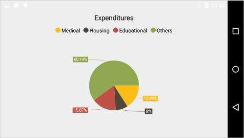

### Exploding a pie segment

You can explode a pie segment using `ExplodeIndex` property and specify the explode radius using `ExplodeRadius` property of `PieSeries`.

 
[C#]

PieSeries pieSeries = new PieSeries()
{
    DataSource = Data,
	ExplodeIndex = 1
};



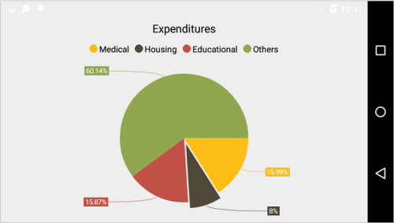

### Exploding all the segments

Using `ExplodeAll` property of `PieSeries`, you can explode all the pie segments.

 
[C#]

PieSeries pieSeries = new PieSeries()
{
    DataSource = Data,
	ExplodeAll = true
};



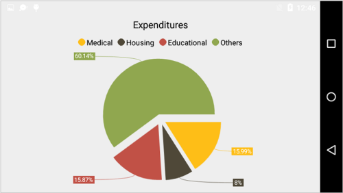

### Sector of Pie

SfChart allows you to render all the data points/segments in semi-pie, quarter-pie or in any sector using `StartAngle` and `EndAngle` properties.

 
[C#]

PieSeries pieSeries = new PieSeries()
{
    DataSource = Data,
	StartAngle = 180,
	EndAngle = 360
};



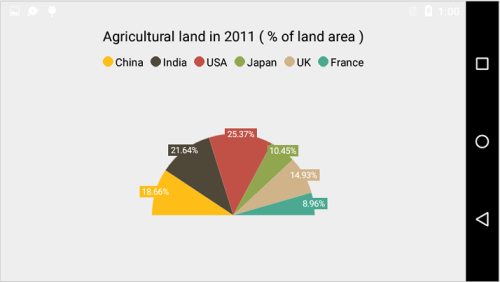

## Doughnut Chart

To render a doughnut chart, create an instance of `DoughnutSeries` and add to the series collection of `SfChart`. You can use the following properties to customize the doughnut segment appearance.

* `Color` – used to change the color of the series.
* `StrokeWidth` – used to change the stroke width of the series.
* `StrokeColor` – used to change the stroke color of the series.
* `DataMarkerPosition` - used to change the position of data marker.

 
[C#]

SfChart chart = new SfChart();
...

DoughnutSeries doughnutSeries = new DoughnutSeries()
{
    DataSource = Data
};
chart.Series.Add(doughnutSeries);



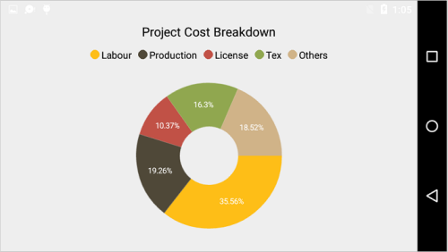

### Changing Doughnut inner radius

You can change the doughnut chart inner radius using `DoughnutCoefficient` with respect to the plot area. It ranges from 0 to 1 and the default value is `0.4`.

 
[C#]

DoughnutSeries doughnutSeries = new DoughnutSeries()
{
    DataSource = Data,
	DoughnutCoefficient = 0.6f
};



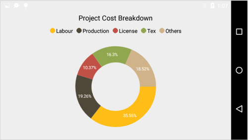

### Changing the doughnut size

You can use the `CircularCoefficient` property to change the diameter of the doughnut chart with respect to the plot area. It ranges from 0 to 1 and the default value is 0.8.

 
[C#]

DoughnutSeries doughnutSeries = new DoughnutSeries()
{
    DataSource = Data,
	CircularCoefficient = 0.5f
};



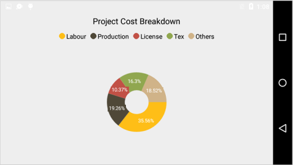

### Exploding a doughnut segment

Exploding a specific doughnut segment, you have to set the index to be exploded using `ExplodeIndex` property of the series.

 
[C#]

DoughnutSeries doughnutSeries = new DoughnutSeries()
{
    DataSource = Data,
	ExplodeIndex = 1
};



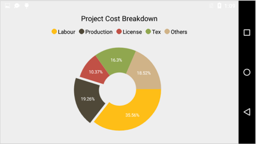

### Exploding all the segments

To explode all the segments, you have to enable `ExplodeAll` property of the series.

 
[C#]

DoughnutSeries doughnutSeries = new DoughnutSeries()
{
    DataSource = Data,
	ExplodeAll = true
};



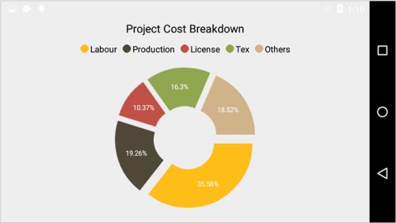

### Sector of Doughnut

SfChart allows you to render all the data points/segments in semi-doughnut, quarter- doughnut or in any sector using `StartAngle` and `EndAngle` properties.

 
[C#]

DoughnutSeries doughnutSeries = new DoughnutSeries()
{
    DataSource = Data,
	StartAngle = 180,
	EndAngle = 360
};



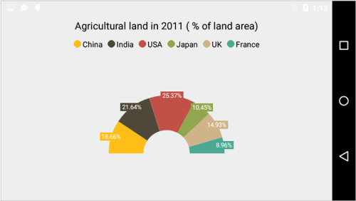

## Pyramid Chart

To render a pyramid chart, create an instance of `PyramidSeries` and add to the series collection of `SfChart`. You can use the following properties to customize the pyramid segment appearance.

* `Color` – used to change the color of the series.
* `StrokeWidth` – used to change the stroke width of the series.
* `StrokeColor` – used to change the stroke color of the series.

 
[C#]

SfChart chart = new SfChart();
...

PyramidSeries pyramidSeries = new PyramidSeries()
{
    DataSource = Data
};
chart.Series.Add(pyramidSeries);



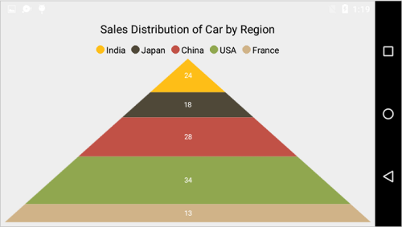

### Pyramid Mode

You can render the pyramid series as linear or surface mode. In linear mode, height of the pyramid segment is based on the Y value and in surface mode, area of the pyramid segment is based on the Y values. The default value of `ChartPyramidMode` is `Linear`.

 
[C#]

PyramidSeries pyramidSeries = new PyramidSeries()
{
    DataSource = Data,
	PyramidMode = ChartPyramidMode.Surface
};



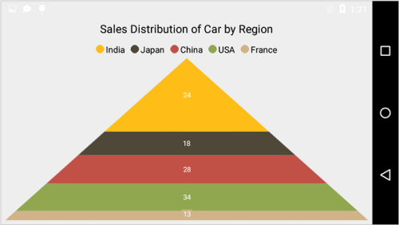

### Gap between the segments

You can control the gap between the two segments using `GapRatio` property. Its ranges from 0 to 1.

 
[C#]

PyramidSeries pyramidSeries = new PyramidSeries()
{
    DataSource = Data,
	GapRatio = 0.1f
};



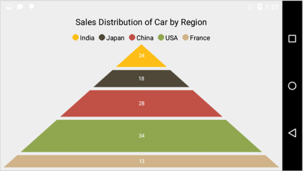

### Exploding a pyramid segment

You can explode a pyramid segment using `ExplodeIndex` property, and `ExplodeOffset` property is used to specify the exploded segment’s distance.

 
[C#]

PyramidSeries pyramidSeries = new PyramidSeries()
{
    DataSource = Data,
	ExplodeIndex = 2
};



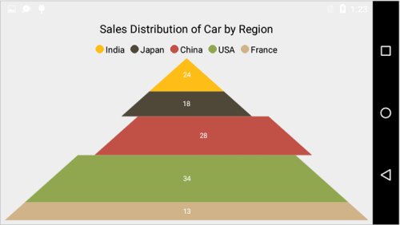

## Funnel Chart

To render a funnel chart, create an instance of `FunnelSeries` and add to the series collection of `SfChart`. You can use the following properties to customize the funnel segment appearance.

* `Color` – used to change the color of the series.
* `StrokeWidth` – used to change the stroke width of the series.
* `StrokeColor` – used to change the stroke color of the series.

 
[C#]

SfChart chart = new SfChart();
...

FunnelSeries funnelSeries = new FunnelSeries()
{
    DataSource = Data
};
chart.Series.Add(funnelSeries);



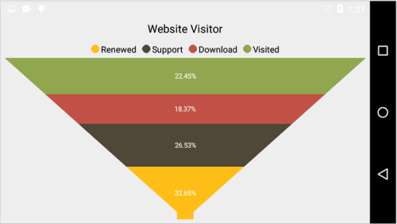

### Gap between the segments

You can control the gap between the two segments using `setGapRatio(float)` property. Its ranges from 0 to 1.

 
[C#]

FunnelSeries funnelSeries = new FunnelSeries()
{
    DataSource = Data,
	GapRatio = 0.1f,
};



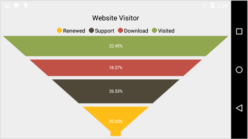

### Exploding a funnel segment

You can explode a pyramid segment using `ExplodeIndex` property and `ExplodeOffset` property is used to specify the exploded segment’s distance.

 
[C#]

FunnelSeries funnelSeries = new FunnelSeries()
{
    DataSource = Data,
	ExplodeIndex = 1
};



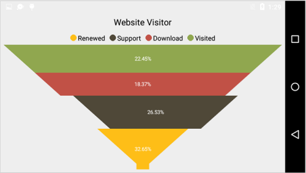

### Changing the minimum width of the funnel

You can change the minimum width of the funnel neck using `MinWidth` property of `FunnelSeries`. Default value is `40`.

 

FunnelSeries funnelSeries = new FunnelSeries()
{
    DataSource = Data,
	MinWidth = 160
};



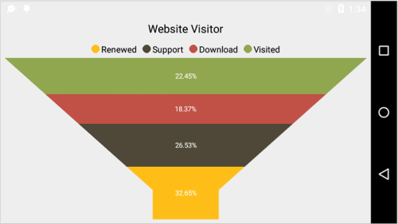