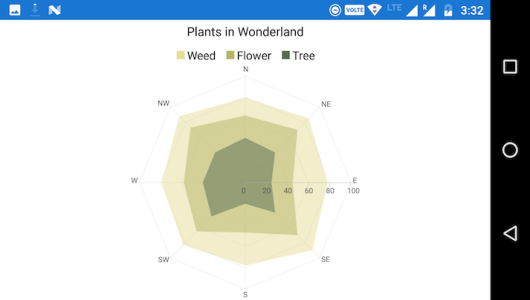
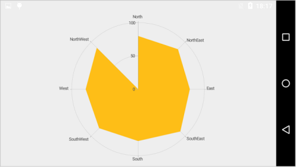
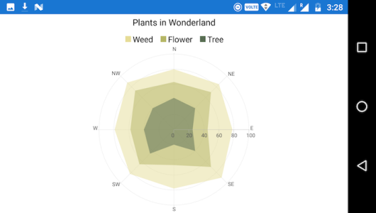

# Chart Types

## Line Chart

To render a line chart, create an instance of [`LineSeries`](https://help.syncfusion.com/cr/cref_files/xamarin-android/Syncfusion.SfChart.Android~Com.Syncfusion.Charts.LineSeries.html) and add to the series collection of [`SfChart`](https://help.syncfusion.com/cr/cref_files/xamarin-android/Syncfusion.SfChart.Android~Com.Syncfusion.Charts.SfChart.html). You can use the following properties to customize the appearance.

* [`Color`](https://help.syncfusion.com/cr/cref_files/xamarin-android/Syncfusion.SfChart.Android~Com.Syncfusion.Charts.ChartSeries~Color.html) – used to change the color of the line.
* [`StrokeWidth`](https://help.syncfusion.com/cr/cref_files/xamarin-android/Syncfusion.SfChart.Android~Com.Syncfusion.Charts.ChartSeries~StrokeWidth.html) – used to change the stroke width of the line.


[C#] 

SfChart chart = new SfChart();
...

LineSeries lineSeries = new LineSeries()
{
	ItemsSource = Data,
	XBindingPath = "XValue",
    YBindingPath = "YValue"
};
chart.Series.Add(lineSeries);



## Area Chart

To render an area chart, create an instance of `AreaSeries` and add to the series collection of `SfChart`. You can use the following properties to customize the appearance.

* [`Color`](https://help.syncfusion.com/cr/cref_files/xamarin-android/Syncfusion.SfChart.Android~Com.Syncfusion.Charts.ChartSeries~Color.html) – used to change the color of the series.
* [`StrokeWidth`](https://help.syncfusion.com/cr/cref_files/xamarin-android/Syncfusion.SfChart.Android~Com.Syncfusion.Charts.ChartSeries~StrokeWidth.html) – used to change the stroke width of the series.
* [`StrokeColor`](https://help.syncfusion.com/cr/cref_files/xamarin-android/Syncfusion.SfChart.Android~Com.Syncfusion.Charts.AreaSeries~StrokeColor.html) – used to change the stroke color of the series.

 
[C#]

SfChart chart = new SfChart();
...

AreaSeries areaSeries = new AreaSeries()
{
	ItemsSource = Data,
	XBindingPath = "XValue",
    YBindingPath = "YValue"
};
chart.Series.Add(areaSeries);



## Spline Area Chart

To render a spline area chart, create an instance of [`SplineAreaSeries`](https://help.syncfusion.com/cr/cref_files/xamarin-android/Syncfusion.SfChart.Android~Com.Syncfusion.Charts.SplineAreaSeries.html) and add to the series collection of [`SfChart`](https://help.syncfusion.com/cr/cref_files/xamarin-android/Syncfusion.SfChart.Android~Com.Syncfusion.Charts.SfChart.html). You can use the following properties to customize the spline area appearance.

* [`Color`](https://help.syncfusion.com/cr/cref_files/xamarin-android/Syncfusion.SfChart.Android~Com.Syncfusion.Charts.ChartSeries~Color.html) – used to change the color of the series.
* [`StrokeWidth`](https://help.syncfusion.com/cr/cref_files/xamarin-android/Syncfusion.SfChart.Android~Com.Syncfusion.Charts.ChartSeries~StrokeWidth.html) – used to change the stroke width of the series.
* [`StrokeColor`](https://help.syncfusion.com/cr/cref_files/xamarin-android/Syncfusion.SfChart.Android~Com.Syncfusion.Charts.AreaSeries~StrokeColor.html) – used to change the stroke color of the series.

 
[C#]

SfChart chart = new SfChart();
...

SplineAreaSeries splineAreaSeries = new SplineAreaSeries()
{
	ItemsSource = Data,
	XBindingPath = "XValue",
    YBindingPath = "YValue"
};
chart.Series.Add(splineAreaSeries);



## Step Area Chart

To render a step area chart, create an instance of [`StepAreaSeries`](https://help.syncfusion.com/cr/cref_files/xamarin-android/Syncfusion.SfChart.Android~Com.Syncfusion.Charts.StepAreaSeries.html) and add to the Series collection property of [`SfChart`](https://help.syncfusion.com/cr/cref_files/xamarin-android/Syncfusion.SfChart.Android~Com.Syncfusion.Charts.SfChart.html). You can use the following properties to customize the step area appearance.

* [`Color`](https://help.syncfusion.com/cr/cref_files/xamarin-android/Syncfusion.SfChart.Android~Com.Syncfusion.Charts.ChartSeries~Color.html) – used to change the color of the series.
* [`StrokeWidth`](https://help.syncfusion.com/cr/cref_files/xamarin-android/Syncfusion.SfChart.Android~Com.Syncfusion.Charts.ChartSeries~StrokeWidth.html) – used to change the stroke width of the series.
* [`StrokeColor`](https://help.syncfusion.com/cr/cref_files/xamarin-android/Syncfusion.SfChart.Android~Com.Syncfusion.Charts.AreaSeries~StrokeColor.html) – used to change the stroke color of the series.

 
[C#]

SfChart chart = new SfChart();
...

StepAreaSeries stepAreaSeries = new StepAreaSeries();
{
	ItemsSource = Data,
	XBindingPath = "XValue",
    YBindingPath = "YValue"
};
chart.Series.Add(stepAreaSeries);



## Range Area Chart

To render a range area chart, create an instance of [`RangeAreaSeries`](https://help.syncfusion.com/cr/cref_files/xamarin-android/Syncfusion.SfChart.Android~Com.Syncfusion.Charts.RangeAreaSeries.html) and add to the Series collection property of [`SfChart`](https://help.syncfusion.com/cr/cref_files/xamarin-android/Syncfusion.SfChart.Android~Com.Syncfusion.Charts.SfChart.html).

Since the [`RangeAreaSeries`](https://help.syncfusion.com/cr/cref_files/xamarin-android/Syncfusion.SfChart.Android~Com.Syncfusion.Charts.RangeAreaSeries.html)  requires two Y values for a point, your data should contain [`HighValues`](https://help.syncfusion.com/cr/cref_files/xamarin-android/Syncfusion.SfChart.Android~Com.Syncfusion.Charts.RangeAreaSegment~HighValues.html) and [`LowValues`](https://help.syncfusion.com/cr/cref_files/xamarin-android/Syncfusion.SfChart.Android~Com.Syncfusion.Charts.RangeAreaSegment~LowValues.html). [`High`](https://help.syncfusion.com/cr/cref_files/xamarin-android/Syncfusion.SfChart.Android~Com.Syncfusion.Charts.RangeSeriesBase~High.html) and [`low`](https://help.syncfusion.com/cr/cref_files/xamarin-android/Syncfusion.SfChart.Android~Com.Syncfusion.Charts.RangeSeriesBase~Low.html) value specifies the maximum and minimum range of the point.


[C#] 

SfChart chart = new SfChart();
...
	
RangeAreaSeries rangeAreaSeries = new RangeAreaSeries();
{
	ItemsSource = Data,
	XBindingPath = "XValue",
    High = "High",
	Low = "Low"
};
chart.Series.Add(rangeAreaSeries);



Following properties are used to customize the range area  segment appearance,

* [`Color`](https://help.syncfusion.com/cr/cref_files/xamarin-android/Syncfusion.SfChart.Android~Com.Syncfusion.Charts.ChartSeries~Color.html) – used to change the color of the series.
* [`StrokeWidth`](https://help.syncfusion.com/cr/cref_files/xamarin-android/Syncfusion.SfChart.Android~Com.Syncfusion.Charts.ChartSeries~StrokeWidth.html) – used to change the stroke width of the series.
* [`StrokeColor`](https://help.syncfusion.com/cr/cref_files/xamarin-android/Syncfusion.SfChart.Android~Com.Syncfusion.Charts.RangeAreaSeries~StrokeColor.html) – used to change the stroke color of the series.

## Stacked Area Chart

To render a stacked area chart, create an instance of [`StackingAreaSeries`](https://help.syncfusion.com/cr/cref_files/xamarin-android/Syncfusion.SfChart.Android~Com.Syncfusion.Charts.StackingAreaSeries.html) and add to the series collection of [`SfChart`](https://help.syncfusion.com/cr/cref_files/xamarin-android/Syncfusion.SfChart.Android~Com.Syncfusion.Charts.SfChart.html). You can use the following properties to customize the stacked area appearance.

* [`Color`](https://help.syncfusion.com/cr/cref_files/xamarin-android/Syncfusion.SfChart.Android~Com.Syncfusion.Charts.ChartSeries~Color.html) – used to change the color of the series.
* [`StrokeWidth`](https://help.syncfusion.com/cr/cref_files/xamarin-android/Syncfusion.SfChart.Android~Com.Syncfusion.Charts.ChartSeries~StrokeWidth.html) – used to change the stroke width of the series.
* [`StrokeColor`](https://help.syncfusion.com/cr/cref_files/xamarin-android/Syncfusion.SfChart.Android~Com.Syncfusion.Charts.StackingSeriesBase~StrokeColor.html) – used to change the stroke color of the series.

 
[C#]

SfChart chart = new SfChart();
...

StackingAreaSeries stackingAreaSeries1 = new StackingAreaSeries()
{
	ItemsSource = Data1,
	XBindingPath = "XValue",
    YBindingPath = "YValue"
};
chart.Series.Add(stackingAreaSeries1);

StackingAreaSeries stackingAreaSeries2 = new StackingAreaSeries()
{
	ItemsSource = Data2,
	XBindingPath = "XValue",
    YBindingPath = "YValue"
};
chart.Series.Add(stackingAreaSeries2);

StackingAreaSeries stackingAreaSeries3 = new StackingAreaSeries()
{
	ItemsSource = Data3,
	XBindingPath = "XValue",
    YBindingPath = "YValue"
};
chart.Series.Add(stackingAreaSeries3);



## 100% Stacked Area Chart

To render a 100% stacked area chart, create an instance of [`StackingArea100Series`](https://help.syncfusion.com/cr/cref_files/xamarin-android/Syncfusion.SfChart.Android~Com.Syncfusion.Charts.StackingArea100Series.html) and add to the series collection of [`SfChart`](https://help.syncfusion.com/cr/cref_files/xamarin-android/Syncfusion.SfChart.Android~Com.Syncfusion.Charts.SfChart.html). You can use the following properties to customize the 100% stacked area appearance.

* [`Color`](https://help.syncfusion.com/cr/cref_files/xamarin-android/Syncfusion.SfChart.Android~Com.Syncfusion.Charts.ChartSeries~Color.html) – used to change the color of the series.
* [`StrokeWidth`](https://help.syncfusion.com/cr/cref_files/xamarin-android/Syncfusion.SfChart.Android~Com.Syncfusion.Charts.ChartSeries~StrokeWidth.html) – used to change the stroke width of the series.
* [`StrokeColor`](https://help.syncfusion.com/cr/cref_files/xamarin-android/Syncfusion.SfChart.Android~Com.Syncfusion.Charts.StackingSeriesBase~StrokeColor.html) – used to change the stroke color of the series.

 
[C#]

SfChart chart = new SfChart();
...

StackingArea100Series stackingArea100Series1 = new StackingArea100Series()
{
	ItemsSource = Data1,
	XBindingPath = "XValue",
    YBindingPath = "YValue"
};
chart.Series.Add(stackingArea100Series1);

StackingArea100Series stackingArea100Series2 = new StackingArea100Series()
{
	ItemsSource = Data2,
	XBindingPath = "XValue",
    YBindingPath = "YValue"
};
chart.Series.Add(stackingArea100Series2);

StackingArea100Series stackingArea100Series3 = new StackingArea100Series()
{
	ItemsSource = Data3,
	XBindingPath = "XValue",
    YBindingPath = "YValue"
};
chart.Series.Add(stackingArea100Series3);



## Spline Range Area Chart

To render a Spline range Area chart, create an instance of [`SplineRangeAreaSeries`](https://help.syncfusion.com/cr/cref_files/xamarin-android/Syncfusion.SfChart.Android~Com.Syncfusion.Charts.SplineRangeAreaSeries.html) and add to the series collection of SfChart.

Since the SplineRangeAreaSeries requires two Y values for a point, your data should contain [`HighValues`](https://help.syncfusion.com/cr/cref_files/xamarin-android/Syncfusion.SfChart.Android~Com.Syncfusion.Charts.RangeAreaSegment~HighValues.html) and [`LowValues`](https://help.syncfusion.com/cr/cref_files/xamarin-android/Syncfusion.SfChart.Android~Com.Syncfusion.Charts.RangeAreaSegment~LowValues.html) values. [`High`](https://help.syncfusion.com/cr/cref_files/xamarin-android/Syncfusion.SfChart.Android~Com.Syncfusion.Charts.RangeSeriesBase~High.html) and [`low`](https://help.syncfusion.com/cr/cref_files/xamarin-android/Syncfusion.SfChart.Android~Com.Syncfusion.Charts.RangeSeriesBase~Low.html) value specifies the maximum and minimum range of the point.

Following properties are used to customize the spline range area segment appearance,

* [`Color`](https://help.syncfusion.com/cr/cref_files/xamarin-android/Syncfusion.SfChart.Android~Com.Syncfusion.Charts.ChartSeries~Color.html) – used to change the color of the series.
* [`StrokeWidth`](https://help.syncfusion.com/cr/cref_files/xamarin-android/Syncfusion.SfChart.Android~Com.Syncfusion.Charts.ChartSeries~StrokeWidth.html) – used to change the stroke width of the series.
* [`StrokeColor`](https://help.syncfusion.com/cr/cref_files/xamarin-android/Syncfusion.SfChart.Android~Com.Syncfusion.Charts.StackingSeriesBase~StrokeColor.html) – used to change the stroke color of the series.

 
[C#]

SfChart chart = new SfChart();
...

SplineRangeAreaSeries splineRangeAreaSeries = new SplineRangeAreaSeries() 
{ 
	ItemsSource = Data,
	XBindingPath = "XValue", 
	High = "High", 
	Low = "Low" 
};
chart.Series.Add(splineRangeAreaSeries);



## Column Chart

To render a column chart, create an instance of [`ColumnSeries`](https://help.syncfusion.com/cr/cref_files/xamarin-android/Syncfusion.SfChart.Android~Com.Syncfusion.Charts.ColumnSeries.html) and add to the series collection of [`SfChart`](https://help.syncfusion.com/cr/cref_files/xamarin-android/Syncfusion.SfChart.Android~Com.Syncfusion.Charts.SfChart.html). You can use the following properties to configure the column segment.

* [`Color`](https://help.syncfusion.com/cr/cref_files/xamarin-android/Syncfusion.SfChart.Android~Com.Syncfusion.Charts.ChartSeries~Color.html) – used to change the color of the series.
* [`StrokeWidth`](https://help.syncfusion.com/cr/cref_files/xamarin-android/Syncfusion.SfChart.Android~Com.Syncfusion.Charts.ChartSeries~StrokeWidth.html) – used to change the stroke width of the series.
* [`StrokeColor`](https://help.syncfusion.com/cr/cref_files/xamarin-android/Syncfusion.SfChart.Android~Com.Syncfusion.Charts.ColumnSeries~StrokeColor.html) – used to change the stroke color of the series. 
* [`Spacing`](https://help.syncfusion.com/cr/cref_files/xamarin-android/Syncfusion.SfChart.Android~Com.Syncfusion.Charts.ColumnSeries~Spacing.html) - used to change the spacing between two segments. The default value of spacing is 0, and the value ranges from 0 to 1. Here, 1 and 0 correspond to 100% and 0% of the available space, respectively.
* [`Width`](https://help.syncfusion.com/cr/cref_files/xamarin-android/Syncfusion.SfChart.Android~Com.Syncfusion.Charts.ColumnSeries~Width.html) - used to change the width of the rectangle. The default value of the width is 0.8, and the value ranges from 0 to 1. Here, 1 and 0 correspond to 100% and 0% of the available width, respectively. 
* [`DataMarkerPosition`](https://help.syncfusion.com/cr/cref_files/xamarin-android/Syncfusion.SfChart.Android~Com.Syncfusion.Charts.ColumnSeries~DataMarkerPosition.html) - used to change the position of data marker. 
* [`CornerRadius`](https://help.syncfusion.com/cr/cref_files/xamarin-android/Syncfusion.SfChart.Android~Com.Syncfusion.Charts.ColumnSeries~CornerRadius.html) -  used to add the rounded corners to the rectangle. The [`TopLeft`](https://help.syncfusion.com/cr/cref_files/xamarin-android/Syncfusion.SfChart.Android~Com.Syncfusion.Charts.ChartCornerRadius~TopLeft.html), [`TopRight`](https://help.syncfusion.com/cr/cref_files/xamarin-android/Syncfusion.SfChart.Android~Com.Syncfusion.Charts.ChartCornerRadius~TopRight.html), [`BottomLeft`](https://help.syncfusion.com/cr/cref_files/xamarin-android/Syncfusion.SfChart.Android~Com.Syncfusion.Charts.ChartCornerRadius~BottomLeft.html) and [`BottomRight`](https://help.syncfusion.com/cr/cref_files/xamarin-android/Syncfusion.SfChart.Android~Com.Syncfusion.Charts.ChartCornerRadius~BottomRight.html) of [`ChartCornerRadius`](https://help.syncfusion.com/cr/cref_files/xamarin-android/Syncfusion.SfChart.Android~Com.Syncfusion.Charts.ChartCornerRadius.html) properties are used to set the radius value for each corner.

 
[C#]

SfChart chart = new SfChart();
...

ColumnSeries columnSeries = new ColumnSeries()
{
	ItemsSource = Data,
	XBindingPath = "XValue",
    YBindingPath = "YValue"
};
chart.Series.Add(columnSeries);



## Range Column Chart

To render a range column chart, create an instance of [`RangeColumnSeries`](https://help.syncfusion.com/cr/cref_files/xamarin-android/Syncfusion.SfChart.Android~Com.Syncfusion.Charts.RangeColumnSeries.html) and add to the series collection of [`SfChart`](https://help.syncfusion.com/cr/cref_files/xamarin-android/Syncfusion.SfChart.Android~Com.Syncfusion.Charts.SfChart.html). 

Since the [`RangeColumnSeries`](https://help.syncfusion.com/cr/cref_files/xamarin-android/Syncfusion.SfChart.Android~Com.Syncfusion.Charts.RangeColumnSeries.html) requires two Y values for a point, your data should contain high and low values. [`High`](https://help.syncfusion.com/cr/cref_files/xamarin-android/Syncfusion.SfChart.Android~Com.Syncfusion.Charts.RangeSeriesBase~High.html) and [`Low`](https://help.syncfusion.com/cr/cref_files/xamarin-android/Syncfusion.SfChart.Android~Com.Syncfusion.Charts.RangeSeriesBase~Low.html) value specifies the maximum and minimum range of the point. 


[C#] 

SfChart chart = new SfChart();
...
	
RangeColumnSeries rangeColumnSeries = new RangeColumnSeries()
{
	ItemsSource = Data,
	XBindingPath = "XValue",
    High = "High",
	Low = "Low"
}
	
chart.Series.Add(rangeColumnSeries);



Following properties are used to customize the range column segment appearance,

* [`Color`](https://help.syncfusion.com/cr/cref_files/xamarin-android/Syncfusion.SfChart.Android~Com.Syncfusion.Charts.ChartSeries~Color.html) – used to change the color of the series.
* [`StrokeWidth`](https://help.syncfusion.com/cr/cref_files/xamarin-android/Syncfusion.SfChart.Android~Com.Syncfusion.Charts.ChartSeries~StrokeWidth.html) – used to change the stroke width of the series.
* [`StrokeColor`](https://help.syncfusion.com/cr/cref_files/xamarin-android/Syncfusion.SfChart.Android~Com.Syncfusion.Charts.RangeColumnSeries~StrokeColor.html) – used to change the stroke color of the series.
* [`Spacing`](https://help.syncfusion.com/cr/cref_files/xamarin-android/Syncfusion.SfChart.Android~Com.Syncfusion.Charts.RangeColumnSeries~Spacing.html) - used to change the spacing between two segments. The default value of spacing is 0, and the value ranges from 0 to 1. Here, 1 and 0 correspond to 100% and 0% of the available space, respectively.
* [`Width`](https://help.syncfusion.com/cr/cref_files/xamarin-android/Syncfusion.SfChart.Android~Com.Syncfusion.Charts.RangeColumnSeries~Width.html) - used to change the width of the rectangle. The default value of the width is 0.8, and the value ranges from 0 to 1. Here, 1 and 0 correspond to 100% and 0% of the available width, respectively. 
* [`CornerRadius`](https://help.syncfusion.com/cr/cref_files/xamarin-android/Syncfusion.SfChart.Android~Com.Syncfusion.Charts.RangeColumnSeries~CornerRadius.html) - used to add the rounded corners to the rectangle. The [`TopLeft`](https://help.syncfusion.com/cr/cref_files/xamarin-android/Syncfusion.SfChart.Android~Com.Syncfusion.Charts.ChartCornerRadius~TopLeft.html), [`TopRight`](https://help.syncfusion.com/cr/cref_files/xamarin-android/Syncfusion.SfChart.Android~Com.Syncfusion.Charts.ChartCornerRadius~TopRight.html), [`BottomLeft`](https://help.syncfusion.com/cr/cref_files/xamarin-android/Syncfusion.SfChart.Android~Com.Syncfusion.Charts.ChartCornerRadius~BottomLeft.html) and [`BottomRight`](https://help.syncfusion.com/cr/cref_files/xamarin-android/Syncfusion.SfChart.Android~Com.Syncfusion.Charts.ChartCornerRadius~BottomRight.html) of [`ChartCornerRadius`](https://help.syncfusion.com/cr/cref_files/xamarin-android/Syncfusion.SfChart.Android~Com.Syncfusion.Charts.ChartCornerRadius.html) properties are used to set the radius value for each corner.

## Stacked Column Chart

To render a stacked column chart, create an instance of [`StackingColumnSeries`](https://help.syncfusion.com/cr/cref_files/xamarin-android/Syncfusion.SfChart.Android~Com.Syncfusion.Charts.StackingColumnSeries.html) and add to the series collection of [`SfChart`](https://help.syncfusion.com/cr/cref_files/xamarin-android/Syncfusion.SfChart.Android~Com.Syncfusion.Charts.SfChart.html). You can use the following properties to configure the stacked column segment.

* [`Color`](https://help.syncfusion.com/cr/cref_files/xamarin-android/Syncfusion.SfChart.Android~Com.Syncfusion.Charts.ChartSeries~Color.html) – used to change the color of the series.
* [`StrokeWidth`](https://help.syncfusion.com/cr/cref_files/xamarin-android/Syncfusion.SfChart.Android~Com.Syncfusion.Charts.ChartSeries~StrokeWidth.html) – used to change the stroke width of the series.
* [`StrokeColor`](https://help.syncfusion.com/cr/cref_files/xamarin-android/Syncfusion.SfChart.Android~Com.Syncfusion.Charts.StackingSeriesBase~StrokeColor.html) – used to change the stroke color of the series.
* [`Spacing`](https://help.syncfusion.com/cr/cref_files/xamarin-android/Syncfusion.SfChart.Android~Com.Syncfusion.Charts.StackingColumnSeries~Spacing.html) -  used to change the spacing between two segments. The default value of spacing is 0, and the value ranges from 0 to 1. Here, 1 and 0 correspond to 100% and 0% of the available space, respectively.
* [`Width`](https://help.syncfusion.com/cr/cref_files/xamarin-android/Syncfusion.SfChart.Android~Com.Syncfusion.Charts.StackingColumnSeries~Width.html) - used to change the width of the rectangle. The default value of the width is 0.8, and the value ranges from 0 to 1. Here, 1 and 0 correspond to 100% and 0% of the available width, respectively. 
* [`DataMarkerPosition`](https://help.syncfusion.com/cr/cref_files/xamarin-android/Syncfusion.SfChart.Android~Com.Syncfusion.Charts.StackingColumnSeries~DataMarkerPosition.html) - used to change the position of data marker.
* [`CornerRadius`](https://help.syncfusion.com/cr/cref_files/xamarin-android/Syncfusion.SfChart.Android~Com.Syncfusion.Charts.StackingColumnSeries~CornerRadius.html) - used to add the rounded corners to the rectangle. The [`TopLeft`](https://help.syncfusion.com/cr/cref_files/xamarin-android/Syncfusion.SfChart.Android~Com.Syncfusion.Charts.ChartCornerRadius~TopLeft.html), [`TopRight`](https://help.syncfusion.com/cr/cref_files/xamarin-android/Syncfusion.SfChart.Android~Com.Syncfusion.Charts.ChartCornerRadius~TopRight.html), [`BottomLeft`](https://help.syncfusion.com/cr/cref_files/xamarin-android/Syncfusion.SfChart.Android~Com.Syncfusion.Charts.ChartCornerRadius~BottomLeft.html) and [`BottomRight`](https://help.syncfusion.com/cr/cref_files/xamarin-android/Syncfusion.SfChart.Android~Com.Syncfusion.Charts.ChartCornerRadius~BottomRight.html) of [`ChartCornerRadius`](https://help.syncfusion.com/cr/cref_files/xamarin-android/Syncfusion.SfChart.Android~Com.Syncfusion.Charts.ChartCornerRadius.html) properties are used to set the radius value for each corner.

 
[C#]

SfChart chart = new SfChart();
...

StackingColumnSeries stackingColumnSeries1 = new StackingColumnSeries()
{
	ItemsSource = Data1,
	XBindingPath = "XValue",
    YBindingPath = "YValue"
};
chart.Series.Add(stackingColumnSeries1);

StackingColumnSeries stackingColumnSeries2 = new StackingColumnSeries()
{
	ItemsSource = Data2,
	XBindingPath = "XValue",
    YBindingPath = "YValue"
};
chart.Series.Add(stackingColumnSeries2);

StackingColumnSeries stackingColumnSeries3 = new StackingColumnSeries()
{
	ItemsSource = Data3,
	XBindingPath = "XValue",
    YBindingPath = "YValue"
};
chart.Series.Add(stackingColumnSeries3);



## 100% Stacked Column Chart

To render a 100% stacked column chart, create an instance of [`StackingColumn100Series`](https://help.syncfusion.com/cr/cref_files/xamarin-android/Syncfusion.SfChart.Android~Com.Syncfusion.Charts.StackingColumn100Series.html) and add to the series collection of [`SfChart`](https://help.syncfusion.com/cr/cref_files/xamarin-android/Syncfusion.SfChart.Android~Com.Syncfusion.Charts.SfChart.html). You can use the following properties to configure the 100% stacked column segment.

* [`Color`](https://help.syncfusion.com/cr/cref_files/xamarin-android/Syncfusion.SfChart.Android~Com.Syncfusion.Charts.ChartSeries~Color.html) – used to change the color of the series.
* [`StrokeWidth`](https://help.syncfusion.com/cr/cref_files/xamarin-android/Syncfusion.SfChart.Android~Com.Syncfusion.Charts.ChartSeries~StrokeWidth.html) – used to change the stroke width of the series.
* [`StrokeColor`](https://help.syncfusion.com/cr/cref_files/xamarin-android/Syncfusion.SfChart.Android~Com.Syncfusion.Charts.StackingSeriesBase~StrokeColor.html) – used to change the stroke color of the series.
* [`Spacing`](https://help.syncfusion.com/cr/cref_files/xamarin-android/Syncfusion.SfChart.Android~Com.Syncfusion.Charts.StackingColumnSeries~Spacing.html) - used to change the spacing between two segments. The default value of spacing is 0, and the value ranges from 0 to 1. Here, 1 and 0 correspond to 100% and 0% of the available space, respectively.
* [`Width`](https://help.syncfusion.com/cr/cref_files/xamarin-android/Syncfusion.SfChart.Android~Com.Syncfusion.Charts.StackingColumnSeries~Width.html) - used to change the width of the rectangle. The default value of the width is 0.8, and the value ranges from 0 to 1. Here, 1 and 0 correspond to 100% and 0% of the available width, respectively. 
* [`DataMarkerPosition`](https://help.syncfusion.com/cr/cref_files/xamarin-android/Syncfusion.SfChart.Android~Com.Syncfusion.Charts.StackingColumnSeries~DataMarkerPosition.html) - used to change the position of data marker.
* [`CornerRadius`](https://help.syncfusion.com/cr/cref_files/xamarin-android/Syncfusion.SfChart.Android~Com.Syncfusion.Charts.StackingColumnSeries~CornerRadius.html) - used to add the rounded corners to the rectangle. The [`TopLeft`](https://help.syncfusion.com/cr/cref_files/xamarin-android/Syncfusion.SfChart.Android~Com.Syncfusion.Charts.ChartCornerRadius~TopLeft.html), [`TopRight`](https://help.syncfusion.com/cr/cref_files/xamarin-android/Syncfusion.SfChart.Android~Com.Syncfusion.Charts.ChartCornerRadius~TopRight.html), [`BottomLeft`](https://help.syncfusion.com/cr/cref_files/xamarin-android/Syncfusion.SfChart.Android~Com.Syncfusion.Charts.ChartCornerRadius~BottomLeft.html) and [`BottomRight`](https://help.syncfusion.com/cr/cref_files/xamarin-android/Syncfusion.SfChart.Android~Com.Syncfusion.Charts.ChartCornerRadius~BottomRight.html) of [`ChartCornerRadius`](https://help.syncfusion.com/cr/cref_files/xamarin-android/Syncfusion.SfChart.Android~Com.Syncfusion.Charts.ChartCornerRadius.html) properties are used to set the radius value for each corner.

 
[C#]

SfChart chart = new SfChart();
...

StackingColumn100Series stackingColumn100Series1 = new StackingColumn100Series()
{
	ItemsSource = Data1,
	XBindingPath = "XValue",
    YBindingPath = "YValue"
};
chart.Series.Add(stackingColumn100Series1);

StackingColumn100Series stackingColumn100Series2 = new StackingColumn100Series()
{
	ItemsSource = Data2,
	XBindingPath = "XValue",
    YBindingPath = "YValue"
};
chart.Series.Add(stackingColumnSeries2);

StackingColumn100Series stackingColumn100Series3 = new StackingColumn100Series()
{
	ItemsSource = Data3,
	XBindingPath = "XValue",
    YBindingPath = "YValue"
};
chart.Series.Add(stackingColumn100Series3);



## Bar Chart

To render a bar chart, create an instance of [`BarSeries`](https://help.syncfusion.com/cr/cref_files/xamarin-android/Syncfusion.SfChart.Android~Com.Syncfusion.Charts.BarSeries.html) and add to the series collection of [`SfChart`](https://help.syncfusion.com/cr/cref_files/xamarin-android/Syncfusion.SfChart.Android~Com.Syncfusion.Charts.SfChart.html). You can use the following properties to configure the bar segment.

* [`Color`](https://help.syncfusion.com/cr/cref_files/xamarin-android/Syncfusion.SfChart.Android~Com.Syncfusion.Charts.ChartSeries~Color.html) – used to change the color of the series.
* [`StrokeWidth`](https://help.syncfusion.com/cr/cref_files/xamarin-android/Syncfusion.SfChart.Android~Com.Syncfusion.Charts.ChartSeries~StrokeWidth.html) – used to change the stroke width of the series.
* [`StrokeColor`](https://help.syncfusion.com/cr/cref_files/xamarin-android/Syncfusion.SfChart.Android~Com.Syncfusion.Charts.BarSeries~StrokeColor.html) – used to change the stroke color of the series.
* [`Spacing`](https://help.syncfusion.com/cr/cref_files/xamarin-android/Syncfusion.SfChart.Android~Com.Syncfusion.Charts.BarSeries~Spacing.html) -  used to change the spacing between two segments. The default value of spacing is 0, and the value ranges from 0 to 1. Here, 1 and 0 correspond to 100% and 0% of the available space, respectively.
* [`Width`](https://help.syncfusion.com/cr/cref_files/xamarin-android/Syncfusion.SfChart.Android~Com.Syncfusion.Charts.BarSeries~Width.html) - used to change the width of the rectangle. The default value of the width is 0.8, and the value ranges from 0 to 1. Here, 1 and 0 correspond to 100% and 0% of the available width, respectively. 
* [`DataMarkerPosition`](https://help.syncfusion.com/cr/cref_files/xamarin-android/Syncfusion.SfChart.Android~Com.Syncfusion.Charts.BarSeries~DataMarkerPosition.html) - used to change the position of data marker.
* [`CornerRadius`](https://help.syncfusion.com/cr/cref_files/xamarin-android/Syncfusion.SfChart.Android~Com.Syncfusion.Charts.BarSeries~CornerRadius.html) -used to add the rounded corners to the rectangle. The [`TopLeft`](https://help.syncfusion.com/cr/cref_files/xamarin-android/Syncfusion.SfChart.Android~Com.Syncfusion.Charts.ChartCornerRadius~TopLeft.html), [`TopRight`](https://help.syncfusion.com/cr/cref_files/xamarin-android/Syncfusion.SfChart.Android~Com.Syncfusion.Charts.ChartCornerRadius~TopRight.html), [`BottomLeft`](https://help.syncfusion.com/cr/cref_files/xamarin-android/Syncfusion.SfChart.Android~Com.Syncfusion.Charts.ChartCornerRadius~BottomLeft.html) and [`BottomRight`](https://help.syncfusion.com/cr/cref_files/xamarin-android/Syncfusion.SfChart.Android~Com.Syncfusion.Charts.ChartCornerRadius~BottomRight.html) of [`ChartCornerRadius`](https://help.syncfusion.com/cr/cref_files/xamarin-android/Syncfusion.SfChart.Android~Com.Syncfusion.Charts.ChartCornerRadius.html) properties are used to set the radius value for each corner.

 
[C#]

SfChart chart = new SfChart();
...

BarSeries barSeries = new BarSeries()
{
	ItemsSource = Data,
	XBindingPath = "XValue",
    YBindingPath = "YValue"
};
chart.Series.Add(barSeries);



## Stacked Bar Chart

To render a stacked bar chart, create an instance of [`StackingBarSeries`](https://help.syncfusion.com/cr/cref_files/xamarin-android/Syncfusion.SfChart.Android~Com.Syncfusion.Charts.StackingBarSeries.html) and add to the series collection of [`SfChart`](https://help.syncfusion.com/cr/cref_files/xamarin-android/Syncfusion.SfChart.Android~Com.Syncfusion.Charts.SfChart.html). You can use the following properties to configure the stacked bar segment.

* [`Color`](https://help.syncfusion.com/cr/cref_files/xamarin-android/Syncfusion.SfChart.Android~Com.Syncfusion.Charts.ChartSeries~Color.html) – used to change the color of the series.
* [`StrokeWidth`](https://help.syncfusion.com/cr/cref_files/xamarin-android/Syncfusion.SfChart.Android~Com.Syncfusion.Charts.ChartSeries~StrokeWidth.html) – used to change the stroke width of the series.
* [`StrokeColor`](https://help.syncfusion.com/cr/cref_files/xamarin-android/Syncfusion.SfChart.Android~Com.Syncfusion.Charts.StackingSeriesBase~StrokeColor.html) – used to change the stroke color of the series.
* [`Spacing`](https://help.syncfusion.com/cr/cref_files/xamarin-android/Syncfusion.SfChart.Android~Com.Syncfusion.Charts.StackingBarSeries~Spacing.html) -  used to change the spacing between two segments. The default value of spacing is 0, and the value ranges from 0 to 1. Here, 1 and 0 correspond to 100% and 0% of the available space, respectively.
* [`Width`](https://help.syncfusion.com/cr/cref_files/xamarin-android/Syncfusion.SfChart.Android~Com.Syncfusion.Charts.StackingBarSeries~Width.html) -used to change the width of the rectangle. The default value of the width is 0.8, and the value ranges from 0 to 1. Here, 1 and 0 correspond to 100% and 0% of the available width, respectively. 
* [`DataMarkerPosition`](https://help.syncfusion.com/cr/cref_files/xamarin-android/Syncfusion.SfChart.Android~Com.Syncfusion.Charts.StackingBarSeries~DataMarkerPosition.html) - used to change the position of data marker.
* [`CornerRadius`](https://help.syncfusion.com/cr/cref_files/xamarin-android/Syncfusion.SfChart.Android~Com.Syncfusion.Charts.StackingBarSeries~CornerRadius.html) - used to add the rounded corners to the rectangle. The [`TopLeft`](https://help.syncfusion.com/cr/cref_files/xamarin-android/Syncfusion.SfChart.Android~Com.Syncfusion.Charts.ChartCornerRadius~TopLeft.html), [`TopRight`](https://help.syncfusion.com/cr/cref_files/xamarin-android/Syncfusion.SfChart.Android~Com.Syncfusion.Charts.ChartCornerRadius~TopRight.html), [`BottomLeft`](https://help.syncfusion.com/cr/cref_files/xamarin-android/Syncfusion.SfChart.Android~Com.Syncfusion.Charts.ChartCornerRadius~BottomLeft.html) and [`BottomRight`](https://help.syncfusion.com/cr/cref_files/xamarin-android/Syncfusion.SfChart.Android~Com.Syncfusion.Charts.ChartCornerRadius~BottomRight.html) of [`ChartCornerRadius`](https://help.syncfusion.com/cr/cref_files/xamarin-android/Syncfusion.SfChart.Android~Com.Syncfusion.Charts.ChartCornerRadius.html) properties are used to set the radius value for each corner.

 
[C#]

SfChart chart = new SfChart();
...

StackingBarSeries stackingBarSeries1 = new StackingBarSeries()
{
	ItemsSource = Data1,
	XBindingPath = "XValue",
    YBindingPath = "YValue"
};
chart.Series.Add(stackingBarSeries1);

StackingBarSeries stackingBarSeries2 = new StackingBarSeries()
{
	ItemsSource = Data2,
	XBindingPath = "XValue",
    YBindingPath = "YValue"
};
chart.Series.Add(stackingBarSeries2);

StackingBarSeries stackingBarSeries3 = new StackingBarSeries()
{
	ItemsSource = Data3,
	XBindingPath = "XValue",
    YBindingPath = "YValue"
};
chart.Series.Add(stackingBarSeries3);



## 100% Stacked Bar Chart

To render a 100% stacked bar chart, create an instance of [`StackingBar100Series`](https://help.syncfusion.com/cr/cref_files/xamarin-android/Syncfusion.SfChart.Android~Com.Syncfusion.Charts.StackingBar100Series.html) and add to the series collection of [`SfChart`](https://help.syncfusion.com/cr/cref_files/xamarin-android/Syncfusion.SfChart.Android~Com.Syncfusion.Charts.SfChart.html). You can use the following properties to configure the 100% stacked bar segment.

* [`Color`](https://help.syncfusion.com/cr/cref_files/xamarin-android/Syncfusion.SfChart.Android~Com.Syncfusion.Charts.ChartSeries~Color.html) – used to change the color of the series.
* [`StrokeWidth`](https://help.syncfusion.com/cr/cref_files/xamarin-android/Syncfusion.SfChart.Android~Com.Syncfusion.Charts.ChartSeries~StrokeWidth.html) – used to change the stroke width of the series.
* [`StrokeColor`](https://help.syncfusion.com/cr/cref_files/xamarin-android/Syncfusion.SfChart.Android~Com.Syncfusion.Charts.StackingSeriesBase~StrokeColor.html) – used to change the stroke color of the series.
* [`Spacing`](https://help.syncfusion.com/cr/cref_files/xamarin-android/Syncfusion.SfChart.Android~Com.Syncfusion.Charts.StackingBarSeries~Spacing.html) -  used to change the spacing between two segments. The default value of spacing is 0, and the value ranges from 0 to 1. Here, 1 and 0 correspond to 100% and 0% of the available space, respectively.
* [`Width`](https://help.syncfusion.com/cr/cref_files/xamarin-android/Syncfusion.SfChart.Android~Com.Syncfusion.Charts.StackingBarSeries~Width.html) - used to change the width of the rectangle. The default value of the width is 0.8, and the value ranges from 0 to 1. Here, 1 and 0 correspond to 100% and 0% of the available width, respectively. 
* [`DataMarkerPosition`](https://help.syncfusion.com/cr/cref_files/xamarin-android/Syncfusion.SfChart.Android~Com.Syncfusion.Charts.StackingBarSeries~DataMarkerPosition.html) - used to change the position of data marker.
* [`CornerRadius`](https://help.syncfusion.com/cr/cref_files/xamarin-android/Syncfusion.SfChart.Android~Com.Syncfusion.Charts.StackingBarSeries~CornerRadius.html) - used to add the rounded corners to the rectangle. The [`TopLeft`](https://help.syncfusion.com/cr/cref_files/xamarin-android/Syncfusion.SfChart.Android~Com.Syncfusion.Charts.ChartCornerRadius~TopLeft.html), [`TopRight`](https://help.syncfusion.com/cr/cref_files/xamarin-android/Syncfusion.SfChart.Android~Com.Syncfusion.Charts.ChartCornerRadius~TopRight.html), [`BottomLeft`](https://help.syncfusion.com/cr/cref_files/xamarin-android/Syncfusion.SfChart.Android~Com.Syncfusion.Charts.ChartCornerRadius~BottomLeft.html) and [`BottomRight`](https://help.syncfusion.com/cr/cref_files/xamarin-android/Syncfusion.SfChart.Android~Com.Syncfusion.Charts.ChartCornerRadius~BottomRight.html) of [`ChartCornerRadius`](https://help.syncfusion.com/cr/cref_files/xamarin-android/Syncfusion.SfChart.Android~Com.Syncfusion.Charts.ChartCornerRadius.html) properties are used to set the radius value for each corner.

 
[C#]

SfChart chart = new SfChart();
...

StackingBar100Series stackingBar100Series1 = new StackingBar100Series()
{
	ItemsSource = Data1,
	XBindingPath = "XValue",
    YBindingPath = "YValue"
};
chart.Series.Add(stackingBar100Series1);

StackingBar100Series stackingBar100Series2 = new StackingBar100Series()
{
	ItemsSource = Data2,
	XBindingPath = "XValue",
    YBindingPath = "YValue"
};
chart.Series.Add(stackingBar100Series2);

StackingBar100Series stackingBar100Series3 = new StackingBar100Series()
{
	ItemsSource = Data3,
	XBindingPath = "XValue",
    YBindingPath = "YValue"
};
chart.Series.Add(stackingBar100Series3);



## Spline Chart

To render a spline chart, create an instance of [`SplineSeries`](https://help.syncfusion.com/cr/cref_files/xamarin-android/Syncfusion.SfChart.Android~Com.Syncfusion.Charts.SplineSeries.html) and add to the series collection of [`SfChart`](https://help.syncfusion.com/cr/cref_files/xamarin-android/Syncfusion.SfChart.Android~Com.Syncfusion.Charts.SfChart.html). You can use the following properties to customize the spline segment appearance.

* [`Color`](https://help.syncfusion.com/cr/cref_files/xamarin-android/Syncfusion.SfChart.Android~Com.Syncfusion.Charts.ChartSeries~Color.html) – used to change the color of the series.
* [`StrokeWidth`](https://help.syncfusion.com/cr/cref_files/xamarin-android/Syncfusion.SfChart.Android~Com.Syncfusion.Charts.ChartSeries~StrokeWidth.html) – used to change the stroke width of the series.

 
[C#]

SfChart chart = new SfChart();
...

SplineSeries splineSeries = new SplineSeries()
{
	ItemsSource = Data,
	XBindingPath = "XValue",
    YBindingPath = "YValue"
};
chart.Series.Add(splineSeries);



## Fast Line Chart

[`FastLineSeries`](https://help.syncfusion.com/cr/cref_files/xamarin-android/Syncfusion.SfChart.Android~Com.Syncfusion.Charts.FastLineSeries.html) is a line chart, but it loads faster than [`LineSeries`](https://help.syncfusion.com/cr/cref_files/xamarin-android/Syncfusion.SfChart.Android~Com.Syncfusion.Charts.LineSeries.html). You can use this when there are large number of points to be loaded in chart. To render a fast line chart, create an instance of [`FastLineSeries`](https://help.syncfusion.com/cr/cref_files/xamarin-android/Syncfusion.SfChart.Android~Com.Syncfusion.Charts.FastLineSeries.html) and add to the series collection of [`SfChart`](https://help.syncfusion.com/cr/cref_files/xamarin-android/Syncfusion.SfChart.Android~Com.Syncfusion.Charts.SfChart.html). You can use the following properties to customize the fast line segment appearance.

* [`Color`](https://help.syncfusion.com/cr/cref_files/xamarin-android/Syncfusion.SfChart.Android~Com.Syncfusion.Charts.ChartSeries~Color.html) – used to change the color of the series.
* [`StrokeWidth`](https://help.syncfusion.com/cr/cref_files/xamarin-android/Syncfusion.SfChart.Android~Com.Syncfusion.Charts.ChartSeries~StrokeWidth.html) – used to change the stroke width of the series.

 
[C#]

SfChart chart = new SfChart();
...

FastLineSeries fastLineSeries = new FastLineSeries()
{
	ItemsSource = Data,
	XBindingPath = "XValue",
    YBindingPath = "YValue"
};
chart.Series.Add(fastLineSeries);



### Dashed Lines

[`PathEffect`](https://help.syncfusion.com/cr/cref_files/xamarin-android/Syncfusion.SfChart.Android~Com.Syncfusion.Charts.FastLineSeries~PathEffect.html) property of the [`FastLineSeries`](https://help.syncfusion.com/cr/cref_files/xamarin-android/Syncfusion.SfChart.Android~Com.Syncfusion.Charts.FastLineSeries.html) is used to render fast line series with dashes.


[C#]

FastLineSeries fastLineSeries = new FastLineSeries() 
{ 
	ItemsSource = Data,
	XBindingPath = "XValue",
    YBindingPath = "YValue" 
};
fastLineSeries.PathEffect = new DashPathEffect(new float[]{6,6}, 4);



## Step Line Chart

To render a step line chart, create an instance of [`StepLineSeries`](https://help.syncfusion.com/cr/cref_files/xamarin-android/Syncfusion.SfChart.Android~Com.Syncfusion.Charts.StepLineSeries.html) and add to the [`Series`](https://help.syncfusion.com/cr/cref_files/xamarin-android/Syncfusion.SfChart.Android~Com.Syncfusion.Charts.ChartBase~Series.html) collection property of [`SfChart`](https://help.syncfusion.com/cr/cref_files/xamarin-android/Syncfusion.SfChart.Android~Com.Syncfusion.Charts.SfChart.html). You can use the following properties to customize the stepline segment appearance.

* [`Color`](https://help.syncfusion.com/cr/cref_files/xamarin-android/Syncfusion.SfChart.Android~Com.Syncfusion.Charts.ChartSeries~Color.html) – used to change the color of the series.
* [`StrokeWidth`](https://help.syncfusion.com/cr/cref_files/xamarin-android/Syncfusion.SfChart.Android~Com.Syncfusion.Charts.ChartSeries~StrokeWidth.html) – used to change the stroke width of the series.

 
[C#]

SfChart chart = new SfChart();
...

StepLineSeries stepLineSeries = new StepLineSeries()
{
	ItemsSource = Data,
	XBindingPath = "XValue",
    YBindingPath = "YValue"
};
chart.Series.Add(stepLineSeries);



## Bubble Chart

To render a bubble chart, create an instance of [`BubbleSeries`](https://help.syncfusion.com/cr/cref_files/xamarin-android/Syncfusion.SfChart.Android~Com.Syncfusion.Charts.BubbleSeries.html) and add to the series collection of [`SfChart`](https://help.syncfusion.com/cr/cref_files/xamarin-android/Syncfusion.SfChart.Android~Com.Syncfusion.Charts.SfChart.html). 

Bubble chart requires 3 fields (X, Y and Size) to plot a point. Here [`Size`](https://help.syncfusion.com/cr/cref_files/xamarin-android/Syncfusion.SfChart.Android~Com.Syncfusion.Charts.BubbleSeries~Size.html) is used to specify the size of each bubble segment. 


[C#]

SfChart chart = new SfChart();
...
	   
BubbleSeries bubbleSeries = new BubbleSeries() 
{ 
	ItemsSource = Data,
	XBindingPath = "XValue",
    YBindingPath = "YValue",
	Size = "Size" 
};
chart.Series.Add(bubbleSeries);



Following properties are used to customize the bubble segment appearance.

* [`Color`](https://help.syncfusion.com/cr/cref_files/xamarin-android/Syncfusion.SfChart.Android~Com.Syncfusion.Charts.ChartSeries~Color.html) – used to change the color of the series.
* [`StrokeWidth`](https://help.syncfusion.com/cr/cref_files/xamarin-android/Syncfusion.SfChart.Android~Com.Syncfusion.Charts.ChartSeries~StrokeWidth.html) – used to change the stroke width of the series.
* [`StrokeColor`](https://help.syncfusion.com/cr/cref_files/xamarin-android/Syncfusion.SfChart.Android~Com.Syncfusion.Charts.BubbleSeries~StrokeColor.html) – used to change the stroke color of the series.
* [`MinimumRadius`](https://help.syncfusion.com/cr/cref_files/xamarin-android/Syncfusion.SfChart.Android~Com.Syncfusion.Charts.BubbleSeries~MinimumRadius.html) – used to change the minimum size of the series.
* [`MaximumRadius`](https://help.syncfusion.com/cr/cref_files/xamarin-android/Syncfusion.SfChart.Android~Com.Syncfusion.Charts.BubbleSeries~MaximumRadius.html) – used to change the maximum size of the series.

## Scatter Chart	

To render a scatter chart, create an instance of [`ScatterSeries`](https://help.syncfusion.com/cr/cref_files/xamarin-android/Syncfusion.SfChart.Android~Com.Syncfusion.Charts.ScatterSeries.html) and add to the series collection of [`SfChart`](https://help.syncfusion.com/cr/cref_files/xamarin-android/Syncfusion.SfChart.Android~Com.Syncfusion.Charts.SfChart.html). You can use the following properties to customize the scatter segment appearance.

* [`Color`](https://help.syncfusion.com/cr/cref_files/xamarin-android/Syncfusion.SfChart.Android~Com.Syncfusion.Charts.ChartSeries~Color.html) – used to change the color of the series.
* [`StrokeWidth`](https://help.syncfusion.com/cr/cref_files/xamarin-android/Syncfusion.SfChart.Android~Com.Syncfusion.Charts.ChartSeries~StrokeWidth.html) – used to change the stroke width of the series.
* [`StrokeColor`](https://help.syncfusion.com/cr/cref_files/xamarin-android/Syncfusion.SfChart.Android~Com.Syncfusion.Charts.ScatterSeries~StrokeColor.html) – used to change the stroke color of the series.
* [`ScatterWidth`](https://help.syncfusion.com/cr/cref_files/xamarin-android/Syncfusion.SfChart.Android~Com.Syncfusion.Charts.ScatterSeries~ScatterWidth.html) – used to change the width of the series.
* [`ScatterHeight`](https://help.syncfusion.com/cr/cref_files/xamarin-android/Syncfusion.SfChart.Android~Com.Syncfusion.Charts.ScatterSeries~ScatterHeight.html) – used to change the height of the series.
* [`ShapeType`]() - used to change the rendering shape of scatter series. The available shapes are cross, diamond, ellipse, hexagon, inverted triangle, pentagon, plus, rectangle and triangle.

 
[C#]

SfChart chart = new SfChart();
...

ScatterSeries scatterSeries = new ScatterSeries()
{
    ScatterHeight = 15,
    ScatterWidth = 15,
	ShapeType = ChartScatterShapeType.Ellipse,
    ItemsSource = Data,
	XBindingPath = "XValue",
    YBindingPath = "YValue"
};
chart.Series.Add(scatterSeries);



## OHLC Chart

To render an OHLC chart, create an instance of [`HiLoOpenCloseSeries`](https://help.syncfusion.com/cr/cref_files/xamarin-android/Syncfusion.SfChart.Android~Com.Syncfusion.Charts.HiLoOpenCloseSeries.html) and add to the series collection of [`SfChart`](https://help.syncfusion.com/cr/cref_files/xamarin-android/Syncfusion.SfChart.Android~Com.Syncfusion.Charts.SfChart.html).

OHLC chart requires [`XValue`](https://help.syncfusion.com/cr/cref_files/xamarin-android/Syncfusion.SfChart.Android~Com.Syncfusion.Charts.ChartDataPoint~XValue.html), [`Open`](https://help.syncfusion.com/cr/cref_files/xamarin-android/Syncfusion.SfChart.Android~Com.Syncfusion.Charts.ChartDataPoint~Open.html), [`High`](https://help.syncfusion.com/cr/cref_files/xamarin-android/Syncfusion.SfChart.Android~Com.Syncfusion.Charts.ChartDataPoint~High.html), [`Low`](https://help.syncfusion.com/cr/cref_files/xamarin-android/Syncfusion.SfChart.Android~Com.Syncfusion.Charts.ChartDataPoint~Low.html) and [`Close`](https://help.syncfusion.com/cr/cref_files/xamarin-android/Syncfusion.SfChart.Android~Com.Syncfusion.Charts.ChartDataPoint~Close.html) to plot a point. 


[C#]

SfChart chart = new SfChart();
...
	   
HiLoOpenCloseSeries hiLoOpenCloseSeries = new HiLoOpenCloseSeries() 
{ 
	ItemsSource = Data,
	XBindingPath = "XValue",
    High = "High",
	Low = "Low",
	Open = "Open",
	Close = "Close" 
};
chart.Series.Add(hiLoOpenCloseSeries);



You can use the following properties to customize the HiLoOpenCloseSeries segment appearance.

* [`Color`](https://help.syncfusion.com/cr/cref_files/xamarin-android/Syncfusion.SfChart.Android~Com.Syncfusion.Charts.ChartSeries~Color.html) – used to change the color of the series.
* [`StrokeWidth`](https://help.syncfusion.com/cr/cref_files/xamarin-android/Syncfusion.SfChart.Android~Com.Syncfusion.Charts.ChartSeries~StrokeWidth.html) – used to change the stroke width of the series.

### Bull and Bear Color	

In OHLC chart, [`BullFillColor`](https://help.syncfusion.com/cr/cref_files/xamarin-android/Syncfusion.SfChart.Android~Com.Syncfusion.Charts.FinancialSeriesBase~BullFillColor.html) property is used to specify a fill color for the segments that indicates an increase in stock price in the measured time interval and [`BearFillColor`](https://help.syncfusion.com/cr/cref_files/xamarin-android/Syncfusion.SfChart.Android~Com.Syncfusion.Charts.FinancialSeriesBase~BearFillColor.html) property is used to specify a fill color for the segments that indicates a decrease in stock price in the measured time interval.


[C#]

HiLoOpenCloseSeries hiLoOpenCloseSeries = new HiLoOpenCloseSeries()
{
    ItemsSource = Data,
	XBindingPath = "XValue",
    High = "High",
	Low = "Low",
	Open = "Open",
	Close = "Close", 
    BearFillColor = Color.Blue,
    BullFillColor = Color.Purple
};



## Candle Chart

To render a candle chart, create an instance of [`CandleSeries`](https://help.syncfusion.com/cr/cref_files/xamarin-android/Syncfusion.SfChart.Android~Com.Syncfusion.Charts.CandleSeries.html) and add to the series collection of [`SfChart`](https://help.syncfusion.com/cr/cref_files/xamarin-android/Syncfusion.SfChart.Android~Com.Syncfusion.Charts.SfChart.html).

Candle chart requires [`XValue`](https://help.syncfusion.com/cr/cref_files/xamarin-android/Syncfusion.SfChart.Android~Com.Syncfusion.Charts.ChartDataPoint~XValue.html), [`Open`](https://help.syncfusion.com/cr/cref_files/xamarin-android/Syncfusion.SfChart.Android~Com.Syncfusion.Charts.ChartDataPoint~Open.html), [`High`](https://help.syncfusion.com/cr/cref_files/xamarin-android/Syncfusion.SfChart.Android~Com.Syncfusion.Charts.ChartDataPoint~High.html), [`Low`](https://help.syncfusion.com/cr/cref_files/xamarin-android/Syncfusion.SfChart.Android~Com.Syncfusion.Charts.ChartDataPoint~Low.html) and [`Close`](https://help.syncfusion.com/cr/cref_files/xamarin-android/Syncfusion.SfChart.Android~Com.Syncfusion.Charts.ChartDataPoint~Close.html) to plot a point. 


[C#]

SfChart chart = new SfChart();
...
	   
CandleSeries candleSeries = new CandleSeries() 
{ 
	ItemsSource = Data,
	XBindingPath = "XValue",
    High = "High",
	Low = "Low",
	Open = "Open",
	Close = "Close"  
};
chart.Series.Add(candleSeries);



You can use the following properties to customize the candle segment appearance.

* [`Color`](https://help.syncfusion.com/cr/cref_files/xamarin-android/Syncfusion.SfChart.Android~Com.Syncfusion.Charts.ChartSeries~Color.html) – used to change the color of the series.
* [`StrokeWidth`](https://help.syncfusion.com/cr/cref_files/xamarin-android/Syncfusion.SfChart.Android~Com.Syncfusion.Charts.ChartSeries~StrokeWidth.html) – used to change the stroke width of the series.
* [`StrokeColor`](https://help.syncfusion.com/cr/cref_files/xamarin-android/Syncfusion.SfChart.Android~Com.Syncfusion.Charts.CandleSeries~StrokeColor.html) – used to change the stroke color of the series.
* [`Spacing`](https://help.syncfusion.com/cr/cref_files/xamarin-android/Syncfusion.SfChart.Android~Com.Syncfusion.Charts.FinancialSeriesBase~Spacing.html) -  used to change the spacing between two segments.
* [`Width`](https://help.syncfusion.com/cr/cref_files/xamarin-android/Syncfusion.SfChart.Android~Com.Syncfusion.Charts.FinancialSeriesBase~Width.html) - used to change the width of the candle.

### Bull and Bear Color

In Candle chart, [`BullFillColor`](https://help.syncfusion.com/cr/cref_files/xamarin-android/Syncfusion.SfChart.Android~Com.Syncfusion.Charts.FinancialSeriesBase~BullFillColor.html) property is used to specify a fill color for the segments that indicates an increase in stock price in the measured time interval and [`BearFillColor`](https://help.syncfusion.com/cr/cref_files/xamarin-android/Syncfusion.SfChart.Android~Com.Syncfusion.Charts.FinancialSeriesBase~BearFillColor.html) property is used to specify a fill color for the segments that indicates a decrease in stock price in the measured time interval.


[C#]

CandleSeries candleSeries = new CandleSeries()
{
    ItemsSource = Data,
	XBindingPath = "XValue",
    High = "High",
	Low = "Low",
	Open = "Open",
	Close = "Close", 
    BearFillColor = Color.Blue,
    BullFillColor = Color.Purple
};



## Radar Chart

To render a radar chart, create an instance of [`RadarSeries`](https://help.syncfusion.com/cr/cref_files/xamarin-android/Syncfusion.SfChart.Android~Com.Syncfusion.Charts.RadarSeries.html) and add to the Series collection of [`SfChart`](https://help.syncfusion.com/cr/cref_files/xamarin-android/Syncfusion.SfChart.Android~Com.Syncfusion.Charts.SfChart.html). 

### Draw type

[`DrawType`](https://help.syncfusion.com/cr/cref_files/xamarin-android/Syncfusion.SfChart.Android~Com.Syncfusion.Charts.PolarSeries~DrawType.html) property is used to specify the radar series rendering type. Following are the two options you can set to this property,

* [`Line`](https://help.syncfusion.com/cr/cref_files/xamarin-android/Syncfusion.SfChart.Android~Com.Syncfusion.Charts.PolarChartDrawType.html) – data points are visualized using line series.
* [`Area`](https://help.syncfusion.com/cr/cref_files/xamarin-android/Syncfusion.SfChart.Android~Com.Syncfusion.Charts.PolarChartDrawType.html) – data points are visualized using area series.


[C#]

RadarSeries radarSeries = new RadarSeries();

radarSeries.ItemsSource = Data;

radarSeries.XBindingPath = "XValue";

radarSeries.YBindingPath = "YValue";

radarSeries.DrawType = PolarChartDrawType.Line;



### Customize the appearance

You can use the following properties to customize the appearance.

* [`Color`](https://help.syncfusion.com/cr/cref_files/xamarin-android/Syncfusion.SfChart.Android~Com.Syncfusion.Charts.ChartSeries~Color.html) – used to change the color of the series.
* [`StrokeWidth`](https://help.syncfusion.com/cr/cref_files/xamarin-android/Syncfusion.SfChart.Android~Com.Syncfusion.Charts.ChartSeries~StrokeWidth.html) – used to change the stroke width of the series.
* [`StrokeColor`](https://help.syncfusion.com/cr/cref_files/xamarin-android/Syncfusion.SfChart.Android~Com.Syncfusion.Charts.PolarSeries~StrokeColor.html) – used to change the stroke color of the series, when draw type is set to Area.
* `PathEffect` – used to render line with dashes, when draw type is set to Line.


[C#]

RadarSeries radarSeries = new RadarSeries();

radarSeries.ItemsSource = Data;

radarSeries.XBindingPath = "XValue";

radarSeries.YBindingPath = "YValue";

radarSeries.Color = Color.Aqua;

radarSeries.StrokeWidth = 3;

radarSeries.StrokeColor = Color.Blue;



### Closed Series

[`Closed`](https://help.syncfusion.com/cr/cref_files/xamarin-android/Syncfusion.SfChart.Android~Com.Syncfusion.Charts.PolarSeries~Closed.html) property is used to determine, whether to connect the first and last data point of the series. By default, value is `true`.


[C#]

RadarSeries radarSeries = new RadarSeries();

radarSeries.ItemsSource = Data;

radarSeries.XBindingPath = "XValue";

radarSeries.YBindingPath = "YValue";

radarSeries.Closed = false;



### Radar start angle for primary axis

The start position of the radar series can be set by using [`PolarAngle`](http://help.syncfusion.com/cr/cref_files/xamarin-android/Syncfusion.SfChart.Android~Com.Syncfusion.Charts.ChartAxis~PolarAngle.html) property of axis. Default value of [`PolarAngle`](http://help.syncfusion.com/cr/cref_files/xamarin-android/Syncfusion.SfChart.Android~Com.Syncfusion.Charts.ChartAxis~PolarAngle.html) property is [`Rotate270`](https://help.syncfusion.com/cr/cref_files/xamarin-android/Syncfusion.SfChart.Android~Com.Syncfusion.Charts.ChartPolarAngle.html). [`PolarAngle`](http://help.syncfusion.com/cr/cref_files/xamarin-android/Syncfusion.SfChart.Android~Com.Syncfusion.Charts.ChartAxis~PolarAngle.html) property can be set for primary axis, secondary axis, or both axes.


[C#]

chart.PrimaryAxis = new CategoryAxis()
{
    PolarAngle = ChartPolarAngle.Rotate0
};



### Radar start angle for secondary axis


[C#]

chart.PrimaryAxis  = new CategoryAxis();

chart.SecondaryAxis =  new NumericalAxis() { PolarAngle = ChartPolarAngle.Rotate0 }; 



### Radar start angle for both axis


[C#]

chart.PrimaryAxis  = new CategoryAxis(){ PolarAngle = ChartPolarAngle.Rotate0 };

chart.SecondaryAxis =  new NumericalAxis() { PolarAngle = ChartPolarAngle.Rotate0 }; 



## Polar Chart

To render a polar chart, create an instance of [`PolarSeries`](https://help.syncfusion.com/cr/cref_files/xamarin-android/Syncfusion.SfChart.Android~Com.Syncfusion.Charts.PolarSeries.html) and add to the Series collection of [`SfChart`](https://help.syncfusion.com/cr/cref_files/xamarin-android/Syncfusion.SfChart.Android~Com.Syncfusion.Charts.SfChart.html). 

### Draw type 

[`DrawType`](https://help.syncfusion.com/cr/cref_files/xamarin-android/Syncfusion.SfChart.Android~Com.Syncfusion.Charts.PolarSeries~DrawType.html) property is used to specify the polar series rendering type. Following are the two options you can set to this property,

* [`Line`](https://help.syncfusion.com/cr/cref_files/xamarin-android/Syncfusion.SfChart.Android~Com.Syncfusion.Charts.PolarChartDrawType.html) – data points are visualized using line series.
* [`Area`](https://help.syncfusion.com/cr/cref_files/xamarin-android/Syncfusion.SfChart.Android~Com.Syncfusion.Charts.PolarChartDrawType.html) – data points are visualized using area series.


[C#]

PolarSeries polarSeries = new PolarSeries();

polarSeries.ItemsSource = Data;

polarSeries.XBindingPath = "XValue";

polarSeries.YBindingPath = "YValue";

polarSeries.DrawType = PolarChartDrawType.Line;



### Customize the appearance

You can use the following properties to customize the appearance.

* [`Color`](https://help.syncfusion.com/cr/cref_files/xamarin-android/Syncfusion.SfChart.Android~Com.Syncfusion.Charts.ChartSeries~Color.html) – used to change the color of the series.
* [`StrokeWidth`](https://help.syncfusion.com/cr/cref_files/xamarin-android/Syncfusion.SfChart.Android~Com.Syncfusion.Charts.ChartSeries~StrokeWidth.html) – used to change the stroke width of the series.
* [`StrokeColor`](https://help.syncfusion.com/cr/cref_files/xamarin-android/Syncfusion.SfChart.Android~Com.Syncfusion.Charts.PolarSeries~StrokeColor.html) – used to change the stroke color of the series, when draw type is set to Area.
* `PathEffect` – used to render line with dashes, when draw type is set to Line.


[C#]

PolarSeries polarSeries = new PolarSeries();

polarSeries.ItemsSource = Data;

polarSeries.XBindingPath = "XValue";

polarSeries.YBindingPath = "YValue";

polarSeries.Color = Color.Aqua;

polarSeries.StrokeWidth = 3;

polarSeries.StrokeColor = Color.Blue;



### Closed Series

[`Closed`](https://help.syncfusion.com/cr/cref_files/xamarin-android/Syncfusion.SfChart.Android~Com.Syncfusion.Charts.PolarSeries~Closed.html) property is used to determine, whether to connect the first and last data point of the series. By default, value is true.


[C#]

PolarSeries polarSeries = new PolarSeries();

polarSeries.ItemsSource = Data;

polarSeries.XBindingPath = "XValue";

polarSeries.YBindingPath = "YValue";

polarSeries.Closed = false;



### Polar start angle for primary axis

The start position of the polar series can be set by using [`PolarAngle`](http://help.syncfusion.com/cr/cref_files/xamarin-android/Syncfusion.SfChart.Android~Com.Syncfusion.Charts.ChartAxis~PolarAngle.html) property of axis. Default value of [`PolarAngle`](http://help.syncfusion.com/cr/cref_files/xamarin-android/Syncfusion.SfChart.Android~Com.Syncfusion.Charts.ChartAxis~PolarAngle.html) property is [`Rotate270`](https://help.syncfusion.com/cr/cref_files/xamarin-android/Syncfusion.SfChart.Android~Com.Syncfusion.Charts.ChartPolarAngle.html). [`PolarAngle`](http://help.syncfusion.com/cr/cref_files/xamarin-android/Syncfusion.SfChart.Android~Com.Syncfusion.Charts.ChartAxis~PolarAngle.html) property can be set for primary axis, secondary axis, or both axes.


[C#]

chart.PrimaryAxis  = new CategoryAxis(){ PolarAngle = ChartPolarAngle.Rotate0 };

chart.SecondaryAxis = new NumericalAxis(); 



### Polar start angle for secondary axis


[C#]

chart.PrimaryAxis  = new CategoryAxis();

chart.SecondaryAxis =  new NumericalAxis() { PolarAngle = ChartPolarAngle.Rotate0 }; 



### Polar start angle for both axis


[C#]

chart.PrimaryAxis  = new CategoryAxis(){ PolarAngle = ChartPolarAngle.Rotate0 };

chart.SecondaryAxis =  new NumericalAxis() { PolarAngle = ChartPolarAngle.Rotate0 }; 



## Pie Chart

To render a pie chart, create an instance of [`PieSeries`](https://help.syncfusion.com/cr/cref_files/xamarin-android/Syncfusion.SfChart.Android~Com.Syncfusion.Charts.PieSeries.html) and add to the series collection of [`SfChart`](https://help.syncfusion.com/cr/cref_files/xamarin-android/Syncfusion.SfChart.Android~Com.Syncfusion.Charts.SfChart.html). You can use the following properties to customize the pie segment appearance.

* [`Color`](https://help.syncfusion.com/cr/cref_files/xamarin-android/Syncfusion.SfChart.Android~Com.Syncfusion.Charts.ChartSeries~Color.html) – used to change the color of the series.
* [`StrokeWidth`](https://help.syncfusion.com/cr/cref_files/xamarin-android/Syncfusion.SfChart.Android~Com.Syncfusion.Charts.ChartSeries~StrokeWidth.html) – used to change the stroke width of the series.
* [`StrokeColor`](https://help.syncfusion.com/cr/cref_files/xamarin-android/Syncfusion.SfChart.Android~Com.Syncfusion.Charts.AccumulationSeries~StrokeColor.html) – used to change the stroke color of the series.
* [`DataMarkerPosition`](https://help.syncfusion.com/cr/cref_files/xamarin-android/Syncfusion.SfChart.Android~Com.Syncfusion.Charts.CircularSeries~DataMarkerPosition.html) - used to change the position of data marker.

 
[C#]

SfChart chart = new SfChart();
...

PieSeries pieSeries = new PieSeries()
{
    ItemsSource = Data,
	XBindingPath = "XValue",
	YBindingPath = "YValue",
};
chart.Series.Add(pieSeries);



### Changing the pie size

You can use [`CircularCoefficient`](https://help.syncfusion.com/cr/cref_files/xamarin-android/Syncfusion.SfChart.Android~Com.Syncfusion.Charts.CircularSeries~CircularCoefficient.html) property to change the diameter of the pie chart with respect to the plot area. It ranges from 0 to 1 and the default value is `0.8`.

 
[C#]

PieSeries pieSeries = new PieSeries()
{
    ItemsSource = Data,
	XBindingPath = "XValue",
	YBindingPath = "YValue",
	CircularCoefficient = 0.5f
};



### Exploding a pie segment

You can explode a pie segment using [`ExplodeIndex`](https://help.syncfusion.com/cr/cref_files/xamarin-android/Syncfusion.SfChart.Android~Com.Syncfusion.Charts.AccumulationSeries~ExplodeIndex.html) property and specify the explode radius using [`ExplodeRadius`](https://help.syncfusion.com/cr/cref_files/xamarin-android/Syncfusion.SfChart.Android~Com.Syncfusion.Charts.CircularSeries~ExplodeRadius.html) property of [`PieSeries`](https://help.syncfusion.com/cr/cref_files/xamarin-android/Syncfusion.SfChart.Android~Com.Syncfusion.Charts.PieSeries.html).

 
[C#]

PieSeries pieSeries = new PieSeries()
{
    ItemsSource = Data,
	XBindingPath = "XValue",
	YBindingPath = "YValue",
	ExplodeIndex = 1
};



### Exploding all the segments

Using [`ExplodeAll`](https://help.syncfusion.com/cr/cref_files/xamarin-android/Syncfusion.SfChart.Android~Com.Syncfusion.Charts.AccumulationSeries~ExplodeAll.html) property of [`PieSeries`](https://help.syncfusion.com/cr/cref_files/xamarin-android/Syncfusion.SfChart.Android~Com.Syncfusion.Charts.PieSeries.html), you can explode all the pie segments.

 
[C#]

PieSeries pieSeries = new PieSeries()
{
    ItemsSource = Data,
	XBindingPath = "XValue",
	YBindingPath = "YValue",
	ExplodeAll = true
};



### Sector of Pie

[`SfChart`](https://help.syncfusion.com/cr/cref_files/xamarin-android/Syncfusion.SfChart.Android~Com.Syncfusion.Charts.SfChart.html) allows you to render all the data points/segments in semi-pie, quarter-pie or in any sector using [`StartAngle`](https://help.syncfusion.com/cr/cref_files/xamarin-android/Syncfusion.SfChart.Android~Com.Syncfusion.Charts.CircularSeries~StartAngle.html) and [`EndAngle`](https://help.syncfusion.com/cr/cref_files/xamarin-android/Syncfusion.SfChart.Android~Com.Syncfusion.Charts.CircularSeries~EndAngle.html) properties.

 
[C#]

PieSeries pieSeries = new PieSeries()
{
    ItemsSource = Data,
	XBindingPath = "XValue",
	YBindingPath = "YValue",
	StartAngle = 180,
	EndAngle = 360
};



## Group small data points into “others”

The small segments in the pie chart can be grouped into “others” category using the [`GroupTo`](https://help.syncfusion.com/cr/cref_files/xamarin-android/Syncfusion.SfChart.Android~Com.Syncfusion.Charts.CircularSeries~GroupTo.html) and [`GroupMode`](https://help.syncfusion.com/cr/cref_files/xamarin-android/Syncfusion.SfChart.Android~Com.Syncfusion.Charts.CircularSeries~GroupMode.html) properties of PieSeries. The [`GroupMode`](https://help.syncfusion.com/cr/cref_files/xamarin-android/Syncfusion.SfChart.Android~Com.Syncfusion.Charts.CircularSeries~GroupMode.html) property is used to specify the grouping type based on slice angle, actual data point value, or percentage, and the [`GroupTo`](https://help.syncfusion.com/cr/cref_files/xamarin-android/Syncfusion.SfChart.Android~Com.Syncfusion.Charts.CircularSeries~GroupTo.html) property is used to set the limit to group data points into a single slice. The grouped segment is labeled as “Others” in legend and toggled as any other segment. The default value of the [`GroupTo`](https://help.syncfusion.com/cr/cref_files/xamarin-android/Syncfusion.SfChart.Android~Com.Syncfusion.Charts.CircularSeries~GroupTo.html) property is [`double.NAN`], and [`GroupMode'](https://help.syncfusion.com/cr/cref_files/xamarin-android/Syncfusion.SfChart.Android~Com.Syncfusion.Charts.CircularSeries~GroupMode.html) property is Value.

## Doughnut Chart

To render a doughnut chart, create an instance of [`DoughnutSeries`](https://help.syncfusion.com/cr/cref_files/xamarin-android/Syncfusion.SfChart.Android~Com.Syncfusion.Charts.DoughnutSeries.html) and add to the series collection of [`SfChart`](https://help.syncfusion.com/cr/cref_files/xamarin-android/Syncfusion.SfChart.Android~Com.Syncfusion.Charts.SfChart.html). You can use the following properties to customize the doughnut segment appearance.

* [`Color`](https://help.syncfusion.com/cr/cref_files/xamarin-android/Syncfusion.SfChart.Android~Com.Syncfusion.Charts.ChartSeries~Color.html) – used to change the color of the series.
* [`StrokeWidth`](https://help.syncfusion.com/cr/cref_files/xamarin-android/Syncfusion.SfChart.Android~Com.Syncfusion.Charts.ChartSeries~StrokeWidth.html) – used to change the stroke width of the series.
* [`StrokeColor`](https://help.syncfusion.com/cr/cref_files/xamarin-android/Syncfusion.SfChart.Android~Com.Syncfusion.Charts.AccumulationSeries~StrokeColor.html) – used to change the stroke color of the series.
* [`DataMarkerPosition`](https://help.syncfusion.com/cr/cref_files/xamarin-android/Syncfusion.SfChart.Android~Com.Syncfusion.Charts.CircularSeries~DataMarkerPosition.html) - used to change the position of data marker.

 
[C#]

SfChart chart = new SfChart();
...

DoughnutSeries doughnutSeries = new DoughnutSeries()
{
    ItemsSource = Data,
	XBindingPath = "XValue",
	YBindingPath = "YValue"
};
chart.Series.Add(doughnutSeries);



### Changing Doughnut inner radius

You can change the doughnut chart inner radius using [`DoughnutCoefficient`](https://help.syncfusion.com/cr/cref_files/xamarin-android/Syncfusion.SfChart.Android~Com.Syncfusion.Charts.DoughnutSeries~DoughnutCoefficient.html) with respect to the plot area. It ranges from 0 to 1 and the default value is `0.4`.

 
[C#]

DoughnutSeries doughnutSeries = new DoughnutSeries()
{
    ItemsSource = Data,
	XBindingPath = "XValue",
	YBindingPath = "YValue",
	DoughnutCoefficient = 0.6f
};



### Changing the doughnut size

You can use the [`CircularCoefficient`](https://help.syncfusion.com/cr/cref_files/xamarin-android/Syncfusion.SfChart.Android~Com.Syncfusion.Charts.CircularSeries~CircularCoefficient.html) property to change the diameter of the doughnut chart with respect to the plot area. It ranges from 0 to 1 and the default value is 0.8.

 
[C#]

DoughnutSeries doughnutSeries = new DoughnutSeries()
{
    ItemsSource = Data,
	XBindingPath = "XValue",
	YBindingPath = "YValue",
	CircularCoefficient = 0.5f
};



### Exploding a doughnut segment

Exploding a specific doughnut segment, you have to set the index to be exploded using [`ExplodeIndex`](https://help.syncfusion.com/cr/cref_files/xamarin-android/Syncfusion.SfChart.Android~Com.Syncfusion.Charts.AccumulationSeries~ExplodeIndex.html) property of the series.

 
[C#]

DoughnutSeries doughnutSeries = new DoughnutSeries()
{
    ItemsSource = Data,
	XBindingPath = "XValue",
	YBindingPath = "YValue",
	ExplodeIndex = 1
};



### Exploding all the segments

To explode all the segments, you have to enable [`ExplodeAll`](https://help.syncfusion.com/cr/cref_files/xamarin-android/Syncfusion.SfChart.Android~Com.Syncfusion.Charts.AccumulationSeries~ExplodeAll.html) property of the series.

 
[C#]

DoughnutSeries doughnutSeries = new DoughnutSeries()
{
    ItemsSource = Data,
	XBindingPath = "XValue",
	YBindingPath = "YValue",
	ExplodeAll = true
};



### Sector of Doughnut

[`SfChart`](https://help.syncfusion.com/cr/cref_files/xamarin-android/Syncfusion.SfChart.Android~Com.Syncfusion.Charts.SfChart.html) allows you to render all the data points/segments in semi-doughnut, quarter- doughnut or in any sector using [`StartAngle`](https://help.syncfusion.com/cr/cref_files/xamarin-android/Syncfusion.SfChart.Android~Com.Syncfusion.Charts.CircularSeries~StartAngle.html) and [`EndAngle`](https://help.syncfusion.com/cr/cref_files/xamarin-android/Syncfusion.SfChart.Android~Com.Syncfusion.Charts.CircularSeries~EndAngle.html) properties.

 
[C#]

DoughnutSeries doughnutSeries = new DoughnutSeries()
{
    ItemsSource = Data,
	XBindingPath = "XValue",
	YBindingPath = "YValue",
	StartAngle = 180,
	EndAngle = 360
};



## Group small data points into “others”

The small segments in the doughnut chart can be grouped into “others” category using the [`GroupTo`](https://help.syncfusion.com/cr/cref_files/xamarin-android/Syncfusion.SfChart.Android~Com.Syncfusion.Charts.CircularSeries~GroupTo.html) and [`GroupMode`](https://help.syncfusion.com/cr/cref_files/xamarin-android/Syncfusion.SfChart.Android~Com.Syncfusion.Charts.CircularSeries~GroupMode.html) properties of DoughnutSeries. The [`GroupMode`](https://help.syncfusion.com/cr/cref_files/xamarin-android/Syncfusion.SfChart.Android~Com.Syncfusion.Charts.CircularSeries~GroupMode.html) property is used to specify the grouping type based on slice angle, actual data point value, or percentage, and the [`GroupTo`](https://help.syncfusion.com/cr/cref_files/xamarin-android/Syncfusion.SfChart.Android~Com.Syncfusion.Charts.CircularSeries~GroupTo.html) property is used to set the limit to group data points into a single slice. The grouped segment is labeled as “Others” in legend and toggled as any other segment. The default value of the [`GroupTo`](https://help.syncfusion.com/cr/cref_files/xamarin-android/Syncfusion.SfChart.Android~Com.Syncfusion.Charts.CircularSeries~GroupTo.html) property is [`double.NAN`], and [`GroupMode'](https://help.syncfusion.com/cr/cref_files/xamarin-android/Syncfusion.SfChart.Android~Com.Syncfusion.Charts.CircularSeries~GroupMode.html) property is Value.

## Add view to the center of doughnut chart

Any view can be added to the center of doughnut chart using the [`CenterView`](https://help.syncfusion.com/cr/cref_files/xamarin-android/Syncfusion.SfChart.Android~Com.Syncfusion.Charts.DoughnutSeries~CenterView.html) property of [`DoughnutSeries`](https://help.syncfusion.com/cr/cref_files/xamarin-android/Syncfusion.SfChart.Android~Com.Syncfusion.Charts.DoughnutSeries.html).


[C#]

TextView label = new TextView(this);
label.Text = "CenterView";
DoughnutSeries doughnutSeries = new DoughnutSeries()
{
	ItemsSource = Data,
	XBindingPath = "XValue",
	YBindingPath = "YValue",
	CenterView = label
}



## Pyramid Chart

To render a pyramid chart, create an instance of [`PyramidSeries`](https://help.syncfusion.com/cr/cref_files/xamarin-android/Syncfusion.SfChart.Android~Com.Syncfusion.Charts.PyramidSeries.html) and add to the series collection of [`SfChart`](https://help.syncfusion.com/cr/cref_files/xamarin-android/Syncfusion.SfChart.Android~Com.Syncfusion.Charts.SfChart.html). You can use the following properties to customize the pyramid segment appearance.

* [`Color`](https://help.syncfusion.com/cr/cref_files/xamarin-android/Syncfusion.SfChart.Android~Com.Syncfusion.Charts.ChartSeries~Color.html) – used to change the color of the series.
* [`StrokeWidth`](https://help.syncfusion.com/cr/cref_files/xamarin-android/Syncfusion.SfChart.Android~Com.Syncfusion.Charts.ChartSeries~StrokeWidth.html) – used to change the stroke width of the series.
* [`StrokeColor`](https://help.syncfusion.com/cr/cref_files/xamarin-android/Syncfusion.SfChart.Android~Com.Syncfusion.Charts.AccumulationSeries~StrokeColor.html) – used to change the stroke color of the series.

 
[C#]

SfChart chart = new SfChart();
...

PyramidSeries pyramidSeries = new PyramidSeries()
{
    ItemsSource = Data,
	XBindingPath = "XValue",
	YBindingPath = "YValue"
};
chart.Series.Add(pyramidSeries);



### Pyramid Mode

You can render the pyramid series as linear or surface mode. In linear mode, height of the pyramid segment is based on the Y value and in surface mode, area of the pyramid segment is based on the Y values. The default value of [`ChartPyramidMode`](https://help.syncfusion.com/cr/cref_files/xamarin-android/Syncfusion.SfChart.Android~Com.Syncfusion.Charts.PyramidSeries~PyramidMode.html) is [`Linear`](https://help.syncfusion.com/cr/cref_files/xamarin-android/Syncfusion.SfChart.Android~Com.Syncfusion.Charts.ChartPyramidMode.html).

 
[C#]

PyramidSeries pyramidSeries = new PyramidSeries()
{
    ItemsSource = Data,
	XBindingPath = "XValue",
	YBindingPath = "YValue",
	PyramidMode = ChartPyramidMode.Surface
};



### Gap between the segments

You can control the gap between the two segments using [`GapRatio`](https://help.syncfusion.com/cr/cref_files/xamarin-android/Syncfusion.SfChart.Android~Com.Syncfusion.Charts.TriangularSeries~GapRatio.html) property. Its ranges from 0 to 1.

 
[C#]

PyramidSeries pyramidSeries = new PyramidSeries()
{
    ItemsSource = Data,
	XBindingPath = "XValue",
	YBindingPath = "YValue",
	GapRatio = 0.1f
};



### Exploding a pyramid segment

You can explode a pyramid segment using [`ExplodeIndex`](https://help.syncfusion.com/cr/cref_files/xamarin-android/Syncfusion.SfChart.Android~Com.Syncfusion.Charts.AccumulationSeries~ExplodeIndex.html) property, and [`ExplodeOffset`](https://help.syncfusion.com/cr/cref_files/xamarin-android/Syncfusion.SfChart.Android~Com.Syncfusion.Charts.TriangularSeries~ExplodeOffset.html) property is used to specify the exploded segment’s distance.

 
[C#]

PyramidSeries pyramidSeries = new PyramidSeries()
{
    ItemsSource = Data,
	XBindingPath = "XValue",
	YBindingPath = "YValue",
	ExplodeIndex = 2
};



## Funnel Chart

To render a funnel chart, create an instance of [`FunnelSeries`](https://help.syncfusion.com/cr/cref_files/xamarin-android/Syncfusion.SfChart.Android~Com.Syncfusion.Charts.FunnelSeries.html) and add to the series collection of [`SfChart`](https://help.syncfusion.com/cr/cref_files/xamarin-android/Syncfusion.SfChart.Android~Com.Syncfusion.Charts.SfChart.html). You can use the following properties to customize the funnel segment appearance.

* [`Color`](https://help.syncfusion.com/cr/cref_files/xamarin-android/Syncfusion.SfChart.Android~Com.Syncfusion.Charts.ChartSeries~Color.html) – used to change the color of the series.
* [`StrokeWidth`](https://help.syncfusion.com/cr/cref_files/xamarin-android/Syncfusion.SfChart.Android~Com.Syncfusion.Charts.ChartSeries~StrokeWidth.html) – used to change the stroke width of the series.
* [`StrokeColor`](https://help.syncfusion.com/cr/cref_files/xamarin-android/Syncfusion.SfChart.Android~Com.Syncfusion.Charts.AccumulationSeries~StrokeColor.html) – used to change the stroke color of the series.

 
[C#]

SfChart chart = new SfChart();
...

FunnelSeries funnelSeries = new FunnelSeries()
{
    ItemsSource = Data,
	XBindingPath = "XValue",
	YBindingPath = "YValue"
};
chart.Series.Add(funnelSeries);



### Gap between the segments

You can control the gap between the two segments using [`GapRatio`](https://help.syncfusion.com/cr/cref_files/xamarin-android/Syncfusion.SfChart.Android~Com.Syncfusion.Charts.TriangularSeries~GapRatio.html) property. Its ranges from 0 to 1.

 
[C#]

FunnelSeries funnelSeries = new FunnelSeries()
{
    ItemsSource = Data,
	XBindingPath = "XValue",
	YBindingPath = "YValue",
	GapRatio = 0.1f,
};



### Exploding a funnel segment

You can explode a pyramid segment using [`ExplodeIndex`](https://help.syncfusion.com/cr/cref_files/xamarin-android/Syncfusion.SfChart.Android~Com.Syncfusion.Charts.AccumulationSeries~ExplodeIndex.html) property and [`ExplodeOffset`](https://help.syncfusion.com/cr/cref_files/xamarin-android/Syncfusion.SfChart.Android~Com.Syncfusion.Charts.TriangularSeries~ExplodeOffset.html) property is used to specify the exploded segment’s distance.

 
[C#]

FunnelSeries funnelSeries = new FunnelSeries()
{
    ItemsSource = Data,
	XBindingPath = "XValue",
	YBindingPath = "YValue",
	ExplodeIndex = 1
};



### Changing the minimum width of the funnel

You can change the minimum width of the funnel neck using [`MinWidth`](https://help.syncfusion.com/cr/cref_files/xamarin-android/Syncfusion.SfChart.Android~Com.Syncfusion.Charts.FunnelSeries~MinWidth.html) property of [`FunnelSeries`](https://help.syncfusion.com/cr/cref_files/xamarin-android/Syncfusion.SfChart.Android~Com.Syncfusion.Charts.FunnelSeries.html). Default value is `40`.

 

FunnelSeries funnelSeries = new FunnelSeries()
{
    ItemsSource = Data,
	XBindingPath = "XValue",
	YBindingPath = "YValue",
	MinWidth = 160
};



