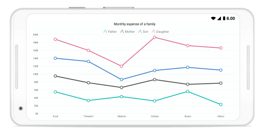
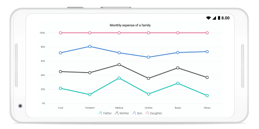
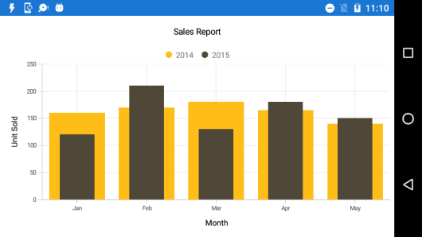
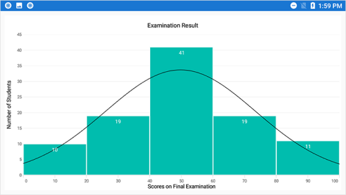
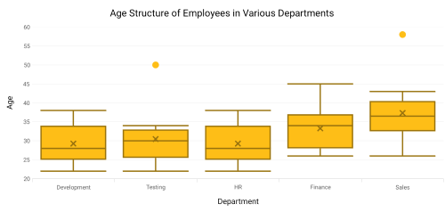
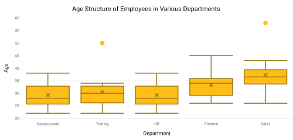
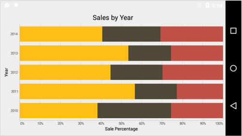
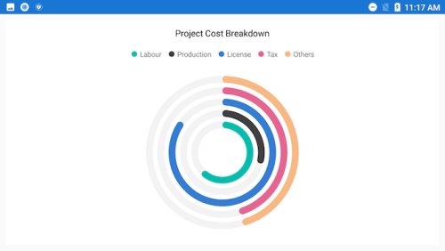
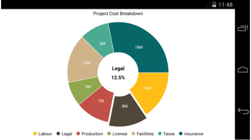

# Chart Types in Xamarin.Android

## Line Chart

To render a line chart, create an instance of [`LineSeries`](https://help.syncfusion.com/cr/cref_files/xamarin-android/Syncfusion.SfChart.Android~Com.Syncfusion.Charts.LineSeries.html) and add to the series collection of [`SfChart`](https://help.syncfusion.com/cr/cref_files/xamarin-android/Syncfusion.SfChart.Android~Com.Syncfusion.Charts.SfChart.html). The [`Visibility`](https://help.syncfusion.com/cr/cref_files/xamarin-android/Syncfusion.SfChart.Android~Com.Syncfusion.Charts.ChartSeries~Visibility.html) property represents the series visibility in SfChart. You can use the following properties to customize the appearance.

* [`Color`](https://help.syncfusion.com/cr/cref_files/xamarin-android/Syncfusion.SfChart.Android~Com.Syncfusion.Charts.ChartSeries~Color.html) – used to change the color of the line.
* [`StrokeWidth`](https://help.syncfusion.com/cr/cref_files/xamarin-android/Syncfusion.SfChart.Android~Com.Syncfusion.Charts.ChartSeries~StrokeWidth.html) – used to change the stroke width of the line.
* [`Alpha`](https://help.syncfusion.com/cr/cref_files/xamarin-android/Syncfusion.SfChart.Android~Com.Syncfusion.Charts.ChartSeries~Alpha.html) - Controls the transparency of the chart series.


[C#] 

SfChart chart = new SfChart();
...

LineSeries lineSeries = new LineSeries()
{
	ItemsSource = Data,
	XBindingPath = "XValue",
    YBindingPath = "YValue"
};
chart.Series.Add(lineSeries);



### Dashed Lines

[`PathEffect`](https://help.syncfusion.com/cr/cref_files/xamarin-android/Syncfusion.SfChart.Android~Com.Syncfusion.Charts.LineSeries~PathEffect.html) property of the [`LineSeries`](https://help.syncfusion.com/cr/cref_files/xamarin-android/Syncfusion.SfChart.Android~Com.Syncfusion.Charts.LineSeries.html) is used to render line series with dashes.

 
[C#]

LineSeries lineSeries = new lineSeries()
{
	ItemsSource = Data,
	XBindingPath = "XValue",
    YBindingPath = "YValue"
};

lineSeries.PathEffect = new DashPathEffect(new float[] {5, 6}, 2);
chart.Series.Add(lineSeries);



## Stacked Line Chart

To render a stacked line chart, create an instance of `StackingLineSeries` and add to the series collection of [`SfChart`](https://help.syncfusion.com/cr/cref_files/xamarin-android/Syncfusion.SfChart.Android~Com.Syncfusion.Charts.SfChart.html). You can use the following properties to customize the stacked line appearance.

* [`Color`](https://help.syncfusion.com/cr/cref_files/xamarin-android/Syncfusion.SfChart.Android~Com.Syncfusion.Charts.ChartSeries~Color.html) – used to change the color of the line.
* [`StrokeWidth`](https://help.syncfusion.com/cr/cref_files/xamarin-android/Syncfusion.SfChart.Android~Com.Syncfusion.Charts.ChartSeries~StrokeWidth.html) – used to change the stroke width of the line.
* [`Alpha`](https://help.syncfusion.com/cr/cref_files/xamarin-android/Syncfusion.SfChart.Android~Com.Syncfusion.Charts.ChartSeries~Alpha.html) - controls the transparency of the chart series.

 
[C#]

SfChart chart = new SfChart();
...

StackingLineSeries stackingLineSeries1 = new StackingLineSeries()
{
	ItemsSource = Data1,
	XBindingPath = "XValue",
	YBindingPath = "YValue"
};
chart.Series.Add(stackingLineSeries1);

StackingLineSeries stackingLineSeries2 = new StackingLineSeries()
{
	ItemsSource = Data2,
	XBindingPath = "XValue",
	YBindingPath = "YValue"
};
chart.Series.Add(stackingLineSeries2);

StackingLineSeries stackingLineSeries3 = new StackingLineSeries()
{
	ItemsSource = Data3,
	XBindingPath = "XValue",
	YBindingPath = "YValue"
};
chart.Series.Add(stackingLineSeries3);

StackingLineSeries stackingLineSeries4 = new StackingLineSeries()
{
	ItemsSource = Data4,
	XBindingPath = "XValue",
	YBindingPath = "YValue"
};
chart.Series.Add(stackingLineSeries4);



### Dashed Stacked Lines

`PathEffect` property of the `StackingLineSeries` is used to render stacked line series with dashes.


[C#]

StackedLineSeries stackingLineSeries1 = new StackedLineSeries()
{ 
	ItemsSource = Data1,
	XBindingPath = "XValue",
    YBindingPath = "YValue" 
};
stackingLineSeries1.PathEffect = new DashPathEffect(new float[]{6,6}, 4);
chart.Series.Add(stackingLineSeries1);

StackedLineSeries stackingLineSeries2 = new StackedLineSeries()
{ 
	ItemsSource = Data2,
	XBindingPath = "XValue",
    YBindingPath = "YValue" 
};
stackingLineSeries2.PathEffect = new DashPathEffect(new float[]{6,6}, 4);
chart.Series.Add(stackingLineSeries2);

StackedLineSeries stackingLineSeries3 = new StackedLineSeries() 
{ 
	ItemsSource = Data3,
	XBindingPath = "XValue",
    YBindingPath = "YValue" 
};
stackingLineSeries3.PathEffect = new DashPathEffect(new float[]{6,6}, 4);
chart.Series.Add(stackingLineSeries3);

StackedLineSeries stackingLineSeries4 = new StackedLineSeries() 
{ 
	ItemsSource = Data3,
	XBindingPath = "XValue",
    YBindingPath = "YValue" 
};
stackingLineSeries4.PathEffect = new DashPathEffect(new float[]{6,6}, 4);
chart.Series.Add(stackingLineSeries4);



## 100% Stacked Line Chart

To render a 100% stacked Line chart, create an instance of [`StackingLine100Series`]() and add to the series collection of [`SfChart`](https://help.syncfusion.com/cr/cref_files/xamarin-android/Syncfusion.SfChart.Android~Com.Syncfusion.Charts.SfChart.html). You can use the following properties to customize the 100% stacked line appearance.

* [`Color`](https://help.syncfusion.com/cr/cref_files/xamarin-android/Syncfusion.SfChart.Android~Com.Syncfusion.Charts.ChartSeries~Color.html) – used to change the color of the line.
* [`StrokeWidth`](https://help.syncfusion.com/cr/cref_files/xamarin-android/Syncfusion.SfChart.Android~Com.Syncfusion.Charts.ChartSeries~StrokeWidth.html) – used to change the stroke width of the line.
* [`Alpha`](https://help.syncfusion.com/cr/cref_files/xamarin-android/Syncfusion.SfChart.Android~Com.Syncfusion.Charts.ChartSeries~Alpha.html) - controls the transparency of the chart series.
* `PathEffect` - used to changed the dashes of the  stacked line series.

 
[C#]

SfChart chart = new SfChart();
...

StackingLine100Series stackingLine100Series1 = new StackingLine100Series()
{
	ItemsSource = Data1,
	XBindingPath = "XValue",
    YBindingPath = "YValue"
};
chart.Series.Add(stackingLine100Series1);

StackingLine100Series stackingLine100Series2 = new StackingLine100Series()
{
	ItemsSource = Data2,
	XBindingPath = "XValue",
    YBindingPath = "YValue"
};
chart.Series.Add(stackingLine100Series2);

StackingLine100Series stackingLine100Series3 = new StackingLine100Series()
{
	ItemsSource = Data3,
	XBindingPath = "XValue",
    YBindingPath = "YValue"
};
chart.Series.Add(stackingLine100Series3);

StackingLine100Series stackingLine100Series4 = new StackingLine100Series()
{
	ItemsSource = Data4,
	XBindingPath = "XValue",
    YBindingPath = "YValue"
};
chart.Series.Add(stackingLine100Series4);



## Area Chart

To render an area chart, create an instance of `AreaSeries` and add to the series collection of `SfChart`. You can use the following properties to customize the appearance.

* [`Color`](https://help.syncfusion.com/cr/cref_files/xamarin-android/Syncfusion.SfChart.Android~Com.Syncfusion.Charts.ChartSeries~Color.html) – used to change the color of the series.
* [`StrokeWidth`](https://help.syncfusion.com/cr/cref_files/xamarin-android/Syncfusion.SfChart.Android~Com.Syncfusion.Charts.ChartSeries~StrokeWidth.html) – used to change the stroke width of the series.
* [`StrokeColor`](https://help.syncfusion.com/cr/cref_files/xamarin-android/Syncfusion.SfChart.Android~Com.Syncfusion.Charts.AreaSeries~StrokeColor.html) – used to change the stroke color of the series.

 
[C#]

SfChart chart = new SfChart();
...

AreaSeries areaSeries = new AreaSeries()
{
	ItemsSource = Data,
	XBindingPath = "XValue",
    YBindingPath = "YValue"
};
chart.Series.Add(areaSeries);



## Spline Area Chart

To render a spline area chart, create an instance of [`SplineAreaSeries`](https://help.syncfusion.com/cr/cref_files/xamarin-android/Syncfusion.SfChart.Android~Com.Syncfusion.Charts.SplineAreaSeries.html) and add to the series collection of [`SfChart`](https://help.syncfusion.com/cr/cref_files/xamarin-android/Syncfusion.SfChart.Android~Com.Syncfusion.Charts.SfChart.html). You can use the following properties to customize the spline area appearance.

* [`Color`](https://help.syncfusion.com/cr/cref_files/xamarin-android/Syncfusion.SfChart.Android~Com.Syncfusion.Charts.ChartSeries~Color.html) – used to change the color of the series.
* [`StrokeWidth`](https://help.syncfusion.com/cr/cref_files/xamarin-android/Syncfusion.SfChart.Android~Com.Syncfusion.Charts.ChartSeries~StrokeWidth.html) – used to change the stroke width of the series.
* [`StrokeColor`](https://help.syncfusion.com/cr/cref_files/xamarin-android/Syncfusion.SfChart.Android~Com.Syncfusion.Charts.AreaSeries~StrokeColor.html) – used to change the stroke color of the series.

 
[C#]

SfChart chart = new SfChart();
...

SplineAreaSeries splineAreaSeries = new SplineAreaSeries()
{
	ItemsSource = Data,
	XBindingPath = "XValue",
    YBindingPath = "YValue"
};
chart.Series.Add(splineAreaSeries);



### Spline Rendering Types

[`SplineType`](https://help.syncfusion.com/cr/cref_files/xamarin-android/Syncfusion.SfChart.Android~Com.Syncfusion.Charts.SplineAreaSeries~SplineType.html) allows you to change the spline area curve in series. 

The following types are used in [`SplineAreaSeries`](https://help.syncfusion.com/cr/cref_files/xamarin-android/Syncfusion.SfChart.Android~Com.Syncfusion.Charts.SplineAreaSeries.html) as

* Natural
* Monotonic
* Cardinal
* Clamped

By default [`SplineType`](https://help.syncfusion.com/cr/cref_files/xamarin-android/Syncfusion.SfChart.Android~Com.Syncfusion.Charts.SplineAreaSeries~SplineType.html) value is [`Natural`](https://help.syncfusion.com/cr/cref_files/xamarin-android/Syncfusion.SfChart.Android~Com.Syncfusion.Charts.SplineType.html). 

The following code shows how to set the [`SplineType`](https://help.syncfusion.com/cr/cref_files/xamarin-android/Syncfusion.SfChart.Android~Com.Syncfusion.Charts.SplineAreaSeries~SplineType.html) value as [`Cardinal`](https://help.syncfusion.com/cr/xamarin-android/Syncfusion.SfChart.Android~Com.Syncfusion.Charts.SplineType.html)

 
[C#]

SplineAreaSeries splineAreaSeries = new SplineAreaSeries() 
{ 
	ItemsSource = Data, 
	XBindingPath = "Month", 
	YBindingPath = "Value",
	SplineType = SplineType.Cardinal
};
chart.Series.Add(splineAreaSeries);



## Step Area Chart

To render a step area chart, create an instance of [`StepAreaSeries`](https://help.syncfusion.com/cr/cref_files/xamarin-android/Syncfusion.SfChart.Android~Com.Syncfusion.Charts.StepAreaSeries.html) and add to the Series collection property of [`SfChart`](https://help.syncfusion.com/cr/cref_files/xamarin-android/Syncfusion.SfChart.Android~Com.Syncfusion.Charts.SfChart.html). You can use the following properties to customize the step area appearance.

* [`Color`](https://help.syncfusion.com/cr/cref_files/xamarin-android/Syncfusion.SfChart.Android~Com.Syncfusion.Charts.ChartSeries~Color.html) – used to change the color of the series.
* [`StrokeWidth`](https://help.syncfusion.com/cr/cref_files/xamarin-android/Syncfusion.SfChart.Android~Com.Syncfusion.Charts.ChartSeries~StrokeWidth.html) – used to change the stroke width of the series.
* [`StrokeColor`](https://help.syncfusion.com/cr/cref_files/xamarin-android/Syncfusion.SfChart.Android~Com.Syncfusion.Charts.AreaSeries~StrokeColor.html) – used to change the stroke color of the series.

 
[C#]

SfChart chart = new SfChart();
...

StepAreaSeries stepAreaSeries = new StepAreaSeries();
{
	ItemsSource = Data,
	XBindingPath = "XValue",
    YBindingPath = "YValue"
};
chart.Series.Add(stepAreaSeries);



## Range Area Chart

To render a range area chart, create an instance of [`RangeAreaSeries`](https://help.syncfusion.com/cr/cref_files/xamarin-android/Syncfusion.SfChart.Android~Com.Syncfusion.Charts.RangeAreaSeries.html) and add to the Series collection property of [`SfChart`](https://help.syncfusion.com/cr/cref_files/xamarin-android/Syncfusion.SfChart.Android~Com.Syncfusion.Charts.SfChart.html).

Since the [`RangeAreaSeries`](https://help.syncfusion.com/cr/cref_files/xamarin-android/Syncfusion.SfChart.Android~Com.Syncfusion.Charts.RangeAreaSeries.html)  requires two Y values for a point, your data should contain [`HighValues`](https://help.syncfusion.com/cr/cref_files/xamarin-android/Syncfusion.SfChart.Android~Com.Syncfusion.Charts.RangeAreaSegment~HighValues.html) and [`LowValues`](https://help.syncfusion.com/cr/cref_files/xamarin-android/Syncfusion.SfChart.Android~Com.Syncfusion.Charts.RangeAreaSegment~LowValues.html). [`High`](https://help.syncfusion.com/cr/cref_files/xamarin-android/Syncfusion.SfChart.Android~Com.Syncfusion.Charts.RangeSeriesBase~High.html) and [`low`](https://help.syncfusion.com/cr/cref_files/xamarin-android/Syncfusion.SfChart.Android~Com.Syncfusion.Charts.RangeSeriesBase~Low.html) value specifies the maximum and minimum range of the point.


[C#] 

SfChart chart = new SfChart();
...
	
RangeAreaSeries rangeAreaSeries = new RangeAreaSeries();
{
	ItemsSource = Data,
	XBindingPath = "XValue",
    High = "High",
	Low = "Low"
};
chart.Series.Add(rangeAreaSeries);



Following properties are used to customize the range area  segment appearance,

* [`Color`](https://help.syncfusion.com/cr/cref_files/xamarin-android/Syncfusion.SfChart.Android~Com.Syncfusion.Charts.ChartSeries~Color.html) – used to change the color of the series.
* [`StrokeWidth`](https://help.syncfusion.com/cr/cref_files/xamarin-android/Syncfusion.SfChart.Android~Com.Syncfusion.Charts.ChartSeries~StrokeWidth.html) – used to change the stroke width of the series.
* [`StrokeColor`](https://help.syncfusion.com/cr/cref_files/xamarin-android/Syncfusion.SfChart.Android~Com.Syncfusion.Charts.RangeAreaSeries~StrokeColor.html) – used to change the stroke color of the series.

## Stacked Area Chart

To render a stacked area chart, create an instance of [`StackingAreaSeries`](https://help.syncfusion.com/cr/cref_files/xamarin-android/Syncfusion.SfChart.Android~Com.Syncfusion.Charts.StackingAreaSeries.html) and add to the series collection of [`SfChart`](https://help.syncfusion.com/cr/cref_files/xamarin-android/Syncfusion.SfChart.Android~Com.Syncfusion.Charts.SfChart.html). You can use the following properties to customize the stacked area appearance.

* [`Color`](https://help.syncfusion.com/cr/cref_files/xamarin-android/Syncfusion.SfChart.Android~Com.Syncfusion.Charts.ChartSeries~Color.html) – used to change the color of the series.
* [`StrokeWidth`](https://help.syncfusion.com/cr/cref_files/xamarin-android/Syncfusion.SfChart.Android~Com.Syncfusion.Charts.ChartSeries~StrokeWidth.html) – used to change the stroke width of the series.
* [`StrokeColor`](https://help.syncfusion.com/cr/cref_files/xamarin-android/Syncfusion.SfChart.Android~Com.Syncfusion.Charts.StackingSeriesBase~StrokeColor.html) – used to change the stroke color of the series.

 
[C#]

SfChart chart = new SfChart();
...

StackingAreaSeries stackingAreaSeries1 = new StackingAreaSeries()
{
	ItemsSource = Data1,
	XBindingPath = "XValue",
    YBindingPath = "YValue"
};
chart.Series.Add(stackingAreaSeries1);

StackingAreaSeries stackingAreaSeries2 = new StackingAreaSeries()
{
	ItemsSource = Data2,
	XBindingPath = "XValue",
    YBindingPath = "YValue"
};
chart.Series.Add(stackingAreaSeries2);

StackingAreaSeries stackingAreaSeries3 = new StackingAreaSeries()
{
	ItemsSource = Data3,
	XBindingPath = "XValue",
    YBindingPath = "YValue"
};
chart.Series.Add(stackingAreaSeries3);



## 100% Stacked Area Chart

To render a 100% stacked area chart, create an instance of [`StackingArea100Series`](https://help.syncfusion.com/cr/cref_files/xamarin-android/Syncfusion.SfChart.Android~Com.Syncfusion.Charts.StackingArea100Series.html) and add to the series collection of [`SfChart`](https://help.syncfusion.com/cr/cref_files/xamarin-android/Syncfusion.SfChart.Android~Com.Syncfusion.Charts.SfChart.html). You can use the following properties to customize the 100% stacked area appearance.

* [`Color`](https://help.syncfusion.com/cr/cref_files/xamarin-android/Syncfusion.SfChart.Android~Com.Syncfusion.Charts.ChartSeries~Color.html) – used to change the color of the series.
* [`StrokeWidth`](https://help.syncfusion.com/cr/cref_files/xamarin-android/Syncfusion.SfChart.Android~Com.Syncfusion.Charts.ChartSeries~StrokeWidth.html) – used to change the stroke width of the series.
* [`StrokeColor`](https://help.syncfusion.com/cr/cref_files/xamarin-android/Syncfusion.SfChart.Android~Com.Syncfusion.Charts.StackingSeriesBase~StrokeColor.html) – used to change the stroke color of the series.

 
[C#]

SfChart chart = new SfChart();
...

StackingArea100Series stackingArea100Series1 = new StackingArea100Series()
{
	ItemsSource = Data1,
	XBindingPath = "XValue",
    YBindingPath = "YValue"
};
chart.Series.Add(stackingArea100Series1);

StackingArea100Series stackingArea100Series2 = new StackingArea100Series()
{
	ItemsSource = Data2,
	XBindingPath = "XValue",
    YBindingPath = "YValue"
};
chart.Series.Add(stackingArea100Series2);

StackingArea100Series stackingArea100Series3 = new StackingArea100Series()
{
	ItemsSource = Data3,
	XBindingPath = "XValue",
    YBindingPath = "YValue"
};
chart.Series.Add(stackingArea100Series3);



## Spline Range Area Chart

To render a Spline range Area chart, create an instance of [`SplineRangeAreaSeries`](https://help.syncfusion.com/cr/cref_files/xamarin-android/Syncfusion.SfChart.Android~Com.Syncfusion.Charts.SplineRangeAreaSeries.html) and add to the series collection of SfChart.

Since the SplineRangeAreaSeries requires two Y values for a point, your data should contain [`HighValues`](https://help.syncfusion.com/cr/cref_files/xamarin-android/Syncfusion.SfChart.Android~Com.Syncfusion.Charts.RangeAreaSegment~HighValues.html) and [`LowValues`](https://help.syncfusion.com/cr/cref_files/xamarin-android/Syncfusion.SfChart.Android~Com.Syncfusion.Charts.RangeAreaSegment~LowValues.html) values. [`High`](https://help.syncfusion.com/cr/cref_files/xamarin-android/Syncfusion.SfChart.Android~Com.Syncfusion.Charts.RangeSeriesBase~High.html) and [`low`](https://help.syncfusion.com/cr/cref_files/xamarin-android/Syncfusion.SfChart.Android~Com.Syncfusion.Charts.RangeSeriesBase~Low.html) value specifies the maximum and minimum range of the point.

Following properties are used to customize the spline range area segment appearance,

* [`Color`](https://help.syncfusion.com/cr/cref_files/xamarin-android/Syncfusion.SfChart.Android~Com.Syncfusion.Charts.ChartSeries~Color.html) – used to change the color of the series.
* [`StrokeWidth`](https://help.syncfusion.com/cr/cref_files/xamarin-android/Syncfusion.SfChart.Android~Com.Syncfusion.Charts.ChartSeries~StrokeWidth.html) – used to change the stroke width of the series.
* [`StrokeColor`](https://help.syncfusion.com/cr/cref_files/xamarin-android/Syncfusion.SfChart.Android~Com.Syncfusion.Charts.StackingSeriesBase~StrokeColor.html) – used to change the stroke color of the series.

 
[C#]

SfChart chart = new SfChart();
...

SplineRangeAreaSeries splineRangeAreaSeries = new SplineRangeAreaSeries() 
{ 
	ItemsSource = Data,
	XBindingPath = "XValue", 
	High = "High", 
	Low = "Low" 
};
chart.Series.Add(splineRangeAreaSeries);



### Spline Rendering Types

[`SplineType`](https://help.syncfusion.com/cr/cref_files/xamarin-android/Syncfusion.SfChart.Android~Com.Syncfusion.Charts.SplineRangeAreaSeries~SplineType.html) property allows you to change the spline range area curve in series.

The following types can be used for [`SplineRangeAreaSeries`](https://help.syncfusion.com/cr/cref_files/xamarin-android/Syncfusion.SfChart.Android~Com.Syncfusion.Charts.SplineRangeAreaSeries.html)

* Natural 
* Monotonic
* Cardinal
* Clamped

By default SplineType value is [`Natural`](https://help.syncfusion.com/cr/xamarin-android/Syncfusion.SfChart.Android~Com.Syncfusion.Charts.SplineType.html).

The following code shows how to set the [`SplineType`](https://help.syncfusion.com/cr/cref_files/xamarin-android/Syncfusion.SfChart.Android~Com.Syncfusion.Charts.SplineRangeAreaSeries~SplineType.html) value as [`Cardinal`](https://help.syncfusion.com/cr/xamarin-android/Syncfusion.SfChart.Android~Com.Syncfusion.Charts.SplineType.html)

 
[C#]

SfChart chart = new SfChart();
...

SplineRangeAreaSeries splineRangeAreaSeries = new SplineRangeAreaSeries() 
{ 
	ItemsSource = Data, 
	XBindingPath = "Month", 
	YBindingPath = "Value",
	SplineType = SplineType.Cardinal
};
chart.Series.Add(splineRangeAreaSeries);



## Column Chart

To render a column chart, create an instance of [`ColumnSeries`](https://help.syncfusion.com/cr/cref_files/xamarin-android/Syncfusion.SfChart.Android~Com.Syncfusion.Charts.ColumnSeries.html) and add to the series collection of [`SfChart`](https://help.syncfusion.com/cr/cref_files/xamarin-android/Syncfusion.SfChart.Android~Com.Syncfusion.Charts.SfChart.html). You can use the following properties to configure the column segment.

* [`Color`](https://help.syncfusion.com/cr/cref_files/xamarin-android/Syncfusion.SfChart.Android~Com.Syncfusion.Charts.ChartSeries~Color.html) – used to change the color of the series.
* [`StrokeWidth`](https://help.syncfusion.com/cr/cref_files/xamarin-android/Syncfusion.SfChart.Android~Com.Syncfusion.Charts.ChartSeries~StrokeWidth.html) – used to change the stroke width of the series.
* [`StrokeColor`](https://help.syncfusion.com/cr/cref_files/xamarin-android/Syncfusion.SfChart.Android~Com.Syncfusion.Charts.ColumnSeries~StrokeColor.html) – used to change the stroke color of the series. 
* [`Spacing`](https://help.syncfusion.com/cr/cref_files/xamarin-android/Syncfusion.SfChart.Android~Com.Syncfusion.Charts.ColumnSeries~Spacing.html) - used to change the spacing between two segments. The default value of spacing is 0, and the value ranges from 0 to 1. Here, 1 and 0 correspond to 100% and 0% of the available space, respectively.
* [`Width`](https://help.syncfusion.com/cr/cref_files/xamarin-android/Syncfusion.SfChart.Android~Com.Syncfusion.Charts.ColumnSeries~Width.html) - used to change the width of the rectangle. The default value of the width is 0.8, and the value ranges from 0 to 1. Here, 1 and 0 correspond to 100% and 0% of the available width, respectively. 
* [`DataMarkerPosition`](https://help.syncfusion.com/cr/cref_files/xamarin-android/Syncfusion.SfChart.Android~Com.Syncfusion.Charts.ColumnSeries~DataMarkerPosition.html) - used to change the position of data marker. 
* [`CornerRadius`](https://help.syncfusion.com/cr/cref_files/xamarin-android/Syncfusion.SfChart.Android~Com.Syncfusion.Charts.ColumnSeries~CornerRadius.html) -  used to add the rounded corners to the rectangle. The [`TopLeft`](https://help.syncfusion.com/cr/cref_files/xamarin-android/Syncfusion.SfChart.Android~Com.Syncfusion.Charts.ChartCornerRadius~TopLeft.html), [`TopRight`](https://help.syncfusion.com/cr/cref_files/xamarin-android/Syncfusion.SfChart.Android~Com.Syncfusion.Charts.ChartCornerRadius~TopRight.html), [`BottomLeft`](https://help.syncfusion.com/cr/cref_files/xamarin-android/Syncfusion.SfChart.Android~Com.Syncfusion.Charts.ChartCornerRadius~BottomLeft.html) and [`BottomRight`](https://help.syncfusion.com/cr/cref_files/xamarin-android/Syncfusion.SfChart.Android~Com.Syncfusion.Charts.ChartCornerRadius~BottomRight.html) of [`ChartCornerRadius`](https://help.syncfusion.com/cr/cref_files/xamarin-android/Syncfusion.SfChart.Android~Com.Syncfusion.Charts.ChartCornerRadius.html) properties are used to set the radius value for each corner.

 
[C#]

SfChart chart = new SfChart();
...

ColumnSeries columnSeries = new ColumnSeries()
{
	ItemsSource = Data,
	XBindingPath = "XValue",
    YBindingPath = "YValue"
};
chart.Series.Add(columnSeries);



### Overlapped placement

By default, all the column series which has the same x and y axes are placed side by side in a chart. If you want place the series one over the other (overlapped), set the [`SideBySideSeriesPlacement`](https://help.syncfusion.com/cr/cref_files/xamarin-android/Syncfusion.SfChart.Android~Com.Syncfusion.Charts.ChartBase~SideBySideSeriesPlacement.html) property of [`SfChart`](https://help.syncfusion.com/cr/cref_files/xamarin-android/Syncfusion.SfChart.Android~Com.Syncfusion.Charts.SfChart.html) to false and configure the Width property to differentiate the series. The following code snippet and screenshot illustrate the overlapped placement of column series.

 
[C#]

SfChart chart = new SfChart()
  {
      SideBySideSeriesPlacement = false
  };
 chart.PrimaryAxis = new CategoryAxis();
 chart.SecondaryAxis = new NumericalAxis();
 ColumnSeries series1 = new ColumnSeries()
 {
                ItemsSource = view.Data1,
                XBindingPath = "Month",
                YBindingPath = "Year2014"
 };
 ColumnSeries series2 = new ColumnSeries()
 {
                ItemsSource = view.Data2,
                XBindingPath = "Month",
                YBindingPath = "Year2015",
                 Width="0.5"
 };

chart.Series.Add(series1);
chart.Series.Add(series2);



## Histogram Chart

To render a histogram chart, create an instance of [`HistogramSeries`](https://help.syncfusion.com/cr/cref_files/xamarin-android/Syncfusion.SfChart.Android~Com.Syncfusion.Charts.HistogramSeries.html), and add it to the series collection of [`SfChart`](https://help.syncfusion.com/cr/cref_files/xamarin-android/Syncfusion.SfChart.Android~Com.Syncfusion.Charts.SfChart.html).

Histogram chart provides a visual display of large amount of data that are difficult to understand in a tabular or data grid form.

You can customize intervals using the [`Interval`](https://help.syncfusion.com/cr/cref_files/xamarin-android/Syncfusion.SfChart.Android~Com.Syncfusion.Charts.HistogramSeries~Interval.html) property and collapse the normal distribution curve using the [`ShowNormalDistributionCurve`](https://help.syncfusion.com/cr/cref_files/xamarin-android/Syncfusion.SfChart.Android~Com.Syncfusion.Charts.HistogramSeries~ShowNormalDistributionCurve.html) property.  You can use the following properties to customize the appearance.

* [`Color`](https://help.syncfusion.com/cr/cref_files/xamarin-android/Syncfusion.SfChart.Android~Com.Syncfusion.Charts.ChartSeries~Color.html) – used to change the color of the series.
* [`StrokeWidth`](https://help.syncfusion.com/cr/cref_files/xamarin-android/Syncfusion.SfChart.Android~Com.Syncfusion.Charts.HistogramSeries~StrokeWidth.html) – used to change the stroke width of the series.
* [`StrokeColor`](https://help.syncfusion.com/cr/cref_files/xamarin-android/Syncfusion.SfChart.Android~Com.Syncfusion.Charts.HistogramSeries~StrokeColor.html) – used to change the stroke color of the series.
* [`CurveColor`](https://help.syncfusion.com/cr/cref_files/xamarin-android/Syncfusion.SfChart.Android~Com.Syncfusion.Charts.HistogramSeries~CurveColor.html) – used to change the color of the normal distribution curve.
* [`DataMarkerPosition`](https://help.syncfusion.com/cr/cref_files/xamarin-android/Syncfusion.SfChart.Android~Com.Syncfusion.Charts.HistogramSeries~DataMarkerPosition.html) - used to position the data marker at [`Bottom`](https://help.syncfusion.com/cr/cref_files/xamarin-android/Syncfusion.SfChart.Android~Com.Syncfusion.Charts.DataMarkerPosition.html), Top and Center of the rectangle.
 
[C#]

SfChart chart = new SfChart();
...

HistogramSeries histogramSeries = new HistogramSeries()
{
	ItemsSource = Data,
	XBindingPath = "XValue",
	YBindingPath = "YValue",   
	Interval = 20
};
chart.Series.Add(histogramSeries);



## Range Column Chart

To render a range column chart, create an instance of [`RangeColumnSeries`](https://help.syncfusion.com/cr/cref_files/xamarin-android/Syncfusion.SfChart.Android~Com.Syncfusion.Charts.RangeColumnSeries.html) and add to the series collection of [`SfChart`](https://help.syncfusion.com/cr/cref_files/xamarin-android/Syncfusion.SfChart.Android~Com.Syncfusion.Charts.SfChart.html). 

Since the [`RangeColumnSeries`](https://help.syncfusion.com/cr/cref_files/xamarin-android/Syncfusion.SfChart.Android~Com.Syncfusion.Charts.RangeColumnSeries.html) requires two Y values for a point, your data should contain high and low values. [`High`](https://help.syncfusion.com/cr/cref_files/xamarin-android/Syncfusion.SfChart.Android~Com.Syncfusion.Charts.RangeSeriesBase~High.html) and [`Low`](https://help.syncfusion.com/cr/cref_files/xamarin-android/Syncfusion.SfChart.Android~Com.Syncfusion.Charts.RangeSeriesBase~Low.html) value specifies the maximum and minimum range of the point. 


[C#] 

SfChart chart = new SfChart();
...
	
RangeColumnSeries rangeColumnSeries = new RangeColumnSeries()
{
	ItemsSource = Data,
	XBindingPath = "XValue",
    High = "High",
	Low = "Low"
}
	
chart.Series.Add(rangeColumnSeries);



Following properties are used to customize the range column segment appearance,

* [`Color`](https://help.syncfusion.com/cr/cref_files/xamarin-android/Syncfusion.SfChart.Android~Com.Syncfusion.Charts.ChartSeries~Color.html) – used to change the color of the series.
* [`StrokeWidth`](https://help.syncfusion.com/cr/cref_files/xamarin-android/Syncfusion.SfChart.Android~Com.Syncfusion.Charts.ChartSeries~StrokeWidth.html) – used to change the stroke width of the series.
* [`StrokeColor`](https://help.syncfusion.com/cr/cref_files/xamarin-android/Syncfusion.SfChart.Android~Com.Syncfusion.Charts.RangeColumnSeries~StrokeColor.html) – used to change the stroke color of the series.
* [`Spacing`](https://help.syncfusion.com/cr/cref_files/xamarin-android/Syncfusion.SfChart.Android~Com.Syncfusion.Charts.RangeColumnSeries~Spacing.html) - used to change the spacing between two segments. The default value of spacing is 0, and the value ranges from 0 to 1. Here, 1 and 0 correspond to 100% and 0% of the available space, respectively.
* [`Width`](https://help.syncfusion.com/cr/cref_files/xamarin-android/Syncfusion.SfChart.Android~Com.Syncfusion.Charts.RangeColumnSeries~Width.html) - used to change the width of the rectangle. The default value of the width is 0.8, and the value ranges from 0 to 1. Here, 1 and 0 correspond to 100% and 0% of the available width, respectively. 
* [`CornerRadius`](https://help.syncfusion.com/cr/cref_files/xamarin-android/Syncfusion.SfChart.Android~Com.Syncfusion.Charts.RangeColumnSeries~CornerRadius.html) - used to add the rounded corners to the rectangle. The [`TopLeft`](https://help.syncfusion.com/cr/cref_files/xamarin-android/Syncfusion.SfChart.Android~Com.Syncfusion.Charts.ChartCornerRadius~TopLeft.html), [`TopRight`](https://help.syncfusion.com/cr/cref_files/xamarin-android/Syncfusion.SfChart.Android~Com.Syncfusion.Charts.ChartCornerRadius~TopRight.html), [`BottomLeft`](https://help.syncfusion.com/cr/cref_files/xamarin-android/Syncfusion.SfChart.Android~Com.Syncfusion.Charts.ChartCornerRadius~BottomLeft.html) and [`BottomRight`](https://help.syncfusion.com/cr/cref_files/xamarin-android/Syncfusion.SfChart.Android~Com.Syncfusion.Charts.ChartCornerRadius~BottomRight.html) of [`ChartCornerRadius`](https://help.syncfusion.com/cr/cref_files/xamarin-android/Syncfusion.SfChart.Android~Com.Syncfusion.Charts.ChartCornerRadius.html) properties are used to set the radius value for each corner.

## Stacked Column Chart

To render a stacked column chart, create an instance of [`StackingColumnSeries`](https://help.syncfusion.com/cr/cref_files/xamarin-android/Syncfusion.SfChart.Android~Com.Syncfusion.Charts.StackingColumnSeries.html) and add to the series collection of [`SfChart`](https://help.syncfusion.com/cr/cref_files/xamarin-android/Syncfusion.SfChart.Android~Com.Syncfusion.Charts.SfChart.html). You can use the following properties to configure the stacked column segment.

* [`Color`](https://help.syncfusion.com/cr/cref_files/xamarin-android/Syncfusion.SfChart.Android~Com.Syncfusion.Charts.ChartSeries~Color.html) – used to change the color of the series.
* [`StrokeWidth`](https://help.syncfusion.com/cr/cref_files/xamarin-android/Syncfusion.SfChart.Android~Com.Syncfusion.Charts.ChartSeries~StrokeWidth.html) – used to change the stroke width of the series.
* [`StrokeColor`](https://help.syncfusion.com/cr/cref_files/xamarin-android/Syncfusion.SfChart.Android~Com.Syncfusion.Charts.StackingSeriesBase~StrokeColor.html) – used to change the stroke color of the series.
* [`Spacing`](https://help.syncfusion.com/cr/cref_files/xamarin-android/Syncfusion.SfChart.Android~Com.Syncfusion.Charts.StackingColumnSeries~Spacing.html) -  used to change the spacing between two segments. The default value of spacing is 0, and the value ranges from 0 to 1. Here, 1 and 0 correspond to 100% and 0% of the available space, respectively.
* [`Width`](https://help.syncfusion.com/cr/cref_files/xamarin-android/Syncfusion.SfChart.Android~Com.Syncfusion.Charts.StackingColumnSeries~Width.html) - used to change the width of the rectangle. The default value of the width is 0.8, and the value ranges from 0 to 1. Here, 1 and 0 correspond to 100% and 0% of the available width, respectively. 
* [`DataMarkerPosition`](https://help.syncfusion.com/cr/cref_files/xamarin-android/Syncfusion.SfChart.Android~Com.Syncfusion.Charts.StackingColumnSeries~DataMarkerPosition.html) - used to change the position of data marker.
* [`CornerRadius`](https://help.syncfusion.com/cr/cref_files/xamarin-android/Syncfusion.SfChart.Android~Com.Syncfusion.Charts.StackingColumnSeries~CornerRadius.html) - used to add the rounded corners to the rectangle. The [`TopLeft`](https://help.syncfusion.com/cr/cref_files/xamarin-android/Syncfusion.SfChart.Android~Com.Syncfusion.Charts.ChartCornerRadius~TopLeft.html), [`TopRight`](https://help.syncfusion.com/cr/cref_files/xamarin-android/Syncfusion.SfChart.Android~Com.Syncfusion.Charts.ChartCornerRadius~TopRight.html), [`BottomLeft`](https://help.syncfusion.com/cr/cref_files/xamarin-android/Syncfusion.SfChart.Android~Com.Syncfusion.Charts.ChartCornerRadius~BottomLeft.html) and [`BottomRight`](https://help.syncfusion.com/cr/cref_files/xamarin-android/Syncfusion.SfChart.Android~Com.Syncfusion.Charts.ChartCornerRadius~BottomRight.html) of [`ChartCornerRadius`](https://help.syncfusion.com/cr/cref_files/xamarin-android/Syncfusion.SfChart.Android~Com.Syncfusion.Charts.ChartCornerRadius.html) properties are used to set the radius value for each corner.

 
[C#]

SfChart chart = new SfChart();
...

StackingColumnSeries stackingColumnSeries1 = new StackingColumnSeries()
{
	ItemsSource = Data1,
	XBindingPath = "XValue",
    YBindingPath = "YValue"
};
chart.Series.Add(stackingColumnSeries1);

StackingColumnSeries stackingColumnSeries2 = new StackingColumnSeries()
{
	ItemsSource = Data2,
	XBindingPath = "XValue",
    YBindingPath = "YValue"
};
chart.Series.Add(stackingColumnSeries2);

StackingColumnSeries stackingColumnSeries3 = new StackingColumnSeries()
{
	ItemsSource = Data3,
	XBindingPath = "XValue",
    YBindingPath = "YValue"
};
chart.Series.Add(stackingColumnSeries3);



## 100% Stacked Column Chart

To render a 100% stacked column chart, create an instance of [`StackingColumn100Series`](https://help.syncfusion.com/cr/cref_files/xamarin-android/Syncfusion.SfChart.Android~Com.Syncfusion.Charts.StackingColumn100Series.html) and add to the series collection of [`SfChart`](https://help.syncfusion.com/cr/cref_files/xamarin-android/Syncfusion.SfChart.Android~Com.Syncfusion.Charts.SfChart.html). You can use the following properties to configure the 100% stacked column segment.

* [`Color`](https://help.syncfusion.com/cr/cref_files/xamarin-android/Syncfusion.SfChart.Android~Com.Syncfusion.Charts.ChartSeries~Color.html) – used to change the color of the series.
* [`StrokeWidth`](https://help.syncfusion.com/cr/cref_files/xamarin-android/Syncfusion.SfChart.Android~Com.Syncfusion.Charts.ChartSeries~StrokeWidth.html) – used to change the stroke width of the series.
* [`StrokeColor`](https://help.syncfusion.com/cr/cref_files/xamarin-android/Syncfusion.SfChart.Android~Com.Syncfusion.Charts.StackingSeriesBase~StrokeColor.html) – used to change the stroke color of the series.
* [`Spacing`](https://help.syncfusion.com/cr/cref_files/xamarin-android/Syncfusion.SfChart.Android~Com.Syncfusion.Charts.StackingColumnSeries~Spacing.html) - used to change the spacing between two segments. The default value of spacing is 0, and the value ranges from 0 to 1. Here, 1 and 0 correspond to 100% and 0% of the available space, respectively.
* [`Width`](https://help.syncfusion.com/cr/cref_files/xamarin-android/Syncfusion.SfChart.Android~Com.Syncfusion.Charts.StackingColumnSeries~Width.html) - used to change the width of the rectangle. The default value of the width is 0.8, and the value ranges from 0 to 1. Here, 1 and 0 correspond to 100% and 0% of the available width, respectively. 
* [`DataMarkerPosition`](https://help.syncfusion.com/cr/cref_files/xamarin-android/Syncfusion.SfChart.Android~Com.Syncfusion.Charts.StackingColumnSeries~DataMarkerPosition.html) - used to change the position of data marker.
* [`CornerRadius`](https://help.syncfusion.com/cr/cref_files/xamarin-android/Syncfusion.SfChart.Android~Com.Syncfusion.Charts.StackingColumnSeries~CornerRadius.html) - used to add the rounded corners to the rectangle. The [`TopLeft`](https://help.syncfusion.com/cr/cref_files/xamarin-android/Syncfusion.SfChart.Android~Com.Syncfusion.Charts.ChartCornerRadius~TopLeft.html), [`TopRight`](https://help.syncfusion.com/cr/cref_files/xamarin-android/Syncfusion.SfChart.Android~Com.Syncfusion.Charts.ChartCornerRadius~TopRight.html), [`BottomLeft`](https://help.syncfusion.com/cr/cref_files/xamarin-android/Syncfusion.SfChart.Android~Com.Syncfusion.Charts.ChartCornerRadius~BottomLeft.html) and [`BottomRight`](https://help.syncfusion.com/cr/cref_files/xamarin-android/Syncfusion.SfChart.Android~Com.Syncfusion.Charts.ChartCornerRadius~BottomRight.html) of [`ChartCornerRadius`](https://help.syncfusion.com/cr/cref_files/xamarin-android/Syncfusion.SfChart.Android~Com.Syncfusion.Charts.ChartCornerRadius.html) properties are used to set the radius value for each corner.

 
[C#]

SfChart chart = new SfChart();
...

StackingColumn100Series stackingColumn100Series1 = new StackingColumn100Series()
{
	ItemsSource = Data1,
	XBindingPath = "XValue",
    YBindingPath = "YValue"
};
chart.Series.Add(stackingColumn100Series1);

StackingColumn100Series stackingColumn100Series2 = new StackingColumn100Series()
{
	ItemsSource = Data2,
	XBindingPath = "XValue",
    YBindingPath = "YValue"
};
chart.Series.Add(stackingColumnSeries2);

StackingColumn100Series stackingColumn100Series3 = new StackingColumn100Series()
{
	ItemsSource = Data3,
	XBindingPath = "XValue",
    YBindingPath = "YValue"
};
chart.Series.Add(stackingColumn100Series3);



## BoxAndWhisker Chart

BoxAndWhiskerSeries plots a combination of rectangles and lines to show the distribution of data sets. To render a box and whisker(box plot) chart, create an instance of [`BoxAndWhiskerSeries`] and add to the series collection property of [`SfChart`](https://help.syncfusion.com/cr/cref_files/xamarin-android/Syncfusion.SfChart.Android~Com.Syncfusion.Charts.SfChart.html). You can use the following properties to customize the appearance.

* [`Color`](https://help.syncfusion.com/cr/cref_files/xamarin-android/Syncfusion.SfChart.Android~Com.Syncfusion.Charts.ChartSeries~Color.html) - used to change the color of the series.
* [`StrokeWidth`](https://help.syncfusion.com/cr/cref_files/xamarin-android/Syncfusion.SfChart.Android~Com.Syncfusion.Charts.ChartSeries~StrokeWidth.html) - used to change the stroke width of the series.
* [`StrokeColor`] - used to change the stroke color of the series.
* [`Spacing`] - used to change the spacing between two segments. The default value of spacing is 0, and the value ranges from 0 to 1. Here, 1 and 0 corresponds to 100% and 0% of the available space, respectively.
* [`Width`] - used to change the width of the rectangle. The default value of the width is 0.8, and the value ranges from 0 to 1. Here, 1 and 0 corresponds to 100% and 0% of the available width, respectively.



[C#]

SfChart chart = new SfChart();
...

BoxAndWhiskerSeries boxPlotSeries = new BoxAndWhiskerSeries() 
{ 
	ItemsSource = Data, 
	XBindingPath = "Department", 
	YBindingPath = "Ages",
	ShowMedian = true
};
chart.Series.Add(boxPlotSeries);



### Customize the series box mode

The series box plotting mode can be changed using the [`BoxPlotMode`] property of [`BoxAndWhiskerSeries`]. The plotting mode of series can be calculated as follows:

* [`Exclusive`] - The quartile values are calculated using the formula (N+1) * P (N count, P percentile), and their index value starts from 1 in the list.
* [`Inclusive`] - The quartile values are calculated using the formula (N−1) * P (N count, P percentile), and their index value starts from 0 in the list.
* [`Normal`] - The quartile values are calculated by splitting the list and getting the median values.

By default, [`BoxPlotMode`] value is [`Exclusive`].

The following code shows how to set the [`BoxPlotMode`] value as [`Inclusive`].



[C#]

SfChart chart = new SfChart();
...

BoxAndWhiskerSeries boxPlotSeries = new BoxAndWhiskerSeries() 
{ 
	ItemsSource = Data, 
	XBindingPath = "Department", 
	YBindingPath = "Ages",
	ShowMedian = true,
	BoxPlotMode = BoxPlotMode.Inclusive
};
chart.Series.Add(boxPlotSeries);



### ShowMedian

The Median values of given data set is viewed by enabling the [`ShowMedian`] property of [`BoxAndWhiskerSeries`]. By default, [`ShowMedian`] value is false. The following code demonstrates how to enable the [`ShowMedian`] property.



[C#]

SfChart chart = new SfChart();
...

BoxAndWhiskerSeries boxPlotSeries = new BoxAndWhiskerSeries()
{
	ItemsSource = Data,
	XBindingPath = "Department",
	YBindingPath = "Ages",
	ShowMedian = true
} 
chart.Series.Add(boxPlotSeries);



### SymbolType

The [`SymbolType`] is used to display the outlier point that lie either below the lower whisker or above the upper whisker line. The available symbols are Cross, Diamond, Ellipse, Hexagon, InvertedTriangle, Pentagon, Plus, Rectangle and Triangle. By default, [`SymbolType`] value is [`Ellipse`].

The following code shows how to set the [`SymbolType`] value as [`Cross`].



[C#]

SfChart chart = new SfChart();
...

BoxAndWhiskerSeries boxPlotSeries = new BoxAndWhiskerSeries()
{
	ItemsSource = Data,
	XBindingPath = "Department",
	YBindingPath = "Ages",
	ShowMedian = true,
	SymbolType = ChartSymbolType.Cross
} 
chart.Series.Add(boxPlotSeries);



## Bar Chart

To render a bar chart, create an instance of [`BarSeries`](https://help.syncfusion.com/cr/cref_files/xamarin-android/Syncfusion.SfChart.Android~Com.Syncfusion.Charts.BarSeries.html) and add to the series collection of [`SfChart`](https://help.syncfusion.com/cr/cref_files/xamarin-android/Syncfusion.SfChart.Android~Com.Syncfusion.Charts.SfChart.html). You can use the following properties to configure the bar segment.

* [`Color`](https://help.syncfusion.com/cr/cref_files/xamarin-android/Syncfusion.SfChart.Android~Com.Syncfusion.Charts.ChartSeries~Color.html) – used to change the color of the series.
* [`StrokeWidth`](https://help.syncfusion.com/cr/cref_files/xamarin-android/Syncfusion.SfChart.Android~Com.Syncfusion.Charts.ChartSeries~StrokeWidth.html) – used to change the stroke width of the series.
* [`StrokeColor`](https://help.syncfusion.com/cr/cref_files/xamarin-android/Syncfusion.SfChart.Android~Com.Syncfusion.Charts.BarSeries~StrokeColor.html) – used to change the stroke color of the series.
* [`Spacing`](https://help.syncfusion.com/cr/cref_files/xamarin-android/Syncfusion.SfChart.Android~Com.Syncfusion.Charts.BarSeries~Spacing.html) -  used to change the spacing between two segments. The default value of spacing is 0, and the value ranges from 0 to 1. Here, 1 and 0 correspond to 100% and 0% of the available space, respectively.
* [`Width`](https://help.syncfusion.com/cr/cref_files/xamarin-android/Syncfusion.SfChart.Android~Com.Syncfusion.Charts.BarSeries~Width.html) - used to change the width of the rectangle. The default value of the width is 0.8, and the value ranges from 0 to 1. Here, 1 and 0 correspond to 100% and 0% of the available width, respectively. 
* [`DataMarkerPosition`](https://help.syncfusion.com/cr/cref_files/xamarin-android/Syncfusion.SfChart.Android~Com.Syncfusion.Charts.BarSeries~DataMarkerPosition.html) - used to change the position of data marker.
* [`CornerRadius`](https://help.syncfusion.com/cr/cref_files/xamarin-android/Syncfusion.SfChart.Android~Com.Syncfusion.Charts.BarSeries~CornerRadius.html) -used to add the rounded corners to the rectangle. The [`TopLeft`](https://help.syncfusion.com/cr/cref_files/xamarin-android/Syncfusion.SfChart.Android~Com.Syncfusion.Charts.ChartCornerRadius~TopLeft.html), [`TopRight`](https://help.syncfusion.com/cr/cref_files/xamarin-android/Syncfusion.SfChart.Android~Com.Syncfusion.Charts.ChartCornerRadius~TopRight.html), [`BottomLeft`](https://help.syncfusion.com/cr/cref_files/xamarin-android/Syncfusion.SfChart.Android~Com.Syncfusion.Charts.ChartCornerRadius~BottomLeft.html) and [`BottomRight`](https://help.syncfusion.com/cr/cref_files/xamarin-android/Syncfusion.SfChart.Android~Com.Syncfusion.Charts.ChartCornerRadius~BottomRight.html) of [`ChartCornerRadius`](https://help.syncfusion.com/cr/cref_files/xamarin-android/Syncfusion.SfChart.Android~Com.Syncfusion.Charts.ChartCornerRadius.html) properties are used to set the radius value for each corner.

 
[C#]

SfChart chart = new SfChart();
...

BarSeries barSeries = new BarSeries()
{
	ItemsSource = Data,
	XBindingPath = "XValue",
    YBindingPath = "YValue"
};
chart.Series.Add(barSeries);



## Stacked Bar Chart

To render a stacked bar chart, create an instance of [`StackingBarSeries`](https://help.syncfusion.com/cr/cref_files/xamarin-android/Syncfusion.SfChart.Android~Com.Syncfusion.Charts.StackingBarSeries.html) and add to the series collection of [`SfChart`](https://help.syncfusion.com/cr/cref_files/xamarin-android/Syncfusion.SfChart.Android~Com.Syncfusion.Charts.SfChart.html). You can use the following properties to configure the stacked bar segment.

* [`Color`](https://help.syncfusion.com/cr/cref_files/xamarin-android/Syncfusion.SfChart.Android~Com.Syncfusion.Charts.ChartSeries~Color.html) – used to change the color of the series.
* [`StrokeWidth`](https://help.syncfusion.com/cr/cref_files/xamarin-android/Syncfusion.SfChart.Android~Com.Syncfusion.Charts.ChartSeries~StrokeWidth.html) – used to change the stroke width of the series.
* [`StrokeColor`](https://help.syncfusion.com/cr/cref_files/xamarin-android/Syncfusion.SfChart.Android~Com.Syncfusion.Charts.StackingSeriesBase~StrokeColor.html) – used to change the stroke color of the series.
* [`Spacing`](https://help.syncfusion.com/cr/cref_files/xamarin-android/Syncfusion.SfChart.Android~Com.Syncfusion.Charts.StackingBarSeries~Spacing.html) -  used to change the spacing between two segments. The default value of spacing is 0, and the value ranges from 0 to 1. Here, 1 and 0 correspond to 100% and 0% of the available space, respectively.
* [`Width`](https://help.syncfusion.com/cr/cref_files/xamarin-android/Syncfusion.SfChart.Android~Com.Syncfusion.Charts.StackingBarSeries~Width.html) -used to change the width of the rectangle. The default value of the width is 0.8, and the value ranges from 0 to 1. Here, 1 and 0 correspond to 100% and 0% of the available width, respectively. 
* [`DataMarkerPosition`](https://help.syncfusion.com/cr/cref_files/xamarin-android/Syncfusion.SfChart.Android~Com.Syncfusion.Charts.StackingBarSeries~DataMarkerPosition.html) - used to change the position of data marker.
* [`CornerRadius`](https://help.syncfusion.com/cr/cref_files/xamarin-android/Syncfusion.SfChart.Android~Com.Syncfusion.Charts.StackingBarSeries~CornerRadius.html) - used to add the rounded corners to the rectangle. The [`TopLeft`](https://help.syncfusion.com/cr/cref_files/xamarin-android/Syncfusion.SfChart.Android~Com.Syncfusion.Charts.ChartCornerRadius~TopLeft.html), [`TopRight`](https://help.syncfusion.com/cr/cref_files/xamarin-android/Syncfusion.SfChart.Android~Com.Syncfusion.Charts.ChartCornerRadius~TopRight.html), [`BottomLeft`](https://help.syncfusion.com/cr/cref_files/xamarin-android/Syncfusion.SfChart.Android~Com.Syncfusion.Charts.ChartCornerRadius~BottomLeft.html) and [`BottomRight`](https://help.syncfusion.com/cr/cref_files/xamarin-android/Syncfusion.SfChart.Android~Com.Syncfusion.Charts.ChartCornerRadius~BottomRight.html) of [`ChartCornerRadius`](https://help.syncfusion.com/cr/cref_files/xamarin-android/Syncfusion.SfChart.Android~Com.Syncfusion.Charts.ChartCornerRadius.html) properties are used to set the radius value for each corner.

 
[C#]

SfChart chart = new SfChart();
...

StackingBarSeries stackingBarSeries1 = new StackingBarSeries()
{
	ItemsSource = Data1,
	XBindingPath = "XValue",
    YBindingPath = "YValue"
};
chart.Series.Add(stackingBarSeries1);

StackingBarSeries stackingBarSeries2 = new StackingBarSeries()
{
	ItemsSource = Data2,
	XBindingPath = "XValue",
    YBindingPath = "YValue"
};
chart.Series.Add(stackingBarSeries2);

StackingBarSeries stackingBarSeries3 = new StackingBarSeries()
{
	ItemsSource = Data3,
	XBindingPath = "XValue",
    YBindingPath = "YValue"
};
chart.Series.Add(stackingBarSeries3);



## 100% Stacked Bar Chart

To render a 100% stacked bar chart, create an instance of [`StackingBar100Series`](https://help.syncfusion.com/cr/cref_files/xamarin-android/Syncfusion.SfChart.Android~Com.Syncfusion.Charts.StackingBar100Series.html) and add to the series collection of [`SfChart`](https://help.syncfusion.com/cr/cref_files/xamarin-android/Syncfusion.SfChart.Android~Com.Syncfusion.Charts.SfChart.html). You can use the following properties to configure the 100% stacked bar segment.

* [`Color`](https://help.syncfusion.com/cr/cref_files/xamarin-android/Syncfusion.SfChart.Android~Com.Syncfusion.Charts.ChartSeries~Color.html) – used to change the color of the series.
* [`StrokeWidth`](https://help.syncfusion.com/cr/cref_files/xamarin-android/Syncfusion.SfChart.Android~Com.Syncfusion.Charts.ChartSeries~StrokeWidth.html) – used to change the stroke width of the series.
* [`StrokeColor`](https://help.syncfusion.com/cr/cref_files/xamarin-android/Syncfusion.SfChart.Android~Com.Syncfusion.Charts.StackingSeriesBase~StrokeColor.html) – used to change the stroke color of the series.
* [`Spacing`](https://help.syncfusion.com/cr/cref_files/xamarin-android/Syncfusion.SfChart.Android~Com.Syncfusion.Charts.StackingBarSeries~Spacing.html) -  used to change the spacing between two segments. The default value of spacing is 0, and the value ranges from 0 to 1. Here, 1 and 0 correspond to 100% and 0% of the available space, respectively.
* [`Width`](https://help.syncfusion.com/cr/cref_files/xamarin-android/Syncfusion.SfChart.Android~Com.Syncfusion.Charts.StackingBarSeries~Width.html) - used to change the width of the rectangle. The default value of the width is 0.8, and the value ranges from 0 to 1. Here, 1 and 0 correspond to 100% and 0% of the available width, respectively. 
* [`DataMarkerPosition`](https://help.syncfusion.com/cr/cref_files/xamarin-android/Syncfusion.SfChart.Android~Com.Syncfusion.Charts.StackingBarSeries~DataMarkerPosition.html) - used to change the position of data marker.
* [`CornerRadius`](https://help.syncfusion.com/cr/cref_files/xamarin-android/Syncfusion.SfChart.Android~Com.Syncfusion.Charts.StackingBarSeries~CornerRadius.html) - used to add the rounded corners to the rectangle. The [`TopLeft`](https://help.syncfusion.com/cr/cref_files/xamarin-android/Syncfusion.SfChart.Android~Com.Syncfusion.Charts.ChartCornerRadius~TopLeft.html), [`TopRight`](https://help.syncfusion.com/cr/cref_files/xamarin-android/Syncfusion.SfChart.Android~Com.Syncfusion.Charts.ChartCornerRadius~TopRight.html), [`BottomLeft`](https://help.syncfusion.com/cr/cref_files/xamarin-android/Syncfusion.SfChart.Android~Com.Syncfusion.Charts.ChartCornerRadius~BottomLeft.html) and [`BottomRight`](https://help.syncfusion.com/cr/cref_files/xamarin-android/Syncfusion.SfChart.Android~Com.Syncfusion.Charts.ChartCornerRadius~BottomRight.html) of [`ChartCornerRadius`](https://help.syncfusion.com/cr/cref_files/xamarin-android/Syncfusion.SfChart.Android~Com.Syncfusion.Charts.ChartCornerRadius.html) properties are used to set the radius value for each corner.

 
[C#]

SfChart chart = new SfChart();
...

StackingBar100Series stackingBar100Series1 = new StackingBar100Series()
{
	ItemsSource = Data1,
	XBindingPath = "XValue",
    YBindingPath = "YValue"
};
chart.Series.Add(stackingBar100Series1);

StackingBar100Series stackingBar100Series2 = new StackingBar100Series()
{
	ItemsSource = Data2,
	XBindingPath = "XValue",
    YBindingPath = "YValue"
};
chart.Series.Add(stackingBar100Series2);

StackingBar100Series stackingBar100Series3 = new StackingBar100Series()
{
	ItemsSource = Data3,
	XBindingPath = "XValue",
    YBindingPath = "YValue"
};
chart.Series.Add(stackingBar100Series3);



## Spline Chart

To render a spline chart, create an instance of [`SplineSeries`](https://help.syncfusion.com/cr/cref_files/xamarin-android/Syncfusion.SfChart.Android~Com.Syncfusion.Charts.SplineSeries.html) and add to the series collection of [`SfChart`](https://help.syncfusion.com/cr/cref_files/xamarin-android/Syncfusion.SfChart.Android~Com.Syncfusion.Charts.SfChart.html). You can use the following properties to customize the spline segment appearance.

* [`Color`](https://help.syncfusion.com/cr/cref_files/xamarin-android/Syncfusion.SfChart.Android~Com.Syncfusion.Charts.ChartSeries~Color.html) – used to change the color of the series.
* [`StrokeWidth`](https://help.syncfusion.com/cr/cref_files/xamarin-android/Syncfusion.SfChart.Android~Com.Syncfusion.Charts.ChartSeries~StrokeWidth.html) – used to change the stroke width of the series.

 
[C#]

SfChart chart = new SfChart();
...

SplineSeries splineSeries = new SplineSeries()
{
	ItemsSource = Data,
	XBindingPath = "XValue",
    YBindingPath = "YValue"
};
chart.Series.Add(splineSeries);



### Dashed Lines

[`PathEffect`](https://help.syncfusion.com/cr/cref_files/xamarin-android/Syncfusion.SfChart.Android~Com.Syncfusion.Charts.SplineSeries~PathEffect.html) property of the [`SplineSeries`](https://help.syncfusion.com/cr/cref_files/xamarin-android/Syncfusion.SfChart.Android~Com.Syncfusion.Charts.SplineSeries.html) is used to render spline series with dashes.

 
[C#]

SplineSeries splineSeries = new SplineSeries()
{
	ItemsSource = Data,
	XBindingPath = "XValue",
    YBindingPath = "YValue"
};

splineSeries.PathEffect = new DashPathEffect(new float[] {5, 6}, 2);
chart.Series.Add(splineSeries);



### Spline Rendering Types

[`SplineType`](https://help.syncfusion.com/cr/cref_files/xamarin-android/Syncfusion.SfChart.Android~Com.Syncfusion.Charts.SplineSeries~SplineType.html) allows you to change the spline curve in series. 

The following types are used in [`SplineSeries`](https://help.syncfusion.com/cr/cref_files/xamarin-android/Syncfusion.SfChart.Android~Com.Syncfusion.Charts.SplineSeries.html) as

* Natural
* Monotonic
* Cardinal
* Clamped

By default [`SplineType`](https://help.syncfusion.com/cr/cref_files/xamarin-android/Syncfusion.SfChart.Android~Com.Syncfusion.Charts.SplineSeries~SplineType.html) value is [`Natural`](https://help.syncfusion.com/cr/xamarin-android/Syncfusion.SfChart.Android~Com.Syncfusion.Charts.SplineType.html).

The following code shows how to set the [`SplineType`](https://help.syncfusion.com/cr/cref_files/xamarin-android/Syncfusion.SfChart.Android~Com.Syncfusion.Charts.SplineSeries~SplineType.html) value as [`Cardinal`](https://help.syncfusion.com/cr/xamarin-android/Syncfusion.SfChart.Android~Com.Syncfusion.Charts.SplineType.html)

 
[C#]

SfChart chart = new SfChart();
...

SplineSeries splineSeries = new SplineSeries() 
{ 
	ItemsSource = Data, 
	XBindingPath = "Month", 
	YBindingPath = "Value",
	SplineType = SplineType.Cardinal
};
chart.Series.Add(splineSeries);



## Fast Line Chart

[`FastLineSeries`](https://help.syncfusion.com/cr/cref_files/xamarin-android/Syncfusion.SfChart.Android~Com.Syncfusion.Charts.FastLineSeries.html) is a line chart, but it loads faster than [`LineSeries`](https://help.syncfusion.com/cr/cref_files/xamarin-android/Syncfusion.SfChart.Android~Com.Syncfusion.Charts.LineSeries.html). You can use this when there are large number of points to be loaded in chart. To render a fast line chart, create an instance of [`FastLineSeries`](https://help.syncfusion.com/cr/cref_files/xamarin-android/Syncfusion.SfChart.Android~Com.Syncfusion.Charts.FastLineSeries.html) and add to the series collection of [`SfChart`](https://help.syncfusion.com/cr/cref_files/xamarin-android/Syncfusion.SfChart.Android~Com.Syncfusion.Charts.SfChart.html). You can use the following properties to customize the fast line segment appearance.

* [`Color`](https://help.syncfusion.com/cr/cref_files/xamarin-android/Syncfusion.SfChart.Android~Com.Syncfusion.Charts.ChartSeries~Color.html) – used to change the color of the series.
* [`StrokeWidth`](https://help.syncfusion.com/cr/cref_files/xamarin-android/Syncfusion.SfChart.Android~Com.Syncfusion.Charts.ChartSeries~StrokeWidth.html) – used to change the stroke width of the series.

 
[C#]

SfChart chart = new SfChart();
...

FastLineSeries fastLineSeries = new FastLineSeries()
{
	ItemsSource = Data,
	XBindingPath = "XValue",
    YBindingPath = "YValue"
};
chart.Series.Add(fastLineSeries);



### Dashed Lines

[`PathEffect`](https://help.syncfusion.com/cr/cref_files/xamarin-android/Syncfusion.SfChart.Android~Com.Syncfusion.Charts.FastLineSeries~PathEffect.html) property of the [`FastLineSeries`](https://help.syncfusion.com/cr/cref_files/xamarin-android/Syncfusion.SfChart.Android~Com.Syncfusion.Charts.FastLineSeries.html) is used to render fast line series with dashes.


[C#]

FastLineSeries fastLineSeries = new FastLineSeries() 
{ 
	ItemsSource = Data,
	XBindingPath = "XValue",
    YBindingPath = "YValue" 
};
fastLineSeries.PathEffect = new DashPathEffect(new float[]{6,6}, 4);



### EnableAntiAliasing

Since [`FastLineSeries`](https://help.syncfusion.com/cr/cref_files/xamarin-android/Syncfusion.SfChart.Android~Com.Syncfusion.Charts.FastLineSeries.html) can be loaded with a large number of points, the rendering of series should be smooth. This requirement can be achieved by setting [`EnableAntiAliasing`](https://help.syncfusion.com/cr/cref_files/xamarin-android/Syncfusion.SfChart.Android~Com.Syncfusion.Charts.FastLineSeries~EnableAntiAliasing.html) property of [`FastLineSeries`](https://help.syncfusion.com/cr/cref_files/xamarin-android/Syncfusion.SfChart.Android~Com.Syncfusion.Charts.FastLineSeries.html) as false.

## Step Line Chart

To render a step line chart, create an instance of [`StepLineSeries`](https://help.syncfusion.com/cr/cref_files/xamarin-android/Syncfusion.SfChart.Android~Com.Syncfusion.Charts.StepLineSeries.html) and add to the [`Series`](https://help.syncfusion.com/cr/cref_files/xamarin-android/Syncfusion.SfChart.Android~Com.Syncfusion.Charts.ChartBase~Series.html) collection property of [`SfChart`](https://help.syncfusion.com/cr/cref_files/xamarin-android/Syncfusion.SfChart.Android~Com.Syncfusion.Charts.SfChart.html). You can use the following properties to customize the stepline segment appearance.

* [`Color`](https://help.syncfusion.com/cr/cref_files/xamarin-android/Syncfusion.SfChart.Android~Com.Syncfusion.Charts.ChartSeries~Color.html) – used to change the color of the series.
* [`StrokeWidth`](https://help.syncfusion.com/cr/cref_files/xamarin-android/Syncfusion.SfChart.Android~Com.Syncfusion.Charts.ChartSeries~StrokeWidth.html) – used to change the stroke width of the series.

 
[C#]

SfChart chart = new SfChart();
...

StepLineSeries stepLineSeries = new StepLineSeries()
{
	ItemsSource = Data,
	XBindingPath = "XValue",
    YBindingPath = "YValue"
};
chart.Series.Add(stepLineSeries);



## Bubble Chart

To render a bubble chart, create an instance of [`BubbleSeries`](https://help.syncfusion.com/cr/cref_files/xamarin-android/Syncfusion.SfChart.Android~Com.Syncfusion.Charts.BubbleSeries.html) and add to the series collection of [`SfChart`](https://help.syncfusion.com/cr/cref_files/xamarin-android/Syncfusion.SfChart.Android~Com.Syncfusion.Charts.SfChart.html). 

Bubble chart requires 3 fields (X, Y and Size) to plot a point. Here [`Size`](https://help.syncfusion.com/cr/cref_files/xamarin-android/Syncfusion.SfChart.Android~Com.Syncfusion.Charts.BubbleSeries~Size.html) is used to specify the size of each bubble segment. 


[C#]

SfChart chart = new SfChart();
...
	   
BubbleSeries bubbleSeries = new BubbleSeries() 
{ 
	ItemsSource = Data,
	XBindingPath = "XValue",
    YBindingPath = "YValue",
	Size = "Size" 
};
chart.Series.Add(bubbleSeries);



Following properties are used to customize the bubble segment appearance.

* [`Color`](https://help.syncfusion.com/cr/cref_files/xamarin-android/Syncfusion.SfChart.Android~Com.Syncfusion.Charts.ChartSeries~Color.html) – used to change the color of the series.
* [`StrokeWidth`](https://help.syncfusion.com/cr/cref_files/xamarin-android/Syncfusion.SfChart.Android~Com.Syncfusion.Charts.ChartSeries~StrokeWidth.html) – used to change the stroke width of the series.
* [`StrokeColor`](https://help.syncfusion.com/cr/cref_files/xamarin-android/Syncfusion.SfChart.Android~Com.Syncfusion.Charts.BubbleSeries~StrokeColor.html) – used to change the stroke color of the series.
* [`MinimumRadius`](https://help.syncfusion.com/cr/cref_files/xamarin-android/Syncfusion.SfChart.Android~Com.Syncfusion.Charts.BubbleSeries~MinimumRadius.html) – used to change the minimum size of the series.
* [`MaximumRadius`](https://help.syncfusion.com/cr/cref_files/xamarin-android/Syncfusion.SfChart.Android~Com.Syncfusion.Charts.BubbleSeries~MaximumRadius.html) – used to change the maximum size of the series.

## Scatter Chart	

To render a scatter chart, create an instance of [`ScatterSeries`](https://help.syncfusion.com/cr/cref_files/xamarin-android/Syncfusion.SfChart.Android~Com.Syncfusion.Charts.ScatterSeries.html) and add to the series collection of [`SfChart`](https://help.syncfusion.com/cr/cref_files/xamarin-android/Syncfusion.SfChart.Android~Com.Syncfusion.Charts.SfChart.html). You can use the following properties to customize the scatter segment appearance.

* [`Color`](https://help.syncfusion.com/cr/cref_files/xamarin-android/Syncfusion.SfChart.Android~Com.Syncfusion.Charts.ChartSeries~Color.html) – used to change the color of the series.
* [`StrokeWidth`](https://help.syncfusion.com/cr/cref_files/xamarin-android/Syncfusion.SfChart.Android~Com.Syncfusion.Charts.ChartSeries~StrokeWidth.html) – used to change the stroke width of the series.
* [`StrokeColor`](https://help.syncfusion.com/cr/cref_files/xamarin-android/Syncfusion.SfChart.Android~Com.Syncfusion.Charts.ScatterSeries~StrokeColor.html) – used to change the stroke color of the series.
* [`ScatterWidth`](https://help.syncfusion.com/cr/cref_files/xamarin-android/Syncfusion.SfChart.Android~Com.Syncfusion.Charts.ScatterSeries~ScatterWidth.html) – used to change the width of the series.
* [`ScatterHeight`](https://help.syncfusion.com/cr/cref_files/xamarin-android/Syncfusion.SfChart.Android~Com.Syncfusion.Charts.ScatterSeries~ScatterHeight.html) – used to change the height of the series.
* [`ShapeType`](https://help.syncfusion.com/cr/cref_files/xamarin-android/Syncfusion.SfChart.Android~Com.Syncfusion.Charts.ScatterSeries~ShapeType.html) - used to change the rendering shape of scatter series. The available shapes are [`Cross`](https://help.syncfusion.com/cr/cref_files/xamarin-android/Syncfusion.SfChart.Android~Com.Syncfusion.Charts.ChartScatterShapeType.html), diamond, ellipse, hexagon, inverted triangle, pentagon, plus, rectangle and triangle.

 
[C#]

SfChart chart = new SfChart();
...

ScatterSeries scatterSeries = new ScatterSeries()
{
    ScatterHeight = 15,
    ScatterWidth = 15,
	ShapeType = ChartScatterShapeType.Ellipse,
    ItemsSource = Data,
	XBindingPath = "XValue",
    YBindingPath = "YValue"
};
chart.Series.Add(scatterSeries);



## Fast Scatter Chart

The [`FastScatterSeries`](https://help.syncfusion.com/cr/cref_files/xamarin-android/Syncfusion.SfChart.Android~Com.Syncfusion.Charts.FastScatterSeries.html) is a special kind of scatter series that renders a collection with a huge number of data points. You can use the following properties to customize the appearance of a fast scatter point.

* [`Color`](https://help.syncfusion.com/cr/cref_files/xamarin-android/Syncfusion.SfChart.Android~Com.Syncfusion.Charts.ChartSeries~Color.html) – used to change the color of series.
* [`StrokeWidth`](https://help.syncfusion.com/cr/cref_files/xamarin-android/Syncfusion.SfChart.Android~Com.Syncfusion.Charts.ChartSeries~StrokeWidth.html) – used to change the stroke width of series.
* [`StrokeColor`](https://help.syncfusion.com/cr/cref_files/xamarin-android/Syncfusion.SfChart.Android~Com.Syncfusion.Charts.FastScatterSeries~StrokeColor.html) – used to change the stroke color of series.
* [`ScatterWidth`](https://help.syncfusion.com/cr/cref_files/xamarin-android/Syncfusion.SfChart.Android~Com.Syncfusion.Charts.FastScatterSeries~ScatterWidth.html) – used to change the width of series.
* [`ScatterHeight`](https://help.syncfusion.com/cr/cref_files/xamarin-android/Syncfusion.SfChart.Android~Com.Syncfusion.Charts.FastScatterSeries~ScatterHeight.html) – used to change the height of series.
* [`ShapeType`](https://help.syncfusion.com/cr/cref_files/xamarin-android/Syncfusion.SfChart.Android~Com.Syncfusion.Charts.FastScatterSeries~ShapeType.html) - used to change the rendering shape of fast scatter series. The available shapes are [`Cross`](https://help.syncfusion.com/cr/cref_files/xamarin-android/Syncfusion.SfChart.Android~Com.Syncfusion.Charts.ChartScatterShapeType.html), [`Diamond`](https://help.syncfusion.com/cr/cref_files/xamarin-android/Syncfusion.SfChart.Android~Com.Syncfusion.Charts.ChartScatterShapeType.html), [`Ellipse`](https://help.syncfusion.com/cr/cref_files/xamarin-android/Syncfusion.SfChart.Android~Com.Syncfusion.Charts.ChartScatterShapeType.html), [`Hexagon`](https://help.syncfusion.com/cr/cref_files/xamarin-android/Syncfusion.SfChart.Android~Com.Syncfusion.Charts.ChartScatterShapeType.html), [`InvertedTriangle`](https://help.syncfusion.com/cr/cref_files/xamarin-android/Syncfusion.SfChart.Android~Com.Syncfusion.Charts.ChartScatterShapeType.html), [`Pentagon`](https://help.syncfusion.com/cr/cref_files/xamarin-android/Syncfusion.SfChart.Android~Com.Syncfusion.Charts.ChartScatterShapeType.html), [`Plus`](https://help.syncfusion.com/cr/cref_files/xamarin-android/Syncfusion.SfChart.Android~Com.Syncfusion.Charts.ChartScatterShapeType.html), [`Rectangle`](https://help.syncfusion.com/cr/cref_files/xamarin-android/Syncfusion.SfChart.Android~Com.Syncfusion.Charts.ChartScatterShapeType.html) and [`Triangle`](https://help.syncfusion.com/cr/cref_files/xamarin-android/Syncfusion.SfChart.Android~Com.Syncfusion.Charts.ChartScatterShapeType.html).
* [`EnableAntiAliasing`](https://help.syncfusion.com/cr/cref_files/xamarin-android/Syncfusion.SfChart.Android~Com.Syncfusion.Charts.FastScatterSeries~EnableAntiAliasing.html) – Enables or disables the smoothness of series. Default value of [`EnableAntiAliasing`](https://help.syncfusion.com/cr/cref_files/xamarin-android/Syncfusion.SfChart.Android~Com.Syncfusion.Charts.FastScatterSeries~EnableAntiAliasing.html) property is true.

 
[C#]

SfChart chart = new SfChart();
...

FastScatterSeries fastScatterSeries = new FastScatterSeries()
{
	ScatterHeight = 15,
	ScatterWidth = 15,
	ShapeType = ChartScatterShapeType.Ellipse,
	ItemsSource = Data,	
	XBindingPath = "XValue",
	YBindingPath = "YValue"
};
chart.Series.Add(fastScatterSeries);



## OHLC Chart

To render an OHLC chart, create an instance of [`HiLoOpenCloseSeries`](https://help.syncfusion.com/cr/cref_files/xamarin-android/Syncfusion.SfChart.Android~Com.Syncfusion.Charts.HiLoOpenCloseSeries.html) and add to the series collection of [`SfChart`](https://help.syncfusion.com/cr/cref_files/xamarin-android/Syncfusion.SfChart.Android~Com.Syncfusion.Charts.SfChart.html).

OHLC chart requires [`XValue`](https://help.syncfusion.com/cr/cref_files/xamarin-android/Syncfusion.SfChart.Android~Com.Syncfusion.Charts.ChartDataPoint~XValue.html), [`Open`](https://help.syncfusion.com/cr/cref_files/xamarin-android/Syncfusion.SfChart.Android~Com.Syncfusion.Charts.ChartDataPoint~Open.html), [`High`](https://help.syncfusion.com/cr/cref_files/xamarin-android/Syncfusion.SfChart.Android~Com.Syncfusion.Charts.ChartDataPoint~High.html), [`Low`](https://help.syncfusion.com/cr/cref_files/xamarin-android/Syncfusion.SfChart.Android~Com.Syncfusion.Charts.ChartDataPoint~Low.html) and [`Close`](https://help.syncfusion.com/cr/cref_files/xamarin-android/Syncfusion.SfChart.Android~Com.Syncfusion.Charts.ChartDataPoint~Close.html) to plot a point. 


[C#]

SfChart chart = new SfChart();
...
	   
HiLoOpenCloseSeries hiLoOpenCloseSeries = new HiLoOpenCloseSeries() 
{ 
	ItemsSource = Data,
	XBindingPath = "XValue",
    High = "High",
	Low = "Low",
	Open = "Open",
	Close = "Close" 
};
chart.Series.Add(hiLoOpenCloseSeries);



You can use the following properties to customize the HiLoOpenCloseSeries segment appearance.

* [`Color`](https://help.syncfusion.com/cr/cref_files/xamarin-android/Syncfusion.SfChart.Android~Com.Syncfusion.Charts.ChartSeries~Color.html) – used to change the color of the series.
* [`StrokeWidth`](https://help.syncfusion.com/cr/cref_files/xamarin-android/Syncfusion.SfChart.Android~Com.Syncfusion.Charts.ChartSeries~StrokeWidth.html) – used to change the stroke width of the series.

### Bull and Bear Color	

In OHLC chart, [`BullFillColor`](https://help.syncfusion.com/cr/cref_files/xamarin-android/Syncfusion.SfChart.Android~Com.Syncfusion.Charts.FinancialSeriesBase~BullFillColor.html) property is used to specify a fill color for the segments that indicates an increase in stock price in the measured time interval and [`BearFillColor`](https://help.syncfusion.com/cr/cref_files/xamarin-android/Syncfusion.SfChart.Android~Com.Syncfusion.Charts.FinancialSeriesBase~BearFillColor.html) property is used to specify a fill color for the segments that indicates a decrease in stock price in the measured time interval.


[C#]

HiLoOpenCloseSeries hiLoOpenCloseSeries = new HiLoOpenCloseSeries()
{
    ItemsSource = Data,
	XBindingPath = "XValue",
    High = "High",
	Low = "Low",
	Open = "Open",
	Close = "Close", 
    BearFillColor = Color.Blue,
    BullFillColor = Color.Purple
};



## Candle Chart

To render a candle chart, create an instance of [`CandleSeries`](https://help.syncfusion.com/cr/cref_files/xamarin-android/Syncfusion.SfChart.Android~Com.Syncfusion.Charts.CandleSeries.html) and add to the series collection of [`SfChart`](https://help.syncfusion.com/cr/cref_files/xamarin-android/Syncfusion.SfChart.Android~Com.Syncfusion.Charts.SfChart.html).

Candle chart requires [`XValue`](https://help.syncfusion.com/cr/cref_files/xamarin-android/Syncfusion.SfChart.Android~Com.Syncfusion.Charts.ChartDataPoint~XValue.html), [`Open`](https://help.syncfusion.com/cr/cref_files/xamarin-android/Syncfusion.SfChart.Android~Com.Syncfusion.Charts.ChartDataPoint~Open.html), [`High`](https://help.syncfusion.com/cr/cref_files/xamarin-android/Syncfusion.SfChart.Android~Com.Syncfusion.Charts.ChartDataPoint~High.html), [`Low`](https://help.syncfusion.com/cr/cref_files/xamarin-android/Syncfusion.SfChart.Android~Com.Syncfusion.Charts.ChartDataPoint~Low.html) and [`Close`](https://help.syncfusion.com/cr/cref_files/xamarin-android/Syncfusion.SfChart.Android~Com.Syncfusion.Charts.ChartDataPoint~Close.html) to plot a point. 


[C#]

SfChart chart = new SfChart();
...
	   
CandleSeries candleSeries = new CandleSeries() 
{ 
	ItemsSource = Data,
	XBindingPath = "XValue",
    High = "High",
	Low = "Low",
	Open = "Open",
	Close = "Close"  
};
chart.Series.Add(candleSeries);



You can use the following properties to customize the candle segment appearance.

* [`Color`](https://help.syncfusion.com/cr/cref_files/xamarin-android/Syncfusion.SfChart.Android~Com.Syncfusion.Charts.ChartSeries~Color.html) – used to change the color of the series.
* [`StrokeWidth`](https://help.syncfusion.com/cr/cref_files/xamarin-android/Syncfusion.SfChart.Android~Com.Syncfusion.Charts.ChartSeries~StrokeWidth.html) – used to change the stroke width of the series.
* [`StrokeColor`](https://help.syncfusion.com/cr/cref_files/xamarin-android/Syncfusion.SfChart.Android~Com.Syncfusion.Charts.CandleSeries~StrokeColor.html) – used to change the stroke color of the series.
* [`Spacing`](https://help.syncfusion.com/cr/cref_files/xamarin-android/Syncfusion.SfChart.Android~Com.Syncfusion.Charts.FinancialSeriesBase~Spacing.html) -  used to change the spacing between two segments.
* [`Width`](https://help.syncfusion.com/cr/cref_files/xamarin-android/Syncfusion.SfChart.Android~Com.Syncfusion.Charts.FinancialSeriesBase~Width.html) - used to change the width of the candle.

## EnableSolidCandles

In Candle Series, [`EnableSolidCandles`](https://help.syncfusion.com/cr/cref_files/xamarin-android/Syncfusion.SfChart.Android~Com.Syncfusion.Charts.CandleSeries~EnableSolidCandles.html) property is used to specify whether the candle segment should be filled or hollow. The default value of this property is false.


[C#]

CandleSeries series = new CandleSeries();
series.ItemsSource = viewModel.FinancialData;
series.XBindingPath = "Date";
series.High = "High";
series.Low = "Low";
series.Open = "Open";
series.Close = "Close";
series.EnableSolidCandles = true;
chart.Series.Add(series);



### Bull and Bear Color

In Candle chart, [`BullFillColor`](https://help.syncfusion.com/cr/cref_files/xamarin-android/Syncfusion.SfChart.Android~Com.Syncfusion.Charts.FinancialSeriesBase~BullFillColor.html) property is used to specify a fill color for the segments that indicates an increase in stock price in the measured time interval and [`BearFillColor`](https://help.syncfusion.com/cr/cref_files/xamarin-android/Syncfusion.SfChart.Android~Com.Syncfusion.Charts.FinancialSeriesBase~BearFillColor.html) property is used to specify a fill color for the segments that indicates a decrease in stock price in the measured time interval.


[C#]

CandleSeries candleSeries = new CandleSeries()
{
    ItemsSource = Data,
	XBindingPath = "XValue",
    High = "High",
	Low = "Low",
	Open = "Open",
	Close = "Close", 
    BearFillColor = Color.Blue,
    BullFillColor = Color.Purple
};



## Radar Chart

To render a radar chart, create an instance of [`RadarSeries`](https://help.syncfusion.com/cr/cref_files/xamarin-android/Syncfusion.SfChart.Android~Com.Syncfusion.Charts.RadarSeries.html) and add to the Series collection of [`SfChart`](https://help.syncfusion.com/cr/cref_files/xamarin-android/Syncfusion.SfChart.Android~Com.Syncfusion.Charts.SfChart.html). 

### Draw type

[`DrawType`](https://help.syncfusion.com/cr/cref_files/xamarin-android/Syncfusion.SfChart.Android~Com.Syncfusion.Charts.PolarSeries~DrawType.html) property is used to specify the radar series rendering type. Following are the two options you can set to this property,

* [`Line`](https://help.syncfusion.com/cr/cref_files/xamarin-android/Syncfusion.SfChart.Android~Com.Syncfusion.Charts.PolarChartDrawType.html) – data points are visualized using line series.
* [`Area`](https://help.syncfusion.com/cr/cref_files/xamarin-android/Syncfusion.SfChart.Android~Com.Syncfusion.Charts.PolarChartDrawType.html) – data points are visualized using area series.


[C#]

RadarSeries radarSeries = new RadarSeries();

radarSeries.ItemsSource = Data;

radarSeries.XBindingPath = "XValue";

radarSeries.YBindingPath = "YValue";

radarSeries.DrawType = PolarChartDrawType.Line;



### Customize the appearance

You can use the following properties to customize the appearance.

* [`Color`](https://help.syncfusion.com/cr/cref_files/xamarin-android/Syncfusion.SfChart.Android~Com.Syncfusion.Charts.ChartSeries~Color.html) – used to change the color of the series.
* [`StrokeWidth`](https://help.syncfusion.com/cr/cref_files/xamarin-android/Syncfusion.SfChart.Android~Com.Syncfusion.Charts.ChartSeries~StrokeWidth.html) – used to change the stroke width of the series.
* [`StrokeColor`](https://help.syncfusion.com/cr/cref_files/xamarin-android/Syncfusion.SfChart.Android~Com.Syncfusion.Charts.PolarSeries~StrokeColor.html) – used to change the stroke color of the series, when draw type is set to Area.
* [`PathEffect`](https://help.syncfusion.com/cr/cref_files/xamarin-android/Syncfusion.SfChart.Android~Com.Syncfusion.Charts.PolarSeries~PathEffect.html) – used to render lines with dashes when the draw type is set to 'Line'.


[C#]

RadarSeries radarSeries = new RadarSeries();

radarSeries.ItemsSource = Data;

radarSeries.XBindingPath = "XValue";

radarSeries.YBindingPath = "YValue";

radarSeries.Color = Color.Aqua;

radarSeries.StrokeWidth = 3;

radarSeries.StrokeColor = Color.Blue;



### Closed Series

[`Closed`](https://help.syncfusion.com/cr/cref_files/xamarin-android/Syncfusion.SfChart.Android~Com.Syncfusion.Charts.PolarSeries~Closed.html) property is used to determine, whether to connect the first and last data point of the series. By default, value is `true`.


[C#]

RadarSeries radarSeries = new RadarSeries();

radarSeries.ItemsSource = Data;

radarSeries.XBindingPath = "XValue";

radarSeries.YBindingPath = "YValue";

radarSeries.Closed = false;



### Radar start angle for primary axis

The start position of the radar series can be set by using [`PolarAngle`](http://help.syncfusion.com/cr/cref_files/xamarin-android/Syncfusion.SfChart.Android~Com.Syncfusion.Charts.ChartAxis~PolarAngle.html) property of axis. Default value of [`PolarAngle`](http://help.syncfusion.com/cr/cref_files/xamarin-android/Syncfusion.SfChart.Android~Com.Syncfusion.Charts.ChartAxis~PolarAngle.html) property is [`Rotate270`](https://help.syncfusion.com/cr/cref_files/xamarin-android/Syncfusion.SfChart.Android~Com.Syncfusion.Charts.ChartPolarAngle.html). [`PolarAngle`](http://help.syncfusion.com/cr/cref_files/xamarin-android/Syncfusion.SfChart.Android~Com.Syncfusion.Charts.ChartAxis~PolarAngle.html) property can be set for primary axis, secondary axis, or both axes.


[C#]

chart.PrimaryAxis = new CategoryAxis()
{
    PolarAngle = ChartPolarAngle.Rotate0
};



### Radar start angle for secondary axis


[C#]

chart.PrimaryAxis  = new CategoryAxis();

chart.SecondaryAxis =  new NumericalAxis() { PolarAngle = ChartPolarAngle.Rotate0 }; 



### Radar start angle for both axis


[C#]

chart.PrimaryAxis  = new CategoryAxis(){ PolarAngle = ChartPolarAngle.Rotate0 };

chart.SecondaryAxis =  new NumericalAxis() { PolarAngle = ChartPolarAngle.Rotate0 }; 



## Polar Chart

To render a polar chart, create an instance of [`PolarSeries`](https://help.syncfusion.com/cr/cref_files/xamarin-android/Syncfusion.SfChart.Android~Com.Syncfusion.Charts.PolarSeries.html) and add to the Series collection of [`SfChart`](https://help.syncfusion.com/cr/cref_files/xamarin-android/Syncfusion.SfChart.Android~Com.Syncfusion.Charts.SfChart.html). 

### Draw type 

[`DrawType`](https://help.syncfusion.com/cr/cref_files/xamarin-android/Syncfusion.SfChart.Android~Com.Syncfusion.Charts.PolarSeries~DrawType.html) property is used to specify the polar series rendering type. Following are the two options you can set to this property,

* [`Line`](https://help.syncfusion.com/cr/cref_files/xamarin-android/Syncfusion.SfChart.Android~Com.Syncfusion.Charts.PolarChartDrawType.html) – data points are visualized using line series.
* [`Area`](https://help.syncfusion.com/cr/cref_files/xamarin-android/Syncfusion.SfChart.Android~Com.Syncfusion.Charts.PolarChartDrawType.html) – data points are visualized using area series.


[C#]

PolarSeries polarSeries = new PolarSeries();

polarSeries.ItemsSource = Data;

polarSeries.XBindingPath = "XValue";

polarSeries.YBindingPath = "YValue";

polarSeries.DrawType = PolarChartDrawType.Line;



N> You need to set [`XBindingPath`](https://help.syncfusion.com/cr/cref_files/xamarin-android/Syncfusion.SfChart.Android~Com.Syncfusion.Charts.ChartSeries~XBindingPath.html) and [`YBindingPath`](https://help.syncfusion.com/cr/cref_files/xamarin-android/Syncfusion.SfChart.Android~Com.Syncfusion.Charts.PolarSeries~YBindingPath.html) properties, so that SfChart would fetch values from the respective properties in the data model to plot the series.

### Customize the appearance

You can use the following properties to customize the appearance.

* [`Color`](https://help.syncfusion.com/cr/cref_files/xamarin-android/Syncfusion.SfChart.Android~Com.Syncfusion.Charts.ChartSeries~Color.html) – used to change the color of the series.
* [`StrokeWidth`](https://help.syncfusion.com/cr/cref_files/xamarin-android/Syncfusion.SfChart.Android~Com.Syncfusion.Charts.ChartSeries~StrokeWidth.html) – used to change the stroke width of the series.
* [`StrokeColor`](https://help.syncfusion.com/cr/cref_files/xamarin-android/Syncfusion.SfChart.Android~Com.Syncfusion.Charts.PolarSeries~StrokeColor.html) – used to change the stroke color of the series, when draw type is set to Area.
* [`PathEffect`](https://help.syncfusion.com/cr/cref_files/xamarin-android/Syncfusion.SfChart.Android~Com.Syncfusion.Charts.PolarSeries~PathEffect.html) – used to render lines with dashes when the draw type is set to 'Line'.


[C#]

PolarSeries polarSeries = new PolarSeries();

polarSeries.ItemsSource = Data;

polarSeries.XBindingPath = "XValue";

polarSeries.YBindingPath = "YValue";

polarSeries.Color = Color.Aqua;

polarSeries.StrokeWidth = 3;

polarSeries.StrokeColor = Color.Blue;



### Closed Series

[`Closed`](https://help.syncfusion.com/cr/cref_files/xamarin-android/Syncfusion.SfChart.Android~Com.Syncfusion.Charts.PolarSeries~Closed.html) property is used to determine, whether to connect the first and last data point of the series. By default, value is true.


[C#]

PolarSeries polarSeries = new PolarSeries();

polarSeries.ItemsSource = Data;

polarSeries.XBindingPath = "XValue";

polarSeries.YBindingPath = "YValue";

polarSeries.Closed = false;



### Polar start angle for primary axis

The start position of the polar series can be set by using [`PolarAngle`](http://help.syncfusion.com/cr/cref_files/xamarin-android/Syncfusion.SfChart.Android~Com.Syncfusion.Charts.ChartAxis~PolarAngle.html) property of axis. Default value of [`PolarAngle`](http://help.syncfusion.com/cr/cref_files/xamarin-android/Syncfusion.SfChart.Android~Com.Syncfusion.Charts.ChartAxis~PolarAngle.html) property is [`Rotate270`](https://help.syncfusion.com/cr/cref_files/xamarin-android/Syncfusion.SfChart.Android~Com.Syncfusion.Charts.ChartPolarAngle.html). [`PolarAngle`](http://help.syncfusion.com/cr/cref_files/xamarin-android/Syncfusion.SfChart.Android~Com.Syncfusion.Charts.ChartAxis~PolarAngle.html) property can be set for primary axis, secondary axis, or both axes.


[C#]

chart.PrimaryAxis  = new CategoryAxis(){ PolarAngle = ChartPolarAngle.Rotate0 };

chart.SecondaryAxis = new NumericalAxis(); 



### Polar start angle for secondary axis


[C#]

chart.PrimaryAxis  = new CategoryAxis();

chart.SecondaryAxis =  new NumericalAxis() { PolarAngle = ChartPolarAngle.Rotate0 }; 



### Polar start angle for both axis


[C#]

chart.PrimaryAxis  = new CategoryAxis(){ PolarAngle = ChartPolarAngle.Rotate0 };

chart.SecondaryAxis =  new NumericalAxis() { PolarAngle = ChartPolarAngle.Rotate0 }; 



## Pie Chart

To render a pie chart, create an instance of [`PieSeries`](https://help.syncfusion.com/cr/cref_files/xamarin-android/Syncfusion.SfChart.Android~Com.Syncfusion.Charts.PieSeries.html) and add to the series collection of [`SfChart`](https://help.syncfusion.com/cr/cref_files/xamarin-android/Syncfusion.SfChart.Android~Com.Syncfusion.Charts.SfChart.html). You can use the following properties to customize the pie segment appearance.

* [`Color`](https://help.syncfusion.com/cr/cref_files/xamarin-android/Syncfusion.SfChart.Android~Com.Syncfusion.Charts.ChartSeries~Color.html) – used to change the color of the series.
* [`StrokeWidth`](https://help.syncfusion.com/cr/cref_files/xamarin-android/Syncfusion.SfChart.Android~Com.Syncfusion.Charts.ChartSeries~StrokeWidth.html) – used to change the stroke width of the series.
* [`StrokeColor`](https://help.syncfusion.com/cr/cref_files/xamarin-android/Syncfusion.SfChart.Android~Com.Syncfusion.Charts.AccumulationSeries~StrokeColor.html) – used to change the stroke color of the series.
* [`DataMarkerPosition`](https://help.syncfusion.com/cr/cref_files/xamarin-android/Syncfusion.SfChart.Android~Com.Syncfusion.Charts.CircularSeries~DataMarkerPosition.html) - used to change the position of data marker.  Default position is [`Inside`](https://help.syncfusion.com/cr/cref_files/xamarin-android/Syncfusion.SfChart.Android~Com.Syncfusion.Charts.CircularSeriesDataMarkerPosition.html).

 
[C#]

SfChart chart = new SfChart();
...

PieSeries pieSeries = new PieSeries()
{
    ItemsSource = Data,
	XBindingPath = "XValue",
	YBindingPath = "YValue",
};
chart.Series.Add(pieSeries);



N> You need to set [`XBindingPath`](https://help.syncfusion.com/cr/cref_files/xamarin-android/Syncfusion.SfChart.Android~Com.Syncfusion.Charts.ChartSeries~XBindingPath.html) and [`YBindingPath`](https://help.syncfusion.com/cr/cref_files/xamarin-android/Syncfusion.SfChart.Android~Com.Syncfusion.Charts.AccumulationSeries~YBindingPath.html) properties, so that SfChart would fetch values from the respective properties in the data model to plot the series.

### Changing the pie size

You can use [`CircularCoefficient`](https://help.syncfusion.com/cr/cref_files/xamarin-android/Syncfusion.SfChart.Android~Com.Syncfusion.Charts.CircularSeries~CircularCoefficient.html) property to change the diameter of the pie chart with respect to the plot area. It ranges from 0 to 1 and the default value is `0.8`.

 
[C#]

PieSeries pieSeries = new PieSeries()
{
    ItemsSource = Data,
	XBindingPath = "XValue",
	YBindingPath = "YValue",
	CircularCoefficient = 0.5f
};



### Exploding a pie segment

You can explode a pie segment using [`ExplodeIndex`](https://help.syncfusion.com/cr/cref_files/xamarin-android/Syncfusion.SfChart.Android~Com.Syncfusion.Charts.AccumulationSeries~ExplodeIndex.html) property and specify the explode radius using [`ExplodeRadius`](https://help.syncfusion.com/cr/cref_files/xamarin-android/Syncfusion.SfChart.Android~Com.Syncfusion.Charts.CircularSeries~ExplodeRadius.html) property of [`PieSeries`](https://help.syncfusion.com/cr/cref_files/xamarin-android/Syncfusion.SfChart.Android~Com.Syncfusion.Charts.PieSeries.html).

 
[C#]

PieSeries pieSeries = new PieSeries()
{
    ItemsSource = Data,
	XBindingPath = "XValue",
	YBindingPath = "YValue",
	ExplodeIndex = 1
};



### Exploding all the segments

Using [`ExplodeAll`](https://help.syncfusion.com/cr/cref_files/xamarin-android/Syncfusion.SfChart.Android~Com.Syncfusion.Charts.AccumulationSeries~ExplodeAll.html) property of [`PieSeries`](https://help.syncfusion.com/cr/cref_files/xamarin-android/Syncfusion.SfChart.Android~Com.Syncfusion.Charts.PieSeries.html), you can explode all the pie segments.

 
[C#]

PieSeries pieSeries = new PieSeries()
{
    ItemsSource = Data,
	XBindingPath = "XValue",
	YBindingPath = "YValue",
	ExplodeAll = true
};



Also, the segments can be exploded by touch using [`ExplodableOnTouch`](https://help.syncfusion.com/cr/cref_files/xamarin-android/Syncfusion.SfChart.Android~Com.Syncfusion.Charts.AccumulationSeries~ExplodableOnTouch.html) property of [`DoughnutSeries`](https://help.syncfusion.com/cr/cref_files/xamarin-android/Syncfusion.SfChart.Android~Com.Syncfusion.Charts.DoughnutSeries.html). Default value of this property is false.

### Sector of Pie

[`SfChart`](https://help.syncfusion.com/cr/cref_files/xamarin-android/Syncfusion.SfChart.Android~Com.Syncfusion.Charts.SfChart.html) allows you to render all the data points/segments in semi-pie, quarter-pie or in any sector using [`StartAngle`](https://help.syncfusion.com/cr/cref_files/xamarin-android/Syncfusion.SfChart.Android~Com.Syncfusion.Charts.CircularSeries~StartAngle.html) and [`EndAngle`](https://help.syncfusion.com/cr/cref_files/xamarin-android/Syncfusion.SfChart.Android~Com.Syncfusion.Charts.CircularSeries~EndAngle.html) properties.

 
[C#]

PieSeries pieSeries = new PieSeries()
{
    ItemsSource = Data,
	XBindingPath = "XValue",
	YBindingPath = "YValue",
	StartAngle = 180,
	EndAngle = 360
};



### Group small data points into “others”

The small segments in the pie chart can be grouped into “others” category using the [`GroupTo`](https://help.syncfusion.com/cr/cref_files/xamarin-android/Syncfusion.SfChart.Android~Com.Syncfusion.Charts.CircularSeries~GroupTo.html) and [`GroupMode`](https://help.syncfusion.com/cr/cref_files/xamarin-android/Syncfusion.SfChart.Android~Com.Syncfusion.Charts.CircularSeries~GroupMode.html) properties of PieSeries. The [`GroupMode`](https://help.syncfusion.com/cr/cref_files/xamarin-android/Syncfusion.SfChart.Android~Com.Syncfusion.Charts.CircularSeries~GroupMode.html) property is used to specify the grouping type based on slice [`Angle`](https://help.syncfusion.com/cr/cref_files/xamarin-android/Syncfusion.SfChart.Android~Com.Syncfusion.Charts.PieGroupMode.html), actual data point value, or [`Percentage`](https://help.syncfusion.com/cr/cref_files/xamarin-android/Syncfusion.SfChart.Android~Com.Syncfusion.Charts.PieGroupMode.html), and the [`GroupTo`](https://help.syncfusion.com/cr/cref_files/xamarin-android/Syncfusion.SfChart.Android~Com.Syncfusion.Charts.CircularSeries~GroupTo.html) property is used to set the limit to group data points into a single slice. The grouped segment is labeled as “Others” in legend and toggled as any other segment. The default value of the [`GroupTo`](https://help.syncfusion.com/cr/cref_files/xamarin-android/Syncfusion.SfChart.Android~Com.Syncfusion.Charts.CircularSeries~GroupTo.html) property is [`double.NAN`], and [`GroupMode`](https://help.syncfusion.com/cr/cref_files/xamarin-android/Syncfusion.SfChart.Android~Com.Syncfusion.Charts.CircularSeries~GroupMode.html) property is Value.

## Doughnut Chart

To render a doughnut chart, create an instance of [`DoughnutSeries`](https://help.syncfusion.com/cr/cref_files/xamarin-android/Syncfusion.SfChart.Android~Com.Syncfusion.Charts.DoughnutSeries.html) and add to the series collection of [`SfChart`](https://help.syncfusion.com/cr/cref_files/xamarin-android/Syncfusion.SfChart.Android~Com.Syncfusion.Charts.SfChart.html). You can use the following properties to customize the doughnut segment appearance.

* [`Color`](https://help.syncfusion.com/cr/cref_files/xamarin-android/Syncfusion.SfChart.Android~Com.Syncfusion.Charts.ChartSeries~Color.html) – used to change the color of the series.
* [`StrokeWidth`](https://help.syncfusion.com/cr/cref_files/xamarin-android/Syncfusion.SfChart.Android~Com.Syncfusion.Charts.ChartSeries~StrokeWidth.html) – used to change the stroke width of the series.
* [`StrokeColor`](https://help.syncfusion.com/cr/cref_files/xamarin-android/Syncfusion.SfChart.Android~Com.Syncfusion.Charts.AccumulationSeries~StrokeColor.html) – used to change the stroke color of the series.
* [`DataMarkerPosition`](https://help.syncfusion.com/cr/cref_files/xamarin-android/Syncfusion.SfChart.Android~Com.Syncfusion.Charts.CircularSeries~DataMarkerPosition.html) - used to change the position of data marker.

 
[C#]

SfChart chart = new SfChart();
...

DoughnutSeries doughnutSeries = new DoughnutSeries()
{
    ItemsSource = Data,
	XBindingPath = "XValue",
	YBindingPath = "YValue"
};
chart.Series.Add(doughnutSeries);



### Stacked doughnut

Doughnut segments can be separated as individual circles using the [`IsStackedDoughnut`](https://help.syncfusion.com/cr/cref_files/xamarin-android/Syncfusion.SfChart.Android~Com.Syncfusion.Charts.DoughnutSeries~IsStackedDoughnut.html) property. The following properties are used to customize the stacked doughnut chart:

* [`CapStyle`](https://help.syncfusion.com/cr/cref_files/xamarin-android/Syncfusion.SfChart.Android~Com.Syncfusion.Charts.DoughnutSeries~CapStyle.html) - Specifies the shape of the start and end points of the circular segment. The supported values are [`BothFlat`](https://help.syncfusion.com/cr/cref_files/xamarin-android/Syncfusion.SfChart.Android~Com.Syncfusion.Charts.DoughnutCapStyle.html), `BothCurve`, `StartCurve`, and `EndCurve`. The default value of the this property is [`BothFlat`](https://help.syncfusion.com/cr/cref_files/xamarin-android/Syncfusion.SfChart.Android~Com.Syncfusion.Charts.DoughnutCapstyle.html).
* [`Spacing`](https://help.syncfusion.com/cr/cref_files/xamarin-android/Syncfusion.SfChart.Android~Com.Syncfusion.Charts.DoughnutSeries~Spacing.html) - Changes the spacing between two individual segments. The default value of spacing is 0, and the value ranges from 0 to 1. Here, 1 and 0 correspond to 100% and 0% of the available space, respectively.
* [`MaximumValue`](https://help.syncfusion.com/cr/cref_files/xamarin-android/Syncfusion.SfChart.Android~Com.Syncfusion.Charts.DoughnutSeries~MaximumValue.html) - Represents the entire span of an individual circle. The default value of the this property is `double.NaN`.
* [`TrackColor`](https://help.syncfusion.com/cr/cref_files/xamarin-android/Syncfusion.SfChart.Android~Com.Syncfusion.Charts.DoughnutSeries~TrackColor.html) - Changes the color of the track area.
* [`TrackBorderColor`](https://help.syncfusion.com/cr/cref_files/xamarin-android/Syncfusion.SfChart.Android~Com.Syncfusion.Charts.DoughnutSeries~TrackBorderColor.html) - Changes the color of the track border.
* [`TrackBorderWidth`](https://help.syncfusion.com/cr/cref_files/xamarin-android/Syncfusion.SfChart.Android~Com.Syncfusion.Charts.DoughnutSeries~TrackBorderWidth.html) - Changes the width of the track border.

 
[C#]

SfChart chart = new SfChart();
...

DoughnutSeries doughnutSeries = new DoughnutSeries()
{
    ItemsSource = Data,
    XBindingPath = "XValue",
    YBindingPath = "YValue",
    IsStackedDoughnut = true,
    CapStyle = DoughnutCapStyle.BothCurve,
    Spacing = 0.4,
    MaximumValue = 100
};
chart.Series.Add(doughnutSeries);



### Changing Doughnut inner radius

You can change the doughnut chart inner radius using [`DoughnutCoefficient`](https://help.syncfusion.com/cr/cref_files/xamarin-android/Syncfusion.SfChart.Android~Com.Syncfusion.Charts.DoughnutSeries~DoughnutCoefficient.html) with respect to the plot area. It ranges from 0 to 1 and the default value is `0.4`.

 
[C#]

DoughnutSeries doughnutSeries = new DoughnutSeries()
{
    ItemsSource = Data,
	XBindingPath = "XValue",
	YBindingPath = "YValue",
	DoughnutCoefficient = 0.6f
};



### Changing the doughnut size

You can use the [`CircularCoefficient`](https://help.syncfusion.com/cr/cref_files/xamarin-android/Syncfusion.SfChart.Android~Com.Syncfusion.Charts.CircularSeries~CircularCoefficient.html) property to change the diameter of the doughnut chart with respect to the plot area. It ranges from 0 to 1 and the default value is 0.8.

 
[C#]

DoughnutSeries doughnutSeries = new DoughnutSeries()
{
    ItemsSource = Data,
	XBindingPath = "XValue",
	YBindingPath = "YValue",
	CircularCoefficient = 0.5f
};



### Exploding a doughnut segment

Exploding a specific doughnut segment, you have to set the index to be exploded using [`ExplodeIndex`](https://help.syncfusion.com/cr/cref_files/xamarin-android/Syncfusion.SfChart.Android~Com.Syncfusion.Charts.AccumulationSeries~ExplodeIndex.html) property of the series.

 
[C#]

DoughnutSeries doughnutSeries = new DoughnutSeries()
{
    ItemsSource = Data,
	XBindingPath = "XValue",
	YBindingPath = "YValue",
	ExplodeIndex = 1
};



### Exploding all the segments

To explode all the segments, you have to enable [`ExplodeAll`](https://help.syncfusion.com/cr/cref_files/xamarin-android/Syncfusion.SfChart.Android~Com.Syncfusion.Charts.AccumulationSeries~ExplodeAll.html) property of the series.

 
[C#]

DoughnutSeries doughnutSeries = new DoughnutSeries()
{
    ItemsSource = Data,
	XBindingPath = "XValue",
	YBindingPath = "YValue",
	ExplodeAll = true
};



Also, the segments can be exploded by touch using [`ExplodableOnTouch`](https://help.syncfusion.com/cr/cref_files/xamarin-android/Syncfusion.SfChart.Android~Com.Syncfusion.Charts.AccumulationSeries~ExplodableOnTouch.html) property of [`DoughnutSeries`](https://help.syncfusion.com/cr/cref_files/xamarin-android/Syncfusion.SfChart.Android~Com.Syncfusion.Charts.DoughnutSeries.html). Default value of this property is false.

### Sector of Doughnut

[`SfChart`](https://help.syncfusion.com/cr/cref_files/xamarin-android/Syncfusion.SfChart.Android~Com.Syncfusion.Charts.SfChart.html) allows you to render all the data points/segments in semi-doughnut, quarter- doughnut or in any sector using [`StartAngle`](https://help.syncfusion.com/cr/cref_files/xamarin-android/Syncfusion.SfChart.Android~Com.Syncfusion.Charts.CircularSeries~StartAngle.html) and [`EndAngle`](https://help.syncfusion.com/cr/cref_files/xamarin-android/Syncfusion.SfChart.Android~Com.Syncfusion.Charts.CircularSeries~EndAngle.html) properties.

 
[C#]

DoughnutSeries doughnutSeries = new DoughnutSeries()
{
    ItemsSource = Data,
	XBindingPath = "XValue",
	YBindingPath = "YValue",
	StartAngle = 180,
	EndAngle = 360
};



### Group small data points into “others”

The small segments in the doughnut chart can be grouped into “others” category using the [`GroupTo`](https://help.syncfusion.com/cr/cref_files/xamarin-android/Syncfusion.SfChart.Android~Com.Syncfusion.Charts.CircularSeries~GroupTo.html) and [`GroupMode`](https://help.syncfusion.com/cr/cref_files/xamarin-android/Syncfusion.SfChart.Android~Com.Syncfusion.Charts.CircularSeries~GroupMode.html) properties of DoughnutSeries. The [`GroupMode`](https://help.syncfusion.com/cr/cref_files/xamarin-android/Syncfusion.SfChart.Android~Com.Syncfusion.Charts.CircularSeries~GroupMode.html) property is used to specify the grouping type based on slice angle, actual data point value, or percentage, and the [`GroupTo`](https://help.syncfusion.com/cr/cref_files/xamarin-android/Syncfusion.SfChart.Android~Com.Syncfusion.Charts.CircularSeries~GroupTo.html) property is used to set the limit to group data points into a single slice. The grouped segment is labeled as “Others” in legend and toggled as any other segment. The default value of the [`GroupTo`](https://help.syncfusion.com/cr/cref_files/xamarin-android/Syncfusion.SfChart.Android~Com.Syncfusion.Charts.CircularSeries~GroupTo.html) property is [`double.NAN`], and [`GroupMode`](https://help.syncfusion.com/cr/cref_files/xamarin-android/Syncfusion.SfChart.Android~Com.Syncfusion.Charts.CircularSeries~GroupMode.html) property is Value.

### Add view to the center of doughnut chart

Any view can be added to the center of doughnut chart using the [`CenterView`](https://help.syncfusion.com/cr/cref_files/xamarin-android/Syncfusion.SfChart.Android~Com.Syncfusion.Charts.DoughnutSeries~CenterView.html) property of [`DoughnutSeries`](https://help.syncfusion.com/cr/cref_files/xamarin-android/Syncfusion.SfChart.Android~Com.Syncfusion.Charts.DoughnutSeries.html).


[C#]

TextView label = new TextView(this);
label.Text = "CenterView";
DoughnutSeries doughnutSeries = new DoughnutSeries()
{
	ItemsSource = Data,
	XBindingPath = "XValue",
	YBindingPath = "YValue",
	CenterView = label
}



### InnerRadius

The [`InnerRadius`](https://help.syncfusion.com/cr/cref_files/xamarin-android/Syncfusion.SfChart.Android~Com.Syncfusion.Charts.DoughnutSeries~InnerRadius.html) property of [`DoughnutSeries`](https://help.syncfusion.com/cr/cref_files/xamarin-android/Syncfusion.SfChart.Android~Com.Syncfusion.Charts.DoughnutSeries.html) is used to get only the inner radius. Using this [`InnerRadius`](https://help.syncfusion.com/cr/cref_files/xamarin-android/Syncfusion.SfChart.Android~Com.Syncfusion.Charts.DoughnutSeries~InnerRadius.html) value, you can provide [`CentreView`](https://help.syncfusion.com/cr/cref_files/xamarin-android/Syncfusion.SfChart.Android~Com.Syncfusion.Charts.DoughnutSeries~CenterView.html) for series to avoid the view from being cropped outside the series.

## Pyramid Chart

To render a pyramid chart, create an instance of [`PyramidSeries`](https://help.syncfusion.com/cr/cref_files/xamarin-android/Syncfusion.SfChart.Android~Com.Syncfusion.Charts.PyramidSeries.html) and add to the series collection of [`SfChart`](https://help.syncfusion.com/cr/cref_files/xamarin-android/Syncfusion.SfChart.Android~Com.Syncfusion.Charts.SfChart.html). You can use the following properties to customize the pyramid segment appearance.

* [`Color`](https://help.syncfusion.com/cr/cref_files/xamarin-android/Syncfusion.SfChart.Android~Com.Syncfusion.Charts.ChartSeries~Color.html) – used to change the color of the series.
* [`StrokeWidth`](https://help.syncfusion.com/cr/cref_files/xamarin-android/Syncfusion.SfChart.Android~Com.Syncfusion.Charts.ChartSeries~StrokeWidth.html) – used to change the stroke width of the series.
* [`StrokeColor`](https://help.syncfusion.com/cr/cref_files/xamarin-android/Syncfusion.SfChart.Android~Com.Syncfusion.Charts.AccumulationSeries~StrokeColor.html) – used to change the stroke color of the series.

 
[C#]

SfChart chart = new SfChart();
...

PyramidSeries pyramidSeries = new PyramidSeries()
{
    ItemsSource = Data,
	XBindingPath = "XValue",
	YBindingPath = "YValue"
};
chart.Series.Add(pyramidSeries);



### Pyramid Mode

You can render the pyramid series as linear or surface mode. In linear mode, height of the pyramid segment is based on the Y value and in surface mode, area of the pyramid segment is based on the Y values. The default value of [`ChartPyramidMode`](https://help.syncfusion.com/cr/cref_files/xamarin-android/Syncfusion.SfChart.Android~Com.Syncfusion.Charts.PyramidSeries~PyramidMode.html) is [`Linear`](https://help.syncfusion.com/cr/cref_files/xamarin-android/Syncfusion.SfChart.Android~Com.Syncfusion.Charts.ChartPyramidMode.html).

 
[C#]

PyramidSeries pyramidSeries = new PyramidSeries()
{
    ItemsSource = Data,
	XBindingPath = "XValue",
	YBindingPath = "YValue",
	PyramidMode = ChartPyramidMode.Surface
};



### Gap between the segments

You can control the gap between the two segments using [`GapRatio`](https://help.syncfusion.com/cr/cref_files/xamarin-android/Syncfusion.SfChart.Android~Com.Syncfusion.Charts.TriangularSeries~GapRatio.html) property. Its ranges from 0 to 1.

 
[C#]

PyramidSeries pyramidSeries = new PyramidSeries()
{
    ItemsSource = Data,
	XBindingPath = "XValue",
	YBindingPath = "YValue",
	GapRatio = 0.1f
};



### Exploding a pyramid segment

You can explode a pyramid segment using [`ExplodeIndex`](https://help.syncfusion.com/cr/cref_files/xamarin-android/Syncfusion.SfChart.Android~Com.Syncfusion.Charts.AccumulationSeries~ExplodeIndex.html) property, and [`ExplodeOffset`](https://help.syncfusion.com/cr/cref_files/xamarin-android/Syncfusion.SfChart.Android~Com.Syncfusion.Charts.TriangularSeries~ExplodeOffset.html) property is used to specify the exploded segment’s distance.

 
[C#]

PyramidSeries pyramidSeries = new PyramidSeries()
{
    ItemsSource = Data,
	XBindingPath = "XValue",
	YBindingPath = "YValue",
	ExplodeIndex = 2
};



Also, the segments can be exploded by touch using [`ExplodableOnTouch`](https://help.syncfusion.com/cr/cref_files/xamarin-android/Syncfusion.SfChart.Android~Com.Syncfusion.Charts.AccumulationSeries~ExplodableOnTouch.html) property of [`PyramidSeries`](https://help.syncfusion.com/cr/cref_files/xamarin-android/Syncfusion.SfChart.Android~Com.Syncfusion.Charts.PyramidSeries.html). Default value of this property is false.

## Funnel Chart

To render a funnel chart, create an instance of [`FunnelSeries`](https://help.syncfusion.com/cr/cref_files/xamarin-android/Syncfusion.SfChart.Android~Com.Syncfusion.Charts.FunnelSeries.html) and add to the series collection of [`SfChart`](https://help.syncfusion.com/cr/cref_files/xamarin-android/Syncfusion.SfChart.Android~Com.Syncfusion.Charts.SfChart.html). You can use the following properties to customize the funnel segment appearance.

* [`Color`](https://help.syncfusion.com/cr/cref_files/xamarin-android/Syncfusion.SfChart.Android~Com.Syncfusion.Charts.ChartSeries~Color.html) – used to change the color of the series.
* [`StrokeWidth`](https://help.syncfusion.com/cr/cref_files/xamarin-android/Syncfusion.SfChart.Android~Com.Syncfusion.Charts.ChartSeries~StrokeWidth.html) – used to change the stroke width of the series.
* [`StrokeColor`](https://help.syncfusion.com/cr/cref_files/xamarin-android/Syncfusion.SfChart.Android~Com.Syncfusion.Charts.AccumulationSeries~StrokeColor.html) – used to change the stroke color of the series.

 
[C#]

SfChart chart = new SfChart();
...

FunnelSeries funnelSeries = new FunnelSeries()
{
    ItemsSource = Data,
	XBindingPath = "XValue",
	YBindingPath = "YValue"
};
chart.Series.Add(funnelSeries);



### Gap between the segments

You can control the gap between the two segments using [`GapRatio`](https://help.syncfusion.com/cr/cref_files/xamarin-android/Syncfusion.SfChart.Android~Com.Syncfusion.Charts.TriangularSeries~GapRatio.html) property. Its ranges from 0 to 1.

 
[C#]

FunnelSeries funnelSeries = new FunnelSeries()
{
    ItemsSource = Data,
	XBindingPath = "XValue",
	YBindingPath = "YValue",
	GapRatio = 0.1f,
};



### Exploding a funnel segment

You can explode a pyramid segment using [`ExplodeIndex`](https://help.syncfusion.com/cr/cref_files/xamarin-android/Syncfusion.SfChart.Android~Com.Syncfusion.Charts.AccumulationSeries~ExplodeIndex.html) property and [`ExplodeOffset`](https://help.syncfusion.com/cr/cref_files/xamarin-android/Syncfusion.SfChart.Android~Com.Syncfusion.Charts.TriangularSeries~ExplodeOffset.html) property is used to specify the exploded segment’s distance.

 
[C#]

FunnelSeries funnelSeries = new FunnelSeries()
{
    ItemsSource = Data,
	XBindingPath = "XValue",
	YBindingPath = "YValue",
	ExplodeIndex = 1
};



Also, the segments can be exploded by touch using [`ExplodableOnTouch`](https://help.syncfusion.com/cr/cref_files/xamarin-android/Syncfusion.SfChart.Android~Com.Syncfusion.Charts.AccumulationSeries~ExplodableOnTouch.html) property of [`FunnelSeries`](https://help.syncfusion.com/cr/cref_files/xamarin-android/Syncfusion.SfChart.Android~Com.Syncfusion.Charts.FunnelSeries.html). Default value of this property is false.

### Changing the minimum width of the funnel

You can change the minimum width of the funnel neck using [`MinWidth`](https://help.syncfusion.com/cr/cref_files/xamarin-android/Syncfusion.SfChart.Android~Com.Syncfusion.Charts.FunnelSeries~MinWidth.html) property of [`FunnelSeries`](https://help.syncfusion.com/cr/cref_files/xamarin-android/Syncfusion.SfChart.Android~Com.Syncfusion.Charts.FunnelSeries.html). Default value is `40`.

 

FunnelSeries funnelSeries = new FunnelSeries()
{
    ItemsSource = Data,
	XBindingPath = "XValue",
	YBindingPath = "YValue",
	MinWidth = 160
};



## Waterfall Chart

[`WaterfallSeries`](https://help.syncfusion.com/cr/cref_files/xamarin-android/Syncfusion.SfChart.Android~Com.Syncfusion.Charts.WaterfallSeries.html) clarifies the cumulative effect of a set of provided positive and negative values. The series is represented by a rectangle and a connector between the rectangles. 

* [`SummaryBindingPath`](https://help.syncfusion.com/cr/cref_files/xamarin-android/Syncfusion.SfChart.Android~Com.Syncfusion.Charts.WaterfallSeries~SummaryBindingPath.html) – Gets or sets the string value that indicates the sum of previous segments in series.
* [`SummarySegmentColor`](https://help.syncfusion.com/cr/cref_files/xamarin-android/Syncfusion.SfChart.Android~Com.Syncfusion.Charts.WaterfallSeries~SummarySegmentColor.html) – Changes the color of summary segment in series.
* [`NegativeSegmentColor`](https://help.syncfusion.com/cr/cref_files/xamarin-android/Syncfusion.SfChart.Android~Com.Syncfusion.Charts.WaterfallSeries~NegativeSegmentColor.html) – Changes the color of negative segment in series.
* [`AllowAutoSum`](https://help.syncfusion.com/cr/cref_files/xamarin-android/Syncfusion.SfChart.Android~Com.Syncfusion.Charts.WaterfallSeries~AllowAutoSum.html) – Enables or disables the segment that has been drawn based on the sum value of previous segments. By default, the value of this property is true. When disabling this property, it renders the segment by using the y-value of provided ItemsSource collection.
* [`ShowConnectorLine`](https://help.syncfusion.com/cr/cref_files/xamarin-android/Syncfusion.SfChart.Android~Com.Syncfusion.Charts.WaterfallSeries~ShowConnectorLine.html) – Enables or disables the connector line of series. By default, value of this property is true.
* [`ConnectorLineStyle`](https://help.syncfusion.com/cr/cref_files/xamarin-android/Syncfusion.SfChart.Android~Com.Syncfusion.Charts.WaterfallSeries~ConnectorLineStyle.html) – Customizes the appearance of connector line style.


[C#]

WaterfallSeries waterfallSeries = new WaterfallSeries()
{
	ItemsSource = RevenueDetails,
	XBindingPath = "Category",
	YBindingPath = "Value",
	AllowAutoSum = true,
	SummaryBindingPath = "IsSummary",
	NegativeSegmentColor = Color.Pink,
	SummarySegmentColor = Color.Gray,
	ShowConnectorLine = true
};

chart.Series.Add(waterfallSeries);



## ErrorBar Chart

[`ErrorBarSeries`] is graphical representations of the variations of data and used on graphs to indicate the errors or uncertainty in a reported measurement. To render a error bar chart, create an instance of [`ErrorBarSeries`] and add to the [`Series`](https://help.syncfusion.com/cr/cref_files/xamarin-android/Syncfusion.SfChart.Android~Com.Syncfusion.Charts.ChartBase~Series.html) collection property of [`SfChart`](https://help.syncfusion.com/cr/cref_files/xamarin-android/Syncfusion.SfChart.Android~Com.Syncfusion.Charts.SfChart.html).

## Type

 The [`Type`] property is used to define the error bar type value in `Fixed`, `Custom`, `Percentage`, `StandardDeviation`, and `StandardErrors`. The default value of this property is [`Fixed`]. For all types, you have to set the values for [`HorizontalErrorValue`] and [`VerticalErrorValue`] except [`Custom`].

### Fixed


[C#]

ErrorBarSeries errorBarSeries = new ErrorBarSeries()
{
	ItemsSource = CarDistributionDetails,
	XBindingPath = "Country",
	YBindingPath = "Value",
        Type = ErrorBarType.Fixed,
	Mode = ErrorBarMode.Both,
	HorizontalErrorValue = 0.5,
	VerticalErrorValue = 4
};

chart.Series.Add(errorBarSeries);



### Percentage


[C#]

ErrorBarSeries errorBarSeries = new ErrorBarSeries()
{
	ItemsSource = CarDistributionDetails,
	XBindingPath = "Country",
	YBindingPath = "Value",
        Type = ErrorBarType.Percentage,
	Mode = ErrorBarMode.Both,
	HorizontalErrorValue = 1,
	VerticalErrorValue = 8
};

chart.Series.Add(errorBarSeries);



### Standard Deviation


[C#]

ErrorBarSeries errorBarSeries = new ErrorBarSeries()
{
	ItemsSource = CarDistributionDetails,
	XBindingPath = "Country",
	YBindingPath = "Value",
        Type = ErrorBarType.StandardDeviation,
	Mode = ErrorBarMode.Both,
	HorizontalErrorValue = 1,
	VerticalErrorValue = 4
};

chart.Series.Add(errorBarSeries);



### Standard Errors


[C#]

ErrorBarSeries errorBarSeries = new ErrorBarSeries()
{
	ItemsSource = CarDistributionDetails,
	XBindingPath = "Country",
	YBindingPath = "Value",
        Type = ErrorBarType.StandardErrors,
	Mode = ErrorBarMode.Both,
	HorizontalErrorValue = 1,
	VerticalErrorValue = 4
};

chart.Series.Add(errorBarSeries);



### Custom

If [`Type`] is `Custom`, you have to set values for[`HorizontalErrorPath`] and [`VerticalErrorPath`] as shown in the following code snippet.


[C#]

ErrorBarSeries errorBarSeries = new ErrorBarSeries()
{
	ItemsSource = CarDistributionDetails,
	XBindingPath = "Country",
	YBindingPath = "Value",
        Type = ErrorBarType.Custom,
	Mode = ErrorBarMode.Both,
	HorizontalErrorPath = "HorizontalErrorValues",
	VerticalErrorValue = "VerticalErrorValues"
};

chart.Series.Add(errorBarSeries);



## Mode

The error value shown on the chart is based on the [`Mode`] property. It have the values of `Both`, `Horizontal`, and `Vertical`. The default value of this property is [`Both`]. 

### Both

To display horizontal and vertical error values, you can set the [`Mode`] as `Both` as shown in the following code.


[C#]

ErrorBarSeries errorBarSeries = new ErrorBarSeries()
{
	ItemsSource = CarDistributionDetails,
	XBindingPath = "Country",
	YBindingPath = "Value",
        Type = ErrorBarType.Fixed,
	Mode = ErrorBarMode.Horizontal,
	HorizontalErrorValue = 0.5,
	VerticalErrorValue = 4
};

chart.Series.Add(errorBarSeries);



### Horizontal

To display horizontal error value only, you can set the [`Mode`] as `Horizontal` as shown in the following code.


[C#]

ErrorBarSeries errorBarSeries = new ErrorBarSeries()
{
	ItemsSource = CarDistributionDetails,
	XBindingPath = "Country",
	YBindingPath = "Value",
        Type = ErrorBarType.Fixed,
	Mode = ErrorBarMode.Horizontal,
	HorizontalErrorValue = 0.5,
	VerticalErrorValue = 4
};

chart.Series.Add(errorBarSeries);



### Vertical

To display vertical error value only, you can set the [`Mode`] as `Vertical` as shown in the following code.


[C#]

ErrorBarSeries errorBarSeries = new ErrorBarSeries()
{
	ItemsSource = CarDistributionDetails,
	XBindingPath = "Country",
	YBindingPath = "Value",
        Type = ErrorBarType.Fixed,
	Mode = ErrorBarMode.Vertical,
	HorizontalErrorValue = 0.5,
	VerticalErrorValue = 4
};

chart.Series.Add(errorBarSeries);



## Direction

The [`HorizontalDirection`] and [`VerticalDirection`] properties are used to set the direction of error bar lines. The default value is [`Both`].

* [`Both`] - used to set error value in positive and negative directions.
* [`Minus`] - used to set error value in a negative direction.
* [`Plus`] - used to set error value in a positive direction.	


[C#]

ErrorBarSeries errorBarSeries = new ErrorBarSeries()
{
	ItemsSource = CarDistributionDetails,
	XBindingPath = "Country",
	YBindingPath = "Value",
        Type = ErrorBarType.Fixed,
	Mode = ErrorBarMode.Both,
	HorizontalDirection = ErrorBarDirection.Both,
        VerticalDirection = ErrorBarDirection.Both,
	HorizontalErrorValue = 0.5,
	VerticalErrorValue = 4
};

chart.Series.Add(errorBarSeries);



## Customization

You can customize the [`ErrorBarSeries`] with the following style properties.

* [`HorizontalLineStyle`] – used to customizes the appearance of horizontal error bar line.
* [`VerticalLineStyle`] – used to customizes the appearance of vertical error bar line.
* [`HorizontalCapLineStyle`] – used to customizes the appearance of horizontal error bar cap line.
* [`VerticalCapLineStyle`] – used to customizes the appearance of vertical error bar cap line.


[C#]

 errorBarSeries.HorizontalLineStyle = new ErrorBarLineStyle();
 errorBarSeries.HorizontalLineStyle.StrokeColor = Color.Cyan;
 errorBarSeries.HorizontalLineStyle.StrokeWidth = 4;
 
 errorBarSeries.VerticalLineStyle = new ErrorBarLineStyle();
 errorBarSeries.VerticalLineStyle.StrokeColor = Color.Cyan;
 errorBarSeries.VerticalLineStyle.StrokeWidth = 4;
 
 errorBarSeries.HorizontalCapLineStyle = new ErrorBarCapLineStyle();
 errorBarSeries.HorizontalCapLineStyle.StrokeColor = Color.Green;
 errorBarSeries.HorizontalCapLineStyle.StrokeWidth = 4;
 errorBarSeries.HorizontalCapLineStyle.Visibility = Visibility.Visible;
 
 errorBarSeries.VerticalCapLineStyle = new ErrorBarCapLineStyle();
 errorBarSeries.VerticalCapLineStyle.StrokeColor = Color.Green;
 errorBarSeries.VerticalCapLineStyle.StrokeWidth = 4;
 errorBarSeries.VerticalCapLineStyle.Visibility =  Visibility.Visible;



