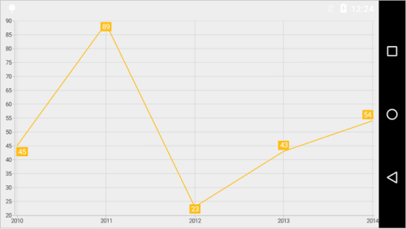
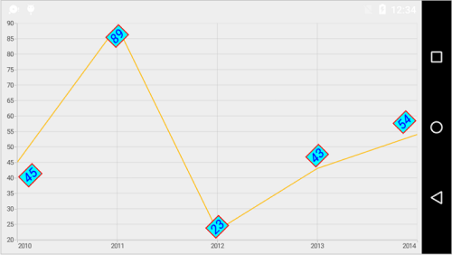
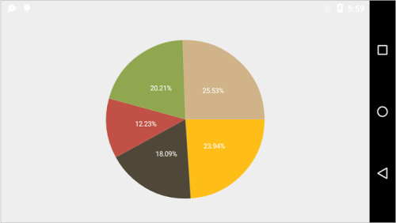
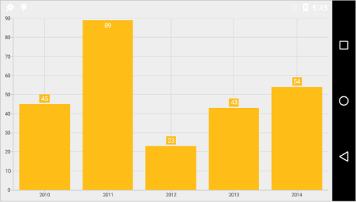
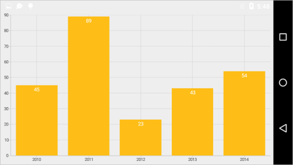
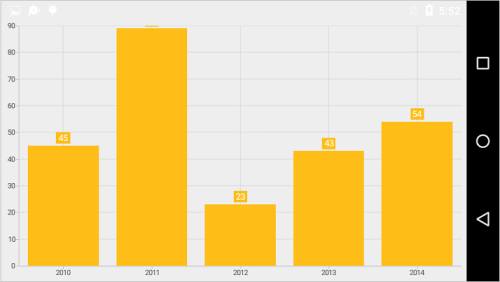
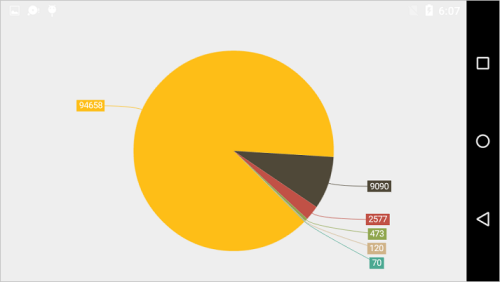
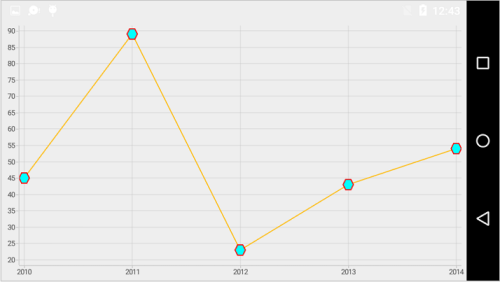
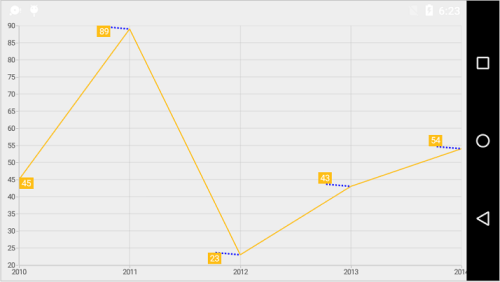

# Data Markers

Data markers are used to provide information about the data points to the user. You can add a shape and label to adorn each data point. This can be enabled using following code snippet,

 
[C#]

lineSeries.DataMarker.ShowLabel = true;



## Customizing Labels

The [`DataMarkerLabel`](https://help.syncfusion.com/cr/cref_files/xamarin-android/Syncfusion.SfChart.Android~Com.Syncfusion.Charts.ChartSeries+DataMarkerLabelCreatedEventArgs~DataMarkerLabel.html) appearance can be customized using following properties,

* [`TextColor`](http://help.syncfusion.com/cr/cref_files/xamarin-android/Syncfusion.SfChart.Android~Com.Syncfusion.Charts.ChartLabelStyle~TextColor.html) – used to change the color of the label.
* [`BackgroundColor`](http://help.syncfusion.com/cr/cref_files/xamarin-android/Syncfusion.SfChart.Android~Com.Syncfusion.Charts.ChartLabelStyle~BackgroundColor.html) – used to change the label background color.
* [`StrokeColor`](http://help.syncfusion.com/cr/cref_files/xamarin-android/Syncfusion.SfChart.Android~Com.Syncfusion.Charts.ChartLabelStyle~StrokeColor.html) – used to change the border color.
* [`StrokeWidth`](http://help.syncfusion.com/cr/cref_files/xamarin-android/Syncfusion.SfChart.Android~Com.Syncfusion.Charts.ChartLabelStyle~StrokeWidth.html) – used to change the width of the border.
* [`TextSize`](http://help.syncfusion.com/cr/cref_files/xamarin-android/Syncfusion.SfChart.Android~Com.Syncfusion.Charts.ChartLabelStyle~TextSize.html) – used to change the text size.
* [`Typeface`](http://help.syncfusion.com/cr/cref_files/xamarin-android/Syncfusion.SfChart.Android~Com.Syncfusion.Charts.ChartLabelStyle~Typeface.html) – used to change the font family and font weight.
* [`MarginTop`](http://help.syncfusion.com/cr/cref_files/xamarin-android/Syncfusion.SfChart.Android~Com.Syncfusion.Charts.ChartLabelStyle~MarginTop.html) - used to change the top margin of the labels.
* [`MarginBottom`](http://help.syncfusion.com/cr/cref_files/xamarin-android/Syncfusion.SfChart.Android~Com.Syncfusion.Charts.ChartLabelStyle~MarginBottom.html) - used to change the bottom margin of the labels.
* [`MarginLeft`](http://help.syncfusion.com/cr/cref_files/xamarin-android/Syncfusion.SfChart.Android~Com.Syncfusion.Charts.ChartLabelStyle~MarginLeft.html) - used to change the left margin of the labels.
* [`MarginRight`](http://help.syncfusion.com/cr/cref_files/xamarin-android/Syncfusion.SfChart.Android~Com.Syncfusion.Charts.ChartLabelStyle~MarginRight.html) - used to change the right margin of the labels.
* [`Angle`](http://help.syncfusion.com/cr/cref_files/xamarin-android/Syncfusion.SfChart.Android~Com.Syncfusion.Charts.ChartDataMarkerLabelStyle~Angle.html) – used to rotate the labels.
* [`LabelPadding`](http://help.syncfusion.com/cr/cref_files/xamarin-android/Syncfusion.SfChart.Android~Com.Syncfusion.Charts.ChartDataMarkerLabelStyle~LabelPadding.html) - used to change the padding value of label.
* [`OffsetX`](http://help.syncfusion.com/cr/cref_files/xamarin-android/Syncfusion.SfChart.Android~Com.Syncfusion.Charts.ChartDataMarkerLabelStyle~OffsetX.html) - used to set the offset value of X.
* [`OffsetY`](http://help.syncfusion.com/cr/cref_files/xamarin-android/Syncfusion.SfChart.Android~Com.Syncfusion.Charts.ChartDataMarkerLabelStyle~OffsetY.html) - used to set the offset value of Y.
* [`UseSeriesPalette`](https://help.syncfusion.com/cr/cref_files/xamarin-android/Syncfusion.SfChart.Android~Com.Syncfusion.Charts.ChartDataMarker~UseSeriesPalette.html) - used to bind the series color to the background color of data marker labels.

Following code snippet illustrates the customization of label and its background,

 
[C#]

lineSeries.DataMarker.ShowLabel = true;
lineSeries.DataMarker.LabelStyle.TextColor = Color.Blue;
lineSeries.DataMarker.LabelStyle.BackgroundColor = Color.Cyan;
lineSeries.DataMarker.LabelStyle.StrokeColor = Color.Red;
lineSeries.DataMarker.LabelStyle.StrokeWidth = 2;
lineSeries.DataMarker.LabelStyle.TextSize = 18;
lineSeries.DataMarker.LabelStyle.Typeface = Typeface.DefaultFromStyle(TypefaceStyle.Italic);
lineSeries.DataMarker.LabelStyle.Angle = 315;
lineSeries.DataMarker.LabelStyle.MarginLeft = 5;
lineSeries.DataMarker.LabelStyle.MarginTop = 5;
lineSeries.DataMarker.LabelStyle.MarginRight = 5;
lineSeries.DataMarker.LabelStyle.MarginBottom = 5;



## Formatting Label Content

You can customize the content of the label using [`LabelContent`](http://help.syncfusion.com/cr/cref_files/xamarin-android/Syncfusion.SfChart.Android~Com.Syncfusion.Charts.ChartDataMarker~LabelContent.html) property. Following are the two options that are supported now,

* [`Percentage`](https://help.syncfusion.com/cr/cref_files/xamarin-android/Syncfusion.SfChart.Android~Com.Syncfusion.Charts.LabelContent.html) – This will show the percentage value of corresponding data point Y value, this is often used in pie, doughnut, funnel and pyramid series types.
* [`YValue`](https://help.syncfusion.com/cr/cref_files/xamarin-android/Syncfusion.SfChart.Android~Com.Syncfusion.Charts.LabelContent.html) – This will show the corresponding Y value.

 
[C#]

pieSeries.DataMarker.LabelContent = LabelContent.Percentage;



## Label Position

The [`LabelPosition`](https://help.syncfusion.com/cr/cref_files/xamarin-android/Syncfusion.SfChart.Android~Com.Syncfusion.Charts.ChartDataMarkerLabelStyle~LabelPosition.html) property is used to position the data marker labels at the [`Center`](https://help.syncfusion.com/cr/cref_files/xamarin-android/Syncfusion.SfChart.Android~Com.Syncfusion.Charts.DataMarkerLabelPosition.html), [`Inner`](https://help.syncfusion.com/cr/cref_files/xamarin-android/Syncfusion.SfChart.Android~Com.Syncfusion.Charts.DataMarkerLabelPosition.html) and [`Outer`](https://help.syncfusion.com/cr/cref_files/xamarin-android/Syncfusion.SfChart.Android~Com.Syncfusion.Charts.DataMarkerLabelPosition.html) positions.

The following screenshot illustrates the default position of data marker labels,

The following code sample illustrates the center position of data marker labels,

 
[C#]

columnSeries.DataMarker.LabelStyle.LabelPosition = DataMarkerLabelPosition.Center;



The following code sample illustrates the Inner position of data marker labels,

 
[C#]

columnSeries.DataMarker.LabelStyle.LabelPosition = DataMarkerLabelPosition.Inner;



The following code sample illustrates the outer position of data marker labels, 

 
[C#]

columnSeries.DataMarker.LabelStyle.LabelPosition = DataMarkerLabelPosition.Outer;



## Smart Labels

In Pie and Doughnut series, overlapping of data labels can be avoided by setting [`SmartLabelsEnabled`](http://help.syncfusion.com/cr/cref_files/xamarin-android/Syncfusion.SfChart.Android~Com.Syncfusion.Charts.CircularSeries~SmartLabelsEnabled.html) property to true.


[C#]

SfChart chart = new SfChart();

PieSeries pieSeries = new PieSeries()
{

    DataSource = Data,
    StartAngle = 45,
    EndAngle = 405,
    SmartLabelsEnabled = true,
    ConnectorType = ConnectorType.Bezier,
    DataMarkerPosition = CircularSeriesDataMarkerPosition.OutsideExtended,

};

pieSeries.DataMarker.ShowLabel = true;

chart.Series.Add(pieSeries);



## Customizing Marker Shapes

Shapes can be added to chart data marker by setting the [`ShowMarker`](http://help.syncfusion.com/cr/cref_files/xamarin-android/Syncfusion.SfChart.Android~Com.Syncfusion.Charts.ChartDataMarker~ShowMarker.html) property to true. There are different shapes you can set to the chart using [`MarkerType`](https://help.syncfusion.com/cr/cref_files/xamarin-android/Syncfusion.SfChart.Android~Com.Syncfusion.Charts.ChartDataMarker~MarkerType.html) property such as [`Cross`](https://help.syncfusion.com/cr/cref_files/xamarin-android/Syncfusion.SfChart.Android~Com.Syncfusion.Charts.DataMarkerType.html), [`Ellipse`](https://help.syncfusion.com/cr/cref_files/xamarin-android/Syncfusion.SfChart.Android~Com.Syncfusion.Charts.DataMarkerType.html), [`Diamond`](https://help.syncfusion.com/cr/cref_files/xamarin-android/Syncfusion.SfChart.Android~Com.Syncfusion.Charts.DataMarkerType.html) etc. Following properties are used to customize marker appearance,

* [`MarkerWidth`](http://help.syncfusion.com/cr/cref_files/xamarin-android/Syncfusion.SfChart.Android~Com.Syncfusion.Charts.ChartDataMarker~MarkerWidth.html) - used to change the width of the marker.
* [`MarkerHeight`](http://help.syncfusion.com/cr/cref_files/xamarin-android/Syncfusion.SfChart.Android~Com.Syncfusion.Charts.ChartDataMarker~MarkerHeight.html) - used to change the height of the marker.
* [`MarkerColor`](http://help.syncfusion.com/cr/cref_files/xamarin-android/Syncfusion.SfChart.Android~Com.Syncfusion.Charts.ChartDataMarker~MarkerColor.html) - used to change the color of the marker.
* [`MarkerStrokeColor`](http://help.syncfusion.com/cr/cref_files/xamarin-android/Syncfusion.SfChart.Android~Com.Syncfusion.Charts.ChartDataMarker~MarkerStrokeColor.html) - used to change the border color of the shape.
* [`MarkerStrokeWidth`](http://help.syncfusion.com/cr/cref_files/xamarin-android/Syncfusion.SfChart.Android~Com.Syncfusion.Charts.ChartDataMarker~MarkerStrokeWidth.html) – used to change the marker border width.

The following code example shows how to enable marker and specify its types,

 
[C#]

lineSeries.DataMarker.ShowLabel = false;
lineSeries.DataMarker.ShowMarker = true;
lineSeries.DataMarker.MarkerType = DataMarkerType.Hexagon;
lineSeries.DataMarker.MarkerWidth = 20;
lineSeries.DataMarker.MarkerHeight = 20;
lineSeries.DataMarker.MarkerColor = Color.Cyan;
lineSeries.DataMarker.MarkerStrokeColor = Color.Red;
lineSeries.DataMarker.MarkerStrokeWidth = 2;



## Connector Line

This feature is used to connect label and data point using a line. It can be enabled for any chart types but this is often used with Pie and Doughnut chart types. The [`ConnectorLineStyle`](https://help.syncfusion.com/cr/cref_files/xamarin-android/Syncfusion.SfChart.Android~Com.Syncfusion.Charts.ChartDataMarker~ConnectorLineStyle.html) property is used to customize the connector line.

* [`StrokeColor`](http://help.syncfusion.com/cr/cref_files/xamarin-android/Syncfusion.SfChart.Android~Com.Syncfusion.Charts.ChartLineStyle~StrokeColor.html) – used to change the color of the line.
* [`StrokeWidth`](http://help.syncfusion.com/cr/cref_files/xamarin-android/Syncfusion.SfChart.Android~Com.Syncfusion.Charts.ChartLineStyle~StrokeWidth.html) – used to change the stroke thickness of the line.
* [`PathEffect`](http://help.syncfusion.com/cr/cref_files/xamarin-android/Syncfusion.SfChart.Android~Com.Syncfusion.Charts.ChartLineStyle~PathEffect.html) – used to set the dashes for the line.
* [`ConnectorHeight`](http://help.syncfusion.com/cr/cref_files/xamarin-android/Syncfusion.SfChart.Android~Com.Syncfusion.Charts.ConnectorLineStyle~ConnectorHeight.html) – used to change the connector line height.
* [`ConnectorRotationAngle`](http://help.syncfusion.com/cr/cref_files/xamarin-android/Syncfusion.SfChart.Android~Com.Syncfusion.Charts.ConnectorLineStyle~ConnectorRotationAngle.html) – used to change the connector line rotation angle.

The following code illustrates how to specify the connector height and its angle,

 
[C#]

lineSeries.DataMarker.ShowLabel = true;
lineSeries.DataMarker.ConnectorLineStyle.ConnectorHeight = 50;
lineSeries.DataMarker.ConnectorLineStyle.ConnectorRotationAngle = 175;
lineSeries.DataMarker.ConnectorLineStyle.StrokeColor = Color.Blue;
lineSeries.DataMarker.ConnectorLineStyle.StrokeWidth = 3;
lineSeries.DataMarker.ConnectorLineStyle.PathEffect = new DashPathEffect(new float[] { 3, 3 }, 3);



N> For Pie and Doughnut series, you can set the [`Bezier`](https://help.syncfusion.com/cr/cref_files/xamarin-android/Syncfusion.SfChart.Android~Com.Syncfusion.Charts.ConnectorType.html) curve for connector line using [`ConnectorType`](https://help.syncfusion.com/cr/cref_files/xamarin-android/Syncfusion.SfChart.Android~Com.Syncfusion.Charts.CircularSeries~ConnectorType.html) property of Pie and Doughnut series.

## Event

### DataMarkerLabelCreated

The [`DataMarkerLabelCreated`](https://help.syncfusion.com/cr/cref_files/xamarin-android/Syncfusion.SfChart.Android~Com.Syncfusion.Charts.ChartSeries~DataMarkerLabelCreated_EV.html) event occurs when the data marker label is created. This argument contains object of the [`DataMarkerLabel`](https://help.syncfusion.com/cr/cref_files/xamarin-android/Syncfusion.SfChart.Android~Com.Syncfusion.Charts.ChartSeries+DataMarkerLabelCreatedEventArgs~DataMarkerLabel.html). The following properties are available in [`DataMarkerLabel`](https://help.syncfusion.com/cr/cref_files/xamarin-android/Syncfusion.SfChart.Android~Com.Syncfusion.Charts.DataMarkerLabel.html) to customize the appearance of data markers based on condition.

* [`Label`](https://help.syncfusion.com/cr/cref_files/xamarin-android/Syncfusion.SfChart.Android~Com.Syncfusion.Charts.DataMarkerLabel~Label.html) – Gets or sets the text of data marker.
* [`BackgroundColor`](https://help.syncfusion.com/cr/cref_files/xamarin-android/Syncfusion.SfChart.Android~Com.Syncfusion.Charts.DataMarkerLabel~BackgroundColor.html) – Gets or sets the background color of data marker label.
* [`Index`](https://help.syncfusion.com/cr/cref_files/xamarin-android/Syncfusion.SfChart.Android~Com.Syncfusion.Charts.DataMarkerLabel~Index.html) – Gets the data point index of data marker label.
* [`XPosition`](https://help.syncfusion.com/cr/cref_files/xamarin-android/Syncfusion.SfChart.Android~Com.Syncfusion.Charts.DataMarkerLabel~XPosition.html) – Gets the x-position of data marker label.
* [`YPosition`](https://help.syncfusion.com/cr/cref_files/xamarin-android/Syncfusion.SfChart.Android~Com.Syncfusion.Charts.DataMarkerLabel~YPosition.html) – Gets the y-position of data marker label.
* [`LabelStyle`](https://help.syncfusion.com/cr/cref_files/xamarin-android/Syncfusion.SfChart.Android~Com.Syncfusion.Charts.DataMarkerLabel~LabelStyle.html) – Gets or sets the label style to customize the appearance of individual data marker label.
* [`MarkerWidth`](https://help.syncfusion.com/cr/cref_files/xamarin-android/Syncfusion.SfChart.Android~Com.Syncfusion.Charts.DataMarkerLabel~MarkerWidth.html) – Gets or sets the marker width.
* [`MarkerHeight`](https://help.syncfusion.com/cr/cref_files/xamarin-android/Syncfusion.SfChart.Android~Com.Syncfusion.Charts.DataMarkerLabel~MarkerHeight.html) – Gets or sets the marker height.
* [`MarkerBorderWidth`](https://help.syncfusion.com/cr/cref_files/xamarin-android/Syncfusion.SfChart.Android~Com.Syncfusion.Charts.DataMarkerLabel~MarkerBorderWidth.html) – Gets or sets the border width of marker symbol.
* [`MarkerBorderColor`](https://help.syncfusion.com/cr/cref_files/xamarin-android/Syncfusion.SfChart.Android~Com.Syncfusion.Charts.DataMarkerLabel~MarkerBorderColor.html) – Gets or sets the border color of marker symbol.
* [`MarkerColor`](https://help.syncfusion.com/cr/cref_files/xamarin-android/Syncfusion.SfChart.Android~Com.Syncfusion.Charts.DataMarkerLabel~MarkerColor.html) – Gets or sets the marker color.
* [`MarkerType`](https://help.syncfusion.com/cr/cref_files/xamarin-android/Syncfusion.SfChart.Android~Com.Syncfusion.Charts.DataMarkerLabel~MarkerType.html) – Gets or sets the shape type of marker. The available shapes are [`Ellipse`](https://help.syncfusion.com/cr/cref_files/xamarin-android/Syncfusion.SfChart.Android~Com.Syncfusion.Charts.DataMarkerType.html), diamond, hexagon, cross, HorizontalLine, VerticalLine, InvertedTriangle, triangle, pentagon, plus, and square.
* [`View`](https://help.syncfusion.com/cr/cref_files/xamarin-android/Syncfusion.SfChart.Android~Com.Syncfusion.Charts.DataMarkerLabel~View.html) Gets or sets the view.