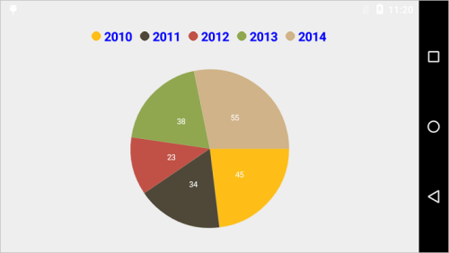
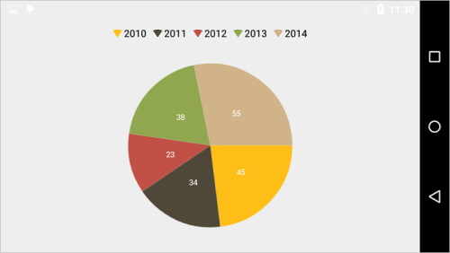
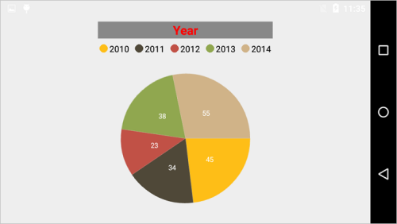
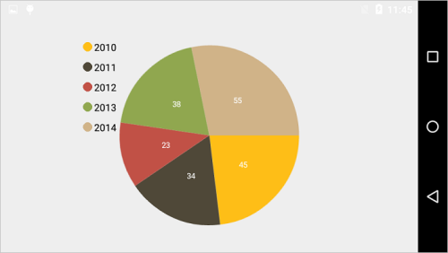

# Legend

Legend contains list of chart series/data points in the chart. The information provided in each legend item helps in identifying the corresponding data series in chart.

Following code example shows how to enable legend in a chart,

 
[C#]

chart.Legend.Visibility = Visibility.Visible;



## Customizing Labels

`Label` property of `ChartSeries` is used to define the label for the corresponding series legend item. The following properties are used to customize the legend items label appearance.

* `TextColor` – used to change the color of the label.
* `TextSize` – used to change the text size.
* `Typeface` – used to change the font family and font weight.
* `MarginTop` - used to change the top margin of the labels.
* `MarginBottom` - used to change the bottom margin of the labels.
* `MarginLeft` - used to change the left margin of the labels.
* `MarginRight` - used to change the right margin of the labels.

 
[C#]

chart.Legend.LabelStyle.TextSize = 18;
chart.Legend.LabelStyle.TextColor = Color.Blue;
chart.Legend.LabelStyle.Typeface = Typeface.DefaultBold;
chart.Legend.LabelStyle.MarginBottom = 5;
chart.Legend.LabelStyle.MarginLeft = 5;
chart.Legend.LabelStyle.MarginRight = 5;
chart.Legend.LabelStyle.MarginTop = 5;            



## Legend Icons

Legend icons are enabled by default, however, you can control its visibility using `IconVisibility` property. Also you can specify the icon type using `LegendIcon` property in ChartSeries. `IconWidth` and `IconHeight` properties are used to adjust the width and height of the legend icons respectively.

 
[C#]

chart.Legend.IconVisibility = Visibility.Visible;
chart.Legend.IconHeight = 20;
chart.Legend.IconWidth = 20;
pieSeries.LegendIcon = ChartLegendIcon.SeriesType;



## Legend Title

Following properties are used to define and customize the legend title.

* `Text` – used to set the title for legend.
* `TextColor` – used to change the color of the title text.
* `BackgroundColor` – used to change the title background color.
* `TextSize` – used to change the text size of the title.
* `Typeface` – used to change the font family and font weight.
* `MarginTop` - used to change the top margin of the title.
* `MarginBottom` - used to change the bottom margin of the title.
* `MarginLeft` - used to change the left margin of the title.
* `MarginRight` - used to change the right margin of the title.
* `TextAlignment` – used to change the alignment of the title text, it can be start, end and center.

 
[C#]

chart.Legend.Title.Text = "Year";
chart.Legend.Title.SetTextColor(Color.Red);
chart.Legend.Title.TextSize = 20;
chart.Legend.Title.Typeface = Typeface.DefaultBold;
chart.Legend.Title.SetBackgroundColor(Color.Gray);
chart.Legend.Title.TextAlignment = TextAlignment.Center; 



## Toggle the series visibility

You can control the visibility of the series by tapping on the legend item. You can enable this feature by enabling `ToggleSeriesVisibility` property.

 
[C#]

chart.Legend.ToggleSeriesVisibility = true;



## Positioning the Legend

You can position the legend anywhere inside the chart. Following properties are used to customize the legend positions.

* `DockPosition`– used to position the legend relatively. Options available are: Left, Right, Top, Bottom and Floating. If the DockPosition is Floating, you can position the legend using x and y coordinates.
* `OffsetX`– used to move the legend on x coordinate by the given offset value, this will work only if the dock position is Floating.
* `OffsetY` - used to move the legend on y coordinate by the given offset value, this will work only if the dock position is Floating.

 
[C#]

chart.Legend.DockPosition = ChartDock.Floating;
chart.Legend.OffsetX = 160;
chart.Legend.OffsetY = 30;



## Legend Orientation

By default, the legend items will be oriented based on the legend dock position for better readability of the legend. However, you can change the orientation of the legend items using `Orientation` property.

 
[C#]

chart.Legend.Orientation = Orientation.Horizontal;

