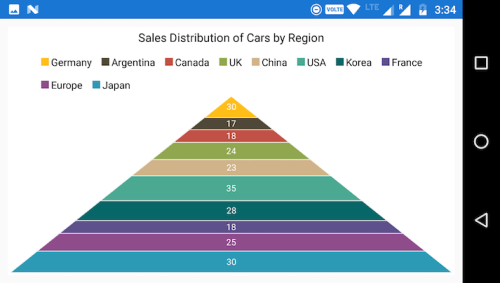
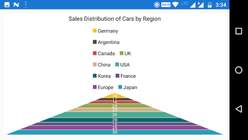

# Legend

Legend contains list of chart series/data points in the chart. The information provided in each legend item helps in identifying the corresponding data series in chart. The [`Visibility`](https://help.syncfusion.com/cr/cref_files/xamarin-android/Syncfusion.SfChart.Android~Com.Syncfusion.Charts.ChartLegend~Visibility.html) property is used to control the visibility of legend.

Following code example shows how to enable legend in a chart,

 
[C#]

chart.Legend.Visibility = Visibility.Visible;



## Customizing background & border

The [`Legend`](https://help.syncfusion.com/cr/cref_files/xamarin-android/Syncfusion.SfChart.Android~Com.Syncfusion.Charts.ChartLegend.html) provides following properties to customize the legend area border and background. 

* [`BackgroundColor`](https://help.syncfusion.com/cr/cref_files/xamarin-android/Syncfusion.SfChart.Android~Com.Syncfusion.Charts.ChartLegend~BackgroundColor.html) - used to change legend background color.
* [`StrokeColor`](https://help.syncfusion.com/cr/cref_files/xamarin-android/Syncfusion.SfChart.Android~Com.Syncfusion.Charts.ChartLegend~StrokeColor.html) - used to change legend border color.
* [`StrokeWidth`](https://help.syncfusion.com/cr/cref_files/xamarin-android/Syncfusion.SfChart.Android~Com.Syncfusion.Charts.ChartLegend~StrokeWidth.html) - used to change legend border width. 
* [`PathEffect`](https://help.syncfusion.com/cr/cref_files/xamarin-android/Syncfusion.SfChart.Android~Com.Syncfusion.Charts.ChartLegend~PathEffect.html) - used to render legend border line with dashes.
* [`MarginTop`](https://help.syncfusion.com/cr/cref_files/xamarin-android/Syncfusion.SfChart.Android~Com.Syncfusion.Charts.ChartLegend~MarginTop.html) - used to change the top margin of the legend.
* [`MarginBottom`](https://help.syncfusion.com/cr/cref_files/xamarin-android/Syncfusion.SfChart.Android~Com.Syncfusion.Charts.ChartLegend~MarginBottom.html) - used to change the bottom margin of the legend.
* [`MarginLeft`](https://help.syncfusion.com/cr/cref_files/xamarin-android/Syncfusion.SfChart.Android~Com.Syncfusion.Charts.ChartLegend~MarginLeft.html) - used to change the left margin of the legend.
* [`MarginRight`](https://help.syncfusion.com/cr/cref_files/xamarin-android/Syncfusion.SfChart.Android~Com.Syncfusion.Charts.ChartLegend~MarginRight.html) - used to change the right margin of the legend.
* [`CornerRadius`](https://help.syncfusion.com/cr/cref_files/xamarin-android/Syncfusion.SfChart.Android~Com.Syncfusion.Charts.ChartLegend~CornerRadius.html) - used to add the rounded corners to the legend border rectangle. The TopLeft, TopRight, BottomLeft and BottomRight of ChartCornerRadius properties are used to set the radius value for each corner.

 
[C#]

chart.Legend.BackgroundColor = Color.Argb(255, 245, 245, 240);
chart.Legend.StrokeColor = Color.Black;
chart.Legend.StrokeWidth = 2;
chart.Legend.MarginTop = 5;
chart.Legend.MarginBottom = 5;
chart.Legend.MarginLeft = 5;
chart.Legend.MarginRight = 5;
chart.Legend.CornerRadius = new ChartCornerRadius(5);
chart.Legend.PathEffect = new DashPathEffect(new float[] { 3, 3 }, 4);          



## Customizing Labels

[`Label`](http://help.syncfusion.com/cr/cref_files/xamarin-android/Syncfusion.SfChart.Android~Com.Syncfusion.Charts.ChartSeries~Label.html) property of [`ChartSeries`](http://help.syncfusion.com/cr/cref_files/xamarin-android/Syncfusion.SfChart.Android~Com.Syncfusion.Charts.ChartSeries.html) is used to define the label for the corresponding series legend item. The [`LabelStyle`](https://help.syncfusion.com/cr/cref_files/xamarin-android/Syncfusion.SfChart.Android~Com.Syncfusion.Charts.ChartLegend~LabelStyle.html) property can be used to customize the legend items label appearance.

* [`TextColor`](https://help.syncfusion.com/cr/cref_files/xamarin-android/Syncfusion.SfChart.Android~Com.Syncfusion.Charts.ChartLegendLabelStyle~TextColor.html) – used to change the color of the label.
* [`TextSize`](https://help.syncfusion.com/cr/cref_files/xamarin-android/Syncfusion.SfChart.Android~Com.Syncfusion.Charts.ChartLegendLabelStyle~TextSize.html) – used to change the text size.
* [`Typeface`](https://help.syncfusion.com/cr/cref_files/xamarin-android/Syncfusion.SfChart.Android~Com.Syncfusion.Charts.ChartLegendLabelStyle~Typeface.html) – used to change the font family and font weight.
* [`MarginTop`](http://help.syncfusion.com/cr/cref_files/xamarin-android/Syncfusion.SfChart.Android~Com.Syncfusion.Charts.ChartLabelStyle~MarginTop.html) - used to change the top margin of the labels.
* [`MarginBottom`](http://help.syncfusion.com/cr/cref_files/xamarin-android/Syncfusion.SfChart.Android~Com.Syncfusion.Charts.ChartLabelStyle~MarginBottom.html) - used to change the bottom margin of the labels.
* [`MarginLeft`](http://help.syncfusion.com/cr/cref_files/xamarin-android/Syncfusion.SfChart.Android~Com.Syncfusion.Charts.ChartLabelStyle~MarginLeft.html) - used to change the left margin of the labels.
* [`MarginRight`](http://help.syncfusion.com/cr/cref_files/xamarin-android/Syncfusion.SfChart.Android~Com.Syncfusion.Charts.ChartLabelStyle~MarginRight.html) - used to change the right margin of the labels.

 
[C#]

chart.Legend.LabelStyle.TextSize = 18;
chart.Legend.LabelStyle.TextColor = Color.Blue;
chart.Legend.LabelStyle.Typeface = Typeface.DefaultBold;
chart.Legend.LabelStyle.MarginBottom = 5;
chart.Legend.LabelStyle.MarginLeft = 5;
chart.Legend.LabelStyle.MarginRight = 5;
chart.Legend.LabelStyle.MarginTop = 5;            



## Legend Icons

Legend icons are enabled by default, however, you can control its visibility using [`IconVisibility`](http://help.syncfusion.com/cr/cref_files/xamarin-android/Syncfusion.SfChart.Android~Com.Syncfusion.Charts.ChartLegend~IconVisibility.html) property. Also you can specify the icon type using [`LegendIcon`](http://help.syncfusion.com/cr/cref_files/xamarin-android/Syncfusion.SfChart.Android~Com.Syncfusion.Charts.ChartSeries~LegendIcon.html) property in ChartSeries. Default legend icon is [`Circle`](https://help.syncfusion.com/cr/cref_files/xamarin-android/Syncfusion.SfChart.Android~Com.Syncfusion.Charts.ChartLegendIcon.html). [`IconWidth`](http://help.syncfusion.com/cr/cref_files/xamarin-android/Syncfusion.SfChart.Android~Com.Syncfusion.Charts.ChartLegend~IconWidth.html) and [`IconHeight`](http://help.syncfusion.com/cr/cref_files/xamarin-android/Syncfusion.SfChart.Android~Com.Syncfusion.Charts.ChartLegend~IconHeight.html) properties are used to adjust the width and height of the legend icons respectively.

 
[C#]

chart.Legend.IconVisibility = Visibility.Visible;
chart.Legend.IconHeight = 20;
chart.Legend.IconWidth = 20;
pieSeries.LegendIcon = ChartLegendIcon.SeriesType;



## Legend Title

Following properties are used to define and customize the legend [`Title`](https://help.syncfusion.com/cr/cref_files/xamarin-android/Syncfusion.SfChart.Android~Com.Syncfusion.Charts.ChartLegend~Title.html).

* [`Text`](http://help.syncfusion.com/cr/cref_files/xamarin-android/Syncfusion.SfChart.Android~Com.Syncfusion.Charts.ChartLegendTitleView~Text.html) – used to set the title for legend.
* [`TextColor`](http://help.syncfusion.com/cr/cref_files/xamarin-android/Syncfusion.SfChart.Android~Com.Syncfusion.Charts.ChartLegendTitleView~TextColors.html) – used to change the color of the title text.
* [`BackgroundColor`](http://help.syncfusion.com/cr/cref_files/xamarin-android/Syncfusion.SfChart.Android~Com.Syncfusion.Charts.ChartLegendTitleView~Background.html) – used to change the title background color.
* [`TextSize`](http://help.syncfusion.com/cr/cref_files/xamarin-android/Syncfusion.SfChart.Android~Com.Syncfusion.Charts.ChartLegendTitleView~TextSize.html) – used to change the text size of the title.
* [`Typeface`](http://help.syncfusion.com/cr/cref_files/xamarin-android/Syncfusion.SfChart.Android~Com.Syncfusion.Charts.ChartLegendTitleView~Typeface.html) – used to change the font family and font weight.
* [`MarginTop`](http://help.syncfusion.com/cr/cref_files/xamarin-android/Syncfusion.SfChart.Android~Com.Syncfusion.Charts.ChartLegendLabelStyle~MarginTop.html) - used to change the top margin of the title.
* [`MarginBottom`](http://help.syncfusion.com/cr/cref_files/xamarin-android/Syncfusion.SfChart.Android~Com.Syncfusion.Charts.ChartLegendLabelStyle~MarginBottom.html) - used to change the bottom margin of the title.
* [`MarginLeft`](http://help.syncfusion.com/cr/cref_files/xamarin-android/Syncfusion.SfChart.Android~Com.Syncfusion.Charts.ChartLegendLabelStyle~MarginLeft.html) - used to change the left margin of the title.
* [`MarginRight`](http://help.syncfusion.com/cr/cref_files/xamarin-android/Syncfusion.SfChart.Android~Com.Syncfusion.Charts.ChartLegendLabelStyle~MarginRight.html) - used to change the right margin of the title.
* [`TextAlignment`](http://help.syncfusion.com/cr/cref_files/xamarin-android/Syncfusion.SfChart.Android~Com.Syncfusion.Charts.ChartLegendTitleView~TextAlignment.html) – used to change the alignment of the title text, it can be start, end and center.

 
[C#]

chart.Legend.Title.Text = "Year";
chart.Legend.Title.SetTextColor(Color.Red);
chart.Legend.Title.TextSize = 20;
chart.Legend.Title.Typeface = Typeface.DefaultBold;
chart.Legend.Title.SetBackgroundColor(Color.Gray);
chart.Legend.Title.TextAlignment = TextAlignment.Center; 



## Toggle the series visibility

You can control the visibility of the series by tapping on the legend item. You can enable this feature by enabling [`ToggleSeriesVisibility`](http://help.syncfusion.com/cr/cref_files/xamarin-android/Syncfusion.SfChart.Android~Com.Syncfusion.Charts.ChartLegend~ToggleSeriesVisibility.html) property.

 
[C#]

chart.Legend.ToggleSeriesVisibility = true;



## Legend item visibility

You can control the visibility of particular series legend item by using the [`VisibilityOnLegend`](http://help.syncfusion.com/cr/cref_files/xamarin-android/Syncfusion.SfChart.Android~Com.Syncfusion.Charts.ChartSeries~VisibilityOnLegend.html) property of series. Default value of VisibilityOnLegend property is Visible.

 
[C#]

ColumnSeries series = new ColumnSeries();
series.VisibilityOnLegend = Visibility.Gone;



## Legend Wrap

The legend items can be placed in multiple rows by using [`OverflowMode`](http://help.syncfusion.com/cr/cref_files/xamarin-android/Syncfusion.SfChart.Android~Com.Syncfusion.Charts.ChartLegend~OverflowMode.html) property if size of the total legend exceeds the available size. The default value of [`OverflowMode`](http://help.syncfusion.com/cr/cref_files/xamarin-android/Syncfusion.SfChart.Android~Com.Syncfusion.Charts.ChartLegend~OverflowMode.html) property is [`Scroll`](https://help.syncfusion.com/cr/cref_files/xamarin-android/Syncfusion.SfChart.Android~Com.Syncfusion.Charts.ChartLegendOverflowMode.html).


[C#]

    chart.Legend.Visibility = Com.Syncfusion.Charts.Visibility.Visible;

    chart.Legend.OverflowMode = ChartLegendOverflowMode.Wrap;



### Legend Width

The legend width can be specified by using [`MaxWidth`](http://help.syncfusion.com/cr/cref_files/xamarin-android/Syncfusion.SfChart.Android~Com.Syncfusion.Charts.ChartLegend~MaxWidth.html) property. This property works only when the [`OverflowMode`](http://help.syncfusion.com/cr/cref_files/xamarin-android/Syncfusion.SfChart.Android~Com.Syncfusion.Charts.ChartLegend~OverflowMode.html) is [`Wrap`](https://help.syncfusion.com/cr/cref_files/xamarin-android/Syncfusion.SfChart.Android~Com.Syncfusion.Charts.ChartLegendOverflowMode.html). The default value of [`MaxWidth`](http://help.syncfusion.com/cr/cref_files/xamarin-android/Syncfusion.SfChart.Android~Com.Syncfusion.Charts.ChartLegend~MaxWidth.html) property is double.NAN.


[C#]

    chart.Legend.Visibility = Com.Syncfusion.Charts.Visibility.Visible;

    chart.Legend.OverflowMode = ChartLegendOverflowMode.Wrap;

    chart.Legend.MaxWidth = 420;



## Positioning the Legend

You can position the legend anywhere inside the chart. Following properties are used to customize the legend positions.

* [`DockPosition`](http://help.syncfusion.com/cr/cref_files/xamarin-android/Syncfusion.SfChart.Android~Com.Syncfusion.Charts.ChartLegend~DockPosition.html)– used to position the legend relatively. Options available are:  [`Left`](https://help.syncfusion.com/cr/cref_files/xamarin-android/Syncfusion.SfChart.Android~Com.Syncfusion.Charts.ChartDock.html), Right, Top, Bottom and Floating. If the DockPosition is Floating, you can position the legend using x and y coordinates.
* [`OffsetX`](http://help.syncfusion.com/cr/cref_files/xamarin-android/Syncfusion.SfChart.Android~Com.Syncfusion.Charts.ChartLegend~OffsetX.html) – used to move the legend on x coordinate by the given offset value, this will work only if the dock position is Floating.
* [`OffsetY`](http://help.syncfusion.com/cr/cref_files/xamarin-android/Syncfusion.SfChart.Android~Com.Syncfusion.Charts.ChartLegend~OffsetY.html) - used to move the legend on y coordinate by the given offset value, this will work only if the dock position is Floating.
* [`LegendPosition`](https://help.syncfusion.com/cr/cref_files/xamarin-android/Syncfusion.SfChart.Android~Com.Syncfusion.Charts.ChartLegend~LegendPosition.html) - used to position the legend items [`Inside`](https://help.syncfusion.com/cr/cref_files/xamarin-android/Syncfusion.SfChart.Android~Com.Syncfusion.Charts.LegendPosition.html) or [`Outside`](https://help.syncfusion.com/cr/cref_files/xamarin-android/Syncfusion.SfChart.Android~Com.Syncfusion.Charts.LegendPosition.html) of the chart series. The default position is Outside.
* [`ItemMarginTop`](https://help.syncfusion.com/cr/cref_files/xamarin-android/Syncfusion.SfChart.Android~Com.Syncfusion.Charts.ChartLegend~ItemMarginTop.html) - used to change the top margin of the legend item.
* [`ItemMarginBottom`](https://help.syncfusion.com/cr/cref_files/xamarin-android/Syncfusion.SfChart.Android~Com.Syncfusion.Charts.ChartLegend~ItemMarginBottom.html) - used to change the bottom margin of the legend item.
* [`ItemMarginLeft`](https://help.syncfusion.com/cr/cref_files/xamarin-android/Syncfusion.SfChart.Android~Com.Syncfusion.Charts.ChartLegend~ItemMarginLeft.html) - used to change the left margin of the legend item.
* [`ItemMarginRight`](https://help.syncfusion.com/cr/cref_files/xamarin-android/Syncfusion.SfChart.Android~Com.Syncfusion.Charts.ChartLegend~ItemMarginRight.html) - used to change the right margin of the legend item.

 
[C#]

chart.Legend.DockPosition = ChartDock.Floating;
chart.Legend.OffsetX = 160;
chart.Legend.OffsetY = 30;



## Legend Orientation

By default, the legend items will be oriented based on the legend dock position for better readability of the legend. However, you can change the [`Horizontal`](https://help.syncfusion.com/cr/cref_files/xamarin-android/Syncfusion.SfChart.Android~Com.Syncfusion.Charts.ChartOrientation.html) or [`Vertical`](https://help.syncfusion.com/cr/cref_files/xamarin-android/Syncfusion.SfChart.Android~Com.Syncfusion.Charts.ChartOrientation.html) orientation of the legend items using [`Orientation`](https://help.syncfusion.com/cr/cref_files/xamarin-android/Syncfusion.SfChart.Android~Com.Syncfusion.Charts.ChartLegend~Orientation.html) property.

 
[C#]

chart.Legend.Orientation = ChartOrientation.Horizontal;



## Event

 **LegendItemClicked**

The [`LegendItemClicked`](https://help.syncfusion.com/cr/cref_files/xamarin-android/Syncfusion.SfChart.Android~Com.Syncfusion.Charts.ChartBase~LegendItemClicked_EV.html) event is triggered when the chart legend item is clicked. This argument contains the following information.

* [`LegendItem`](https://help.syncfusion.com/cr/cref_files/xamarin-android/Syncfusion.SfChart.Android~Com.Syncfusion.Charts.ChartLegendItemClickedEventArgs~LegendItem.html) – Used to customize the label and appearance of individual legend item. 

**LegendItemCreated**

The [`LegendItemCreated`](https://help.syncfusion.com/cr/cref_files/xamarin-android/Syncfusion.SfChart.Android~Com.Syncfusion.Charts.ChartBase~LegendItemCreated_EV.html) event is triggered when the chart legend item is created. This argument contains the following information.

* [`LegendItem`](https://help.syncfusion.com/cr/cref_files/xamarin-android/Syncfusion.SfChart.Android~Com.Syncfusion.Charts.ChartLegendItemCreatedEventArgs~LegendItem.html) – Used to customize the label and appearance of individual legend item.

You can customize the legend item by using following properties of [`ChartLegendItem`](https://help.syncfusion.com/cr/cref_files/xamarin-android/Syncfusion.SfChart.Android~Com.Syncfusion.Charts.ChartLegendItem.html).

* [`Label`](https://help.syncfusion.com/cr/cref_files/xamarin-android/Syncfusion.SfChart.Android~Com.Syncfusion.Charts.ChartLegendItem~Label.html) – Used to get or set the legend item label.
* [`LabelStyle`](https://help.syncfusion.com/cr/cref_files/xamarin-android/Syncfusion.SfChart.Android~Com.Syncfusion.Charts.ChartLegendItem~LabelStyle.html) – Used to customize the appearance of legend labels. The properties listed in [`customizing label`](https://help.syncfusion.com/xamarin-android/sfchart/legend#customizing-labels) can be customized using LabelStyle property.
* [`IconColor`](https://help.syncfusion.com/cr/cref_files/xamarin-android/Syncfusion.SfChart.Android~Com.Syncfusion.Charts.ChartLegendItem~IconColor.html) – Used to get or set the legend icon color.
* [`Index`](https://help.syncfusion.com/cr/cref_files/xamarin-android/Syncfusion.SfChart.Android~Com.Syncfusion.Charts.ChartLegendItem~Index.html) – Used to get the legend item index.
* [`IsEnabled`](https://help.syncfusion.com/cr/cref_files/xamarin-android/Syncfusion.SfChart.Android~Com.Syncfusion.Charts.ChartLegendItem~IsEnabled.html) – Used to get the visibility of the series if the series is the type of [`CartesianSeries`](https://help.syncfusion.com/cr/cref_files/xamarin-android/Syncfusion.SfChart.Android~Com.Syncfusion.Charts.CartesianSeries.html) and get the visibility of the data point if the series is type of [`AccumulationSeries`](https://help.syncfusion.com/cr/cref_files/xamarin-android/Syncfusion.SfChart.Android~Com.Syncfusion.Charts.AccumulationSeries.html).
* [`DataPoint`](https://help.syncfusion.com/cr/cref_files/xamarin-android/Syncfusion.SfChart.Android~Com.Syncfusion.Charts.ChartLegendItem~DataPoint.html) – Used to get the legend item data point for accumulation series only.
* [`Series`](https://help.syncfusion.com/cr/cref_files/xamarin-android/Syncfusion.SfChart.Android~Com.Syncfusion.Charts.ChartLegendItem~Series.html) – Used to get respective chart series.
* [`View`](https://help.syncfusion.com/cr/cref_files/xamarin-android/Syncfusion.SfChart.Android~Com.Syncfusion.Charts.ChartLegendItem~View.html) – Used to get or set the legend item view.