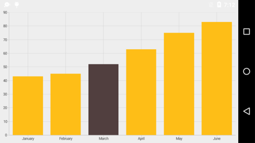
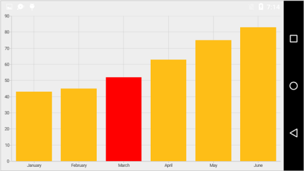

# Data Point Selection

You can select a data point by tapping on it. To enable the selection feature, you can use `DataPointSelectionEnabled` property. 

 
[C#]

ColumnSeries columnSeries = new ColumnSeries();
columnSeries.DataPointSelectionEnabled = true;


Following properties are used to configure the selection feature,

* `SelectedDataPointIndex` – used to programmatically select a data point.
* `SelectedDataPointColor` – used to change the selected data point color.

 
[C#]

ColumnSeries columnSeries = new ColumnSeries();
columnSeries.DataPointSelectionEnabled = true;
columnSeries.SelectedDataPointIndex = 2;
columnSeries.SelectedDataPointColor = Color.Red;



N> For Accumulation series like pie, doughnut, pyramid and funnel, when you select a data point, the corresponding legend item also will be selected.

## Event

**SelectionChanging**

The `SelectionChanging` event of `SfChart` is used to subscribe the selection changing listener and this is triggered before the data point is selected. You can restrict a data point from being selected, by cancelling this event, by using `setCancel(boolean)` property of the listener argument. The argument contains the following information,

* `SelectedSeries` – used to get the series of selected data point.
* `SelectedDataPointIndex` – used to get the selected data point index.
* `PreviousSelectedIndex` – used to get the previous selected data point index.
* `Cancel` – used to set the value indicating whether the selection should be cancelled.

**SelectionChanged**

The `SelectionChanged` event of `SfChart` is used to subscribe the selection changed listener and this triggered after a data point is selected. The argument contains the following information,

* `SelectedSeries` – used to get the series of selected data point.
* `SelectedDataPointIndex` – used to get the selected data point index.
* `PreviousSelectedIndex` – used to get the previous selected data point index.
* `Selected Segment` - used to get the selected segment of the series.